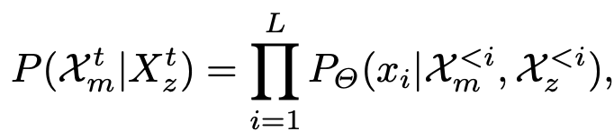

# [MM] UniCode: Learning a Unified Codebook for Multimodal Large Language Models

- paper: https://www.ecva.net/papers/eccv_2024/papers_ECCV/papers/01331.pdf
- github: X
- ECCV 2024 accepted (인용수: 4회, 24-10-07 기준)
- downstream task: VQA, T2I

# 1. Motivation

- 현재 MLLM은 text-only codebook을 사용함으로써 멀티모달 context를 기반으로 text & image 생성하는데 한계가 있다.

  $\to$ 이를 해결하고자, image & text unified codebook를 개발해보자!

  

  (a) **Lightweight projector**: 최소한의 학습 비용으로 LLM의 textual space로 visual signal을 mapping하는 방식. Text-only codebook만 사용하기 때문에 language generation에 한계가 있다.

  (b) **Visual tokenizer**: Visual codebook를 따로 두는 방식. codebook의 Quantity가 커짐에 따라 "codebook collapse"와 같이 일부 code만 사용하는 이슈가 발생함. + Modality gap을 해결하기 위해 많은 노력이 요구됨 (ex. Data quantity)

  (c) **Ours**: 추가 모듈이 불필요하며, 멀티모달간 unified tokenizer를 활용 가능!

# 2. Contribution

- Visual & Textual input을 한번에 tokenize할 수 있는 Unified Tokenizer, Unicode를 제안함 $\to$추가 모듈이 불필요
  - Language driven iterative training을 제안 (LLM & tokenizer를 번갈아 학습하는 방식)
- LLaVa의 Visual Instruction Tuning에 추가로 "**image decompression pretraining task**"를 추가로 제안하여 복잡한 멀티모달 내용에 대한 이해력 향상
- 적은 학습 데이터 & parameter로 MLLM task에서 SOTA

# 3. UniCode

## 3.1 Visual Tokenization

- Encoder, Decoder, codebook로 구성

  

  - *Q*: Visual tokenization. Embedding vector *z*에 가장 가까운 code를 선택하는 함수
  - 선택된 $e(k=M_{ij})$는 image를 reconstruct하는데 사용
    - $z \in \mathbb{R}^{h \times w \times c}$, $i =[1, h], j=[1,w]$

- Efficient Stack Quantization

  - code-map의 resolution (*h $\times$ w*) 에 제곱에 비례해서 LLM의 계산량이 커지게됨

  - 반면, token의 bit-depth에 비례해서 이미지 복원 성능이 좌우된다고 함

    $\to$ *D-layer* code map $M_d \in \mathbb{N}^{\hat{h}_d \times \hat{w}_d \times D}$로 quantization을 수행

  - 최종 선택되는 code는 *D*개의 code map layer의 aggregation 으로 대체

    

    - $F_{d=1}^D$: aggregation 함수. 여기선 concatation 혹은 cumulative sum. 제일 좋은건 concatnation이었다고 함

## 3.2 Codebook Learning Paradigm

제안 방식을 대체할 두 가지 방식을 먼저 설명

- Frozen LLM

  - Encoder / decoder가 frozen codebook과 align되지 못해 image의 의미론적 nuance를 정교하게 캡쳐하지 못하는 단점 존재

- Dual Alternative Training

  - LLM과 visual tokenizer를 번갈아 학습함

    - 즉, visual tokenizer 학습 시에는 LLM의 codebook로 replace됨
    - 반대로 LLM학습시에는 visual tokenizer의 codebook로 학습함

    $\to$ Visual tokenizer를 학습할 때 codebook의 변화량이 LLM을 학습할때 변화량보다 월등히 큼. 이는 stacked quantization일 경우 훨씬 극명하게 나타남. (codebook 업데이트에 추가 layer 업데이트가 수반되기 때문.) 이러한 차이는 codebook과 LLM의 misalignment을 부추기게 되어 LLM의 언어 생성능력을 떨어뜨림

- Language-driven Iterative Training

  - Visual tokenizer가 LLM의 codebook를 update하지 않는 방식

  - 일단 image feature *Z*를 EMA (Exponential Moving Average)를 사용하여 visual codebook을 1차 업데이트

    

    - $Z \in \mathbb{R}^{hw \times c}$: image feature
    - $\mathbb{C}$: codebook

  - Regular interval에 한번 Language codebook로 업데이트

    

    $\to$ 1. **visual tokenizer**의 **codebook**이 **language codebook** $C_L$에 **점진적으로 수렴하도록 유도**하는 효과

    2. Language codebook이 visual tokenizer로 인한 update를 예방 

## 3.3 In-context Image Decomposition

- 이름은 거창하지만, $hw \to hwD$를 예측하는 task

- $hw$로 압축한 token 갯수만으로 $hwD$개의 token을 reconstruction하는 self-supervised pretraining 

- 목적: 적은 수의 visual token가지고 학습하고 싶은데, 압축된 token으로 학습할 경우, LLM의 word embedding과 학습 시에 semantically meaningful token을 학습하는걸 방해할까봐 이를 보완하고자 함

  

- Loss function

  - Decompressed Loss

  

  - $\hat{Z} \in \mathbb{R}^{\hat{h} \times \hat{w}}$ : 압축된 quantized embedding (Aggregated quantized embedding)
    - $u_l$: l번째 target sequence vector $u_l \in \mathbb{R}^{1 \times 1}$
    - target sequence: ${u_1, u_2, ..., u_{\hat{h} \times \hat{w} \times D}}$
    - $\theta$: LLM의 learnable parameters

​	$\to$ Instruction Following을 위해 최종적으로는 아래와 같이 구현

- $x_m^t$: $t=[1,T]$ 중 t번째 image segment의 visual code
- $x_z^t$: $t=[1,T]$ 중 t번째 image segment의 quatnized embedding

## 3.4 Training

### Stage 1. Unified Codebook Training

- visual tokenizer를 image reconstruction task로 학습 (language-driven iterative paradigm)

### Stage 2. Instruction Tuning

- visual encoder & decoder는 freeze $\to$ LLM을 finetuning

  

# 4. Experiments

- VQA & image Gen task

  

  - 학습셋이 적음에도 Emu보다 좋음

- Ablation Studies

  - Difference tokenizers

    

  - Different visual encoders

    

  - Difference visual tokenizers

    

  - Different learning of unified codebook

    

    - Dual: fig 2(b) vs Iter: fig 2(c)

  - With / Without Image-Decompression loss

    

  - Different code-map resolution

    

    - Training & Testing 간의 align되는 code-map resolution이 제일 좋았음 (*320=320로 학습 & 320로 Test. 나머지는 256로 학습한 결과)

- Image Generation

  

- Image Reconstruction Quality (codebook size & code-map resolution & Layer 갯수에 따른)

  

- Qaulitative Results

  