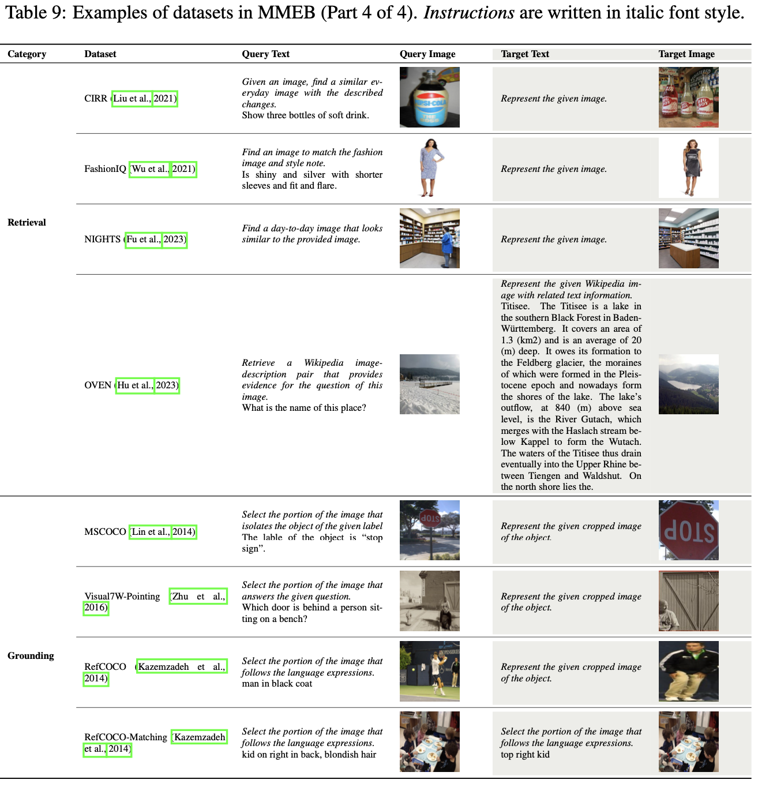
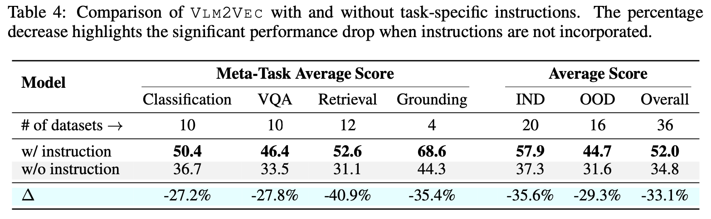

# [MM] VLM2VEC: Training Vision-Language Models for Massive Multimodal Embedding Tasks

- paper: https://arxiv.org/pdf/2410.05160
- github: https://github.com/TIGER-AI-Lab/VLM2Vec
- archived (인용수: 0회, '24-10-20 기준)
- downstream task: Ranking tasks (classification, Vision Question & Answering, Multimodal Retrieval, Visual Grounding)

# 1. Motivation

- Embedding은 다양한 downstream task를 수행할 수 있다.

- 이로 인해 Universal 한 text embedding에 대한 많은 연구가 진행되었으며, 대표적인 benchmark으로 MTEB (Massive Text Embedding Benchmark)가 등장했다.

- 하지만, Multimodal embedding 도메인에 대해서는 benchmark도, methods도 도전적인 연구과제로 남아 있다.

  1. Vision embedding만 평가하거나, 단독 task에 대해서만 수행한다. (ex. MSCOCO/Flickr retrieval)
  2. vision과 text를 단독으로 처리한다. (ex. CLIP, BLIP) 이로 인해 두 modality간의 관계를 잘 놓친다. 

  $\to$ 이를 해결하는 benchmark & method를 제안해보자!

  

# 2. Contribution

- Multimodal embedding을 위한 benchmark MMEB (Massive Multimodal Embedding Benchmark)를 제안함

  

  - 36개 datasets이 4개의 meta-task categories로 구성: classification, vision quesiton & answering, retrieval, vision grounding

  - 이 모든 task를 ranking task로 변환함 (1,000개의 candidate중 1개를 고르는 task)

  - 20개의 Training set (in-distribution dataset) 과 16개의 (domain이 다른) validataion dataset (Out-of-distribution dataset)로 구성하여 generalization 능력을 측정하고자 설계함

    

- **Pretrained VLM** 모델 <u>Phi-3.5-V</u>을 backbone으로 하며 **contrastive learning** 기반의 **VLM2VEC**을 제안함.

  - 고차원의 이미지 처리 가능 + 긴 text 문장 처리 가능
  - Transformer기반 모델 내에서 text와 vision 간의 deeply fused 됨 $\to$ cross modality간의 관계성을 잘 찾을 수 있는 구조
  - **instruction-following** 능력 기반으로 다양한 task를 수행할 수 있게 됨

# 3. VLM2Vec

- Overall Diagram

  

- Baseline: Phi-3-V (pretrained VLM)

  

  - $q_{inst}$: query의 instruction

    

    - *task_definition*: classification, vqa 등 task마다 정형화된 instruciton

      

      

      

      

  - $t^+$: positive target. 1개의 image 혹은 text 혹은 image+text일 수 있음

  - $t^-$: negative target. 1개의 image 혹은 text 혹은 image+text일 수 있음

  - **h**$_{inst}$, **h**$_{t^+}$: query embedding, positive target embedding

    - 마지막 layer의 마지막 token의 vector representation을 가지고 contrastive learning을 수행함

  - $\phi$: cosine 유사도 

    

- GradCache

  - Contrastive Learning 수행할 때, hard negative을 넣어주는게 좋으나 실제로는 이를 찾기가 어려움

  - 때문에 batch size를 늘려주어, 많은 negative sample을 계산식에 넣어주는게 중요함

  - 하지만 GPU memory 제한이 있어, 이를 늘리는 방법인 GradCache를 도입함

    

    - $\hat{Q}_j$: j번째 sub-batch 

  - 두개의 steps

    1. Representation Gradient Computation & Caching
    2. Sub-batch Gradient Accumulation

# 4. Experiments

- MMEB Benchmark

  

- Generalization Ability

  - Retrieval (8개 dataset finetuned) > VQA (6개 dataset finetuned)  > Classification (5개 dataset finetuned) 순으로 성능을 보임

    $\to$ Retreival dataset이 image, text가 instruction에 더 다앙해 좋은 성능을 보임

  

- Ablation studies

  - Full finetuning vs. LoRA

    

  - Hyperparameters (Batch-size & Number of training steps & Number of Sub-images)

    

  - Instruction Following 유/무

    