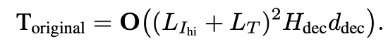

# [MM] CogAgent: A Visual Language Model for GUI Agents

- paper: https://arxiv.org/pdf/2312.08914
- github: https://github.com/THUDM/CogVLM
- CVPR 2024 accepted (Spotlight, 인용수: 151회, 24-10-29 기준)
- downstream task: VQA, GUI Agent

# 1. Motivation

- ChatGPT는 GUI를 이해하고, 이를 기반으로 사람과 interaction하는 능력이 부족함

- 기존 연구들은 LLM기반의 purely language-based agent만 있음 $\to$ real-world 시나리오에서는 꽤 제한적임

  - ex. icon, image기반의 GUI는 non-verbal한 요소가 많음
  - ex. web pages에 존재하는 canvas, iframe 같은 text기반의 rendered GUI 들은 HTML(language)만 가지고 파악이 힘듦

- GUI를 이해하고 navigation을 수행하는 VLM기반의 Agent 모델을 도입해보자!

  - ex. 온라인 티켓 예약, 웹 검색, 파일 관리, PPT 자동 생성 등 수행

    

# 2. Contribution

- GUI Understanding & Navigation을 수행하는 CogAgent를 제안함
  - <u>Training Data</u>: GUI Navigation을 위한 data와 LAION같은 natural image data로 pretrained된 기존 VLMs들의 분포가 상이하므로, GUI로 annotated된 데이터 + OCR 데이터를 기반으로 progresstive pretraining을 시도함
  - High resolution & Compute tradeoff를 고려한 새로운 <u>visual expert module</u>를 제안: GUI를 사람수준으로 이해하기 위해 작은 text를 이해하는게 필수적이므로, 기존 224x224 해상도 $\to$ 1120x1120 해상도로 늘림. 단, 기존 decoder-only 구조에서는 visual token 갯수가 기하급수적으로 늘어나므로, Cross-Attention 기반에 새로운 visual expert를 제안함
    - 1120x1120의 고해상도를 기존 구조에서 490x490을 처리하는데 필요한 FLOPs의 절반수준으로 줄임
- General VQA + GUI Navigation task에서 SOTA

# 3. CogAgent

## 3.1 Architecture

- LLM: CogLLM

  - Vision encoder: Eva2-CLIP-E@224x224

    

    - $X_{in_i}$: i번째 LLM decoder layer의 input hidden state
    - $B, L_{I_{o}}, L_T, D_{dec}$: Batch size, length of low-resolution image , length of Text embedding, i번째 hidden size of decoder layer

## 3.2 HR-CM (High-Resolution Cross Module)

- Vision encoder: Eva2-CLIP-L@1120x1120

- Cross Module

  

  - $X_{hi}$: i번째 HR-CM layer의 input hidden state
  - $B, L_{I_{hi}}, D_{hi}$: Batch size, length of high-resolution image , hidden size of HR-CM

- Cross Attention

  

- 계산량

  - New

    

  - Previous

    

  - Improved

    

    - $L_{I_{hi}}$=6400($\frac{1120^2}{14^2}$), $L_{I_{lo}}$=256 ($\frac{224^2}{14^2}$)

## 3.3 Pretraining dataset

- 사전학습 데이터셋 선별 기준

  - GUI application 시나리오

    1. 다양한 크기, 방향, 폰트의 text를 이해할 수 있어야 함
    2. 이미지 내 object, text를 grounding (localization)할 수 있어야 함
    3. Web-page 같은 GUI image에 특화 (specialize)되어야 함

    $\to$위 시나리오를 고려하여 pretraining dataset을 선별

- Text Recognition

  - 다양한 크기, font, 방향의 text를 포함한 **LAION-2B**에서 synthetic rendering한 <u>80M</u> 데이터
  - Natural image 기반 **COYO + LAION-2B**에서 OCR용 <u>18M</u> 데이터 $\to$ Paddle OCR 기반 Pseudo OCR bbox를 정답으로 사용
  - Latex기반 **Academic Document** 데이터 9M 을 data augmentation 적용하여 사용 (ex. flipping, gaussian blur, eroision, gaussian noise, etc)

-  Visual Grounding: GUI agent에게 element를 잘 이해하고, 배치시키는 능력은 필수불가결하므로 Visual Grounding dataset을 학습

  - LAION-115M 중 <u>40M</u>의 image-caption pair dataset $\to$ [0, 999]로 normalize 수행

  - Web-page에서 crawling한 GT dataset $\to$ CCS400K dataset을 제안 (Common Crawl Screen Shot <u>400K images</u> & <u>140M VQA</u> datasets)

    - REG (GUI Referrring Expression Generation): screenshot으로 캡쳐된 이미지 내 DOM (Document Object Model) 요소들의 HTML code를 생성하는 task

    - REC (GUI Referring Expression Comprehension): DOM 요소들의 bbox를 생성하는 task

      $\to$ overfitting 방지를 위해 다양한 screen resolution rendering에 사용

  - 추가로 COYO-700M+LAION-2B의 image caption 데이터를 사용

## 3.4 Training

- Pretraining

- 쉬운 task부터 training (Curriculum learning)하여 더욱 빠른 수렴속도를 보였다고 함
  - text recognition $\to$ image captioning $\to$ harder text recognition (academic document) $\to$ grounding & web page data
- batch-size (4608) + iteration (60K)
  - 초기 20K는 HRCM만 학습하고 나머진 freeze
  - 나머지 40K는 전부 학습

- Finetuning
  - mobile phone 2K의 screen shot을 모아 10명의 labeler를 통해 다양한 potential task별로 annotation을 수행
  - Mind2Web & AITW 등과 같은 opensource benchmark도 사용

# 4. Experiments

- VQA

  

  

- GUI Navigation

  

- Ablation Studies

  - Model architecture에 따른 computation 비교

    

  - Model architecture에 따른 성능 비교

    

  - Pretraining data에 따른 성능 비교

    