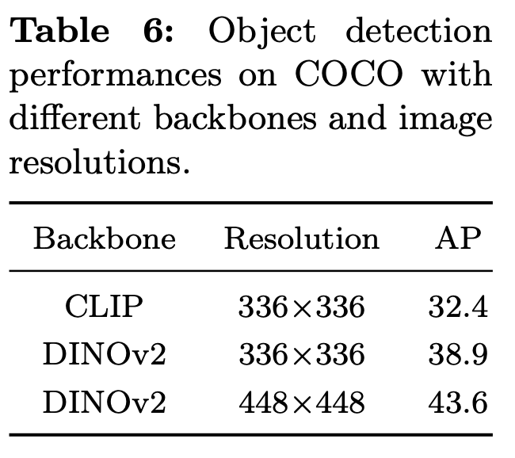

# [MM] Groma: Localized Visual Tokenization for Grounding Multimodal Large Language Models

- paper: https://arxiv.org/pdf/2404.13013
- github: https://github.com/FoundationVision/Groma
- ECCV 2024 accepted (인용수: 15회, 24-10-30 기준)
- downstream task: Visual Reference Comprehension & Grounding, VQA

# 1. Motivation

- 최근 MLLM은 localization 능력이 떨어져, visual context를 잘 이해하지 못한다.
  - <u>물체의 coordinate를 직접적으로 예측하는 방법</u>: 고해상도 이미지 처리하기 위해서 visual token이 많아지는 challenge가 있음
  - <u>LLM의 sequence를 처리하는 태생적 한계</u>: 이를 극복하고자 외부 모듈 (ex. SAM)을 도입하는 방법  $\to$ 추론 속도에 지장
  
- Open-vocabulary Object Detection에서 영감을 얻어, grounding task를 2개로 나누면 어떨까? (**Perceive-then-understand**)
  
  ex. Grounding-DINO 
  
  
  
  - Localization: Perceptual skill은 요구되나, semantic understanding은 불필요 $\to$ tokenizer
  
    - 장점
      - 고해상도 이미지 입력을 tokenizer에만 주고, LLM은 저해상도 입력을 줌으로써 계산량은 줄이고, localization 성능은 보존이 가능함
      - referring input (설명 부분에 해당) & grounding output (object coordinate)를 region token으로 통합할 수 있음
  
  - Recognition: 검출한 object를 text와 연결 $\to$ LLM
  
    

# 2. Contribution

- Localized & fine-grained visual perception 능력을 갖는 Groma (Grounded Multimodal Assistant)를 제안함 (Groma: 라틴어로 정밀 측정기라는 의미도 있다고함)

  - region tokenization: RoIs (Regions of Interest)를 식별하고 encoding하여 region token으로 변환하는 과정

    $\to$ region token과 RoI가 연관되어 있기 때문에, region token을 MLLM은 참조하기만 하면 됨 (기존에는 coordinate 4개 값을 모두 예측했어야 함)

    $\to$ user가 입력한 region input 역시 encode할 수 있음

    

- Dataset: GPT-4V를 기반으로 long-form grounded data인 "Groma Instruct"를 생성함

  

- Referring & Grounding benchmark에서 SOTA 달성 + image-level understanding에서도 좋은 성능을 보임

# 3. Groma

## 3.1 Model Architecture

- 4개의 모듈로 구성: (1) image encoder: image tokenizer (2) region proposer: RoI 찾는 모듈 (3) region encoder: region-level image tokenizer (4) LLM

1. Image Encoder: DiNOv2@448x448 pretrained ViT를 사용

   - 1024 token $\to$ 256으로 변환하는 2D neighbor patch token merging을 사용

2. Region Proposer: Deformable-DETR을 사용

   - 4개의 마지막 Image encoder layer를 feature pyramid로 활용
   - 300개의 region proposal을 출력 (+NMS + objectness score)
   - binary classifier를 사용

3. Region Encoder: Region propser의 output (region proposals, bounding-boxes)를 region token으로 변환

   - Multi-scale RoIAlign layer: 해당 영역의 feature를 crop & feature fuse를 하여 region tokens을 생성

     $\to$ 기존의 numerical representation of position (ex. x,y,w,h)에 비해 해당 이미지 영역에 대한 feature와 semantically align되므로 LLM 모델이직관적으로 이해

4. LLM: Vicuna-7B 
   - Adapter: MLP layer (LLaVA-1.5와 동일) , image-token & region-token을 LLM의 input feature space로 mapping 역할

## 3.2 Input & Output Formatting

- User-specified region을 입력으로 (referring) 받고, visuall grounded answer (grounding)을 region token으로 처리할 수 있음

  - region token: Region proposal 내 정밀한 location 정보를 담고 있음. LLM의 text output과 연결고리 역할

  - Proxy tokens: Continuous한 region token을 codebook에 직접 통합할 수 없어 대신 register하고자 추가함

    

- Grounding Output (Region Proposer의 출력값 활용)

  

  - <image>, <region> : image token과 region token이 대체되는 placeholder 역할
  - '
, '
: grounded phase의 시작과 끝을 알리는 역할
  - <roi>, </roi>: reference region의 시작과 끝을 알리는 역할
  - [grounding]: 모델에게 grounding answer를 내도록 알리는 역할

- Referring Input (User-specific region을 활용)

  

## 3.3 Model Training

- 3개의 stage로 학습

  

  1. Detection pretraining: Localization 능력 함양 (A100-8대 기준 5일 소요)
     - Image encoder + Region Proposer만 학습 (나머진 freeze)
  2. Text-Image Alignment pretraining (image-level + region-level) (A100-8대 기준 2.5일 소요)
     - MLP projection layer + region encoder만 학습 (나머진 freeze)
  3. Instruction Finetuning (A100-8대 기준 0.5일 소요)
     - Full-finetuning

- Dataset

  

## 3.4 GPT-assisted Grounded Conversation Generation

- SFT stage에서 사용할 Groma Instruct 데이터셋 확보를 위해 ChatGPT-4V를 활용

  - 목적: fine-granied visual grounding dataset 확보 (Visual Genome 데이터셋 활용)

    

  - 방법

    1. highly overlap bbox는 제외 (3-10 RoIs/image) + Numeric marker를 사용하여 이미지에 표시
    2. Rich region description 추가 (image-based Q&A, image description, textual context)
    3. Few-shot 으로 manually desgined grounded chat을 제공

# 4. Experiments

- Region proposer: 6개의 encoder + 6개의 decoder로 구성
  - mixed query selection + look-forward-twice 적용하여 학습 속도 향상
  - Top-100 region 예측

- 정량적 결과

  - Grounding Benchmarks

    

    - Wen-VL보다 작은 grounding 데이터셋 (10x), 작은 visual tokenizer (1.9B vs 0.3B(?))을 가지고 비슷한 성능

    - REC는 협소한 object grounding에 대해서만 평가해서 LVIS-Ground로도 평가를 진행

      

  - Referring Benchmarks: fine-grained region understanding 능력 평가

    

    

  - Conversational VQA Benchmarks

    

    - Image-level Understanding에도 준수한 성능
      - 다만 Ferret보다 Conversation & Reasoning에서 안좋은건 DiNOV2가 Clip보다 image understanding에서 떨어지기 때문
      - Scale-up pretraining하면 해결될 걸로 예상

- 정성적 결과

  - Grounded Image Captioning Task

    

  - Grounded Chat & Referential Dialog

    

- Ablation Studies

  - Clip vs DINOv2: RoIs Detection 성능이 DINOv2가 뛰어나서 이를 채택

    

  - Frozen vs UnFrozen LLMs @ SFT

    

  - (Image) Token Merge

    - 성능은 거의 보존되면서 visual token은 1/4

      