# [MM][GUI] V-Zen: Efficient GUI Understanding and Precise Grounding With A Novel Multimodal LLM

- paper: https://arxiv.org/pdf/2405.15341
- github: https://github.com/abdur75648/V-Zen
- Archived (인용수: 1회, '24-11-06 기준)
- downstream task: GUI Navigation, Visual Grounding

# 1. Motivation

- MLLM의 발전에도 불구하고 기존 모델들은 GUI를 이해하고 미세한 interaction하기에 부족함

  - 시각적 정보를 간과하고, text-bawsed task에 중점을 두고 있음

    - 문제점
      1. bounding box의 coordinate를 text 응답으로 대체 $\to$ GUI icon들 (image, diagram, ico)간의 공간적 상관관계, 시각적 컨텐츠를 간과하게 됨 $\to$ 정밀하지 못함
      1. 이미지를 224x224의 작은 크기로 resize $\to$ 작은 icon들의 정보가 사라짐

    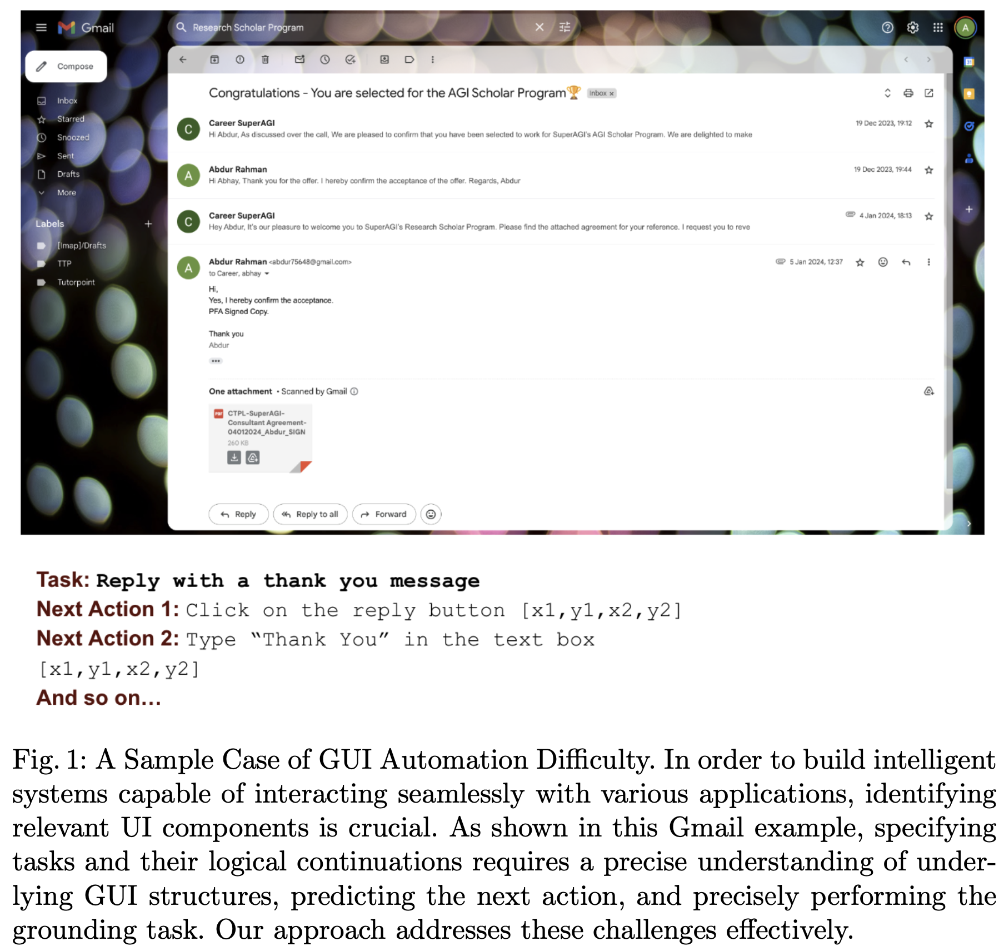

  - 자동 GUI task를 위해 미세하고 효율적인 "Grounding" 능력이 부족함

    $\to$ GUI navigate & understanding & interacting 능력을 키우기 위해 **visual grounding module**을 도입해보면 어떨까?

# 2. Contribution

- MLLM에 visual grounding module로 DINO detector를 결합한 V-Zen MLLM모델을 제안함
  - Object의 위치 정보가 LLM뿐 아니라 grounding module로부터 생성되며 coordinate의 정확한 예측을 수행하게됨
  - CogAgent와 같이 High Cross-Resolution Module (HCRM) (1120 x 1120) 에 활용할 dual-resolution image encoder 도입하여 추가 성능 향상
- GUIDE (Graphical User Interface Data for Execution)라는 Visual Grounding GUI dataset를 제안함
- Next-action prediction & grounding에서 SOTA

# 3. V-Zen

## 3.1 Overview

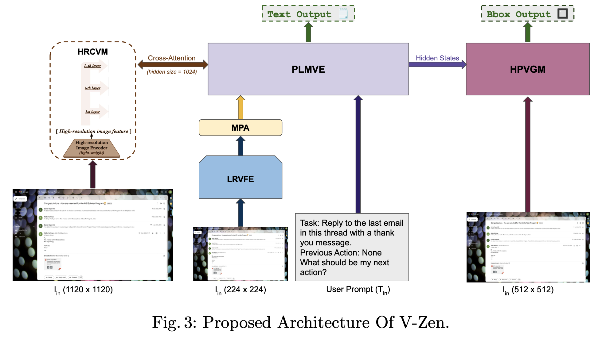

## 3.2 Modules

- 5개의 모듈로 구성

  1. LRVFE (Low-Resolution Visual Feature Extractor)

     - Eva-2-Clip (224x224)기반의 image encoder 

       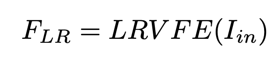

  2. MPA (Multimodal Projection Adapter)

     - MLP layer로 구성되며, Image $\to$ Text feature로 projection하는 역할

       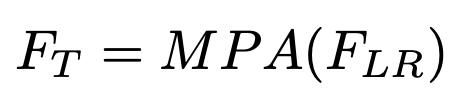

  3. PLMVE (Pretrained Model with Visual Expert)

     - Vicuna-7B / Misrtral LLM을 사용 $\to$ Answer를 text (혹은 hidden state)를 제공하는 역할

     - Image와 Text를 나누어 encoding후 MSA 수행

       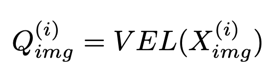

       - VEL: Visual Expert Layer
       - $Q_{img}^{(i)}$: i번째 layer의 Visual embedding vector

       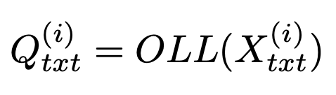
       
       - OLL: Original LLM Layer
       - $Q_{img}^{(i)}$: i번째 layer의 Visual embedding vector
       
       $$Q^{(i)}=MHSVE(Q_{img}^{(i)}, Q_{txt}^{(i)})$$
       
       - MHSVE: Multi-Head Self Attention with Visual Experts

  4. HRCVM (High-Resolution Cross Visual Module)

     - 작은 Eva2-CLIP 1120x1120을 사용

     - CogAgent와 동일한 구조로 High-resolution image의 feature를 LLM layer마다 Cross-Attention시킴

       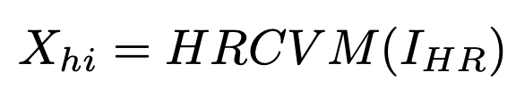

       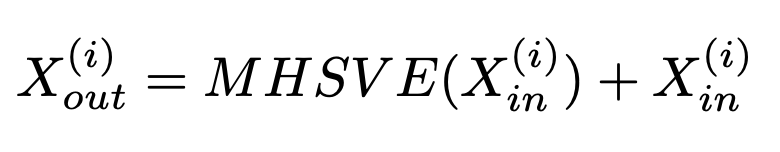

       - Final Output은 Residual Connection

         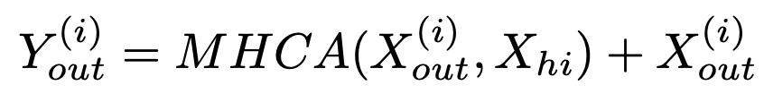

  5. HPVGM (High-Precision Visual Grounding Module)

     - MLLM의 마지막 hidden state를 query로 입력받고, Swin Transformer기반의 backbone에서 multi-scale image feature를 key, value로 하여 bbox를 예측
     - DINO를 기반으로 구현

- 학습

  - CogAgent와 동일하게 학습했다고 함

## 3.3 GUIDE Dataset

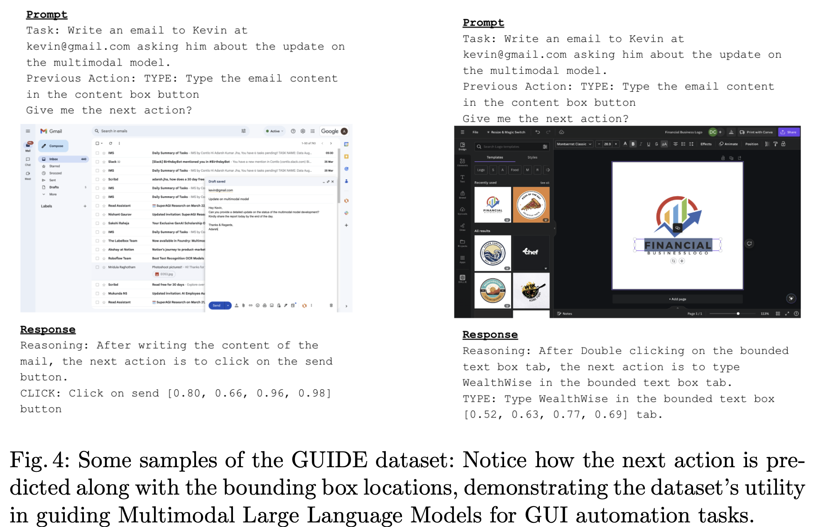

- Source: Apollo.io, Contlo, Gmail, Google Calendar, **Canva**에서 **124,000** sample을 뽑았음 (비공개ㅠ)
- CoT (Chain of Thought)기반으로 구성됨
- Next action이 무엇인지, Grounding information과 함께 제공

# 4. Experiments

- 정량적 결과

  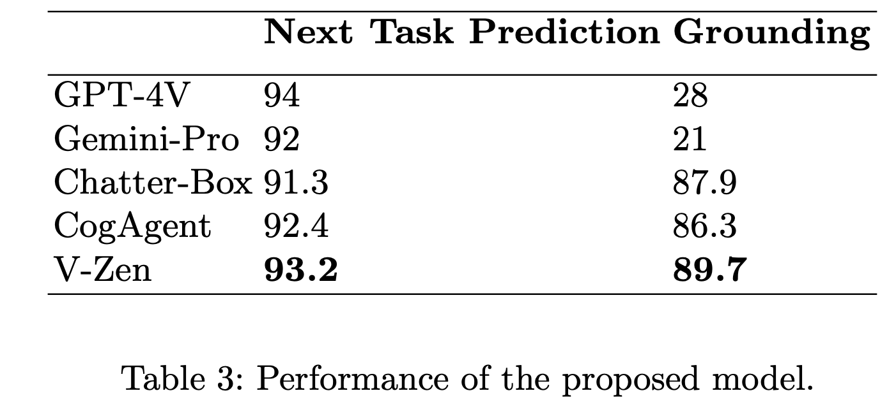

- 정성적 결과

  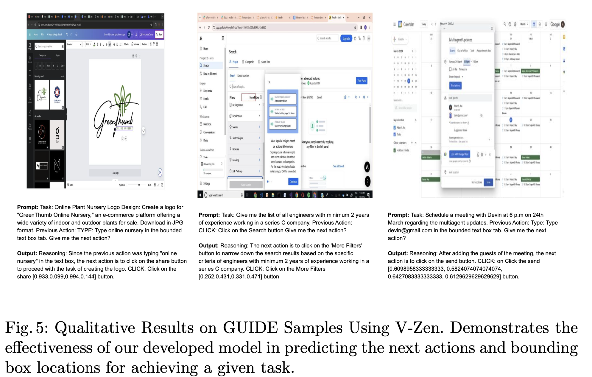

- Ablation Studies

  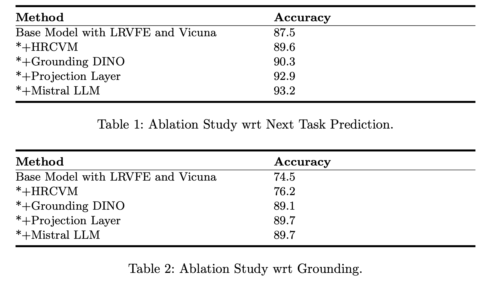