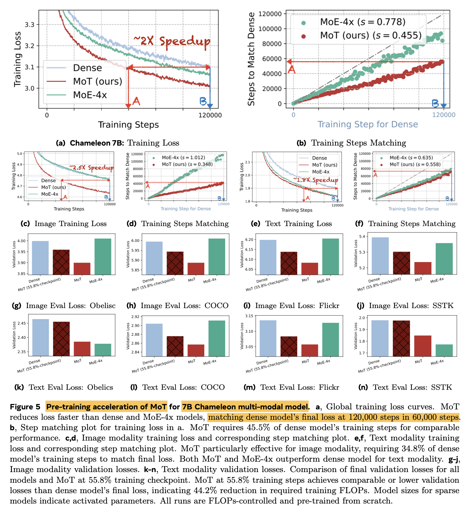
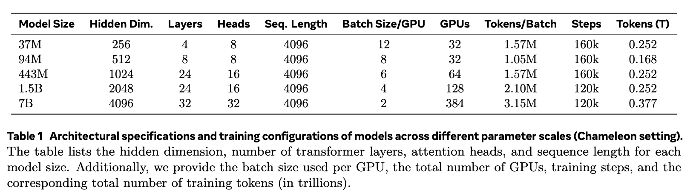

# [MM] Mixture-of-Transformers: A Sparse and Scalable Architecture for Multi-Modal Foundation Models

- paper: https://arxiv.org/pdf/2411.04996
- github: X
- archived (인용수: 0회, '24-11-12 기준)
- downstream task: T2I generation, Text generation, Speech generation

# 1. Motivation

- 최근 서로 다른 modality (ex. text & image)를 early fusion (ex. unified tokenizer)하는 것이 좋은 성과를 내곤 한다. (ex. Chameleon)

  - 하지만, 이는 text-only Llama-2와 비등한 성능을 내기 위해 훨씬 많은 학습 데이터를 요구한다. (9.2T tokens vs. 2T tokens)

  $\to$ Scaling challenge를 해결하고자 **MoE** (Mixture of Experts)로 **sparsely activation**을 수행함으로 해결하고자 하는 연구가 있다.

  $\to$ learned router 없이는 **imbalanced activation, unstable scale-up** 이슈가 붉어진다.

  $\to$ 또한, **simple rule-based routing**이 더 좋은 성능을 내기도 한다.

- 해당 모델은 서로 다른 modality간에 distinct한 modality-specific prior 없이도, 서로 다른 feature space로 projection된다. 

  

  $\to$ 서로 다른 modality간에는 타고난 difference가 있기 때문에 다르게 processing됨을 의미함

  $\to$ **modality-specific router**를 도입해볼까?

# 2. Contribution

- Chameleon setting (Image generation & Text generation)에서 55.8%의 Training token만 가지고, dense baseline의 성능을 matching

  

- 3rd modality로 speech를 추가 (Image+Text+Speech)하고 동일하게 빠른 학습 속도를 보임 (37.2%의 Training token만으로 기존과 동등한 수준)

  

- Modality Specific Loss (Transfusion)으로 더 향상된 성능 $\to$ CIDEr (Image captioning), FID score & CLIP score (image generation), training loss

  

  

  - Text: Next Token Prediction Loss
  - Diffusion: Diffusion Loss

- MoT의 training computation efficiency를 기존 모델들 (dense model, MoE model)과 비교

  

  - A100, 7B LLM기준 image는 47.2%, text는 75.6% 로 dense model performance를 match
  - 동일한 파라미터 수 MoE-4x 대비 성능 &. 학습 속도 향상

- MoT(text) + MoE-4x(image) 헀을 때 가장 좋은 성능

  

# 3. MoT

- Architecture

  

  - 목적: Multi-modal pretraining의 computational cost를 줄이는게 목적

  - 방법: Non-embedding weight (ex. FFN, normalization layer, Attention layer)를 modality-specific하게 구분

    - 기존 Transformer

      

    - MoT Transformer

      

      - Global Attention: 모든 modality 간에 self-attention 수행

        

- Algorithm

  

# 4. Experiments

- Autoregressive

  

- Image+Text+Speech Modality

  

- Modality-specific Objectives

  

## 4.1 Autoregressive Objectives for Text & Image

- 학습 속도 향상

- Model parameter Scale-Up 실험

  

- Validation Loss 역시 향상

  

## 4.2 Text+Image+Speech Results

- Dataset

  

- Models

  

- Results

  

## 4.3 Autoregressive Text + Diffusion-Based Image Generation

- Special Token 추가

  - BoI: Begin of Image
  - EoI: End of Image

- Result

  

- 정성적 결과

  

##  4.4 Ablation Studies

- 실험

  

- Module별 기여

  

- Leave-One-Analysis (2개로 병합)

  

  $\to$ 통합되지 않은 modality에서 좋은 성능이 나타나는 것으로 보아, embedding 외 weight를 modality-specific하게 구별하는게 나음

## 4.5 Combine MoE + MoT

- Text (MoE-4x) + Image (MoT)가 제일 좋은 성능

  

## 4.6 MoT의 ML System 관점

- Throughput

  $$|ROUTER| = K \times D \\ MoE=(E-1) \times |FFN| + |ROUTER| = 3(E-1)D^2+ED > 3(E-1)D^2 \\ MoT=(K-1) \times (|ATTN| + |FFN|) = 7(K-1)D^2$$

  - E: Feed-Forward layer 수
  - K: modality 수
  - D: hidden embedding dimension
  - ATTN: Attention Layer = $4D^2$

- Compute Efficiency

  - MoE: Top-K selection, indexing tokens, scatter + adding expert output가 latency에 부정적
  - MoT: Token을 grouping하는데 CPU-GPU synchronization이 요구됨. $\to$ engineering technique으로 해결 가능

- Walltime Clock기준 학습 시간 향상

  