# [Layout] LayoutDETR: Detection Transformer Is a Good Multimodal Layout Designer

- paper: https://arxiv.org/pdf/2212.09877
- github: https://github.com/salesforce/LayoutDETR
- archived (인용수: 9회, '24-11-13 기준)
- downstream task: Content-aware Layout Generation (ad-banner, mobile UI app)

# 1. Motivation

- Generative Models들은 디자인 자동화를 scale-up했지만, graphic layout design을 하기 위한 designer들의 요구를 들어주기 어려운 면이 있다.

- 왜? Background 영역을 조건으로 forgroung 이미지를 재배치하기 위해서는 Background 영역을 잘 "검출"하고, multimodal forground element들을 타당하게 재배치 및 크기 변경해야 하는데, GM 은 이러한 능력이 결여 됨

  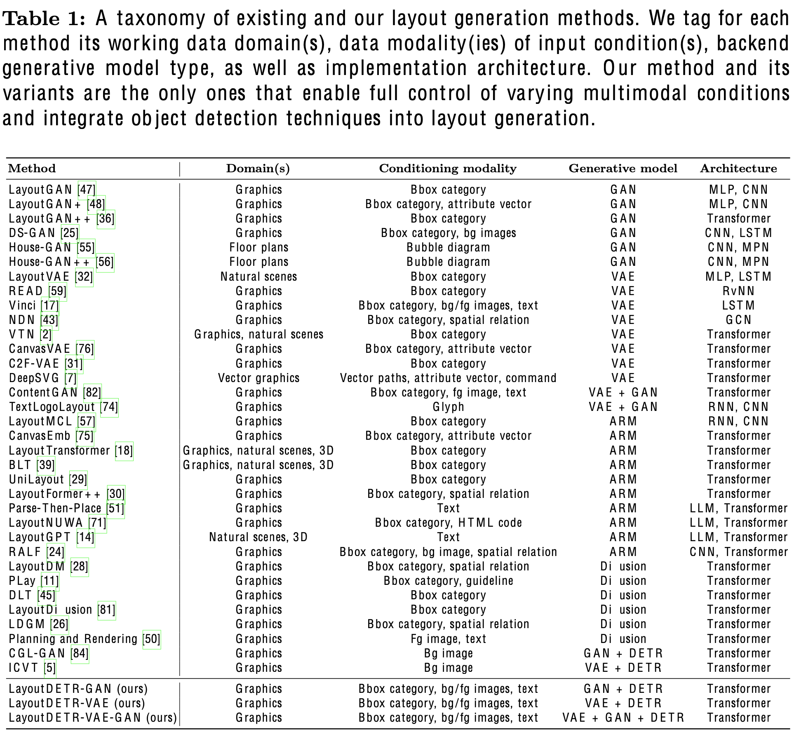

  $\to$ Content-aware layout generation 문제를 Detection 문제로 바라보고, layout의 박스를 예측하는 문제로 바라보면 어떨까?

  - forground layout의 분포를 학습하는 능력
  - background image의 모양과 의미를 학습하는 능력
  - foreground image의 모양과 의미를 학습하는 능력
  - background & foreground 정보를 결합하여 foreground의 bbox 정보를 생성하는 능력

# 2. Contribution

- 서로 연관되지 않은 두 분야, layout generation과 visual detection을 연결하는 framework인 LayoutDETR을 제안함

  - "detection" == "generation"이 어떻게 실현가능 한가?
    - "layout" concept을 학습하기 위해 GAN discriminator, Layout Encoder를 도입

  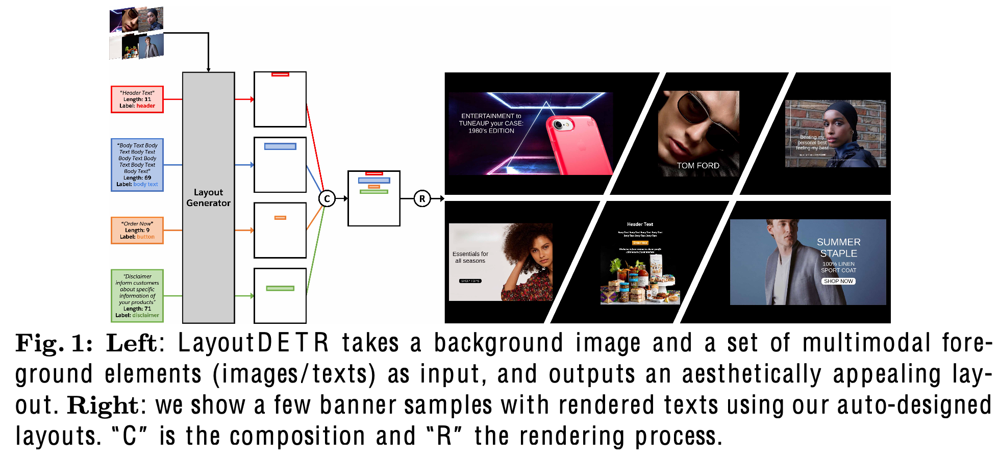

  - input
    - background image
    - Foreground elements
      - text: text 길이 정보, label 정보 (ex. subject, body, etc), text content
      - non-text: image

- 대량의 ad-banner dataset을 제안함 

  - text bbox, text categories, text content 등 포함

- 6개의 evaluation metric에서 SOTA

- Graphical system & User study 진행함

# 3. LayoutDETR

- 문제 정의

  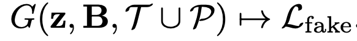

  - *G*: Layout Generator
  - **z**: Layout Generator의 입력되는 latent noise vector

  - Layout *L* = {**b**$^i$}$_{i=1}^N$

    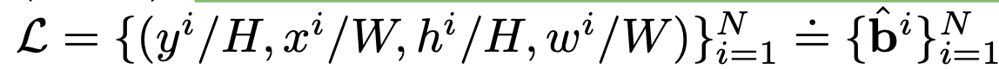

    - text element

      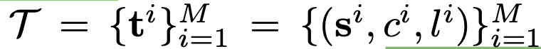

      - **s**$^i$: i번째 text element의 context
      - $c^i$: text label {header, body, disclaimer, button}
      - $l^i$: text string의 길이

    - image element

      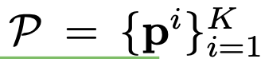

      - **p**$^i$: i번째 image element의 patch 정보 (ViT)

  - 관심 없는 요소 (button underlay, embellishment)는 background로 변경하여 진행

- Overall Architecture

  - 4개의 모듈로 구성: Encoder, VAE, GAN, Decoder

  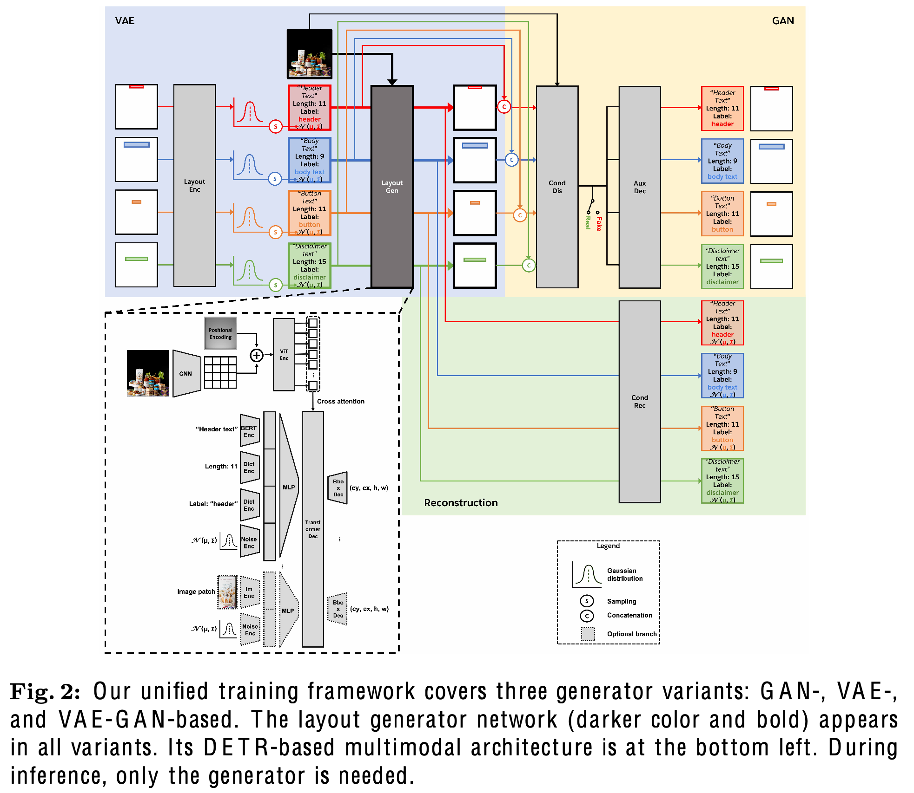

## 3.1 Generative Learning Frameworks

- GAN Variant

  - Generator: Layout-DETR

  - discriminator

    - $D^c$: multimodal conditional discriminator
      -  input: *L*, ***B***, $T \cup P$
      - output: \{0,1}
        - 1: ground truth layout
        - 0: generated layout
    - $D^u$: multimodal unconditional discriminator
      - input: *L*
      - output: \{0,1}

  - Honey Tip

    - irregular bbox에 insensitive한 경향이 있음 (ex. 우측 하단에 있는 header text는 학습 중에 무시하게 됨)

      $\to$ position-aware regularization을 통해 해소

  - Decoder

    - Bbox를 reconstruct하는 auxiliary decoder를 discriminator에 추가함

      - bacground, foreground elements를 안보고, layout을 예측한 결과(unconditional)가 이 모든걸 보고 (conditional) 예측한 결과랑 유사해지도록 학습
      
        $\to$ layout 자체만 집중하여 학습하는 효과
      
      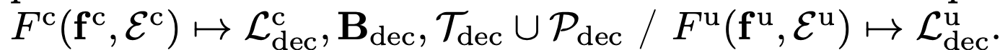

  - Loss

    - GAN Loss

      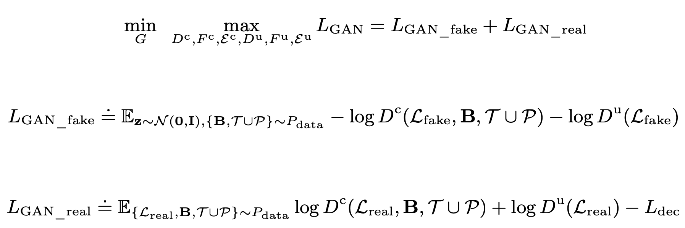

    - Reconstruction Loss

      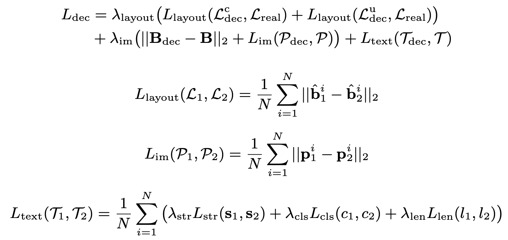

      - $L_{str}$: auto-regressive loss
      - $L_{cls}$: standard classification loss (CE loss)
      - $L_{len}$: 256개의 quantized된 length class에 대한 CE loss

- VAE Variant

  - VAE framework: Generator *G*가 encoder *E*와 동시에 학습되는 framework

    - Encoder *E* 

      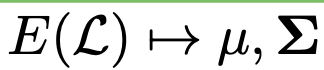

      - input: Ground Truth Layout
      - output: latent vector **z**
    
    - 해당 출력은 Gaussain sampling으로 Generator에 입력으로 들어감
    
      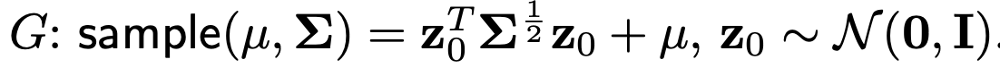
  
  - Loss
  
    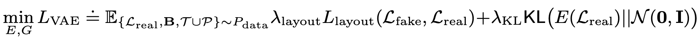

- Total Loss

  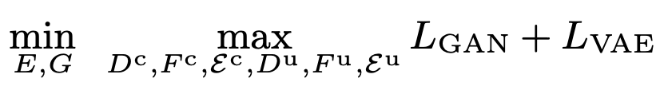

## 3.2 Additional Objectives

- GIoU Loss

  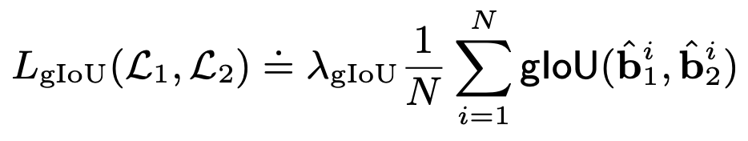

  - $L_1, L_2$: Ground Truth Layout, Prediction Layout

- Auxiliary Reconstruction Loss

  - 목적: input의 controllability를 향상

    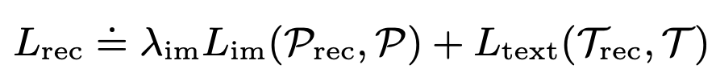

- Overlap Loss

  - 목적: element간에 overlap을 방지하고자 함

    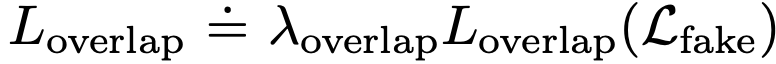

- Alignment Loss

  - 목적: 미적으로 아름다운 layout은 6개 중 1개의 alignment를 갖고 있음 (left, horizontal-center, right, top, vertical-center, bottom). 

    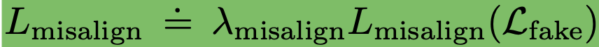

- Total Loss

  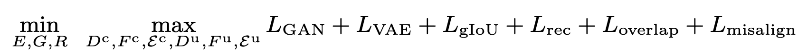

## 3.3 DETR-based Multimodal Architectures

- DETR-decoder 기반
  - 차이점: learnable object queries $\to$ foreground embeddings로 대체
    - text 요소의 경우, BERT의 embedding, text class embedding (learning dictionary), 그리고 text length embedding (learning dictionary)로 대체

## 3.4 Ad Banner Dataset

- Source: Pitt Image Ads Dataset
- Text class: 4개 (header text, body text, disclaimer text, button text)
  - logo: header text로 대체
  - text string은 OCR engine으로 추출
- 7,196개의 English character로만 구성된 ad-banner dataset

# 4. Experiments

- 정량적 평가

  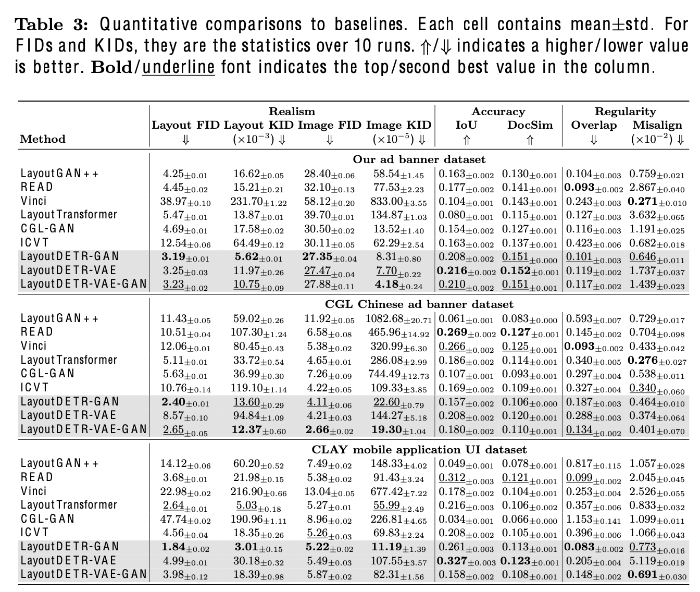

  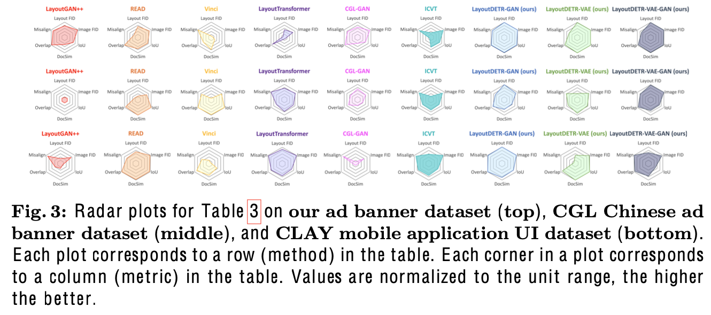

- 정성적 결과

  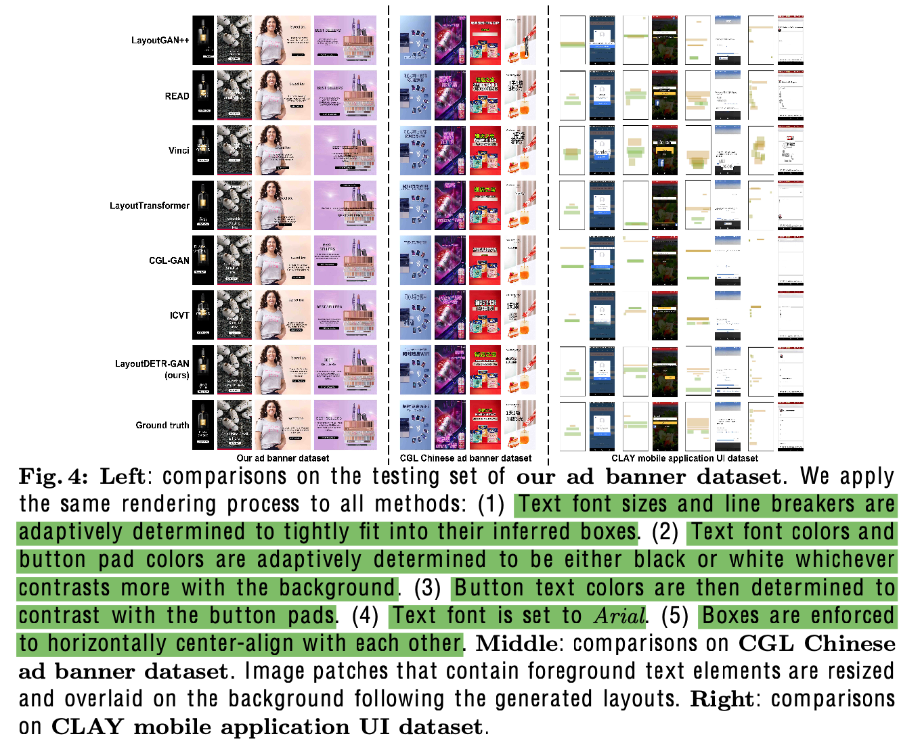

- User preference 결과

  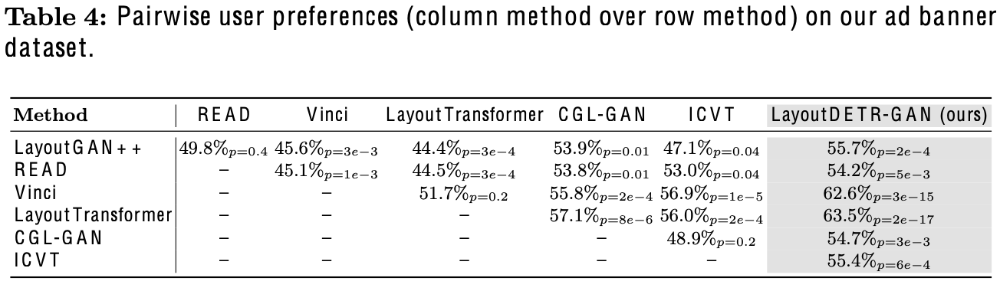

- Ablation Studies

  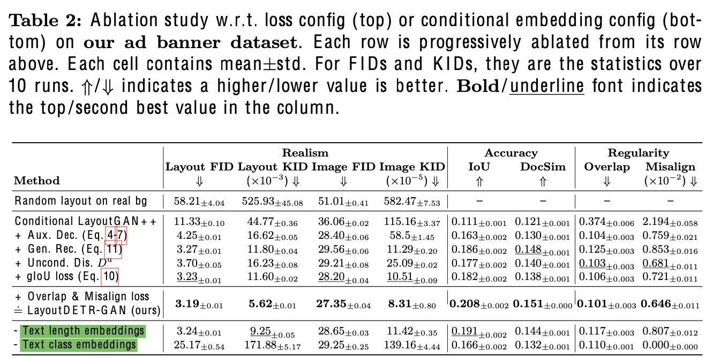
