# [MM] Visual CoT: Advancing Multi-Modal Language Models with a Comprehensive Dataset and Benchmark for Chain-of-Thought Reasoning

- paper: https://arxiv.org/pdf/2403.16999
- github: https://github.com/deepcs233/Visual-CoT
- NeurIPS 2024 accepted (SpotLight) (인용수: 0회, '24-11-18 기준)
- downstream task: OCR, VQA

# 1. Motivation

- Chain-of-Though reasonoing은 LLM에서 이점을 보이나, MLLM에 적용한 연구는 드물었음

- 인간의 시각적 이해와 비슷하게, 협소한 영역에 집중하며, MLLM을 black-box가 아닌, 해석 가능한 수단으로 만들 고 싶음.

  $\to$ Multi-turn & Dynamic focused visual 입력을 주어 해결해보자!

  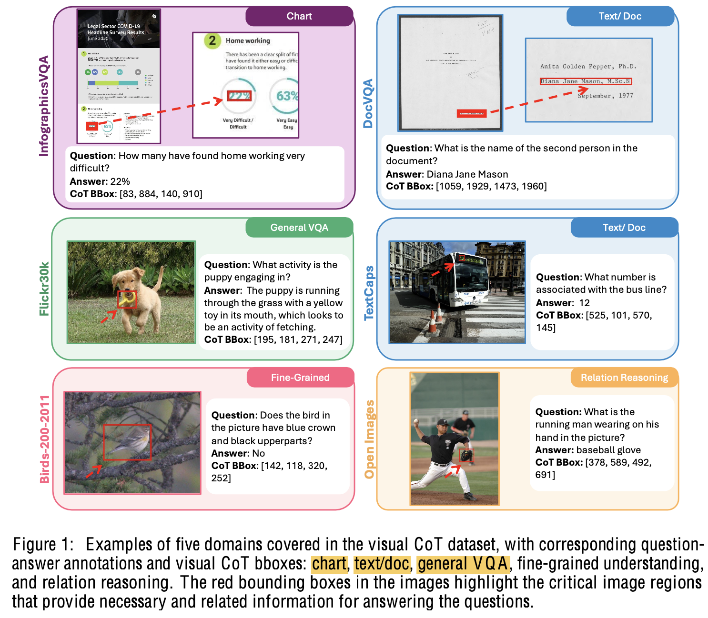

# 2. Contribution

- Visual CoT dataset 438K를 공개함
  - VQA, detailed reasoning step 추가 (98K)
  - 5개의 domain (차트 / 문서 / 일반 VQA / 세밀한 이해 / 관계 이해)
- 새로운 multi-turn processing pipeline을 제안함 
- Visual Chain-of-Toughts benchmark을 제안함
  - 답을 하기 위해 작은 영역을 봐야 하는 경우가 많음 (캔버스 크기 대비 1%보다 작음, 247.8$^2$ pixel)

# 3. Visual CoT

- Dataset: 데이터셋 생성을 위해 chatGPT(언어) / PaddleOCR(시각) 사용

  - 구성

    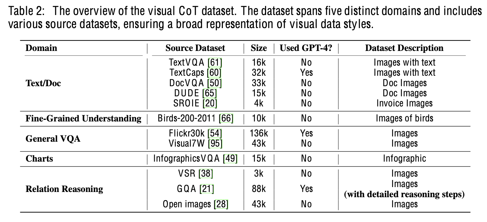

    1. Text/doc: OCR 및 맥락 이해
    2. Finegrained Understanding: ex. 새의 부분 라벨링 
    3. General VQA: 일반적 능력 향상
    4. Charts: 고해상도 이미지가 특징. OCR 적용하여 정답 영역을 인지하고 CoT bbox 생성
    5. Relation Reasoning: 이미지 내 물체간의 공간적 관계가 복잡함. scene graph of objects를 구성함 (GQA)

  - Reasoning step 예시

    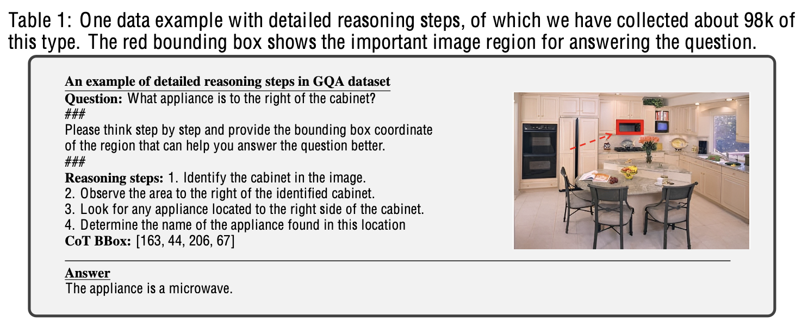

  - 데이터 분석

    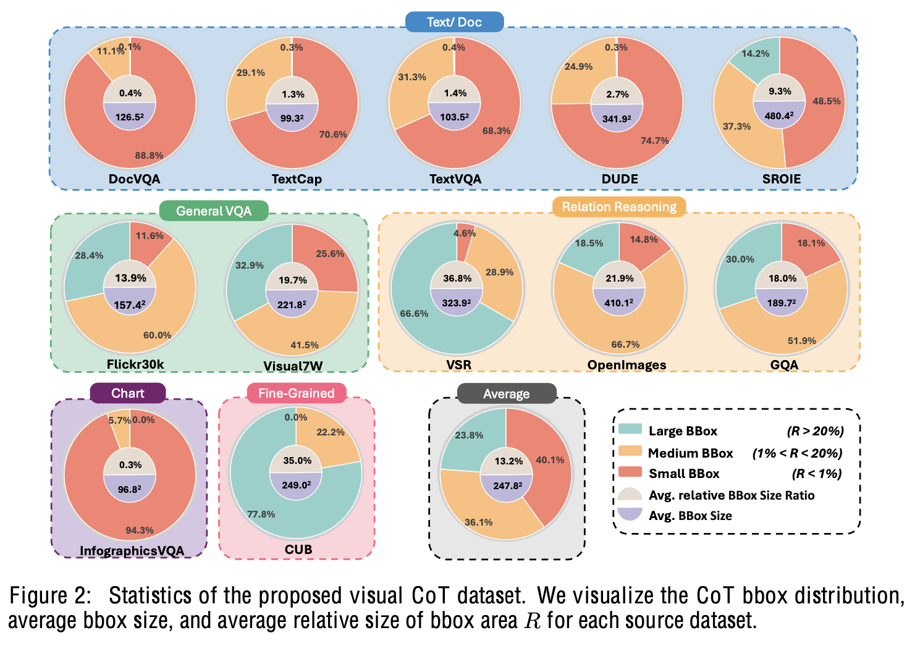

- VisCoT

  - 학습 중에는 CoT bbox로 ground truth를 사용

  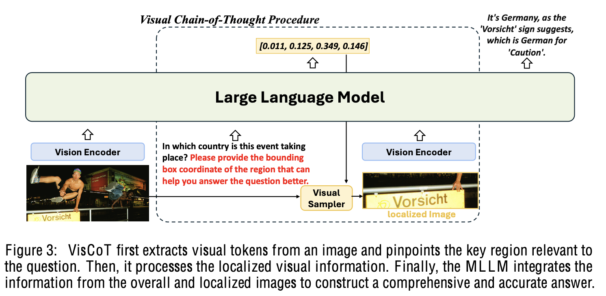

  - Visual Sampler

    - Vision Encoder와 동일

    - crop하는 공식

      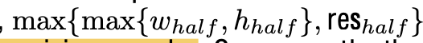

      - $res_{half}$: 224 $\to$ 112, 336 $\to$ 168
      - 영역이 이미지를 벗어나는 경우엔 이미지 중심으로 이동후 crop

- 학습

  - pretraining: LLM & vision encoder는 freeze하고 projector만 학습 (32 Hours@A100)

    - Table 2. 참고

  - finetuning: 전체 학습 (512 Hours@A100)

    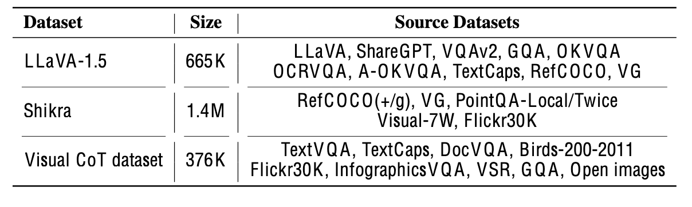

# 4. Experiments

- Visual CoT benchmark

  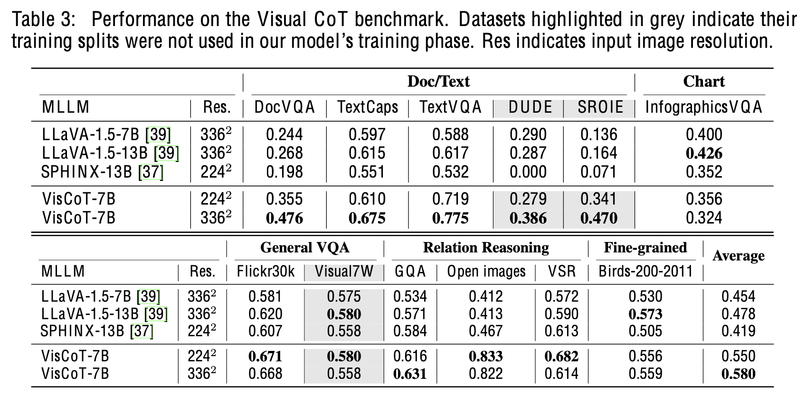

- Ablation study

  - CoT 유/무

    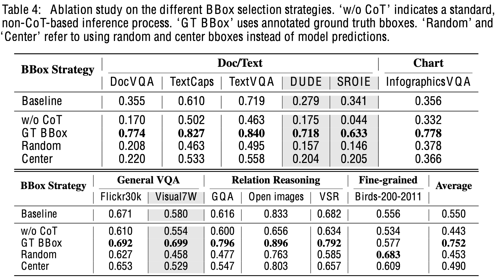

  - Visual sampler: crop을 어떻게 할 건가에 따른 성능 비교

    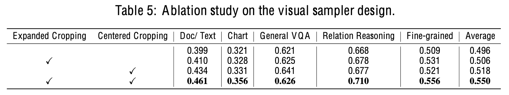

  - Token Efficiency

    - 2번 inference함에 따라 resolution을 4배 줄여도 기존보다 좋은지 체크

      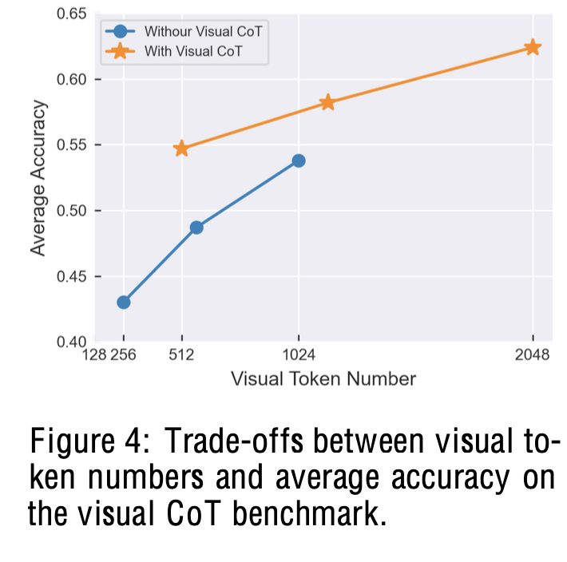

- 정성정 결과

  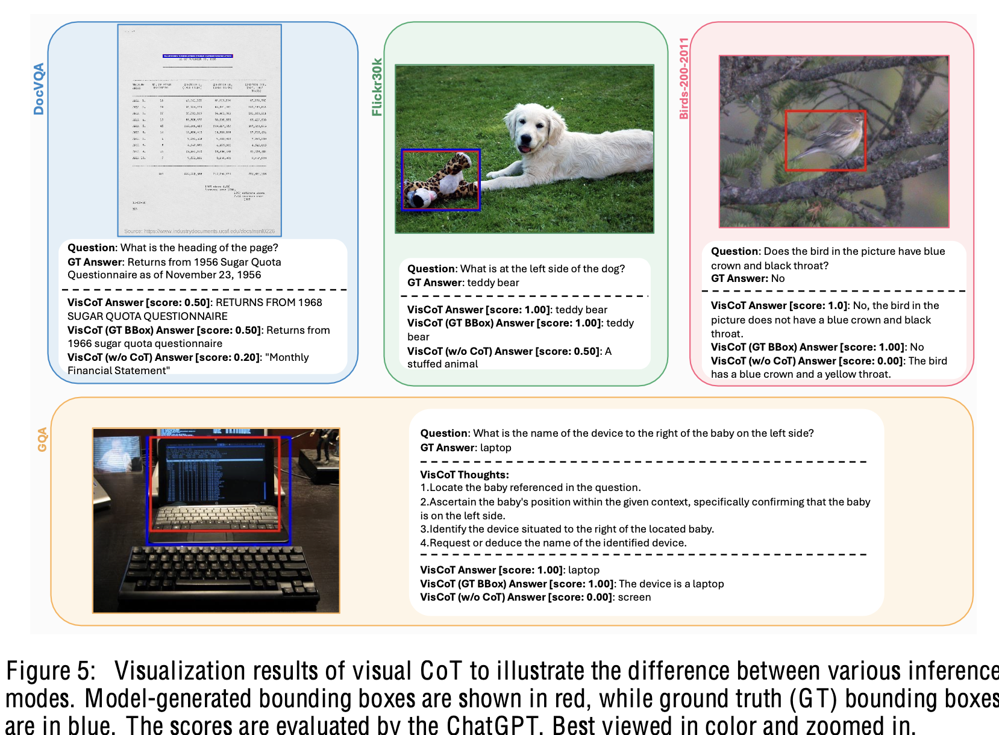