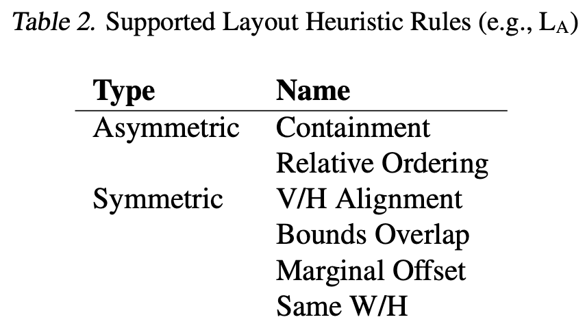

# [Layout] Interactively Optimizing Layout Transfer for Vector Graphics

- paper: https://arxiv.org/pdf/2309.11635
- github: X
- ICML AI & HCI Workshop Paper (인용수: 1회, '24-11-20 기준)
- downstream task: Interactive Layout Optimization

# 1. Motivation

- "Vector Graphics"는 곡선 기하학 등 다양한 형태의 요소를 discrete하게 표현함으로써 cleanliness & scaliabilty가 좋아 산업-표준 시각적 디자인 방식임

- Skilled desginer들은 요소간의 상대적 관계성 (alignment, ordering, sizing, 등)을 통해 전달하고자 하는 핵심 정보를 전달하는데 활용함

  - 이러한 layout 규칙에는 많은 heuristics가 포함됨

- 하지만 이러한 Design process로  규칙을 수정하는데는 공수가 많이 듬 $\to$ 기존에 존재하는 layout design (source)는 많은 "영감"을 줌

  $\to$ 공수가 많이 드는 작업 속도를 줄이기 위해, "참조" 레이아웃으로부터 5가지를 충족시키는 tool을 만들어보자!

  1. 레이아웃 정보를 추출
  2. 특정 요소만 적용
  3. heuristic rule (ex. align, ordering, containment, etc) 을 적용
  4. 특정 property (ex. x, y / width, height)만  적용
  5. 수동으로 수정 가능 (interactive)

- $L_A, L_B$: A(Target)의 layout 규칙, B(Source)의 layout 규칙
- *T*: 두 디자인 간의 correspondance ($M_{AB}$)을 통해 생성된 transformation matrix 
- $L_{A*}$: T를 적용한 Target의 레이아웃 규칙을 따르는 Source의 layout 규칙
- *T\**: 수동으로 designer가 수정한 A$\to$B transformation matrix

# 2. Contribution

- 두 디자인 (A, B)간의 interactively layout transfer를 하는 pipeline을 제안
- 이를 구현하는 VLT (Vector Layout Transfer) tool을 제안
- gallery example를 제안

# 3. VLT (Vector Layout Transfer)

- VLT

  - A: Target

    - 변화하고자 하는 디자인

  - B: Source

    - Reference design (참조할 디자인)

  - $M_{AB}$: correspondence matrix & match information

    - 두 디자인의 요소들 간에 matching을 표현하는 matrix

    - 1 to 1 matching이 되는 경우: position & size정보를 기반으로 1 to 1 matching을 시도

    - 1 to 1 matching이 안되는 경우: heuristic design rule를 추출

      - Heuristic Layout Rules

        

      - VLT: 시각화 + Layout Rules ($L_A, L_B$) 추출한 모습. Designer가 실시간으로 수정을 할 수도 있음

        

- Optimizing Layouts

  - 요소별로 5개의 property로 layout을 표현

    

  - Transformation *T*는 아래와 같이 표현

    

  - Heuristic-based rule을 각 디자인별로 추출 ($L_A, L_B$) (Table 2 참고)

    - 요소간의 Symmetric / Asymmetric 관계를 표현함

      

  - Steps

    1. one-to-one pairing으로 matching된 요소간의 layout rule을 적용
    2. 그룹별로 marginal offset (vertical/horizontal)을 수동으로 적용
    3. Iterative optimization을 수행

# 4. Experiments

- 실험 결과: 연구원들이 직접 실험

  

  - UI interaction 횟수 : 7 / 8 / 12 / 15 (적을수록 좋음)
  - 변경된 element property: 111 / 76 / 291 / 128 (많을수록 좋음)

- 전체 흐름은 디자이너와 흡사하게 변경

  