---

**title**: "[MM] Eyes Wide Shut? Exploring the Visual Shortcomings of Multimodal LLMs"

\---

# [MM] Eyes Wide Shut? Exploring the Visual Shortcomings of Multimodal LLMs

- paper: https://arxiv.org/pdf/2401.06209
- github: https://github.com/tsb0601/MMVP
- CVPR 2024 accepted (인용수: 163회, 24-11-27 기준)
- downstream task: Multi-modal Visual Perception (MMVP), VQA

# 1. Motivation

- Chat GPT-4v를 포함한 기존의 MLLM은 systematic 문제를 갖고 있다. 즉, Clip 기반으로 Visual feature를 추출한다.

  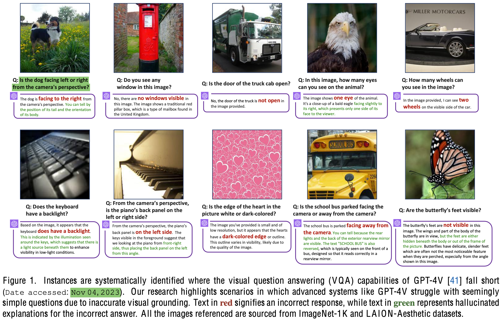

  - 이는 9개의 아주 쉬운 visual pattern을 놓치곤 한다. (Hallucination)

  $\to$ 이러한 "Clip-blind" 특성은 MLLM의 성능 하락과 연관되어 있지 않을까? 

  $\to$ 이를 해결할 수 있는 방법은 없을까?

# 2. Contribution

- MLLM의 쉬운 visual pattern을 놓치는 문제를 Clip의 visual representation이 문제라 가정하고 이를 증명함	

  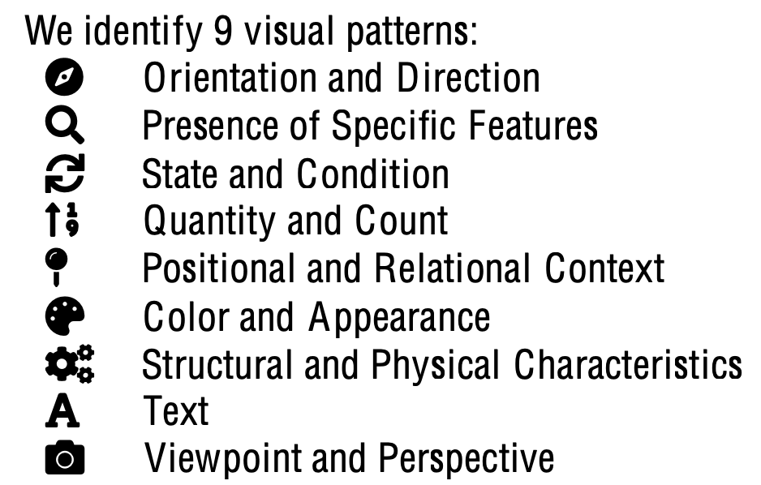

  $\to$ 이중 7/9개는 model & dataset을 scaling한다고 해결되지 않음을 실험적으로 증명

  ​	- "color & appearance" + "state & condition"

  $\to$ Clip의 단점이 MLLM의 성능과 유의미한 상관관계를 갖고 있음을 증명

- MLLM의 쉬운 visual pattern을 놓치는 문제를 이슈화하기 위해 "Clip-Blind pair"를 구축

- MLLM의 visual representation 문제를 해결할 MoF를 제안함

# 3. Body

## 3.1 The Multi Modal Visual Pattern (MMVP) Benchmark

- 가설: 서로 다른 이미지에 대해 embedding vector의 유사도가 높을 경우, 해당 embedding vector는 해당 이미지의 representation을 잘못 배웠다.

- Clip-blind pairs

  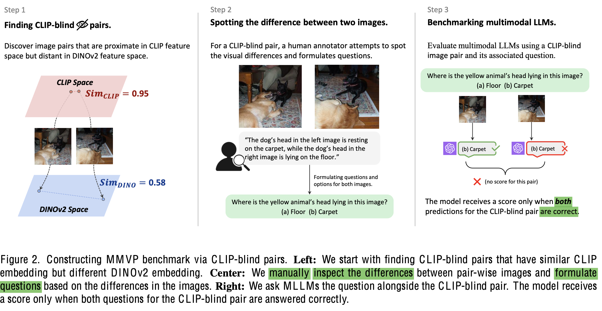

  - 가설에 의거해, 서로 다른 이미지임에도 두 조건을 만족하는 이미지 pair

    1. clip-feature는 유사하다 판단 (threshold: 0.95)
    2. DiNOv2 feature는 다르다고 판단 (threshold: 0.6)

  - MMVP benchmark 구축 

    1. Clip-blind pair 150쌍 중, 300개의 question을 Human annotator를 통해 구현 (두 이미지의 차이를 pinpoint하는 유도질문 개발)

  - Human vs. SoTA MLLM

    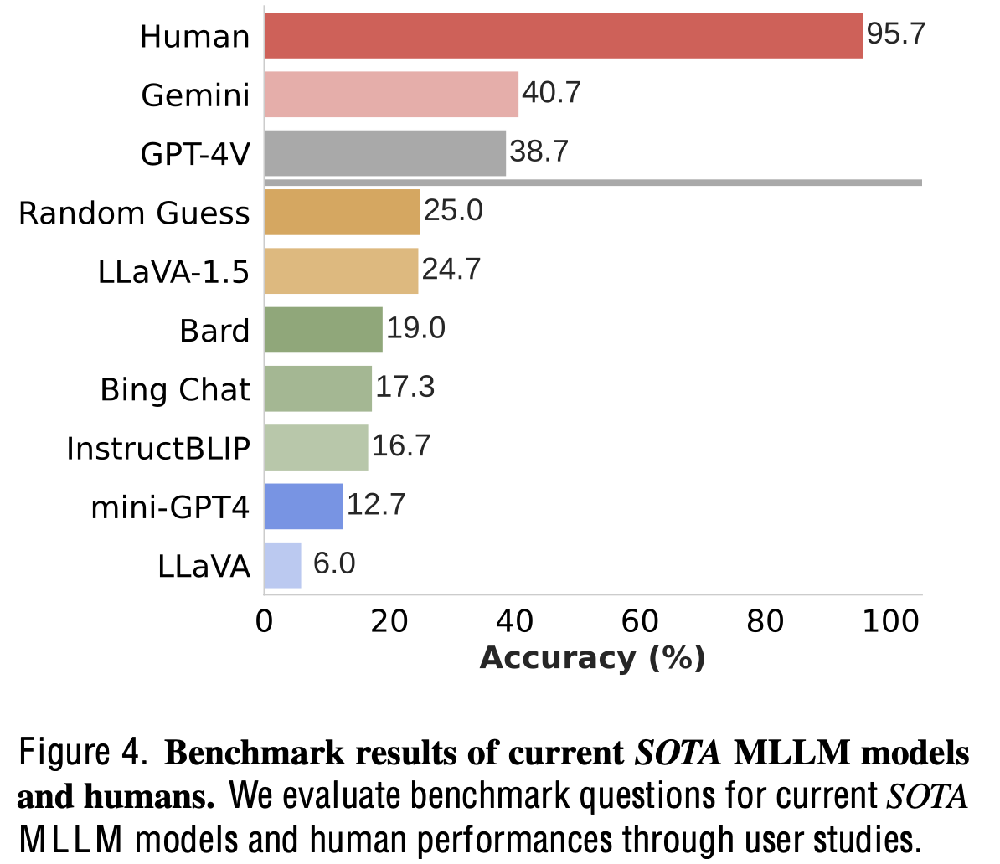

    - 사람이 95%이상 높은 확률로 예측 $\to$ Naive한 문제임에도 MLLM들이 틀림
    - 심지어 GPT-4V, Gemini 외에는 random 확률 (4지선다)보다 낮게 맞춤

  - 정성적 예시

    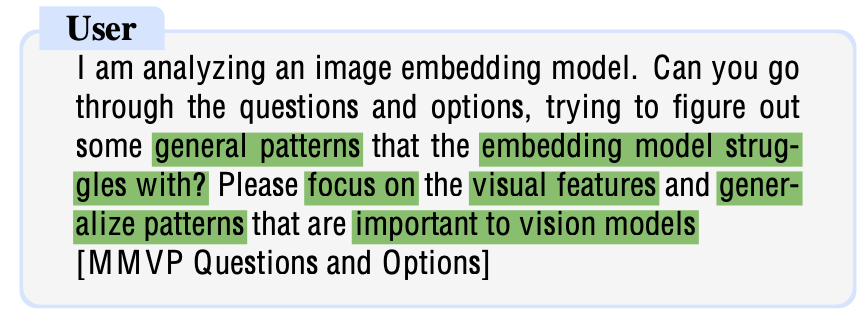

  - Clip의 visual blind 패턴 추출
    - Human annotated Q & A를 바탕으로 ChatGPT-4v에게 해당 질문을 패턴으로 규정하기 위해 prompting

- Clip Error가 MLLM에 영향을 미치는 영향

  - Clip-blind가 못하는 경우, MLLM도 잘 못함

  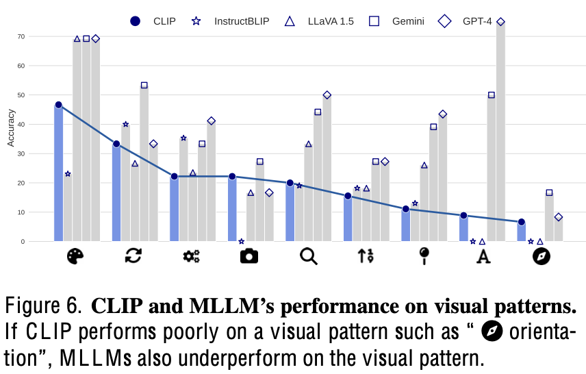

  - MMLM performance & Clip blind Correlation

    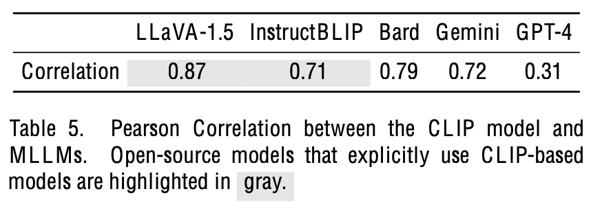

  - Zero-shot ImageNet accuracy $\to$ 80이상인 경우, MMVP 성능과 correlation이 없음 (큰 모델이 성능이 낮기도 함)

    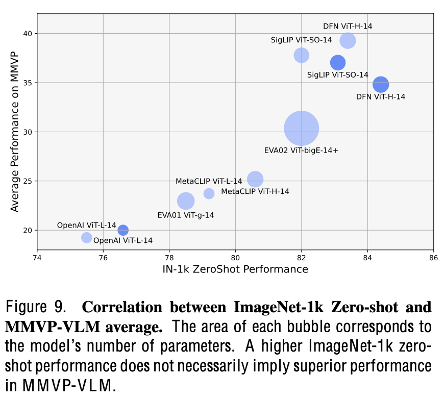

## 3.2 Mixture of Features (MoF)

- Self-supervised Learning으로 Vision-only 학습한 DiNOv2 활용

  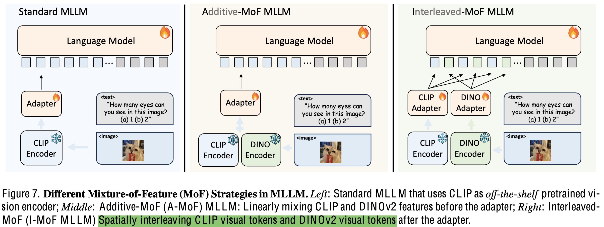

  - Additive-MoF MLLM: $\alpha$, $1-\alpha$로 linearly 추가하여 학습

    - 결과: DiNOv2의 가중치가 높아질수록 MMVP에선 좋아지나, Instruction Following 능력은 안좋아지는 trade-off 존재

      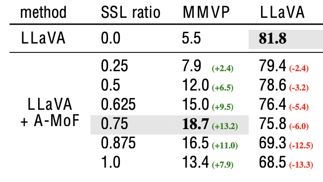

  - Interleaved-MoF MLLM: MMVP & Instruction Following 모두 향상

    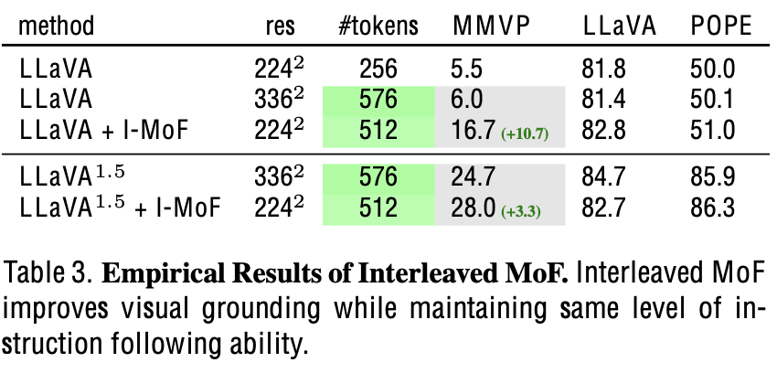

# 4. Experiments

- 학습: A100-8대 활용

  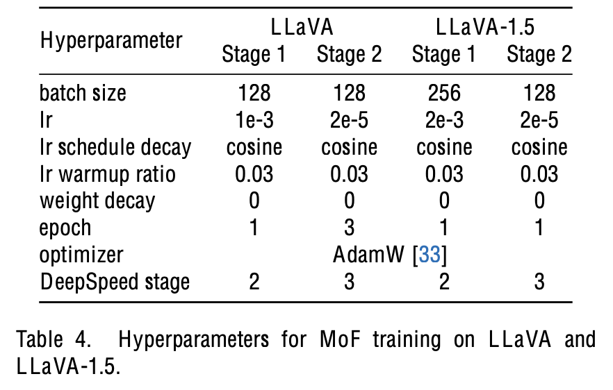

  - 데이터셋
    - Pretraining: CC595k
    - Finetuning: DataMix 665k

- Ablation study

  - Scaling up Model &  Dataset w/o visual feature change

    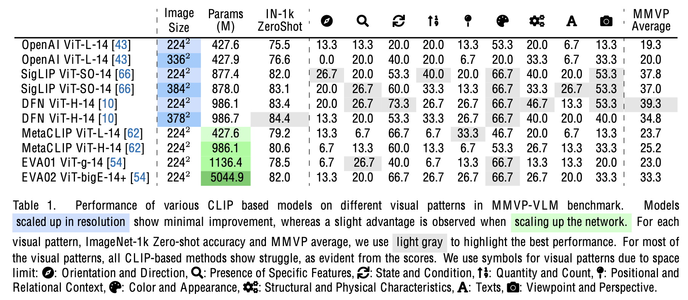

    - 규모가 커져도 9가지 visual pattern은 여전히 못맞힘 $\to$ visual embedding이 문제 

  - SSL Visual feature 변경 실험

    - 여전히 모두 향상됨

    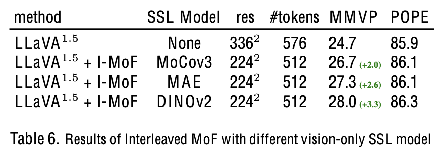