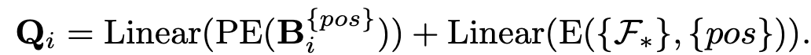

# [OD] CoDETR: DETRs with Collaborative Hybrid Assignments Training

- paper: https://arxiv.org/pdf/2211.12860v5
- github: https://github.com/Sense-X/Co-DETR
- ICCV 2023 accepted (인용수: 297회, '24-12-04 기준)
- downstream task: OD

# 1. Motivation

- 논문을 고르게 된 이유

  - 꾸밈 요소 검출 문제 $\to$ "그룹" 요소를 찾고, rule-base로 보완하는 문제로 정의

    

  - MS-COCO leaderboard에서 SOTA

    

- 기존 DETR의 문제는 one-to-one matching으로 GT당 1개의 positive query를 가지고 학습하게 됨으로써, sparse supervision으로 encoder / decoder의 feature & attention map이 학습을 충분히 못한다는 점이다.

  

  - 반면, ATSS와 같이 one-to-many 학습을 하면 encoder의 feature가 discriminative 능력을 잘 학습하게 된다.

    $\to$ DETR의 end-to-end 장점은 유지하면서 다른 object detector의 장점을 살리는 학습방식을 고안해보자!

# 2. Contribution

- 기존 DETR의 "sparse supervision"을 개선할 새로운ㅇ collaborative hybrid assignment training 기법인 "Co-DETR"을 제안함

  - 학습시에만 auxiliary decoder를 활용하여 gt당 여러개의 positive query를 할당 (one-to-many) 함으로써 이를 해결

  - customized positive query를 auxiliary head로부터 positive coordinate를 추출하여 initial positive query로 활용

    $\to$ **encoder**의 **discriminative learning** ability 와 **decoder**의 **cross attention** learning을 향상

  - 추가되는 parameter가 없어 Inference 속도는 동일

- MS-COCO에서 SOTA (66.0 mAP)

  

# 3. Co-DETR

- 기존 DETR의 문제점

  - Hungrian matching기반 one-to-one set matching

    - GT 1개당 Positive query 1개만 matching $\to$ bbox regression은 1개의 query만 학습 $\to$ forground에 대한 학습이 잘 안될 것

  - 실험

    - Encoder feature: $F \in \mathbb{R}^{C \times H \times W}$

    - Discriminability score map:  $D \in \mathbb{R}^{1 \times H \times W}$ 

      $\to$ *D*를 통해 IoF (Intersection over foreground), IoB (Intersection over Background)를 계산

      

      - *S*: Threshold. 해당 feature grid score가 Threshold 이상이면 forground, 이하면 background로 간주

      - $M_{h,w}^{fg}$: (*h,w*)에 위치한 gt의 forground

      - $D(F_{h,w})$: Discriminability score. Encoder feature를 아래와 같은 공식으로 유도

        

        - *J*: J개의 multi-level feature 갯수

        - $\hat{F}_{j}$: j번째 level feature의 l2-norm encoder feature $\in \mathbb{R}^{1 \times H_j \times W_j}$

          

    - Cross-attention score: attention map을 기준으로 IoF, IoB를 그림

      

      $\to$ 예상대로 동일 IoB일때 IoF가 Co-DETR > DETR(Deformable)보다 낫게 나옴 $\to$ encoder / decoder의 discriminative / cross-attention feature 향상

- 왜 Co-DETR이 좋은가?

  - GT에 matching되는 query가 stable해진다

    

  - Auxiliary head에 negative query가 없어, memory가 합리적으로 사용된다.

    

- Architecture

  

  - *K*개의 auxiliary decoder head를 붙이고, 각 head별 positive sample 할당 정책 (*A*)에 따라 positive query / negative query를 할당

    

    - **G**: Ground Truth bbox

    - $\bold{\hat{P}}_i$: i번째 auxiliary head의 Prediction

    - $A_i$: i번째 auxiliary head의 query 할당 정책

      

- Loss

  - Encoder loss

    

    

  - Decoder loss

    

    - $\tilde{\bold{P}}_{i,l}$: l번째 decoder layer의 i번째 auxiliary head의 prediction
    - $\bold{P}_i^{pos}$: positive target

  - Customized Positive Query

    - One-to-many matching의 단점은, 수많은 negative query를 양산하는 것 $\to$ 여기서는 negative는 고려하지 않음

    - Auxiliary head가 예측한 positive queries의 bbox $\bold{B}_i^{pos} \in \mathbb{R}^{M_i \times 4}$를 initial query로 활용

      

      - $M_i$: i번째 auxiliary head의 positive sample 갯수
      - PE: Positional Encoding
      - E: ??

  - CoDETR Loss

    

# 4. Experiments

- MS-COCO

   

- SOTA와 비교

  

  

- Ablation studies

  - 임의의 auxiliary head +1 추가시 성능 향상 

    

  - 1~6 Auxiliary head별 성능 향상

    

    - 3개 이상부터는 auxilary head별 optimization 방향이 달라 conflict 발생하여 성능이 하락하는 걸로 짐작

      - Conflict 분석

        - Head i, j별 distance 정의

          

          - C: CAM 결과

        - one-to-one matching DETR head와 distance를 K에 따라 비교

          

          - K=1일땐 minor하나 K=3이상부터 무시불가능한 수준으로 distance가 증가

        - 각 module별 성능 향상 기여

          

      - Auxiliary head의 positive query 정성적 결과 & positive / negative query와 original query간의 distance

        

    - Auxiliary branch의 성능도 향상

      