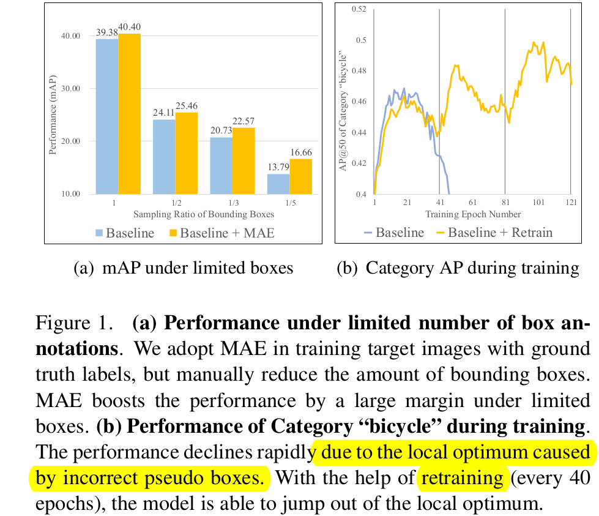

# [UDA][OD] MRT: Masked Retraining Teacher-Student Framework for Domain Adaptive Object Detection

- paper: https://openaccess.thecvf.com/content/ICCV2023/papers/Zhao_Masked_Retraining_Teacher-Student_Framework_for_Domain_Adaptive_Object_Detection_ICCV_2023_paper.pdf
- github: https://github.com/JeremyZhao1998/MRT-release
- ICCV 2023 accepted (인용수: 1회, '24-01-05 기준)
- downstream task: UDA for OD

# 1. Motivation

- Target domain의 **limited number of pseudo boxes**가 **noisy psuedo box**일 때, student 모델은 sub-optimal 결과에 수렴하게 된다.

  - (a) **limited number of box** : UDA 학습 초기에 threshold를 통과하는 reliable pseudo box가 적을 경우 target data에 overfitting될 수 있다. 이러할 때 (sampling box 갯수가 적을 때) 특히 MAE loss가 overfitting을 방지하여 더 큰 성능 향상을 보인다.

  - (b) **noisy pseudo box**: 일정 epoch (40)마다 MAE loss로 학습된 weight로 re-initialize해줌으로써 모델이 noisy label로 인한 over-fitting을 방지한다. (굉장히 heuristic 한듯.. 원시적인 해결책은 아니고, continual learning처럼 Source+MAE 로 initialize해줌으로써 overfitting 방지함)

    

  

# 2. Contribution

- Deformable DETR과 unbiased teacher기반 MRT (Masked Retraining )을 제안함
  - Masked Auto-Encoder(MAE) 기반 Self-supervised Learning (Auxiliary Loss)를 도입 $\to$ pseudo box가 적은 상황에서 target domain에 overfitting을 방지하는 효과
  - Selective Retraining Mechanism 제안 $\to$ noisy label로 이인해 overfitting되어 sub-optimal parameter space로 빠지는 걸 방지함으로써 성능을 향상시킴
- 다양한 DAOD benchmark에서 SOTA

# 3. MRT

- overall diagram

  

- baseline : unbiased teacher

  - supervised loss

    

  - unsupervised loss 

    - classification loss만 적용 (아마 regression 정보는 너무 noisy하므로 뺀듯)

      

  - adversarial loss

    - backbone, encoder, decoder각각에 대한 discriminator를 GRL (Gradient Reversal Layer)를 통과시켜 minmax Loss를 정의함

      

  $\to$ 편의상 baseline loss를 $L_{teach}$로 정의

  

## 3.1. Masked Autoencoder Branch

- Student의 encoder를 통과한 enhanced feature에 대해 auxiliary decoder를 추가하여 encoder의 입력 $z_k$를 reconstruction하는 $\hat{z_k}$ loss

  $\to$ computational cost를 효과적으로 하기 위해 last K번째 feature에 해당하는 layer 만 reconstruction해줌

  $\to$ auxiliary decoder의 경우 asymmetric하게 2MLP layer로만 구성함 (다른 논문 참고한다고만 말하고 왜인진 언급하지 않음)

  

  - $z_k$: k번째 encoder의 입력 feature
  - $\hat{z_k}$: auxiliary decoder가 생성한 feature
  - $S_m$: auxiliary decoder
  - $S_e$: student encoder
  - $q_m$: masked query
    - deformable decoder의 경우, reference point를 기준으로 offset에 해당하는 영역만 sparse하게 sampling하여 attention을 수행하므로, 해당 sampling된 영역중 임의의 sampled 영역을 masking을 수행한다.
  - $m$: random하게 생성된 mask

- Total Loss

  $\to$ mask loss를 병렬적으로 학습에 활용함 (pretrain 목적으로 시도 해봤으나, 결과적으로 성능이 안좋았음)

  $\to$ $\lambda_{mask}$는 초기에 pseudo box가 적은 상황에서 overfitting방지 목적으로 사용되므로, iteration이 반복될수록 점차 줄여줘야 성능에 긍정적임 (이말은 mask loss가 크면 main task 과 다른 방향으로 학습이 된다는 말이곘군)

  

## 3.2. Selective Retraining Mechanism

- Noisy Label이 있는 상황에서 주기적으로 student weight를 MAE loss updated weight + Source-only weight로 일부를 업데이트 수행해줘야 overfitting으로 인한 sub-optimal parameter region에서 **jump-over**할 수 있음

  - MAE loss updated weight , Source-only weight로 업데이트 하는 이유는 두 weight는 noisy pseudo label로 인한 overfitting이 되지 않은 weight이기 때문

  - 실험적으로 random initialize weight보다 좋았다고 함

  - 실험적으로 decoder는 그대로 두고, backbone과 encoder만 re-initialize하는게 제일 좋았다고 함

    

## 3.3. Dynamic Threshold

- iteration이 반복될수록, pseudo label의 prediction score가 over-confidence해지는 경향이 발생함

  $\to$ fixed threshold일 경우, iteration이 진행 될수록 noisy label이 더 많아지게 되므로 prediction score에 비례해서 threshold를 정해주는 dynamic threshold 채택

# 4. Experiments

- Cityscapes to Foggy Cityscapes (weather)

  - Quantitative Result

    

  - Qualitative Result

    

- Cityscapes to BDD-100K-daytime (small2large)

  

- Sim10K to Cityscapes (synthetic2real)

  

- Ablation study

  

- t-SNE

  

- Ablation on MAE branch

  

  (a) Mask ratio : 0.8 **best**

  (b) $\lambda_{mask}$ decay 방식 : **Hard** $\to$ step decay

  (c) MAE 적용 dataset : target only

  (d) : MAE loss 적용 시점 $\to$ auxiliary loss처럼 병렬적 사용 했을 경우가 제일 좋음
