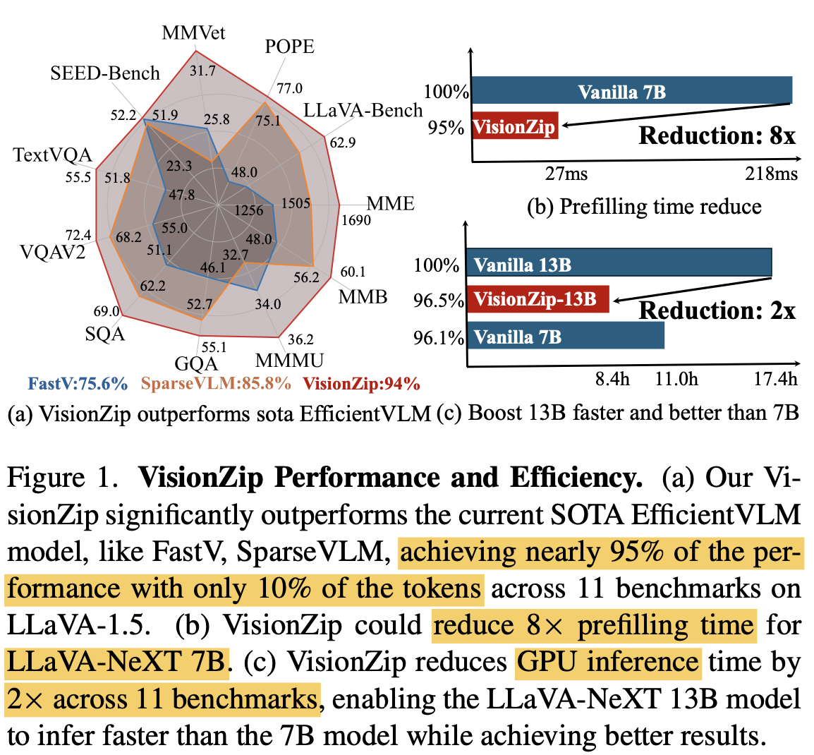

# [MM] VisionZip: Longer is Better but Not Necessary in Vision Language Models

- paper: https://arxiv.org/pdf/2412.04467
- github: https://github.com/dvlab-research/VisionZip
- archived (인용수: 0회, '24-12-15 기준)
- downstream task: Multimodal Understanding

# 1. Motivation

- Image에 저장된 정보는 문장에 저장된 정보에 비해 sparser하게 저장하는 특징이 있음 $\to$ MLLM의 vision token은 significant redunduncy가 있음

  - Visual token의 attention map을 살펴보면, 매우 소수의 token만 attention weight이 높게 유지됨 $\to$ 소수의 token만 performance에 관련됨

    

- 기존의 visual token 감축 방식들은 text-aware (question-aware) 방식들이라 multi-turn dialog와 같은 실제 service 환경에서는 부적합함

  

  - kv cache를 수행한 이전 dialog들은 이전 question에 focused된 visual token만 저장함 $\to$ 현재 시점 질문과는 무관한 feature를 포함함

    $\to$ question-agnostic하게 visual token을 저장하는 방식은 없을까?

# 2. Contribution

- Training free / Efficient training만으로 성능은 유지하면서 속도는 8x 향상시키는 VisionZip을 제안함 

  

  - Prefilling time 기준 x8배 향상
    - Prefilling time: Vision encoder를 통과하고, 첫 LLM의 token output이 나오기까지 걸리는 시간
    - 전체 속도 x2배 향상

# 3. VisionZip

- Overview

  

- Computation Complexity

  

  - *T*: Transformer의 layer 갯수
  - *n*: sequence length
    - *n*=$n_{sys}+n_{img}+n_{question}$
  - *d*: hidden dimension
  - *m*: FFN의 intermediate size

- Redunduncy check

  - -2 layer의 Self-Attention map을 찍어봄

    

    - 정확히는 multi-head의 평균값

      

  - Clip

    

  - Siglip

    

    $\to$ 매우 scarce하게 분포함

- VisionZip 알고리즘

  

  
  
  - Dominant Token
    - CLS token이 있을 때
      - CLS token에 attention이 높은 상위 k개 token
    - CLS token이 없을 때
      - average attention을 구하고, attention average score가 제일 높은 k의 token
  - Contextual token merging
    - non-dominant token에도 잠재적으로 중요한 정보가 남아 있을 수 있으므로 간직해야 함
    - non-dominant token을 target / merge token으로 나누고, 유사한 정보를 갖는 token끼리 merge 수행
  - Efficient Tuning
    - visual token 갯수가 갑자기 줄어들면, original 갯수로 학습한 Projector가 misalignment을 발생할 수 있음 $\to$ adapt 필요
    - 1/10의 instruction tuning으로 projector만 학습하여 A800 x 8대로 30분이면 학습

# 4. Experiments

- 정량적 분석

  - LLaVa-1.5

    

  - LLaVa-NeXT

    

  - Mini-Gemini

    

  - Video-LLaVA dataset

    

  - Efficiency test

    

- 정성적 분석

  - Layer별 attention weight 추이

    

    - Earlier : board하게 attention

    - 마지막 : contraslive learning하므로 board하게 attention
    - 마지막 두번째: sparse하게 attention $\to$ 실제로 LLM 입력으로 들어가는 visual token

  - Attention weight이 gradient에 주는 영향

    - softmax를 사용하는 경우, gradient에 attention weight는 exponential하게 반영됨

      

      

- Ablation study

  - Without Dominant vs. With Domiant

    

- VisionZip의 장점

  - LLaVA-13b를 LLaVA-7b보다 성능/속도 모두 빠르게 만들 수 있음

    

    - +: efficient tuning

  - Multi-turn에 유리 (kv-cache) $\to$ 앞서 설명