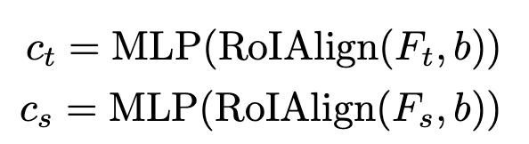

# [SSOD] SEMI-DETR: Semi-Supervised Object Detection with Detection Transformers

- paper: https://openaccess.thecvf.com/content/CVPR2023/papers/Zhang_Semi-DETR_Semi-Supervised_Object_Detection_With_Detection_Transformers_CVPR_2023_paper.pdf
- github: https://github.com/JCZ404/Semi-DETR
- CVPR 2023 accepted (인용수: 47회, '24-12-30 기준)
- downstream task: Semi-supervised Object Detection

# 1. Motivation

- 기존에 사용하던 semi-supervised object detection 방식은 두가지 문제가 있다.

  - One-to-one matching기반의 DETR에 naive하게 적용하면 recall이 낮아 문제가 있다.
  - DETR의 학습방식은 Learnable query기반이라 deterministic하지 않아, consistency-based SSOD regularization 적용하지 못한다.

  $\to$ DETR기반의 OD 모델에 Semi-supervised 학습 방식을 도입해보자!

# 2. Contribution

- 새로운 DETR기반의 SSOD기법인 SEMI-DETR을 제안함

  - one-to-many + one-to-one assignment Hybrid방식

- DETR에 적합한 consistency regularization기법 제안 + Cost기반의 Pseudo label mining 기법 제안

  

  - Consistency Regularization: Cross-view query consistency
  - Pseudo Label Mining: GMM

- SOTA

  

# 3. Semi-DETR

- One-to-many vs. One-to-one

  - One-to-many 

    

    - 장점: 잠재 object pool이 커서 검출기에 더 좋은 quality의 pseudo label을 제공

    - 단점: NMS같은 hand-crafted 후처리 로직 필요

    - Loss

      

  - One-to-one

    

    - 장점: NMS-free

    - 단점: Matching된 1개가 틀렸을 경우, noise label로 인해 성능 하락

    - Loss

      

  - 본 논문

    - One-to-many $\to$ One-to-one 2 stage로 학습

    - Matching cost (Distance Metric)

      

      - s: image-classification score
      - u: IoU

- overview

  

- Cross-view Query Consistency

  - 목적: 동일 이미지에 대해 서로 다른 view로 Augmentation을 수행한 이미지 input에 대해  동일한 결과를 출력하도록 유도하는 regularization loss

    

    - 기존 방식과 다르게 learnable query기반인지라, deterministic (ex. anchor방식) 하지 않다. $\to$ Teacher 의 output을 directly MSE Loss떼리기 어렵다.

      

      - $f_{\theta}$: 기존 방식의 student output
      - $f'_{\theta}$: 기존 방식의 teacher output

    - Decoder의 output (object query)를 가지고 MSE를 떼려보자

      - Decoder input

        - RoIAlign + MLP Feature

          

        - Learnable query ($q_t, q_s$)

        - Image Features ($E_t, E_s$)

        - Attention mask($A$) : 정보 leakage 방지용

      - Decoder output

        

      - Loss

        

- Cost-based Pseudl Label Mining

  - Cost가 제일 작은 pseudo label을 활용하여, pseudo label quality를 향상시키자

    

    - $C_{ij}$: i번째 proposal과 j번째 pseudo label간의 matching cost

  - Matching cost의 분포를 2개의 GMM로 cluster하여 mean (cost)가 낮은 GMM의 평균값을 threshold로 활용

    

- Total Loss

  

# 4. Experiments

- MS-COCO Partial

  

- Pascal VOC & MS-COCO Full

  

- Ablation Study

  - Module ablation

    

  - Various pseudo label filter

    

  - Various one-to-many methods

    

  - 1st stage step & Threshold

    

    