# [SSOD] MixPL: Mixed Pseudo Labels for Semi-Supervised Object Detection

- paper: https://arxiv.org/pdf/2312.07006
- github: https://github.com/Czm369/MixPL
- archived (인용수: 7회, '24-12-31 기준)
- downstream task: SSOD

# 1. Motivation

- SSOD의 한계는 잘하는 건(크고, head class인 것들) 계속 더 잘하게 되고, 못하는 건 (작고, tail class인 것들) 점점 더 못하게 된다는 것.

  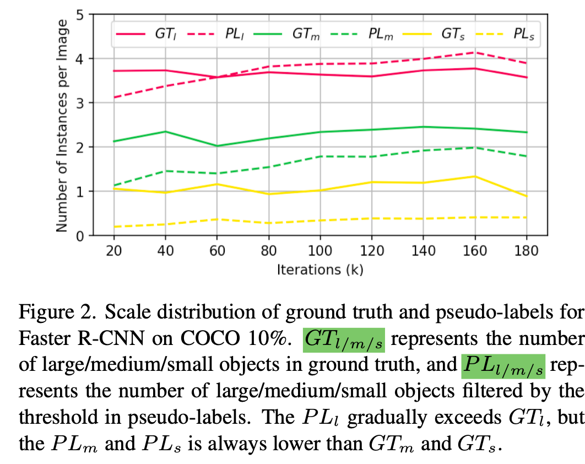

  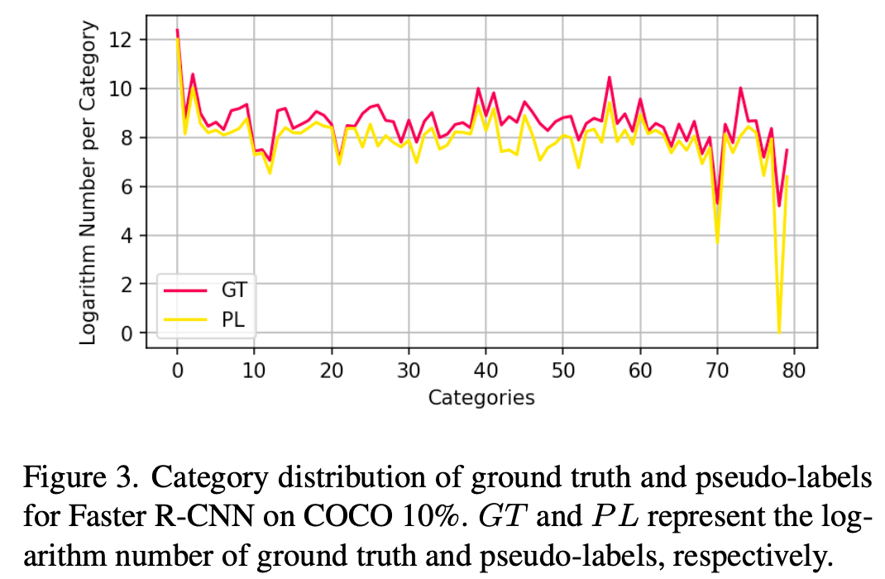

  $\to$ 이를 해결할 방법을 고안해보자!

# 2. Contribution

- 미탐 (Missed Detection)의 효과는 줄이고, 작은 크기 물체 검출 능력을 향상시킬 수 있는 Mosaic + Mixup기반 MixPL (Pixed Pseudo Labels)기법을 제안함

  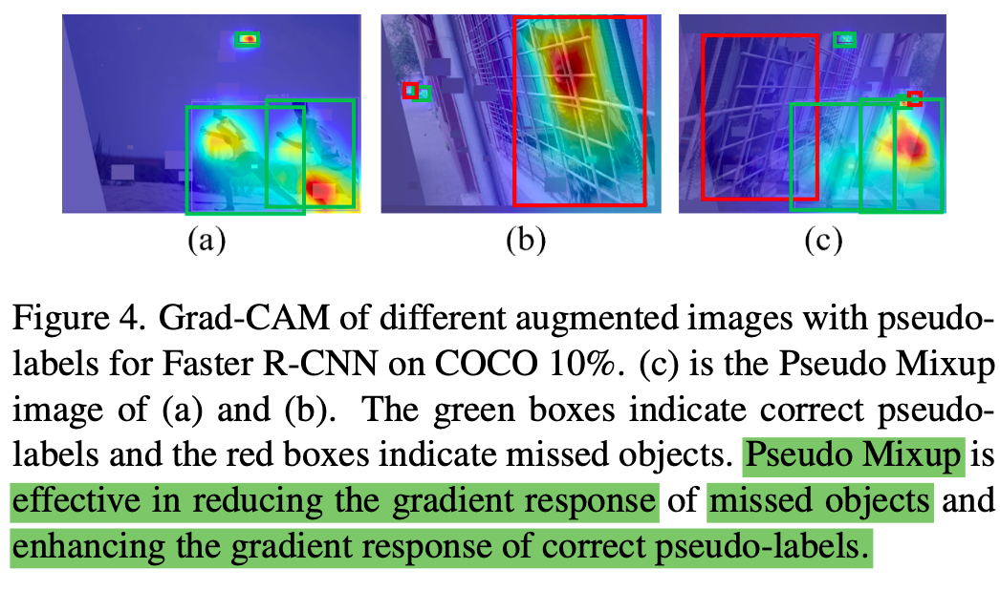

  - Missed detection에 대한 Gradient response를 적게 줌으로써 미탐으로 인해 잘못 최적화 되는 효과를 반감시킴 (Grad-CAM)

- Tail class에 대해 빈도수 기반으로 resampling하는 로직 제안

- 모든 검출기에 대해 SOTA

  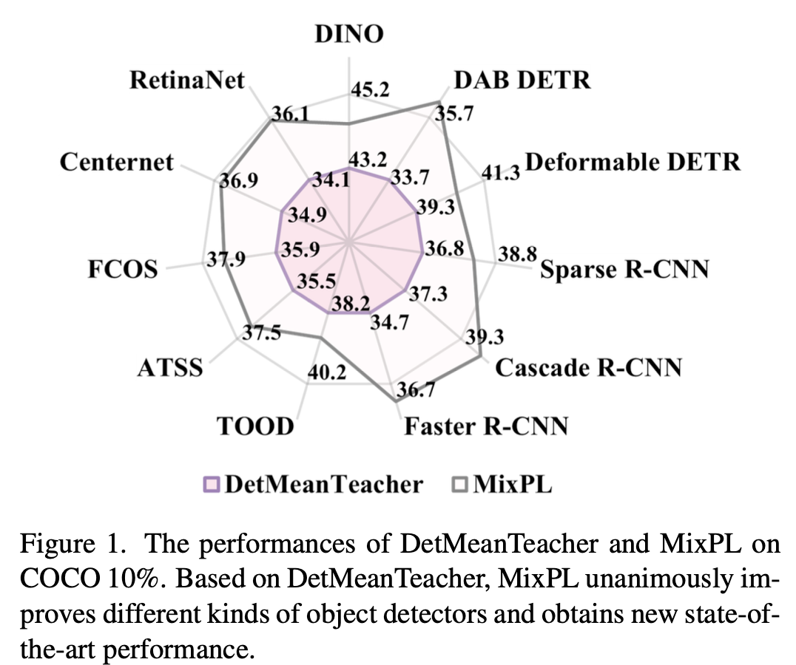

# 3. MixPL

- Overall architecture

  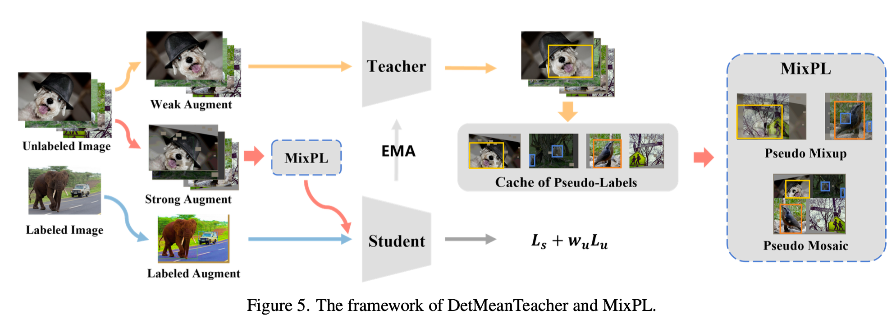

  - MeanTeacher기반

- Mixed Pseudo Label

  - Mixup: FN의  negative effect (grad-norm)을 줄여주고,  TP의  robustness을 augmentation으로 향상

  - Mosaic: 4개의 사분면으로 쪼개어 augemntation 수행하므로, scale이 작은 물체 검출 성능이 향상

    

  - Label Resampling: Tail class에 대해 oversampling 수행. 이렇게 해도 head class의 경우, pseudo label의 비율이 많기 때문에 성능 하락이 없고, 둘 (head+tail)다 향상

    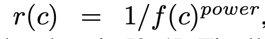

    - *f(c)*: c category 의 발생 빈도

  - Cache: 가장 이웃한 iteration에서 저장된 pseudo label image

# 4. Experiments

- 정량적 분석

  - MS-COCO Partial

    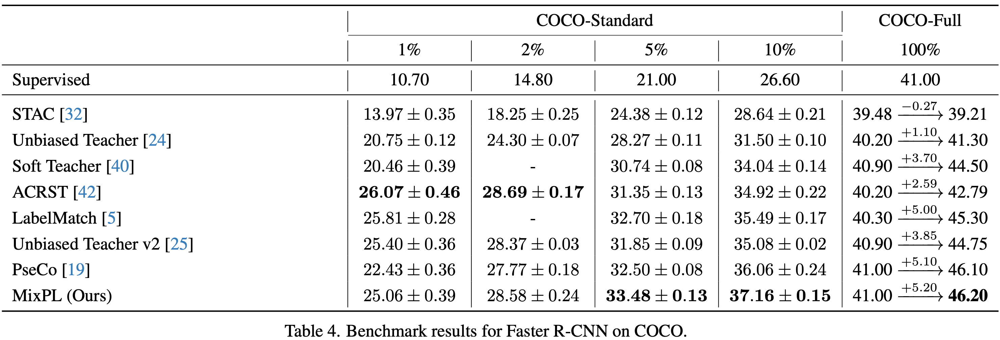

    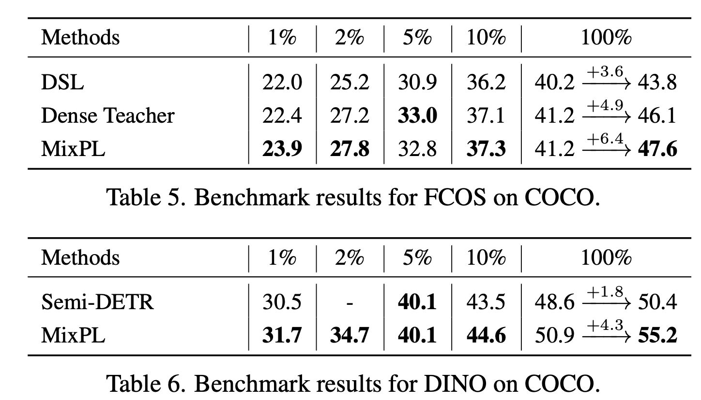

  - MS-COCO Full

    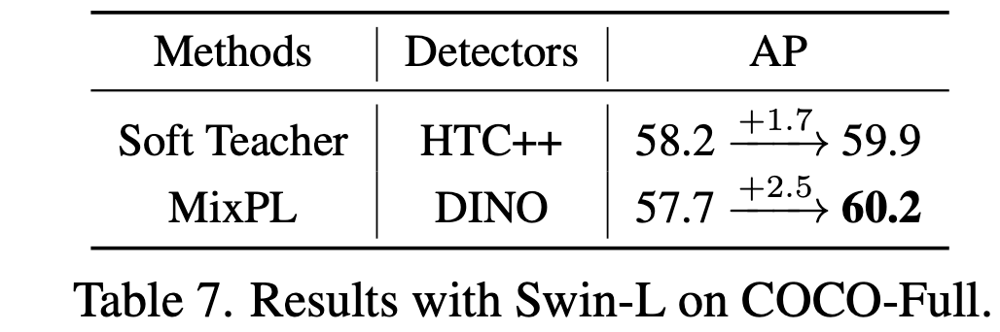

  - PASCAL VoC

    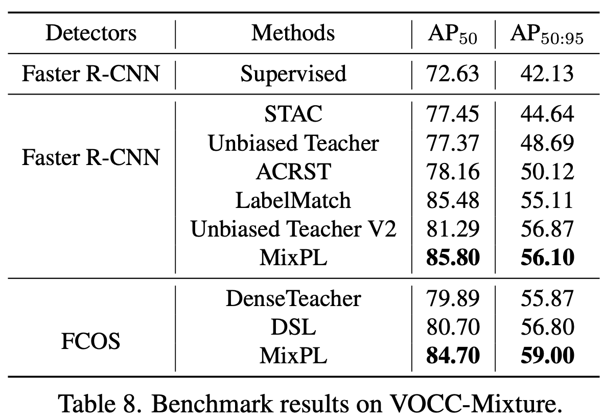

    

- Ablation Study

  - Different OD

    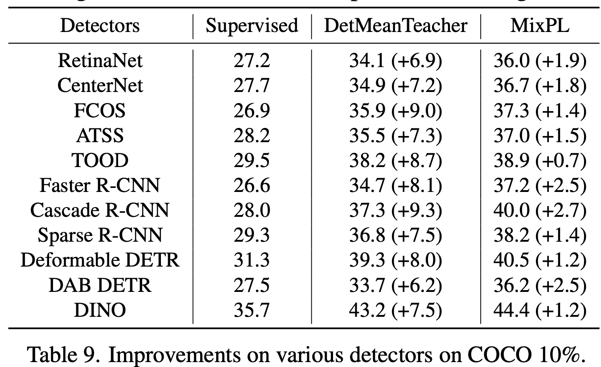

  - Gradient Density

    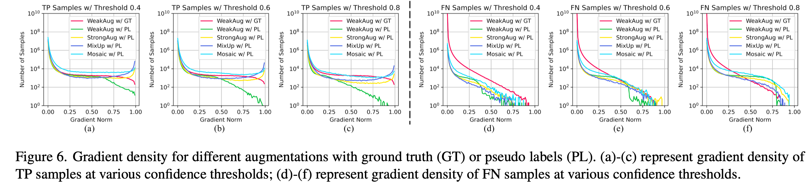

    - Loss를 chain-rule로 미분해서 weight를 얼마만큼 update하는지 나타내는 척도로 활용. 
    - Pseduo Label에 대해FN의 경우 이 값이 낮을수록 좋고,  TP의 경우 높을수록 유리함

  - Regularization

    - MixPL vs. Double View (batch 2배)

      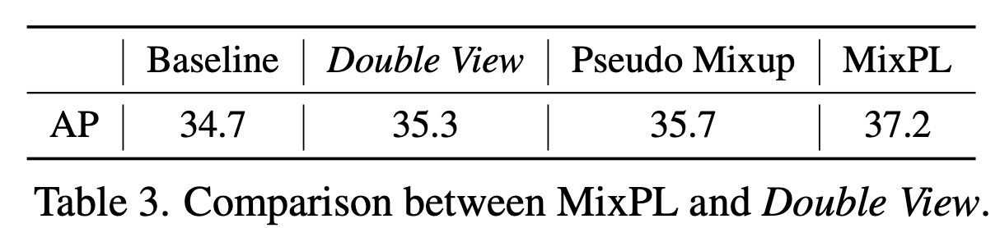

  - Different Size for Pseudo Mosaic

    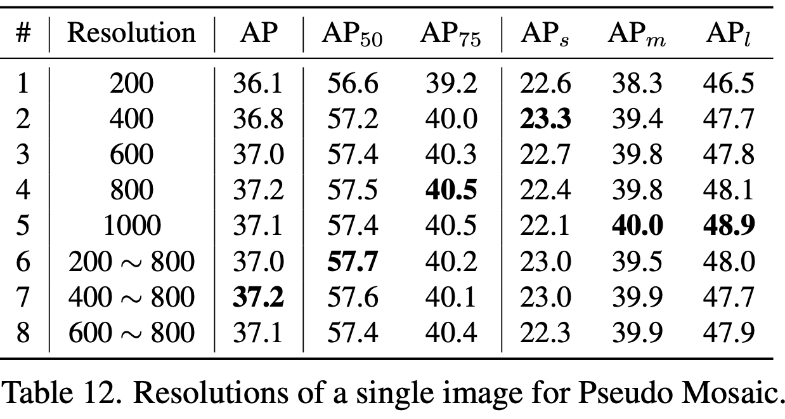

  - Labeled Resampling & Confidence Score

    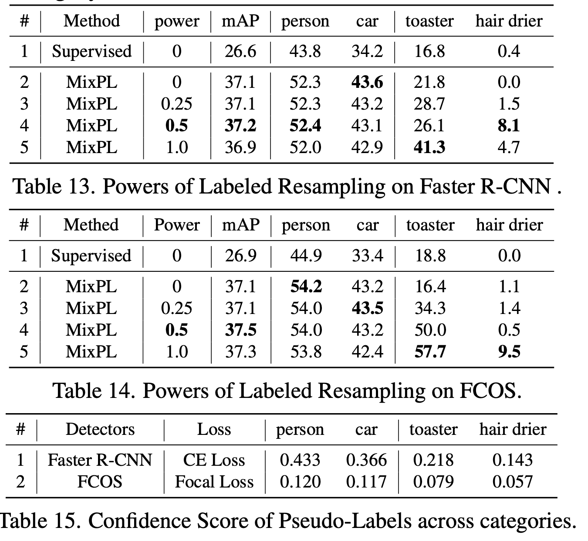

    