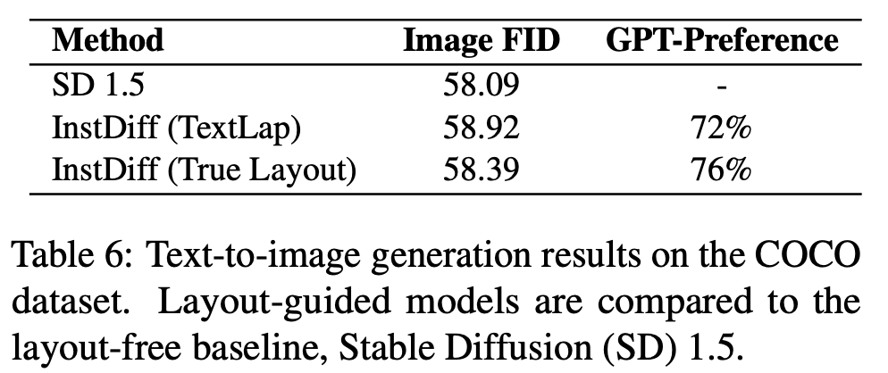

# [Layout] TextLap: Customizing Language Models for Text-to-Layout Planning

- paper: https://arxiv.org/pdf/2410.12844
- github: https://github.com/puar-playground/TextLap
- EMNLP 2024 accepted (인용수: 0회, 25-01-03 기준)
- downstream task: Text-to-Layout generation

# 1. Motivation

- LLM기반의 text-to-layout은 (자연어 명령을 주면 되기에) layout에 user의 의도를 적용하기 편리한 user-friendly 방식이다.

  - 하지만 2D graphical layout을 text 홀로 표현하기에는 다양한 방법의 표현 (list 형태, css 형태, 문장 형태 등)할 수 있어 부족하다.

  - LLM의 autoregressive한 nature로, coodinate number를 이해하는데 어려움이 있다.

    $\to$ iterative하게 user text input과 연관(coherent)된 요소만 반복적으로 수정가능하도록 구현해보면 어떨까?

    

# 2. Contribution

- 새로운 text-to-layout task을 제안 & evaluation dataset과 protocol을 제안함

  

- Text-to-Layout task용 Instruction Tuning dataset (InstLap)을 제안함

- GPT-4보다 우수한 성능을 냄

  

# 3. TextLap

- InstLap Dataset

  

  - MS-COCO, LAION, Crello로 구성

    - MS-COCO
      - 비정상적인 (?) 이미지를 filtering하여 27,246장을 text-to-layout 형태의 instruction dataset으로 구축
        - 작은 박스들은 filtering
        - 큰 박스 기준으로 0.1 이상 IoU가 생기는 박스들 filtering
        - 다른 박스들에 대해서는 0.01 IoU threshold 적용
        - is_crowd box도 filtering
      - GPT-4V를 토대로 Image Caption을 생성
        - 박스 친 object에 대해서만 설명해도록 함
        - 해당 object의 박스를 출력하도록 함 (**Layout planning task**)
      - 정사각형의 canvas가 되도록 longest side를 crop
    - Crello
      - 박스가 캔버스 크기 대비 1% 이하면 filtering
      - 투명도가 70% 이상 차지하는 요소 filtering
      - 10개 초과하는 요소를 갖는 이미지 filterings
    - InstLap Bench
      - TRINS-Gen dataset에 Paddle-OCR을 돌려 10개의 ocr word 이상 나오는 이미지는 filtering
      - 502개의 Visually Rich document design benchmark 데이터 확보
      - Annotator를 고용하여, 해당 ocr word의 정확한 위치와 관련 설명을 라벨링

  - Chat-gpt에게 요소별 shift augmentation을 적용해서 output layout을 생성하도록 데이터 구축

    

- LLM-assited Annotation

  - MS-COCO

    - 80개 class는 한정적이므로, Open-set으로 단어를 확장

  - Crello

    - Phi-3V 모델을 가지고 요소별 description (caption), size 그리고 공간적 배치에 대한 insatruction을 생성

  - Layout Shift Augmentation

    - BBox coordinate과 방향 (direction)을 이해하기 위해 추가함

      - random distance, random direction (동서남북)

        ex. "제일 왼쪽에 있는 요소를 왼쪽으로 xx만큼 이동시켜"

- Model 

  - Vicuna-7B 사용

  - User가 (Instruction에서) 지정한 물체의 bbox를 출력하도록 학습

    

# 4. Experiments

- Evaluation Metrics
  - (Layout) FID
  - MaxIoU
    - Object layout의 경우 exact match를 찾기 어려우므로, CLIP의 text embedding 유사도를 기준으로 정답셋을 구축
  - Failure rate
    - 전체 출력 대비 bbox format에 맞지 않은 출력을 하는 비율
  - Precision & Recall & F1-score

- 정량적 결과

  - Closed-set COCO 

    

    - GPT-4 (R): list of integer 출력

    - GPT-4 (rCSS): css format으로 출력. 128로 bbox 출력을 normalize

    - TextLap (D128): 128로 bbox 출력을 normalize

    - TextLap (D1024) 1024로 bbox 출력을 normalize

    - TextLap(S128): Special token 128 추가

      - 학습 loss가 큼 $\to$ 학습 data가 부족하기 때문으로 사료

        

  - Open-set COCO

    

  - InstLap Bench

    

    - MaxIoU: InstTrain과 InstLap-Bench의 domain gap이 커서 GPT-4V보다 낮은 성능 낸 것으로 사료

  - Crello

    

  - Text-to-Layout Generation

    

- 정성적 결과

  - InstLap Bench

    

  - Visual-Textual Layout Planning

    