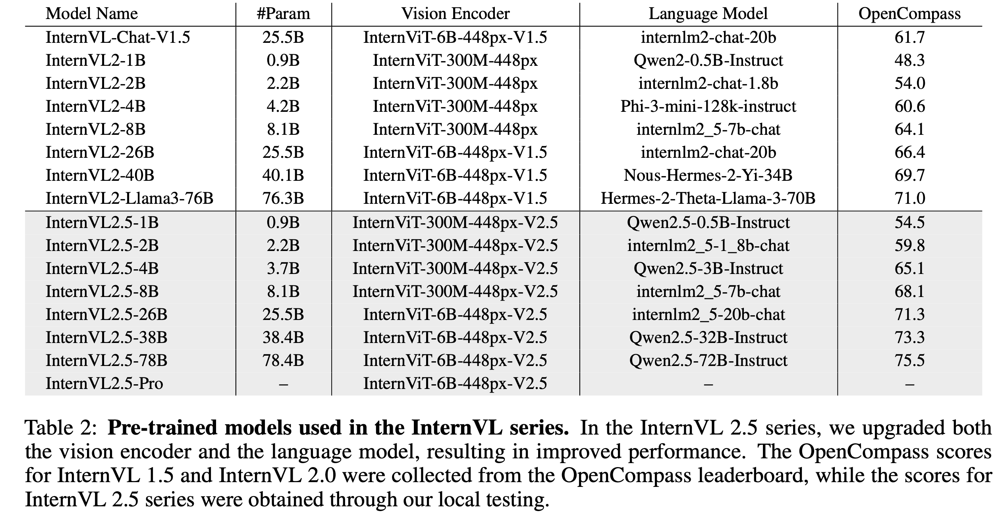
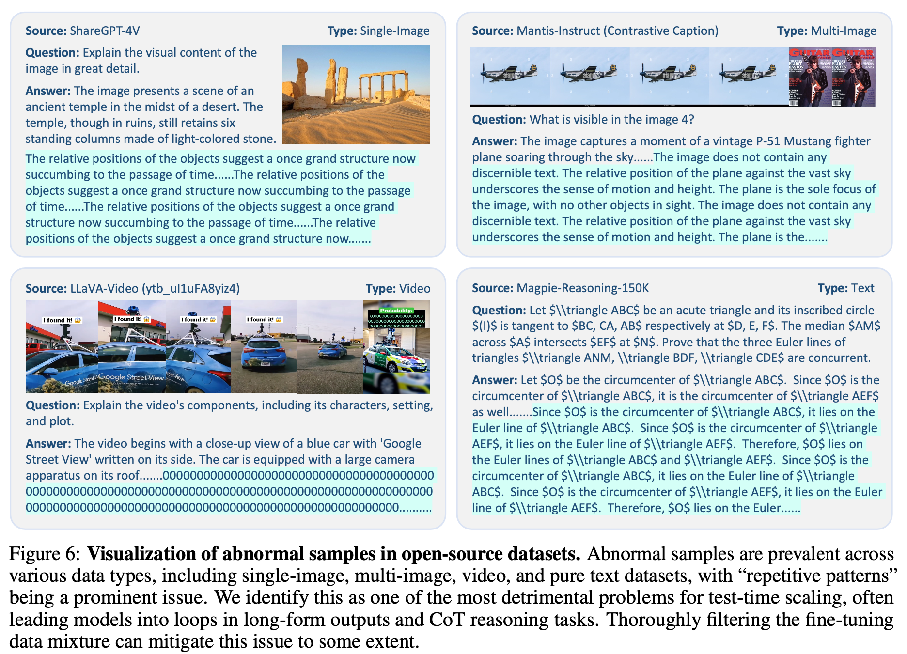

# [MM] InternVL-2.5: Expanding Performance Boundaries of Open-Source Multimodal Models with Model, Data, and Test-Time Scaling

- paper: https://arxiv.org/pdf/2412.05271
- github: https://github.com/OpenGVLab/InternVL
- Technical report (인용수: 5회, '25-01-08 기준)
- downstream task: Multi-modal reasoning, document understanding, multi-image/video understanding, multi-modal hallucination detection, visual grounding, multilingual capabilities, etc

# 1. Motivation

- Closed-source models (Chatgpt-4o, Gemini, Claude, etc)와 open-source model간의 성능 격차를 줄이고자 함

- MLLM의 Vision Encoder 크기에 따른 성능에 기여하는 정도를 정리하고자 함

  $\to$ Parameter가 많아질수록 학습 데이터의 dependency가 줄게됨 (큰 모델 사용할수록 적은 양의 학습데이터로 성능이 좋아짐)

  - ex. 1/10만으로 6B ViT+InternVL2.5-78B가 600M ViT+Qwen2-VL-72B보다 좋아짐

# 2. Contribution

- InternVL-2.5를 opensource community에 공개함

-  Model의 component별 parameter Scaling이 performance에 미치는 영향에 대해 깊이 있는 탐구를 함

- 다양한 Multimodal task에서 SOTA를 달성함

  

# 3. InterVL-v2.5

- overall architecture

  

  - Pixel Unshuffle: visual token을 4배 줄이는 효과

## 3.1 Vision Encoder

- parameter 수 (6G, 300M), fixed & dynamic에 따라 실험

  

## 3.2 Large Language Model

- 다양한 LLM backbone으로 실험

  

## 3.3 Training Strategy

- Dynamic High-Resolution for Multimodal Data

  - Closest Aspect Ratio Matching

    

  - Image Resize & Split: $ S \times S$개의 이미지로 split

    

  - Data formats

    

    - Video: $n_{tiles}=1$로 고정하되, thumbnail만 사용

    - Multi-image: $n_{tiles} < n_{max}$로 bound시키되, image-*n*을 앞아 붙임. 

      - $n_{max}$는 전체 이미지 갯수 ($N_{image}$)로 나눔

        

    - Single-Image: $n_{tiles} < n_{max}$로 bound시키되, thumbnail image를 마지막에 붙임

- Training Pipeline

  

  - 3개의 pipeline로 학습

    - Hyper-parameters

      

      - Stage 1: MLP Warmup
        - MLP만 학습하여, visual & language representation alignment 역할
        - Chat ML style의 instruction으로 NTP loss로 학습
        - High Learning Rate로 학습
      - Stage 1.5: ViT Incremental Learning
        - MLP+ViT를 학습
        - NTP Loss로 학습
        - Low Learning Rate 사용하여 catastrophic forgetting 방지
      - Stage 2: 모든 module에 대해 unified LR적용

    - Datasets

      

- Progressive Scaling Strategy

  - 작은 LLM (ex. 28B) Stage 1.5에서 학습한 ViT를 큰 LLM (ex. 78B)에 그대로 사용하는 방법
  - 가설: visual feature는 일반화된 representation이므로, LLM이 바뀌어도 잘될것임
  - 장점: 다른 LLM backbone에 transferability가 좋아짐 (stage 1, stage 1.5를 skip하기 때문에 좋음) $\to$ 학습이 가속화됨

- Training Enhancements

  - Random JPEG Compression

    - Image의 경우, JPEG으로 압축된 이미지가 입력으로 많기 때문에 augmentation으로써 활용

  - Loss Reweighting

    

    - Token averaging: Mini-batch 내에서, 전체 token에 대해 loss계산 시, averaging 수행

      - 단점: 정답이 긴 sample에 bias되어 성능 하락 발생 가능

    - Sample averaging: Mini-batch 내에서 loss계산 시, sample별로 averaging 수행

      - 단점: 짧은 답변 생성 우려

      $\to$ 적절한 조합 (square averaging)으로 weight를 변경 $w_i=\frac{1}{w^{0.5}}$

## 3.4 Data Organization

- Dataset Configuration

  

  - Maximum tile number ($n_{max}$), repeat factor ($r$)등으로 balanced된 데이터로 학습시킴
  - 그밖에 다양한 engineering으로 학습 효율을 높임 (ex. multi-image 입력 시, longer sequence로 concat 후 학습으로 zero padding 최소화)

- Data filtering

  

  - LLM은 소량의 anomal sample에 민감하게 반응하는 경향을 발견함 $\to$ filtering하면, CoT task에서 성능이 비약적으로 향상됨

    - LLM기반 Quality scoring: LLM의 힘을 빌려, domain specific prompt로 샘플에 대해 평가

    - Repetition Detection: 단순 반복 샘플 필터링

      

    - Heuristic Rule-based Filtering: 매뉴얼하게 필터링

- Finetuning Data Mixture

  

  

# 4. Experiments

- Multimodal Reasoning (Math)

  

- OCR & Document Understanding

  

- Multi-Image Understanding

  

- Comprehensive Multimodal understanding (+ Hallucination)

  

- Visual Grounding

  

- Multi-Lingual performance

  

- Video Understanding

  

- Vision Capability

  - Image Classification

    

  - Semantic Segmentation

    

- 요약

  