# [MM] InternVL-2.5-MPO: Enhancing the Reasoning Ability of Multimodal Large Language Models via Mixed Preference Optimization

- paper: https://arxiv.org/pdf/2411.10442
- github: https://github.com/OpenGVLab/InternVL/tree/main
- Archived (인용수: 4회, '25-01-15 기준)
- downstream task: VQA

# 1. Motivation

- Chaint-of-Thoung (CoT) 기반의 "Reasoning"이 Direct Answer에 비해 모든 opensource MLLM에서 성능 하락을 야기함 $\to$  이는 Train & Inference의 distribution shift 때문

  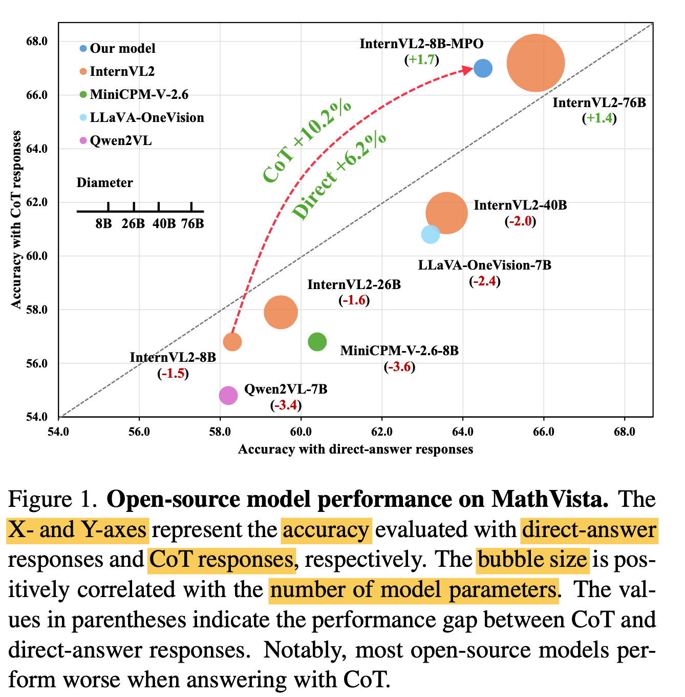

  - **Distribution Shift**? 

    - MLLM의 STF (Supervised Fine Tuning) 방식은 **GT token**이 주어지고, Next Token을 예측하는 방식임 (**teacher forcing**)

    - 반면, inference는 이전 step의  **"prediction"된 token**을 입력받아   Next Token을 예측하는 방식임

      $\to$ Simple한 answer만 예측하는 "Direct Answer" 방식이 더 많은 token을 생성해야 하는 CoT방식보다 더 우수함

- Reasoning의 문제를 해결하기 위해 필요한 RLHF (Reinforcement Learning with Human Feedback)  benchmark를 annotation하는 cost가 많이 발생해 해결하지 못하는 상황

  $\to$ 이를 저렴한 cost로 annotation하는 방법은 없을까?

# 2. Contribution

- 자동으로 Preference data를 취득하는 **data construction pipeline**과, 이를 통해  고품질 대용량 preference benchmark인 **MMPR**을 제안함

  - DropoutNTP

    - 50%의 token을 truncate하고, 나머지 절반 (50%)를 이미지 없이 생성하여 negative sample (rejected sample)을 생성

      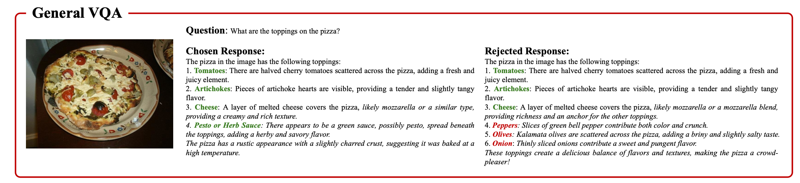

      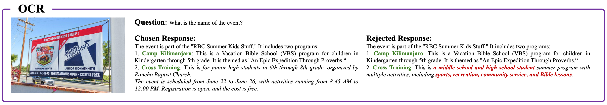

  - Correctness-based pipeline

    - Clear GT가 있는 경우, GT와 matching된 prediction 결과를 "chosen", matching되지 않은 prediction 결과를 "rejected"로 두고 Preference Optimization

      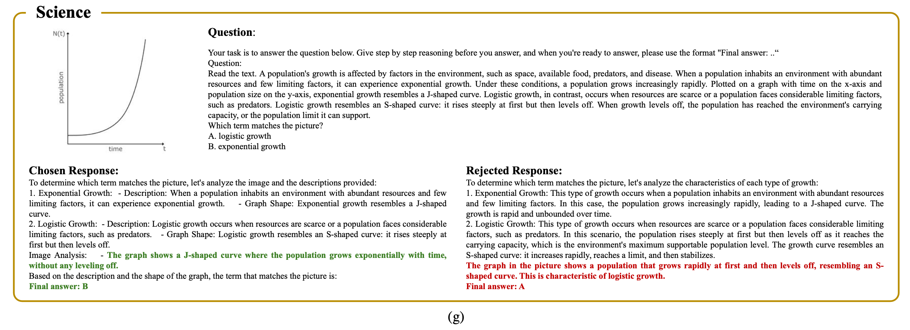

      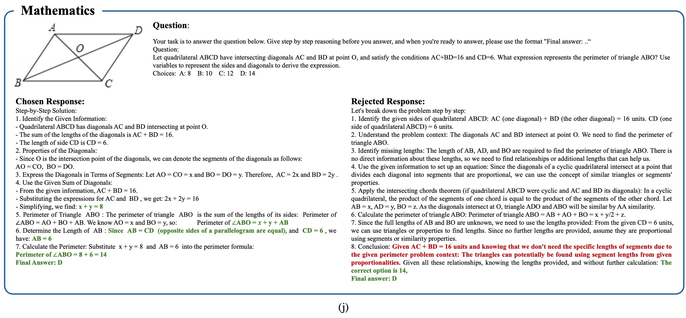

  - MMPR (3M set)

    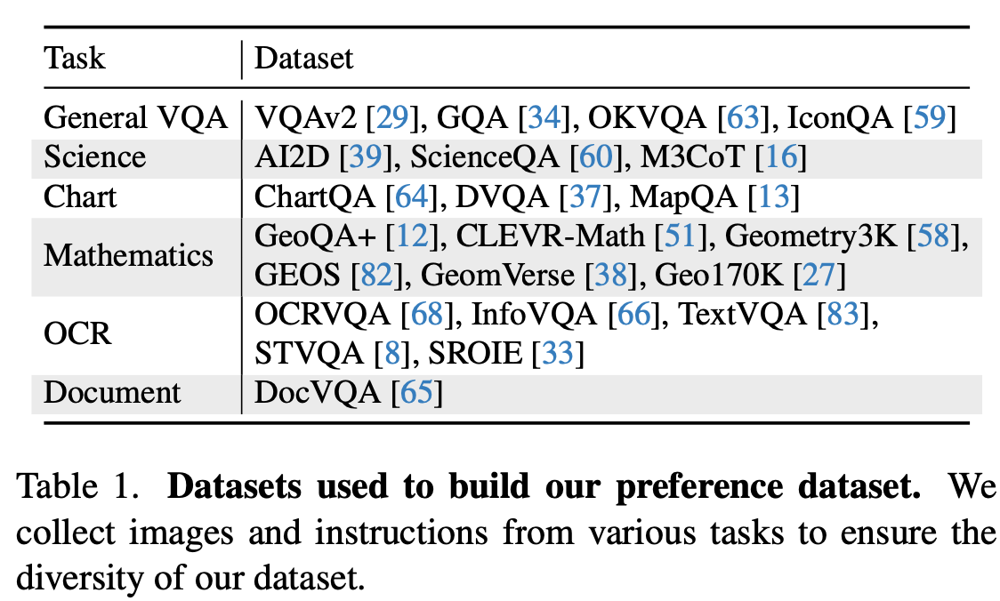

- SFT loss와 더불어 다양한 Preference Optimization (PO) loss를 혼합한 **MPO** (Mixed Preference Optimization)을 제안함

- SOTA를 보임

  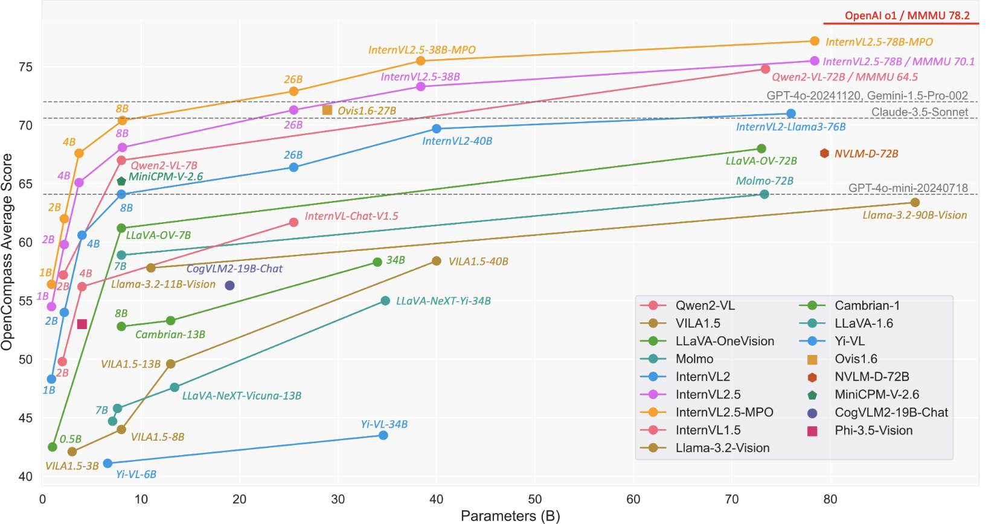

# 3. InterVL-2.5-MPO

## 3.1 Scalable Multimodal Preference Dataset Generation

- 정의

  - image *I*

  - instruction *x*

  - chosen response $y_c$ 

  - rejected response $y_r$

  - Initial model $M_o$

    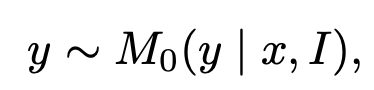

    - *y*: MPO이전 model의 prediction response

- DropNTP (Next Token Prediction)

  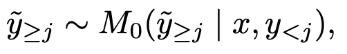

  - $\tilde{y}$: j번째 token 이후로 이미지 없이 생성한 text token 

  - Ablation study 결과 50%로 주는게 제일 좋음

    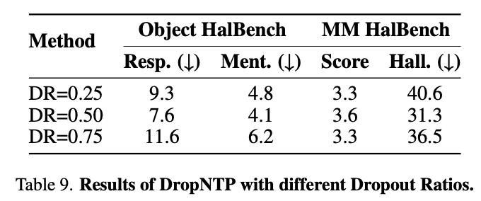

    - 너무 많이 제거 (25%)하면? 너무 많이 틀린 negative sample이 생겨서, preference optimization하기에 불충분 (easy-negative)
    - 너무 많이 살려(75%)두면? 정답과 거의 유사해서 positive에 가까우므로 오히려 정답을 오답으로 학습하게되어 성능이 안좋음
    - 적당히 제거(50%)하면? Hard-negative response가 알맞게 생성되어 Preference Optimization이 가능해짐 

  - 이전 방법들과 효율성 비교

    - 이전 (RLAIF-V)방식은 평균 992.7 token이 preference token pair 생성에 필요했음
    - 우리 것은 571.2 token만으로 되므로 약 57.5% 효과적임

## 3.2 Multimodal Preference Dataset

- Statistics
  - clear ground truth: 2.5M
  - No clear ground truth: 750K
- Correctness-based pipeline에서 기존의 질문은 사용하지 않음 $\to$ 틀린 CoT 오답 (prediction)이 학습성능에 악영향 끼치게 되므로

## 3.3 Improved MLLM with PO

- SFT + MPO (Mixed Preference Optimization)이 제일 좋은 성능

- MPO

  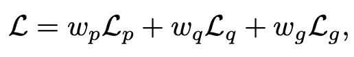

  - Relative Preference b/w pairs of response $L_p$

    - 목적: Chosen/Rejected sample간의 상대적인 score를 크게 벌려놓겠다. (일종의 contrastive learning)

    - Chosen / Rejected pair간의 KL Divergence 를 loss로 구현 (DPO와 동일)

      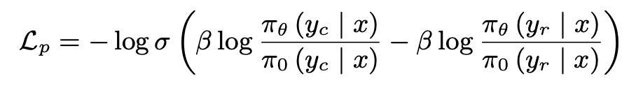

      - $\pi_{\theta}$: PO로 optimize되고 있는 MLLM
      - $\pi_0$: PO로 otimize되지 않은 freezed MLLM

  -  Absolute Quality of individual response $L_q$

    - 목적: 각 response별 절대적인 quality를 측정하여 loss에 반영하겠다.

    - 학습된 Binary classifier의 score가 reward로 사용 (chosen: 1, rejected: 0)

      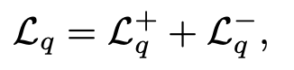

      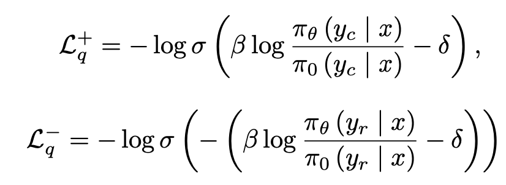

      - $\delta$: 이전 reward의 moving average score. 목적은 stablize training

  - Generated Response (NTP) $L_g$

    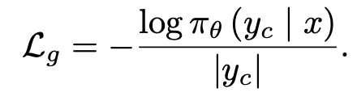

- Chain-of-Thought 구조: 아래 3개를 reasoning에 포함하도록 instruction set을 구축

  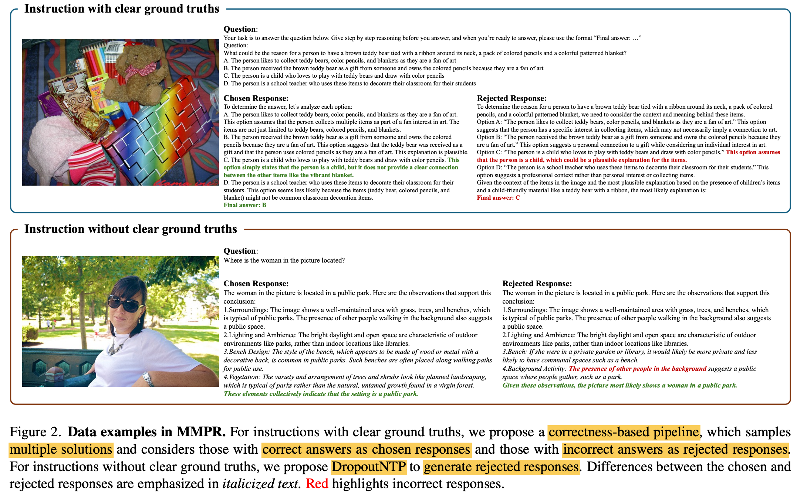

  - Background Konwledge CoT
  - Visual Content CoT
  - Grounded CoT

# 4. Experiments

- 정량적 결과

  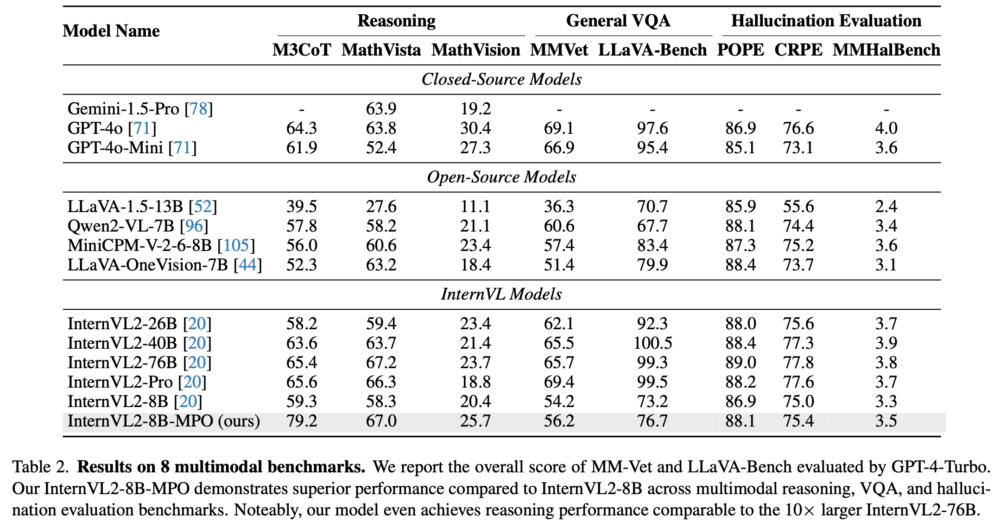

- Ablation study

  - SFT vs. MPO

    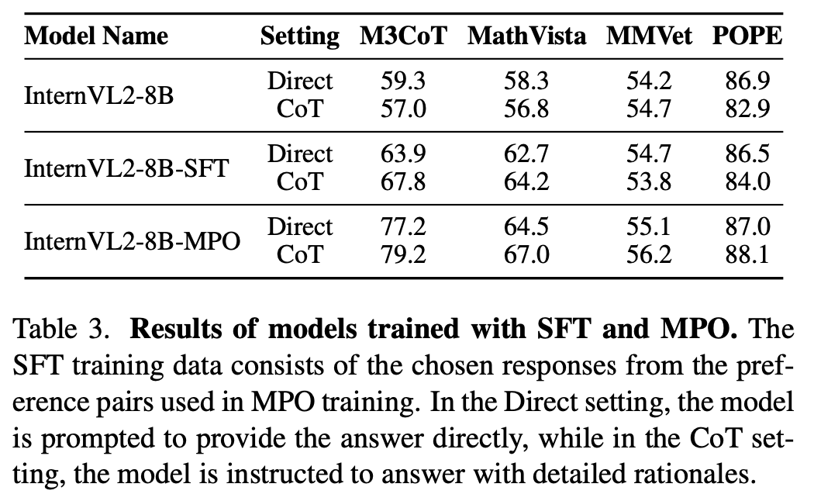

    - SFT: SFT ($L_g$)만으로 학습한 모델. Direct방식보다 CoT방식이 오히려 성과가 안좋음
    - MPO: Direct방식보다 CoT방식이 모든 면에서 좋음 $\to$ **SFT+PO** 방식이 제일 좋다

  - 기존 Rejection set (RLAIF-V) vs. MPO의 Rejection set (DropoutNTP) 생성방법에 따른 비교

    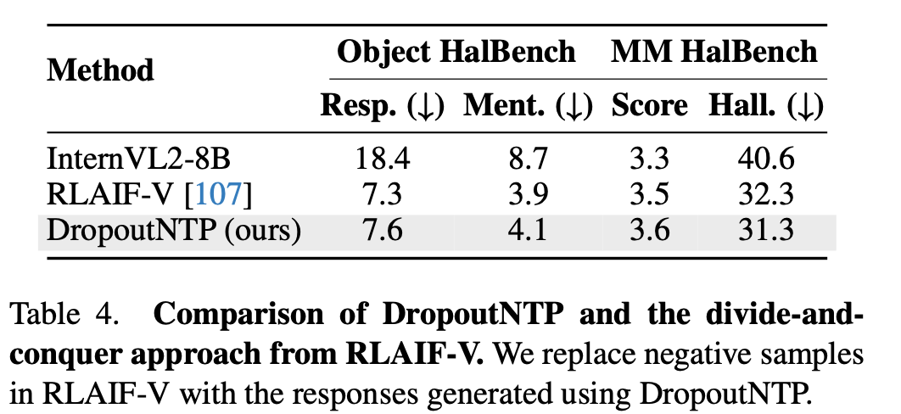

  - 다양한 PO+SFT 방식별 CoT vs. Direct 성능비교

    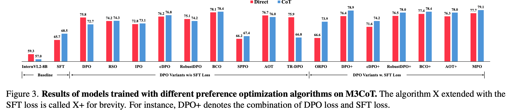

  - SFT dataset scale / hyperparameters에 따른 성능 비교

    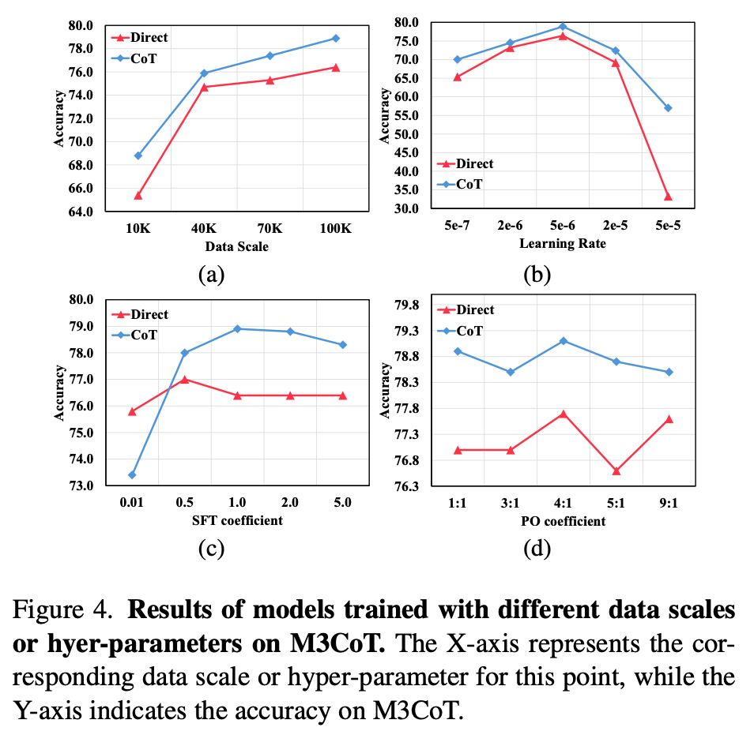

- Text-onle dataset 성능에서도 좋다.

  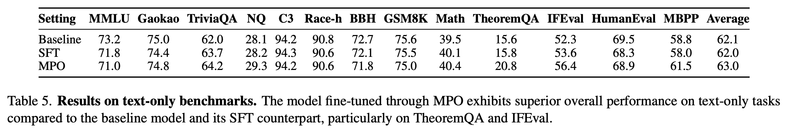