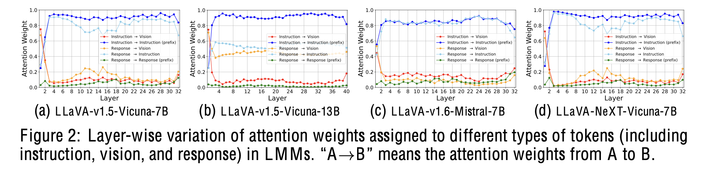
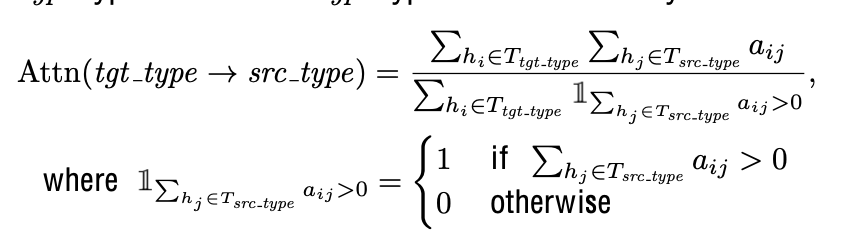
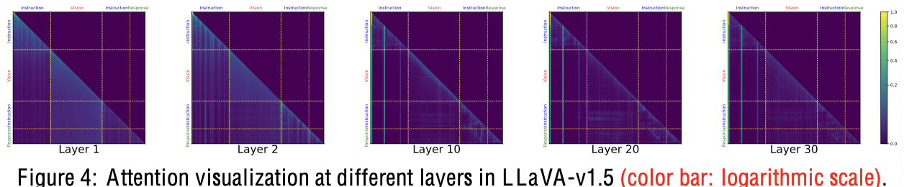
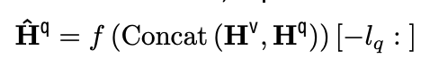

# [MM] LLaVa-Mini: EFFICIENT IMAGE AND VIDEO LARGE MULTIMODAL MODELS WITH ONE VISION TOKEN

- paper: 
- github: https://github.com/ictnlp/LLaVA-Mini
- archived (인용수: 0회, '25-01-25 기준)
- downstream task: VQA

# 1. Motivation

- LMM (Large Multi-modal Models)에서 압도적으로 많은 visual token 수로 인해 이미지를 고해상도로 혹은 긴 비디오를 처리하는데 한계가 있음

- Visual token들이 LMM의 초기에만 activate되고, 이후에는 사라지는 현상을 발견함

  

  $\to$ LMM에 들어가기 전에 pre-fusion을 수행한다면, visual token 수를 획기적으로 줄일 수 있지 않을까?

# 2. Contribution

- Image를 1 token으로 줄여서 Real-time (40ms)을 확보하면서 baseline (LLaVa-1.5)와 비교할만한 성능을 내는 LLaVa-Mini를 제안함.

  - Pre-fusion module을 제안함

  

  - 77% FLOPs reduction
  - 360MB $\to$ 0.6 MB/pimage
  - 100ms $\to$ 40ms
  - 100 imgs/vid $\to$ 10,000 imgs/vid

# 3. LLaVa-Mini

- Preliminaries

  - LLaVa instruction: system prompt ($H^q$), vision tokens ($H^v$), 그리고 language instructions ($H^q$)로 구성

    

  - LLaVa의 visual token이 각 layer별로 끼치는 영향을 attention weight 기반으로 분석해봄

    

    - $\Sigma_{h_i} \mathbb{I}_{\Sigma_{h_j}}$: target type token의 갯수
    - $\Sigma_{h_i}{\Sigma_{h_j}a_{ij}}$: target type token의 attention weight의 총합

  - 대부분의 visual token은 초기 layer에서 fusion됨

    

    - (a): attention weight의 평균값 기준 80%의 visual token이 줄어듦
    - (b): attention entropy도 초기에만 크고, 갈수록 줄어듦

    

    - 초기 layer는 대부분 attention이 강한데, layer가 깊어질수록 attention이 안됨

    

    - 뒤 layer의 visual token을 drop해도 성능하락이 거의 안됨
    - 앞 layer의 visual token을 drop해도 성능하락이 많이 발생

  - Overall Diagram

    

    - Vision Encoder: Clip-ViT-L-336

    - Compression; $C^2$로 줄임 (C=1, 8)

      

    - Pre-fusion module

      

      - $\hat{\mathbb{H}}^q \in \mathbb{R}^{l_q \times d_h}$

  - Video Image 계산량 감소

    - $MN^2+l_q$ $\to$ $MC^2+l_q$
      - *M*: frame 갯수
      - $l_q$: question token 갯수
      - *N*: original visual token의 갯수 (576)

- Training

  

# 4. Experiments

- Dataset
  - Pretraining: 558K caption data
  - Finetuning: 665K instruction data + 100K video instruction + opensource = 3M data

- Image VQA

  

- Video VQA

  

  

- Long Video QA

  

- Efficiency

  

- Ablation

  - With / Without Pre-fusion & # of tokens

    

  - pre-fusion vs pooling

    

- 정성적 결과

  