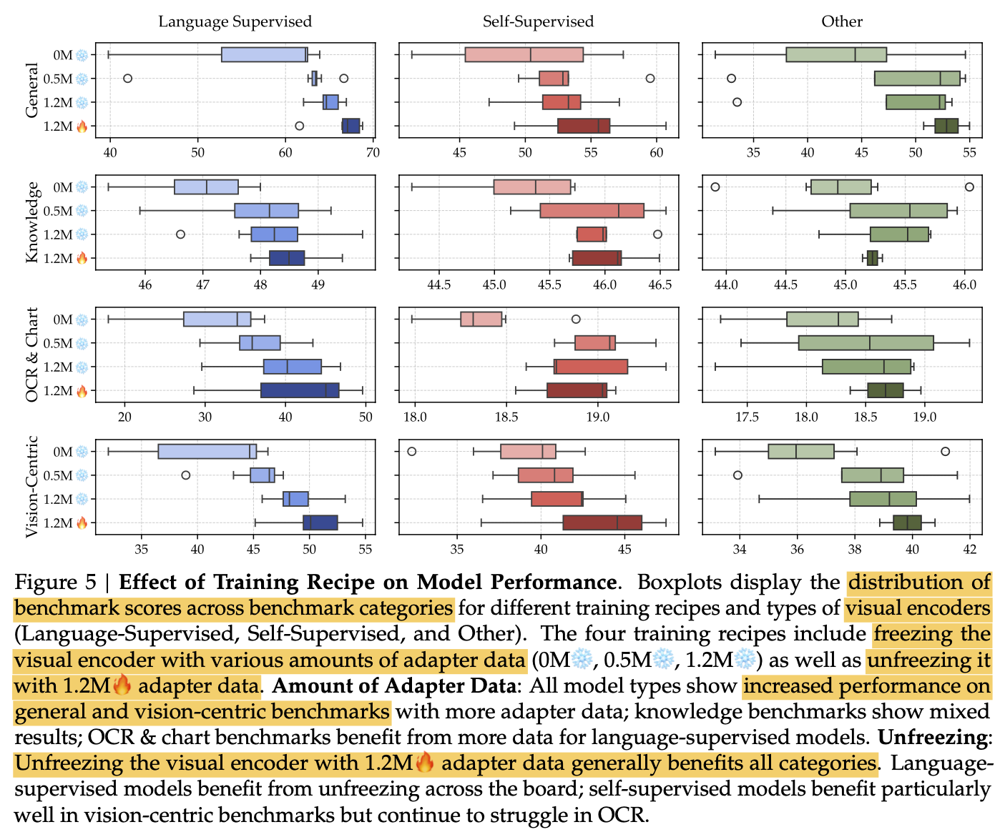
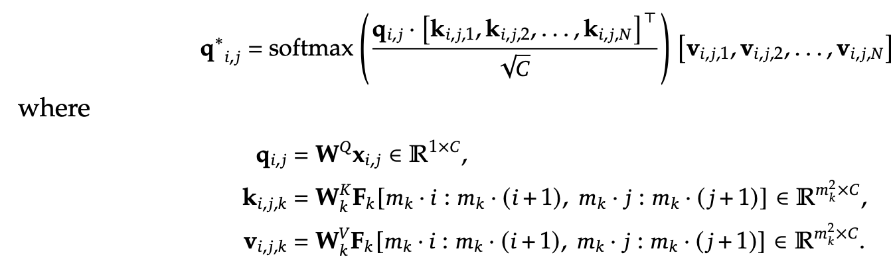

# [MM] Cambrian-1: A Fully Open,Vision-Centric **Exploration of Multimodal LLMs

- paper: https://arxiv.org/pdf/2406.16860
- github: https://github.com/cambrian-mllm/cambrian
- website: https://cambrian-mllm.github.io
- NeurIPS 2024 Oral accepted (인용수: 163회, '25-01-30 기준)
- downstream task: VQA (+Vision-Centric)

# 1. Motivation

- MLLM에서 vision component은 중요성 대비 디자인 choice에 대해 불충분하게 탐험되었다.

  - 원인
    - **dataset**: real-world (Visual Question & Answering) scenario에 적합한 데이터셋 부재
    - **grounding ability**: MLLM은 grounding 능력이 부족하다.

- 이런 결과로 **정확한 grounding 능력**은 **visual representation learning**에 대한 분석이 되지 못하였다.

  - Cambrian의 뜻: "캄브리아기 폭발 (Cambrian Explosion)"에서 파생됨. 오감 중 "**시각**"을 활용한 순간, 인류는 한층 성장했음을 의미.

  $\to$ 이러한 능력을 평가하기 위한 새로운 **benchmark**와 새로운 **multiomodal connector**를 제안해보자!

# 2. Contribution

- 전통적인 Computer Vision task dataset을 Visual Question & Answering으로 바꾸어 만든 Cambrian Vision-centered benchmark (CV-bench)를 제안

  

- 새로운 connector 기반의 Cambrain-1에 대해 5가지 영역으로 분석 및 노하우를 정리

  

  - **Visual Representation**: 다양한 visual encoder (23가지)의 조합에 대한 결과를 report

  - **Connector Design**: concat, re-sampler 외에 **dynamic** + **spatially aware connector**인 SVA (Spatial-aware Visual Aggregator)를 제안

  - **Instruction Tuning Recipes**: Instruction tuning 전략 & 방법 소개

  - **Benchmarking**: MLLM benchmark를 4개의 cluster로 분리 & 정리하여 부족한 영역을 추출하고, vision centric benchmark의 한계를 지적함

  - **Insturction Tuning Data**: high-quality visual instruction-tuning data를 public source로부터 추출하고, **balance**를 맞추기 위한 **data pipeline**을 제안함 (knowledge-base field용으로 국한)

    

# 3. MLLM기반 Visual Representation 분석

## 3.1 Benchmarks 분석

- 사용한 모델: 23개의 Vision encoder + LLM(Vicuna-7B)의 통계값을 활용

  

  - pretraining: 1.2M (adapter만 학습)

  - finetuning: 737K (full-finetuning)

    

- Clustering benchmark

  

  - 23 MLLM의 benchmark별 성능을 기준으로 confusion matrix를 계산

  - 4개로 clustering (**General, Knowledge, Chart&OCR, Vision-Centric**)

  - 입력에 따른 3가지 경우로 분석 수행

    - with vision: image + question
    - without vision: question
    - random: none

    

    - with / without vision의 차이를 기준으로 열거
      - 차이가 5% 이하: Language에 dependent한 benchmarks (SQA-I, MMMU, MathVista, AI2D)
    - without vision / random guess 차이
      - 차이가 40%: language bias가 심한 benchmark (TextVQA, GQA)
      - 음수인 경우: visual grounding이 중요한 benchmark (MMVP, MME)

## 3.2 CV-Bench 소개

- Computer Vision benchmark의 고품질 라벨을 활용하여 human의 검사 아래 **2,638**개의 고품질 대량 (상대적으로..)의 검증셋을 구축

  - 기존 Vision-centric benchmark들 보다 3.5배 (RealWorld QA), 8.8배 (MMVP) 큰 규모

- 4가지 template 기반 프로그램으로 Quesetion, Answer를 제작하고, 사람이 모호한 것은 제거

  

  

- 데이터셋 구성

  

  - Spatial Relationship (2D): visual prompt (bbox)를 그려넣어 모호함을 제거. Anchor object를 기준으로 상대적 거리를 예측하도록 질문 (단답형)
  - Object Counting (2D): 2, 3, 4, 5 & 6 중 1개로 예측하도록 수행. (주관식의 객관식화) 존재 유무를 물어볼 경우, 0도 포함
  - Depth Order (3D): visual prompt(bbox)를 그려넣어, 두 물체간 상대적 거리를 예측하도록 질문 (단답형)
  - Relative Distiance (3D): visual prompt(bbox)를 그려넣어 상대적 거리를 질문 (단답형)

  

- Accuracy

  

## 3.3 Instruction Tuning 레시피 분석

- Finetuning 737K dataset
  - LLaVA 665K + OCR&Chart data = 737K
    - OCR&Chart data
      - AI2D (15,501)
      - DocVQA (14,999)
      - DVQA (13,000)

- 결론

  

  - One Stage vs Two Stage Training: 0M vs. (0.5M / 1.2M)

    - pretraining dataset이 커질수록 성능 향상 ((0.5M vs 1.2M)

    

  - Freeze Vision encoder vs. Unfreeze vision encoder

    

## 3.4 MLLM을 이용한 Visual Representation 평가

- freezed visual encoder + 1.2M adapter + 0.7M fine-tuning을 default로 활용

- Visual encoder별 성능

  

  - Language supervised 모델이 computer vision self-supervised 모델보다 대부분 좋음 $\to$ Language supervised dataset이 (최소 400M) computer vision 모델 (최대 142M)보다 많기 때문으로 가정

    - self-supervised vision 모델을 unfreeze해서 5M으로 finetuning해본 결과, dinov2가 clip보다 좋은 성능을 냄

      

      

  - High resolution 모델일수록 OCR에서 좋은 성능을 냄 (OpenCLIP ConvNeXt-XXL@1024)

    

## 3.5 Multiple vision encoder를 융합하는 방법

- Non-language supervised model (DINOv2)는 OCR benchmark에서 SOTA를 냈음 $\to$ merge할 경우 성능 향상 기대

  - 서로 다른 token을 같는 encoder의 경우, interpolation을 수행하여 동일 token 갯수 (576개)로 바꾸고, feature dimension으로 concat (A-MoF)

  

- 이런 Naive한 방법은, information loss가 발생하므로 최적의 solution이 아님

- 모든 encoder를 동일한 가중치를 주고 있는데, 최적의 solution이 아님

  

# 4. Spatial Vision Aggregator (SVA): A New Design

- Overview

  

  - *G*: learnable query의 "group" 갯수. 학습하고자 하는 "vision pattern"의 갯수라고 생각하면 됨
  - *D*: Cross attention layer의 갯수. 성능 & 속도 trade off 존재
  - *L*: learnable token의 가로(세로) 길이. 총 $L^2$개의 vision token으로 압축됨

- 특징

  - learnable laten queries를 여러 vision encoder와 cross attention 시킴 (기존 방식들과 동일. ex Blip-2)

  - Spatial inductive bias를 추가 $\to$ Token 별로 "space"에 대한 정의를 explicitly 제공

    - Spatial Inductive Bias

      - *L*의 배수로 가로, 세로의 길이를 쪼갰을 때, 각 sub-region별로 indexing. 총 $\Sigma_k m_k^2$개의 sub-region 제공

      

    - Cross Attention

      

      - key, value: vision encoder feature
      - query: learnable tokens

  - LLM layer 중간 중간에도 압축되지 않은 vision feature를 여러번 제공함으로써 성능 향상

  - SVA Ablation Study

    - SVA: $D=3, G=1$ (OpenAI CLIP ViT-L/14@336, SigLIP ViT-SO400M/14@384, OpenCLIP ConvNeXt-XXL@1024, and DINOv2 ViT-L/14@518)
    - SVA-no-multi-agg: $D=3, G=3$ (중간마다 vision feature 제공 X)

    

    - SVA 구조에 따른 성능비교: line 1,2 vs. 3
    - Aggregator (중간마다 넣는 구조)에 따른 추가 성능 향상: line 3 vs. line 4

    

  - D, G에 따른 Ablation study

    

  

# 5. Instruction Tuning Data for Training MLLMs

- Training data의 balance가 성능에 얼마나 중요한지 연구가 잘 되고 있지 않아, 해보려고 함

## 5.1 Data Collection

- 존재하는 benchmakr를 모음 (+ catastrophic forgetting 방지를 위해 language-only도 추가)

- Science dataset이 부족하여 "Data Collect Engine"을 도입하여 **161K science-related data** 확보

  1. Topic Generation: GPT-4v같은 llm을 활용하여 불충분한 field data에 대한 topic을 생성. 여기선 30 fields, 3,660 topics를 json format으로 추출

  

  2. Filtering Web Data: search engine API를 활용하여 high-quality web pages를 topic당 10개씩 (총 36,600개)의 web-site를 추출. (ex. wikipidia)

     

  3. Parsing: Web-page로부터 image-caption-text tuples를 추출

     

  4. Data Generation: LLM (ex.Chatgpt 3.5 turbo)를 활용해서 Question-Answer pair를 생성 $\to$ 165K data sample를 생성

     

- Cambrian-10M: **9,784K** data sample로 구성됨

  

## 5.2 Data Curation

- single data source로부터 max 갯수를 *t=150k, 250k, 350k, 450k*로 제한하여 성능 비교함

   $\to$ 250k, 350k가 최적임을 확인

- 누적된 이미지 분포

  

- data ratios를 맞추기 위해, 1,350K (10%)에 대해서 다양한 비율로 실험해봄

  

  1. General, OCR, Langauge의 balance를 맞추는게 성능에 매우 중요. OCR dataset에 비례해서 OCR성능이 좋아지나,  너무 많으면,  general or vision-centric task가 나빠짐
  2. knowledge-intensive task의 성능에는 여러 요인이 작용함을 확인. (mix of OCR, chart, reasoning, general perception, etc) 너무 적은 science related data는 성능을 나빠지게 함

  $\to$ Cambrian-7M이 등장

## 5.3 "Answer Machine"를 방지하는 방법: System Prompt

- 성능이 좋아도, "Chatbot" 서비스를 위해서는 긴 답변이 필수임

- 문제 원인

  - 단답형의 VQA dataset이 너무 많기 때문

  - 적절한 "System prompt"를 앞에 넣어주고 학습 & 추론하면 성능 하락 없이 해결됨

    *Answer the question using a single word or phrase*

    

# 6. Experiments

- Vision Encoder
  - OpenAI CLIP ViT-L/14@336, SigLIP ViT-SO400M/14@384, OpenCLIP ConvNeXt-XXL@1024, and DINOv2 ViT-L/14@518
- Adapter
  - SVA (D=3, G=1)
- LLM
  - LLaMA-3-Instruct-8B
  - Vicuna-1.5-13B
  - Hermes-2-Yi-34B

- 정량적 결과

  

  

- 정성적 결과

  