# [LLM] DeepSeek-V3 Technical Report

- paper: https://arxiv.org/pdf/2412.19437
- github: https://github.com/deepseek-ai/DeepSeek-V3 (Training code X)
- archived (인용수: 0회, '25-02-01 기준)
- downstream task: VQA

# 1. Introduction

- Opensource 모델의 성능 한계를 극복하고자 **671B (37B-activated)**의 **MoE**기반 LLM 모델인 **Deepseek-V3**를 개발하게 되었음

- 주요 특징

  - 학습의 효율성 

    - Mixture-of-Experts (MoE)기반으로 전체 파라미터 수 (671B)대비 일부 파라미터 (37B)만 activate됨으로써, 크기 대비 학습이 효율적임 (DeepSeek-V2와 동일)

    - **FP8 mixed precision training**을 도입함

    - **Efficient cross-node all-to-all communication kernel**을 도입함 $\to$ InfiniBand (IB) & NVLink를 10분 활용

      - Pre-training

        - tokens: 14.8T high-quality diverse tokens
        - cost:  **2.788M @ H800 GPU hours** (H800x2,048로 3.7일)
        - max length: 32K

      - Post-training (SFT + RL / Distillation (@R1 series))

        - cost: **0.1M @ H800 GPU hours** 
        - max length: 128K

        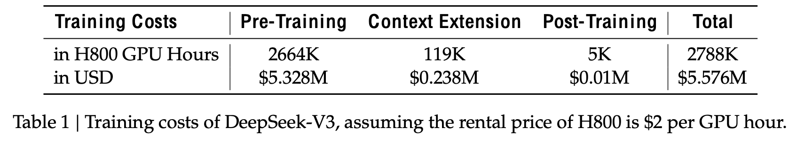$\to$ 미국 BigTech대비 10%

  - 추론의 효율성 (DeepSeek-V2와 동일)

    - Multi-head Latent Attention (MLA) 기반 
      - LoRA (Low-Rank Adaptaion)처럼 중간에 Query 와 Key-Value의 feature size를 줄였다가, 늘려주는 Bottleneck구조 도입 $\to$ Inference할 때, KeyValue cache의 메모리를 획기적으로 줄여줌

  - **Auxiliary Loss-free** 전략으로 **load-balancing**을 함으로써, domain별 Expert (혹은 specialist)의 역할을 가중함

    - Auxiliary loss for load-balance?
      - LLM의 특정 MoE head만 activation되는 현상 (load imbalancing)을 해결하기 위해 auxiliary loss를 부여하고 있었음 (강제로 여러 head가 activate되도록.)
      - 하지만, 이런 auxiliary loss는 성능 하락을 야기할 수 있음

  - Multi-Token Prediction (MTP) training을 도입하여 성능 향상

- 주요 benchmark에서 SOTA

  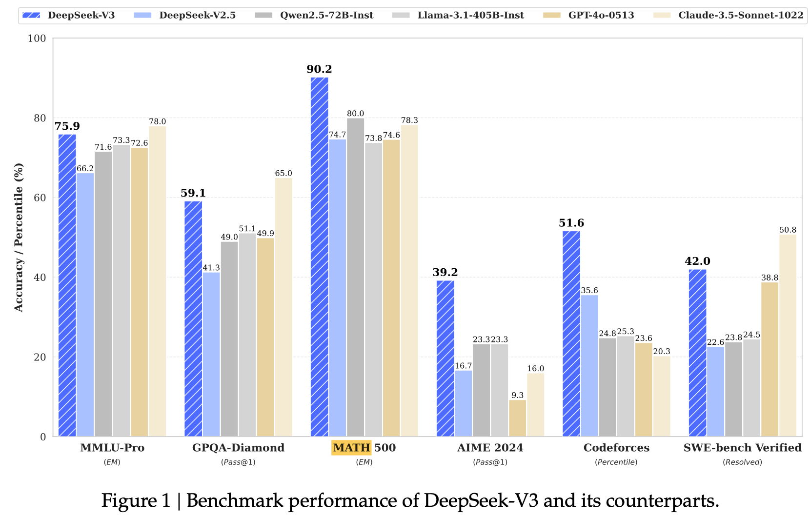

  - Knowledge
    - Education benchmark:  MMLU, MMLU-Pro, GPQA
    - Factuality benchmark: SimpleQA, Chinese SimpleQA
  - Code & Match Reasoning
    - Math related benchmark: MATH-500
    - Coding benchmark: LiveCodeBench

# 2. Architecture

## 2.1 Basic Architecture

- DeepSeek-V2 그대로 차용 (MoE + MLA)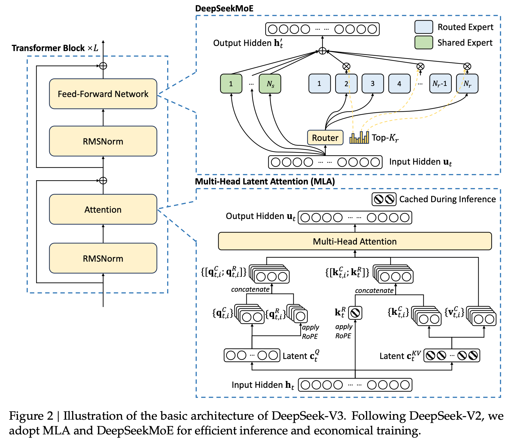

- Multi-head Latent Attention (MLA)

  - 핵심: Low-rank (keyValue joint) compression $d_c (<< d_hn_h), d'_c(<< d_hn_h)$

    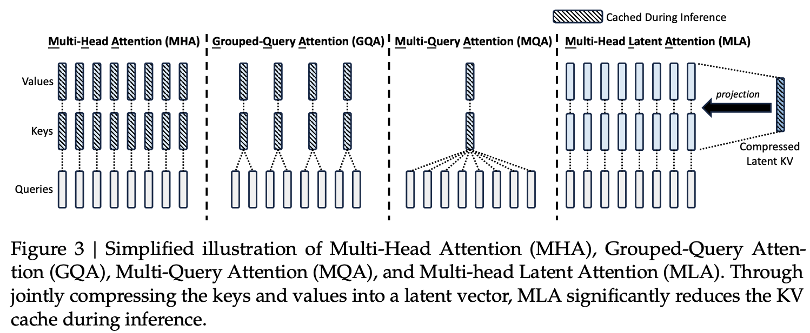

    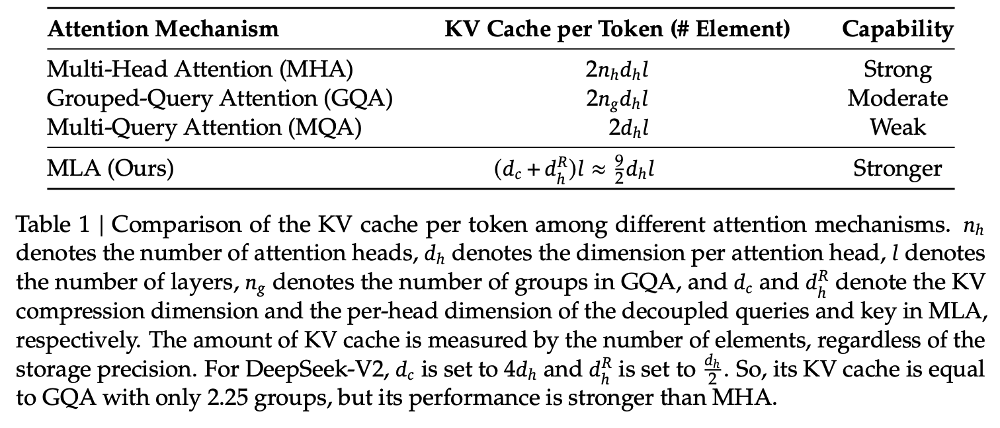

    - $d_h$: head dimension
    - $n_h$: multi-head 갯수
    - $d_c$: key,value compression dimension
    - $d'_c$: query compression dimension

  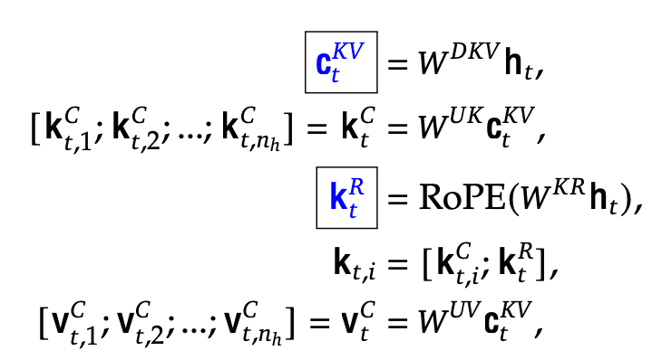

  - **h**$_t \in \mathbb{R}^d$ : t번째 input hidden embedding

  - **c**$_t^{KV} \in \mathbb{R}^{d_c}$ : down-projection (*W*$^{DK} \in \mathbb{R}^{d_c \times d}$) 통과한 Key, Value embedding

  - **k**$_t^C \in \mathbb{R}^{d_hn_h}$ : up-projection (*W*$^{UK} \in \mathbb{R}^{d_hn_h \times d_c}$) 통과한 key embedding

  - **v**$_t^C \in \mathbb{R}^{d_hn_h}$ : up-projection (*W*$^{UV} \in \mathbb{R}^{d_hn_h \times d_c}$) 통과한 value embedding

  - **k**$_t^R \in \mathbb{R}^{d_h^R}$ : Rotary projection (*W*$^{KR} \in \mathbb{R}^{d_h^R \times d}$) 통과한 Rotation Position embedding

    $\to$ 파란색은 inference때 key, value caching됨. Memory efficient함

    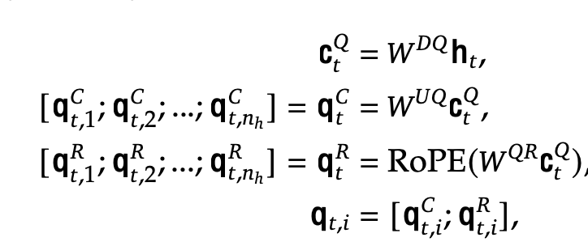

    - **h**$_t \in \mathbb{R}^d$ : t번째 input hidden embedding
    - **c**$_t^{Q} \in \mathbb{R}^{d'_c}$ : down-projection (*W*$^{DQ} \in \mathbb{R}^{d'_c \times d}$) 통과한 Key, Value embedding
    - **q**$_t^C \in \mathbb{R}^{d_hn_h}$ : up-projection (*W*$^{UQ} \in \mathbb{R}^{d_hn_h \times d'_c}$) 통과한 value embedding
    - **q**$_t^R \in \mathbb{R}^{d_h^Rn_h}$ : up-projection (*W*$^{UQ} \in \mathbb{R}^{d_h^Rn_h \times d'_C}$) 통과한 Rotation Position embedding

- Multi-head Latent Attention

  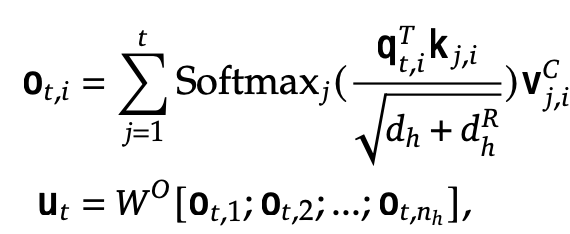

  - *W*$^O$: Output projection matrix

## 2.2 DeepseekMoE with Auxiliary-Loss-Free Load Balancing

- DeepSeekMoE vs. MoE

  - DeepSeekV2와 차별점: activation function softmax $\to$ sigmoid로 바꾸고, normalization을 수행

  - Shared expert와 fine-grained isolated (routed) expert로 expert를 이분화함

    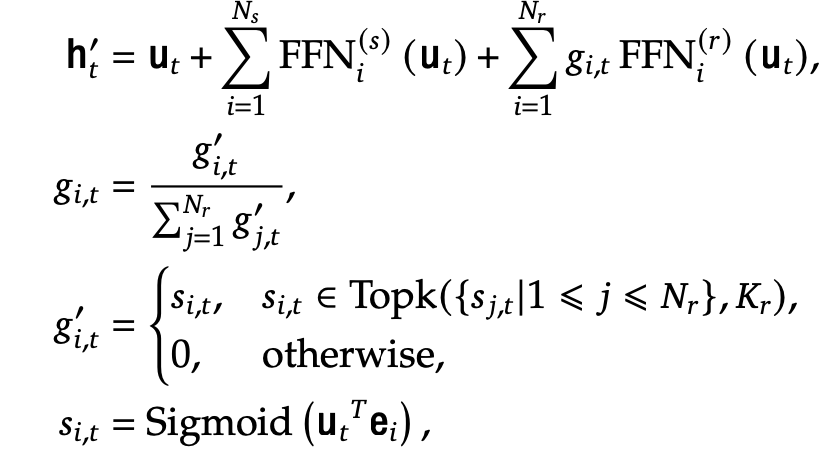

    - **h**'$_t$: t번째 token의 DeepSeekMoE output
    - **u**$_t$: t번째 token의 DeepSeekMoE input
    - $FFN_i^{(s)}$: i번째 expert의 shared Feed-Forward Network
    - $FFN_i^{(r)}$: i번째 expert의 routed Feed-Forward Network
    - $N_s$: shared expert의 갯수
    - $N_r$: routed expert의 갯수
    - **e**$_i$: i번째 routed expert의 centroid vector (?)
    - $g_{i,t}$: t번째 token의 i번째 routed expert의 **token-to-expert affinity score**
    - $K_r$: TopK의 Affinity score 갯수

- Auxiliary-Loss-Free Load Balancing

  - layer별 MLA에서 affinity score를 계산할 때, bias를 추가해줌으로써 해결

    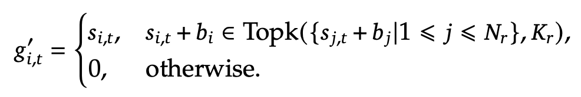

    - $b_j$: j번째 TopK에 포함된 routed expert의 bias. iteration 돌때마다 $\gamma$ 만큼 줄어듦. (hyper-parameter)

      $\to$단, routing할때만 $g'_{i,t}$가 사용되며, 실제 affinity score는 original한 값을 활용.

- Complementary Sequence-wise Balance Loss

  - 목적: extreme imbalance된 expert selection을 방지하고자, balance loss를 넣긴 함.

    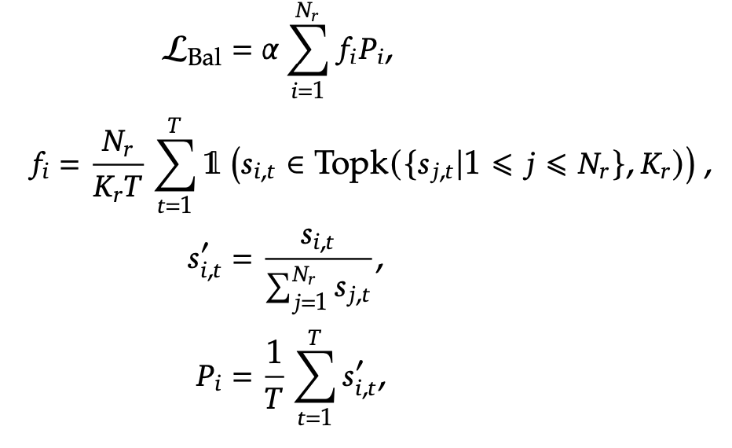

    $\to$ affinity score ($s_i$)가 0에 가까워지는 목적 (즉, 균일해지는 역할)

- Node-limited routing

  - 목적: *M*개의 node (ex. H800x8대 server)별로 Top $\frac{K_r}{M}$개의 affinity score를계산하여 합침으로써, communication cost를 줄이고자 함

- No token Dropping

  - 기존에 MoE는 (DropOut 같이?) imbalance token을 drop한 것 같음. 
  - 하지만 DeepSeekMoE는 load-balancing이 잘되어, 1개의 token도 drop하지 않았다고 함

## 2.3 Multi-Token Prediction

- Next Token만 예측하는게 아니라 (메두사 처럼) **multiple future token**을 예측

  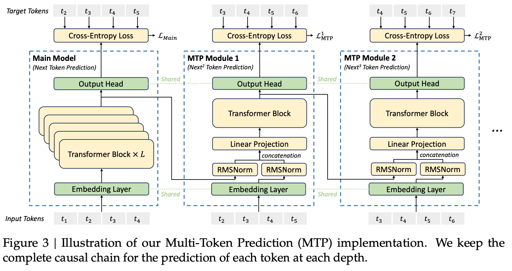

  - Independent layer

    - projection matrix $M_k \in \mathbb{R}^{d \times 2d}$

      - 이전 (k-1) depth의 representation **h**$_i^{k-1} \in \mathbb{R}^d$과, (i+k) token $Emb(t_{i+k}) \in \mathbb{R}^d$를 입력으로 받아 projection $M_k$를 통과시킴

        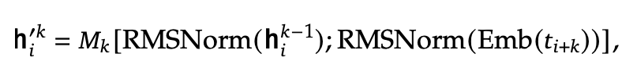

      - Transformer block ($TRM_k$)

        - projection matrix 통과한 결과 **h'**$_i^{k-1} \in \mathbb{R}^d$를 입력받아 Transformer block을 통과시킴

          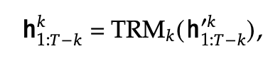

  - Shared layer

    - output head embedding

      - Independent layer 통과된 값 **h**$_{1:T-k}^k \in \mathbb{R}^d$을 입력받아, prediction token **P**$_{i+k+1}^{k} \in \mathbb{R}^V$를 예측

        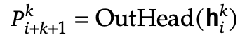

    - input embedding

- MTP Training Objective

  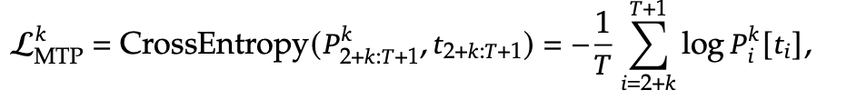

  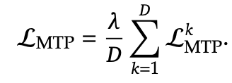

# 3. Infrastructures

## 3.1 Compute Cluster

- H800 x 2,048개로 학습
  - 8개씩 NVLink + NVSwitch + InfiniBand(IB)로 node간 연결

## 3.2 Training Framework

- HAI-LLM framework

  - 16-way Pipeline Parallelism (PP) $\to$ DualPipeline algorithm으로 성능 최적화를 수행함
  - 64-way Expert Parallelism (EP) (@8 nodes)
  - ZeRO-1 Data Parallelism (DP)

- DualPipe와 계산-통신 오버랩

  - **DualPipe 개념**:

    - **계산**과 **통신**을 **Forward** 및 **Backward** chunk 내에서 **상호 오버랩하여 파이프라인 버블을 감소**.

    - **청크 분할**: attention, all-to-all dispatch, MLP, all-to-all combine으로 세분화.

    - 포워드 및 백워드 청크 내의 세부 요소(input, weight)를 재구성하여 GPU 사용 효율 극대화.

      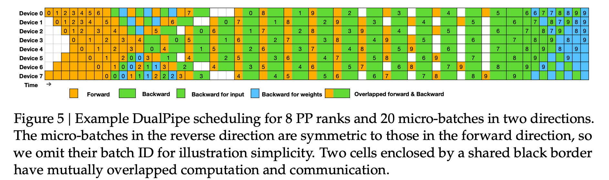

  - **효율성**:

    - 파이프라인 양 방향에서 **미세 배치 단위의 오버랩**.
    - **ZeroBubble 및 1F1B** 대비 통신 오버헤드 감소 및 버블 최소화.

  - **비교**:

    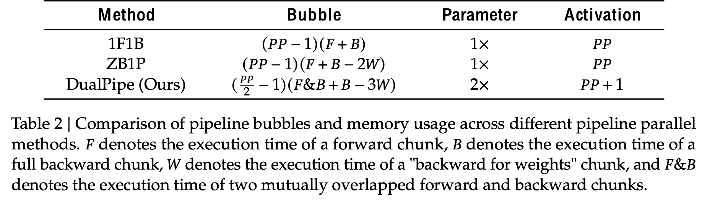

    - DualPipe: 파이프라인 버블이 **PP 크기 절반 수준**으로 감소.
    - 메모리 사용량 소폭 증가(2배)하나 **모델 병렬 효율성 증가**.
    - **활성 메모리 증가**: 약 1/PP 배.

  - **주요 결과**:

    - 계산-통신 비율 유지하며 높은 확장성.
    - 대규모 파이프라인에서도 **통신-계산 오버랩**을 통한 성능 극대화

- 노드 간 All-to-All 통신의 효율적 구현
  - DualPipe 성능 최적화
    - 노드 간 All-to-All 통신 커널(작업 분배와 결합 포함)을 효율적으로 구현하여 SM (Streaming Multiprocessor) 사용량을 최적화
  - 클러스터 설계
    - 노드 간 GPU는 IB(InfiniBand)로 완전 연결.
    - 노드 내 통신은 NVLink를 사용.
    - NVLink 대역폭: 160GB/s (IB 대역폭의 약 3.2배).
  - **통신 효율화 전략**
    - 각 토큰은 최대 4개의 노드로만 전달, IB 트래픽 감소.
    - IB로 전달된 데이터는 NVLink를 통해 목표 GPU로 즉시 전달.
    - IB와 NVLink 간 통신은 완전 중첩(overlapping)되어 효율성을 극대화.
    - 평균적으로 각 노드에서 3.2개의 전문가를 선택 가능.
  - **결과**
    - 실질적으로 8명의 전문가로 구성되지만, 최대 13명까지 확장 가능 (4 노드 × 3.2 전문가/노드).
    - 20개의 SM만으로 IB와 NVLink 대역폭을 완전히 활용.
  - **Warp 최적화**
    - 20 SM을 10개의 통신 채널로 분할.
    - 동적으로 조정된 Warp를 통해 IB 및 NVLink 작업 처리:
      1. IB 송신
      2. IB-NVLink 전달
      3. NVLink 수신
    - 결합 과정에서도 NVLink 송신 및 IB 수신이 Warp를 통해 조정.
  - **추가 최적화**
    - PTX(병렬 스레드 실행) 명령어와 통신 청크 크기 자동 조정 사용.
    - L2 캐시 사용 및 SM 간 간섭을 최소화.
- 최소한의 Overhead로 Memory의 비약적 절감 팁
  - MLA Up-Projection과 RMSNorm의 재계산
    - backpropagation 과정에서 재계산을 수행함으로써, memory에 output activation을 저장하지 않도록 함 $\to$ memory를 비약적으로 절감
  - EMA in CPU
    - 매 training step마다 EMA를 위한 parameter를 비동기적으로 CPU에서 계산하게 함
  - Multi-Token prediction에서 Shared embedding & output head
    - DualPipe에서 동일 PP rank에 두 layer를 할당하여, 메모리를 추가 향상시킴

## 3.3 FP8로 학습

### Mixed Precision Framework

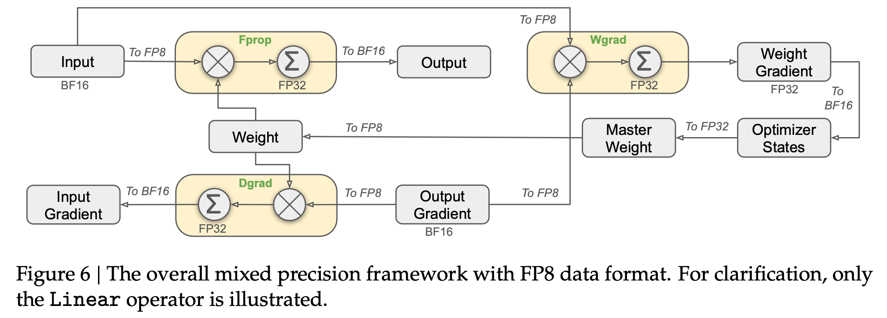

- 핵심 computation kernel, GEMM operations의 input을 FP8 precision, output을 BF16 or FP32로 둠

  - Activation: FP8
    - forward pass, weight backward pass, activation backward pass

  - Optimizer state: BF16
    - embedding module, output head, MoE gating modules, normalization operators, attention operators

  $\to$ 상대적 에러가 FP16 대비 0.25%를 나타냄

  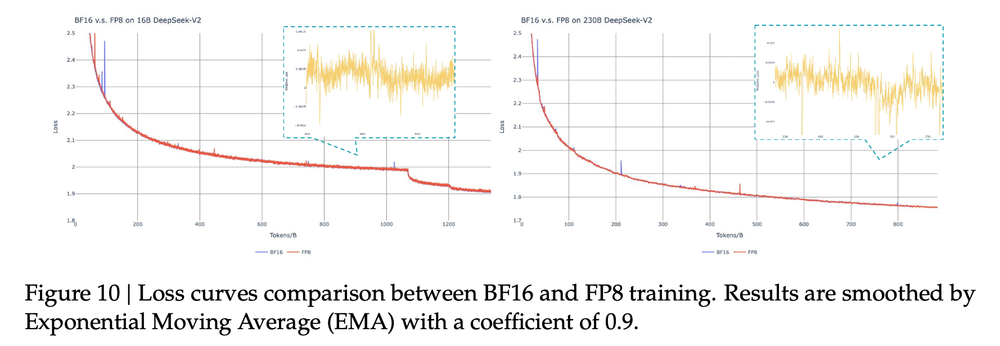

### Quantization & Multiplication의 Precision 향상하는 방법

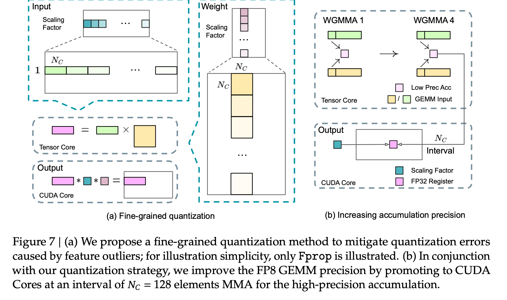

- Fine-grained quantization 전략을 제안함

  - tile-wise grouping ($1 \times N_c$ elements)

    - **입력 데이터(활성화 값)**를 1x128의 작은 타일(작은 데이터 묶음)로 나누고, 각 타일마다 “스케일링 팩터”를 적용함.
    - 즉, 묶음별로 크기를 다르게 조정해 더 세밀하게 다룸

  - block-wise grouping ($N_c \times N_c$ elements)

    - **가중치 데이터**를 128x128 블록 단위로 나눠서 스케일링함

    $\to$ 각 블록이 데이터 특성에 맞게 조정됨

- Increasing Accumulation Precision

  1. **문제점**  
     - FP8 연산에서 누적 정확도(Accumulation Precision)가 낮아지며, 특히 큰 차원(K=4096)에서는 최대 2% 오차 발생.  
     - FP32와 비교해 FP8 누적은 약 14비트의 제한된 정확도를 가짐.
  2. **해결책: CUDA Core**
     - **Tensor Core**에서 FP8 누적 결과를 일정 간격(𝑁𝐶=128)마다 **FP32 레지스터**로 복사하여 고정밀 누적 수행.  
  3. **효율성 유지**  
     - 두 WGMMA(Warpgroup-level Matrix Multiply-Accumulate) 작업 병렬 실행으로 Tensor Core 사용률 유지.  
     - 𝑁𝐶=128(4 WGMMAs) 설정이 최소 오버헤드로 정밀도를 크게 향상.
  4. **결과**  
     - 낮은 누적 정밀도 문제 해결 및 훈련 정확도 개선.

- Mantissa over Exponents
  - 기존 Mixed FP8 framework는 Fprop에는 E4M3(4-bit exponent, 3-bit mantissa), Dgrad & Wgrad엔 E5M2 (5-bit exponent, 2-bit mantissa)를 사용
  - 우리는 전체에 E4M3(4-bit exponent, 3-bit mantissa)를 사용
- Online Quantization
  - 실시간으로 Maximum absolute value를 계산하는 "Delayed quantization"을 차용하여 Scale값을 online으로 계산하여 fine-grained quationzation을 수행

### Low-precision Storage & Communication

- Low Precision Optimizer States

  - AdamW 옵티마이저의 1차·2차 모멘트 → FP32 대신 BF16 사용 (성능 저하 없음)
  - 마스터 가중치 및 그래디언트 → FP32 유지 (수치적 안정성 보장)

- Low Precision Activation

  - **Wgrad 연산을 FP8로 수행**하여 메모리 절약

    - Linear 연산자의 역전파 활성화 캐싱 → FP8 활용

      1. Attention 연산 후 Linear 입력값
         - 역전파 시 중요하므로 **E5M6 데이터 형식 사용**
         - 1x128 타일 → 128x1 타일로
         - **스케일링 계수 = 2의 거듭제곱**(양자화 오류 방지)

      	2. MoE의 SwiGLU 연산자 입력값
          - 입력값을 **FP8로 저장 후, 역전파 시 출력값 재계산**
          - 메모리 절약과 연산 정확성 균형 유지

  - Low Precision Communication

    - MoE Up-projection 전 활성화 값 FP8로 양자화 → FP8 Fprop과 호환
    - **스케일링 계수 = 2의 거듭제곱**, Linear 연산 후 attention 입력과 동일
    - MoE down-projection 전 활성화 그래디언트 → FP8 유지
    - Forward 및 backward 결합 연산은 BF16 유지 → 훈련 정확도 보장

## 3.4 Inference & Deployment

- 기반 인프라
  - H800 클러스터에서 NVLink(노드 내) 및 IB(노드 간) 사용
  - Prefilling(사전 채우기)과 Decoding(디코딩) 단계를 분리하여 성능 최적화

### Prefilling

- 4개 노드, 32개 GPU가 최소 배포 단위
- TP4 (4-way Tensor Parallelism) + SP (Sequence Parallelism) + DP8 (8-way Data Parallelism) 조합
- MoE: EP32(32-way Expert Parallelism) → 대규모 배치 크기 처리 가능
- 균형 잡힌 MoE 전문가 로드 밸런싱
- 부하가 큰 전문가를 **중복 배치**하여 GPU 간 부하 균형 유지
  - 10분마다 전문가 부하 통계를 기반으로 조정
  - 각 GPU: 원래 8개의 전문가 + 1개의 중복 전문가
- 마이크로 배치 최적화
  - 2개의 마이크로 배치를 동시에 처리 → 통신과 연산을 겹쳐 실행
  - 동적 중복 전략 실험 중
    - 각 GPU가 16개 전문가를 호스팅하지만, 한 번에 9개만 활성화
    - 레이어별로 최적의 라우팅 방식 실시간 계산 → 계산 부담 없음

### Decoding

- 40개 노드, 320개 GPU가 최소 배포 단위
- TP4 + SP (Attention 연산) + DP80 조합
- MoE: EP320 (각 GPU가 1개 전문가 전담, 64개 GPU는 중복·공유 전문가 호스팅)
- All-to-All 통신 → IB 포인트 투 포인트 전송(낮은 지연시간 유지)
- IBGDA(NVIDIA, 2022) 기술 활용 → 지연시간 최소화
- 전문가 부하를 일정 주기로 분석하여 중복 전문가 설정 조정
- 마이크로 배치 최적화
  - Attention이 많은 연산을 차지하므로, **첫 번째 마이크로 배치의 Attention을 실행하는 동안 두 번째 배치의 MoE(디스패치+컴바인)를 병렬 처리**
- 디코딩 단계의 병목 = 메모리 접근 속도
  - MoE 연산 시 적은 SM을 할당하여 Attention 연산 속도를 최적화

## 3.5 하드웨어 설계 제안

###  통신 하드웨어 (Communication Hardware)

- 현재 문제:  통신 작업이 SM(스트리밍 멀티프로세서)에서 실행되어 연산 자원 낭비
- 제안:
  - 통신 작업을 NVIDIA SHARP 같은 전용 GPU/네트워크 공동 프로세서에서 처리
  - IB(스케일아웃)와 NVLink(스케일업) 네트워크를 통합 → 프로그래밍 단순화 및 성능 향상

### 연산 하드웨어 (Compute Hardware)

- FP8 GEMM 누적 연산 정밀도 향상
  - 현재 **FP8 GEMM 누적 연산 시 14비트 정밀도만 유지** → FP32 변환 시 오류 발생
  - 최소 34비트 누적 정밀도 필요 → 훈련 및 추론 시 정밀도 향상 가능
- 타일·블록 단위 양자화 지원
  - 현재 GPU는 per-tensor 양자화만 지원
  - 제안:
    - Tensor Core에서 타일·블록 단위 양자화를 직접 지원하여 CUDA 코어 간 불필요한 데이터 이동 최소화

- 온라인 양자화 지원
  - **현재 문제**: FP8 변환을 위해 HBM(고대역폭 메모리)에서 여러 번 데이터를 읽고 씀
  - 제안:
    - FP8 변환과 TMA(Tensor Memory Accelerator) 접근을 통합하여 메모리 전송 중 양자화 수행
    - 워프 수준 캐스트 명령어 추가 → Layer Normalization과 FP8 변환을 효과적으로 결합
    - Near-Memory Computing 채택 → 
      - BF16 데이터를 FP8로 변환하는 작업을 HBM에서 읽어오는 순간 수행
      - 오프칩 메모리 접근량 50% 절감 가능
- Transposed GEMM 연산 지원
  - **현재 문제**: 전치(transpose) 연산을 위해 추가적인 메모리 작업 필요
  - 제안:
    - 공유 메모리에서 직접 전치된 매트릭스를 읽는 기능 추가
    - FP8 변환 및 TMA 접근 최적화와 결합하여 성능 개선

# 4. Pretraining

## 4.1 Data Construction

- DeepSeekV2 채용

  - Fill-in-Middle (FIM) 전략

    - Next-token Prediction 시, 중간 text를 예측하는 학습방법

      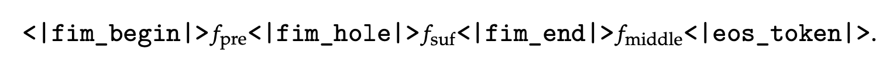

- DeepSeekV2 대비 변경사항

  - 다국어 지원
  - 수학 & 프로그래밍 데이터 추가 학습 $\to$ 14.8T 고품질 다양한 tokens 
  - 128K의 vocabulary로 구성된 tokenizer 사용
  - token bias 제거를 위해, line break가 없는 line의 경우, multi-line 이 되도록 random하게 line-breaking

## 4.2 Hyperparameter

- layer 수: 61
- hidden dimension: 7,168
- per-head dimension $d_h$: 128
- number of attention heads $n_h$: 128
- key-value compression dimension $d_c$: 512
- query compression dimension $d'_c$: 1,536
- Rotation embedding per-head dimension $d_h^R$: 64
- shared expert 수 $n_s$: 1
- routed expert 수 $n_r$: 256
- intermediate hidden dimension **h**: 2,048
- Multi token prediction depth *D*: 1
- DeepSeek-V3: 671B (37B)

### Training Hyperparameter

- Maximum sequence length: 4K
- Batch size scheduling: 처음 (3,072) $\to$ 나중 (15,360)로 batch size를 바꿈

## 4.3 Long Context Extension

- YaRN: Max Context를 4K $\to$ 32K, 32K $\to$ 128K로 늘리며 학습

  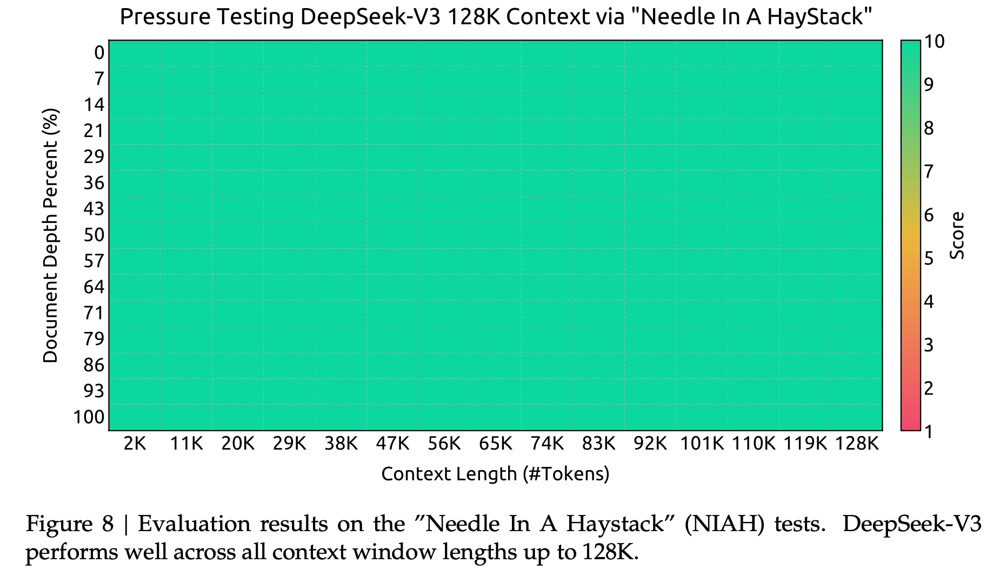

## 4.4 Evaluation

- 데이터셋

  - English, MultiLingual, Math, Code위주의 benchmark

- 정량적 결과 (vs. OpenSource Models)

  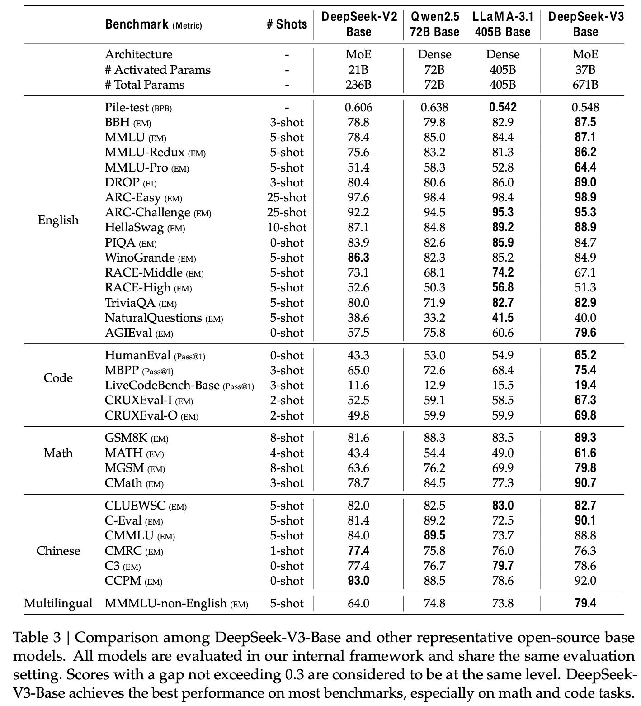

- Ablation study

  - With / WIthout MTP

    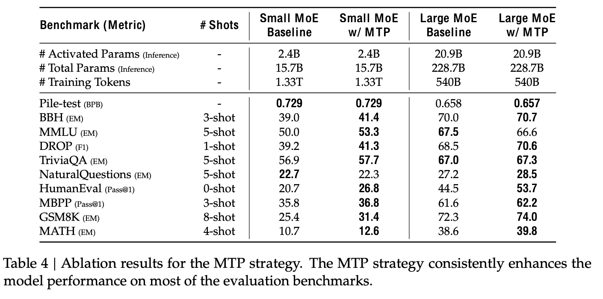

  - With / Without Auxiliary-Loss-Free Balancing

    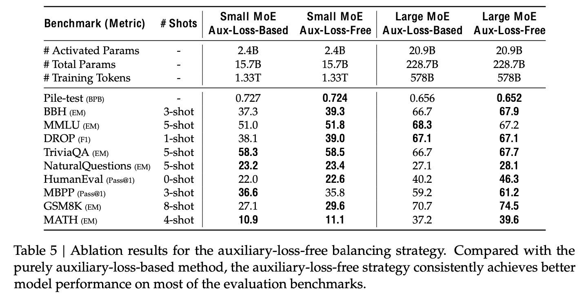

- Batch-wise Load Balance vs. Sequence-wise Load Balance

  - 결론: Batch-wise Load Balance (Auxiliary-loss-free) 가 더 좋다.

    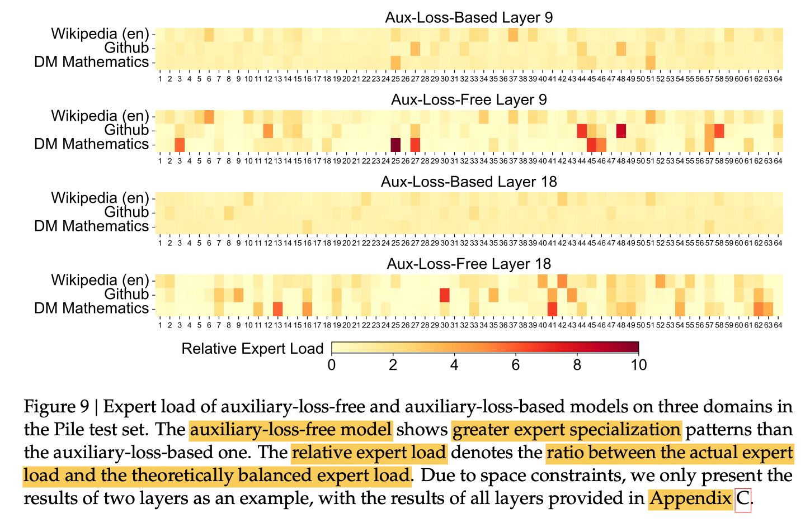

    

# 5. Post-Training

## 5.1 Supervised Finetuning

- Reasoning Data
  - 수학, 코딩 대회, Logic 퍼즐 등으로 구성된 데이터셋
  - 데이터 획득 방법
    - DeepSeek-R1을 모방한 domain specific expert를 Reinforcement Learning으로 학습
      - Reflection & Verfication을 수행하게 하는 system prompt를 도입하여 RL로 학습
      - <problem, original response>와 <system prompt, problem, original response>간의 RL training으로 학습
      - Rejection Sampling을 통해 코품질 (CoT용) 데이터셋을 생성
- Non-Reasoning Data
  - DeepSeek-V2.5를 통해 creative writing, role-play, simple QA를 생성하고, human annotator에게 검토시켜 학습용 데이터셋 취득
- SFT Settings
  - 2-epoch 학습

## 5.2 Reinforcement Learning

### Reward Model

- Rule-based Reward Model을 활용
  - LeetCode의 test-code를 활용
  - Math의 정답이 box 내에 위치해야함을 활용
- Model-based Reward Model을 활용
  - Preference data를 취득하여 학습
  - DeepSeek-V3 SFT checkpoint로부터 시작
  - CoT도 포함되도록 함

### Group Relative Policy Optimization

- InterVL-2.5-DPO와 동일

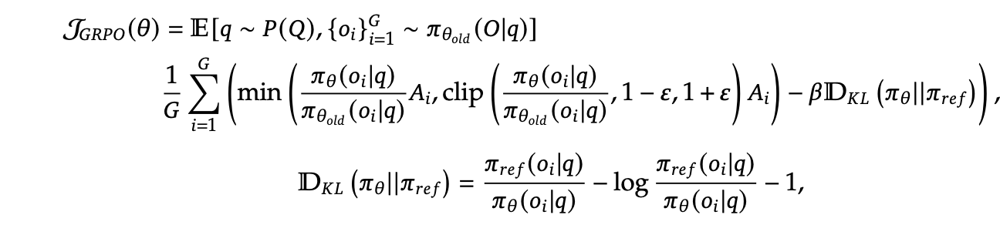

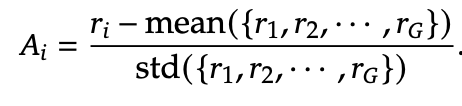

## 5.3 Evaluations

- 정량적 결과 (vs. SOTA)

  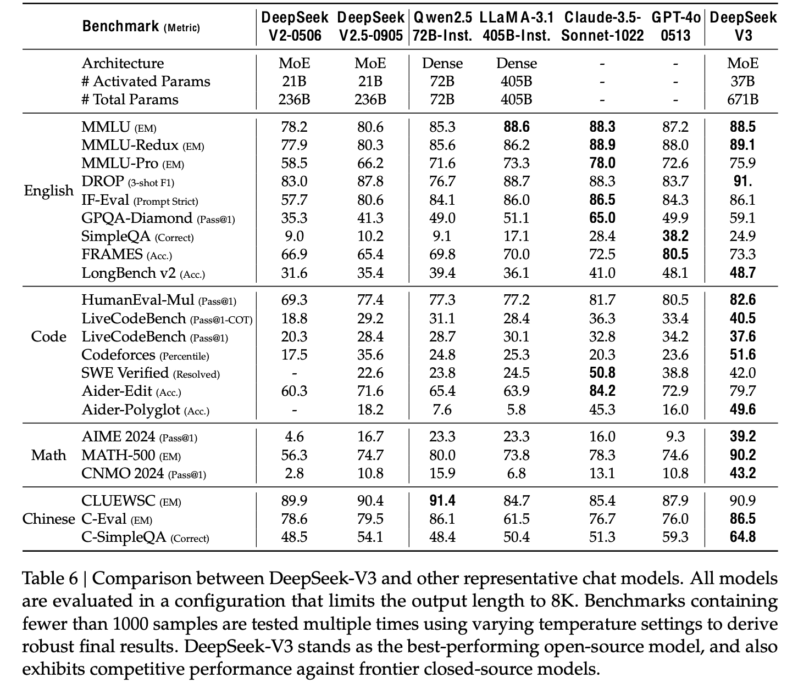

- English Open-ended conversation 결과

  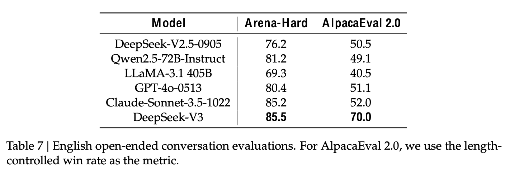

- LLM as a judge 능력 결과 (Generative Reward Model)

  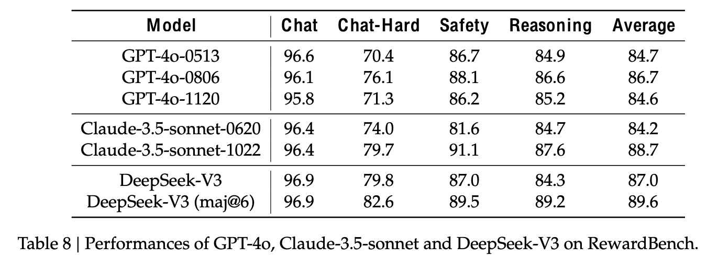

- DeepSeek R1의 Distillaition 훈련 결과

  - Baseline: DeepSeek-V2.5를 기반으로 Short CoT 학습

  - Distill: DeepSeek-V2.5를 기반으로 위에 설명한 expert model이 생성한 distillation data로 학습

    $\to$ distillation data가 매우 효과적임을 입증

  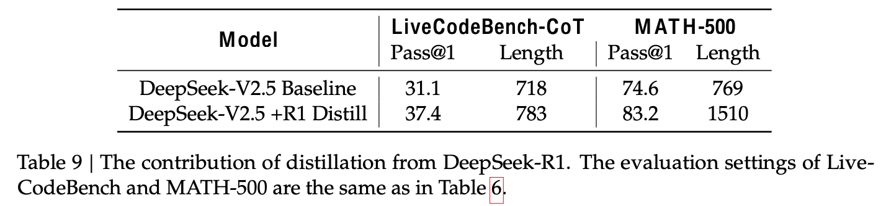

### Multi-Token Prediction Evaluation

- Next 2 token예측 + Speculative Decoding 도입 $\to$ decoding 속도 1.8배 향상
