- paper: https://arxiv.org/pdf/2501.12948
- github: https://github.com/deepseek-ai/DeepSeek-R1
- archived (인용수: 4회, '25-02-03 기준)
- downstream task: VQA

# 1. Introduction

- LLM의   "reasoning ability"를 향상시키기 위해 pure한 Reinforcement Learning (RL)방법을 도입해봄 $\to$ <u>DeepSeek-R1-Zero</u>

  - Baseline: DeepSeek-V3
  - RL framework: **GRPO** $\to$ InternVL-2.5-DPO에서 소개한 방법

- 가독성과 언어 혼합을 줄이기 위해 초기에 SFT용 소량의 cold-start-data를 두고, multi-stage-training을 도입해봄 $\to$ <u>DeepSeek-R1</u>

  Step 1. SFT: DeepSeek-V3-Base를 CoT Label로 SFT training

  Step 2. RL: GRPO로 step 1에서 학습한 모델을 추가 학습

  Step 3. SFT2: step 2에서 학습한 모델 (RL checkpoint) 출력을 rejection sampling한 data (new SFT data) + Step 1 SFT data로 DeepSeek-V3-Base를 재학습

  Step 4. RL2: step 3에서 학습한 모델을 GRPO로 추가 학습 (DeepSeek-R1)

  Step 5. Distillation: Qwen2.5-32B를 step 4 모델로 data distillation으로 학습 (Qwen2.5-32B를 direct RL보다 성능이 우수)

## 1.1 Contributions

### Post-Training

- SFT 없이 pure RL만 가지고 CoT를 추론하도록 학습 했을 때, self-verification, reflection, long CoT를 생산하는 능력이 생김을 보인 최초의 opensource 모델
- DeepSeek-R1을 학습하기 위한 2개의 RL과 2개의 SFT로 구성된 pipeline을 제안함

### Distillation

- Small model (ex. Qwen2.5-32B)에서 direct RL보다 DeepSeek-R1을 distillation한게 우수한 reasoning pattern을 보임을 확인
- DeepSeek-R1의 reasoning data를 가지고 학습한 모델 (distilled model)이 SOTA를 보임

## 1.2 Summary of Evaluation Results

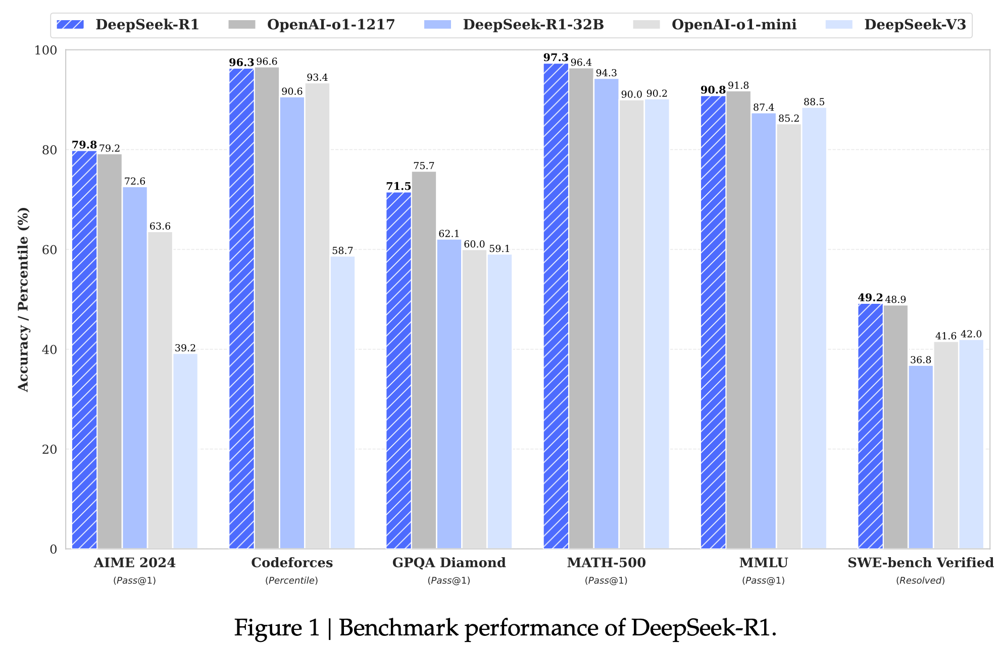

- Reasoning Tasks
  - AIME 2024: 미국 올림피아드 수학 경시대회 2차 예선 시험. (pass@1: 79.8)
  - MATH-500: OpenAI에서 개발한 CoT기반의 500개의 수학문제 (97.3%)
  - Codeforces: 프로그래밍 플랫폼에서 코딩 능력을 경쟁자와 상대적 점수화해 산출(Elo). 1,500점을 기준으로 시작 (2,029점 $\to$ 96.3%로 human을 능가)
  - SWE-bench Verified: OpenAI에서 개발한 python기반 github 저장소에서 수집된 2,294개의 issue-pull list. 주어진 code-base와 이슈 설명을 기반으로 해당 문제를 해결하는 코드를 짜고, unit test를 통과해야 하는 <u>software engineering test</u> (resolved: 49.2)
- Knowledge
  - MMLU(Massive Multitask Language Understanding): 총 57개의 주제에 걸쳐 15,908개 문제로 구성된 고등학교~대학원 수준의 STEM(과학, 기술, 공학, 수학), 인문학, 사회과학, 기타 전문지식으로 구성된 4지선다형 문제 (90.8)
  - GPQA(Google-Proof Question Answering) Diamond: 고급 과학 분야 (박사급 생물학, 물리학, 화학) 전문가들이 작성한 448개의 객관식 질문으로 구성. "구글 방지" 특성을 지녀, 비전문가는 30분을 주더라도 34%밖에 못맞힘. (71.5)

- Others
  - 창의적 글쓰기, general QA, editing, summarization 에서도 잘함
    - AlpacaEval 2.0 : GPT-4 Turbo에 비해 얼마나 좋은 instruction following 능력을 따르는지 측정

# 2. Approach

## 2.1 DeepSeek-R1-Zero

- Supervised data 없이 순수하게 Reinforcement Learning 만으로 학습 (Label-free)

- Group Relative Policy Optimization (GRPO) 기반으로 학습

  - critic model: group score를 기준으로 old policy model을 평가하는 모델. policy model과 동일한 사이즈
  - policy model($\pi_{\theta}$): optimized되는 모델. DeepSeek-V3-Base를 pretrained model로 활용
    - $\{o_i\}_{i=1}^G$: G개의 policy model output. 
  - $\{r_i\}_{i=1}^G$ Reward: 모델의 출력한 값이 조건을 충족하면 1, 아니면 0 생성하는 학습 signal

  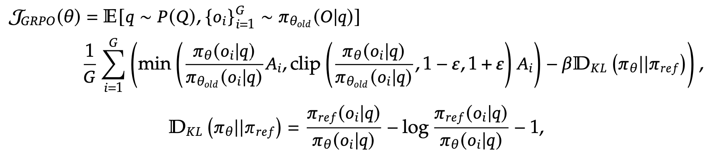

  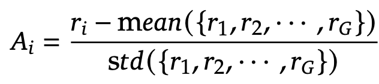

  

### Reward Modeling

- Reward: 모델의 출력한 값이 조건을 충족하면 1, 아니면 0 생성하는 학습 signal

- Rule-based reward modeling을 수행

  - Accuracy reward

    - Math problem: 특정 포맷에 정답이 분포하는지 여부로 reward를 측정 (ex. box 내부)
    - Coding problem: compiler의 test case를 기준으로 feedback (ex. LeetCode compile)

  - Format reward

    - CoT의 'thinking process'가 $<think><\think>$ 내부에 위치하는지를 기준으로 reward를 측정

    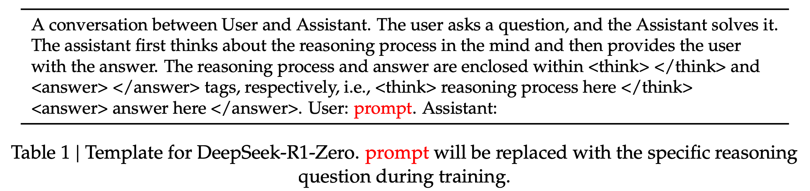

- Neural Reward Model에 대해서

  - 사용하지 않은 이유: 
    - Reward Hacking 발생: 중간에 Reward모델의 reward 패턴을 generator가 학습하여, reward를 잘 받게 학습되는 경향 
    - 추가 학습 비용: reward 모델을 학습하기 위해 추가 학습 cost가 발생함

### Performance, Self-evolution Process and Aha Moment of DeepSeek-R1-Zero

- Training Log

  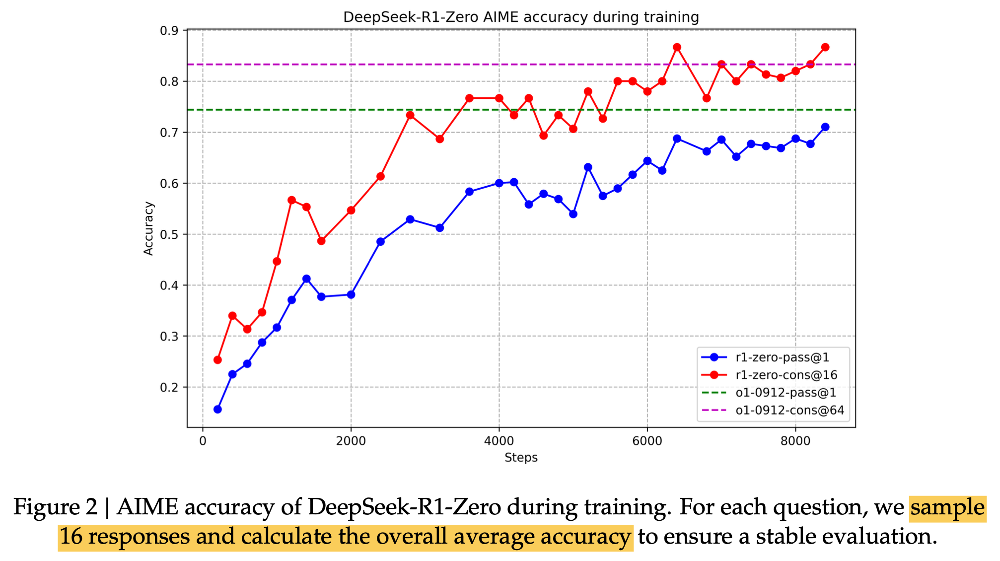

- CoT length check

  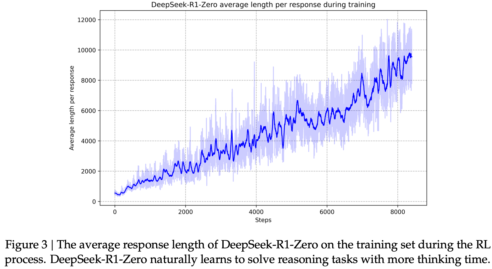

  - pure RL로 학습이 진행될수록, CoT가 더 복잡한 thinking output을 내뱉음 $\to$ Self-evolving의 증거

- Aha Moment

  - Reflection: 자신의 결과를 복기하는 능력

    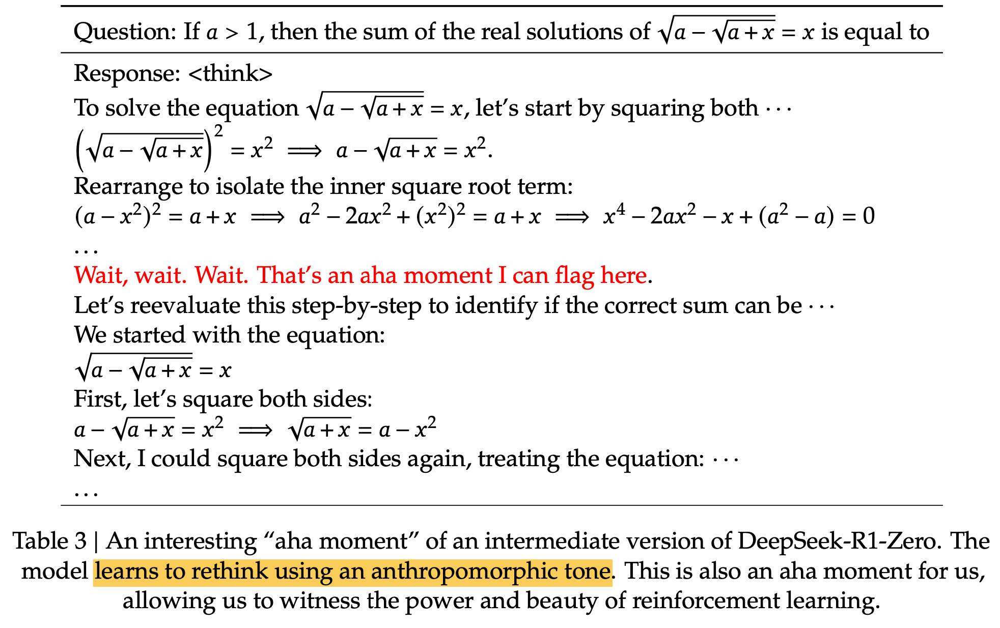

- 정량적 결과

  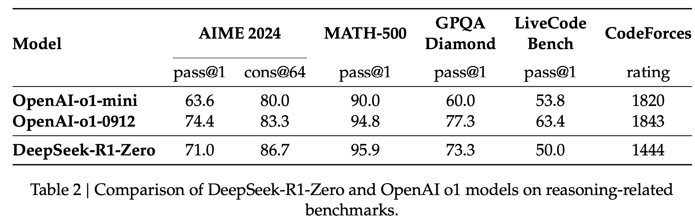

  - cons@64: Majority voting으로 성능 향상 (Ensemble)

## 2.2 DeepSeek-R1: Reinforcement Learning with Cold Start

- 목적: 아래 두 가지 달성을 위해 Cold-Start data를 학습 pipeline에 추가
  1. DeepSeek-R1-Zero의 reasoning performance 향상
  2. user-friendly Chain-of-Thought(CoT)를 생산
     - Readability 향상
       - Mix multiple language 해결
       - 요약을 추가한 형태
       - ||special token| | <reasoning_process> | |special_token| 
 형태
     - 성능 향상

### Cold Start

- Few-shot prompting으로 long CoT를 DeepSeek-R1-Zero를 활용하여 detailed answer를 생성
- Human Annotator를 통해 post-processing (readable format)
- DeepSeek-V3-Base를 기반으로 학습 수행

### Reasoning Oriented Reinforcement Learning

- Coding, Math, Science, Logic reasoning 등 reasoning-oriented RL training 수행
- Langauge Mixing 방지를 위해 "language consistency reward"를 부여

### Rejection Sampling & SFT

- 다른 domain data (ex. writing, role-playing, other general-purpose tasks) 를 추가

  - Reasoning data

    - RL training된 checkpoint가 생성한 sample 중 rule-based로 rejection sampling수행하여 학습 데이터 취득

    - RL training된 모델을 judgement로 활용하여 학습 데이터 취득

      $\to$ 600K reasoning data 취득

  - Non-Reasoning data

    - DeepSeek-V3 학습할때 사용한 pipeline 활용

### Reinforcment Learning for all Scenarios

- Reasoning data는 rule-based reward를 적용
- Non-reasoning data는 reward-model를 활용해서 human preference를 catch하도록 reward를 생성
  - Helpfulness: "summary"에 집중하여 judge하도록 함
  - Harmlessness: harmful content가 있는지 위주로 judge하도록 함

## 2.3 Distillation: Empower Small Models with Reasoning Capability

- Baseline Models: LLaMa-3.1-8B, Qwen2.5-32B, LLama-3.3-70B-Instruct
- Dataset: DeepSeek-R1로 생성한 800K curated dataset
- Training pipeline: SFT만 가지고 학습 (No RL training)

# 3. Experiments

- temperature: 0.6 / top-*p*: 0.95 / *k*번의 response를 계산하여 평균한 값을 활용

  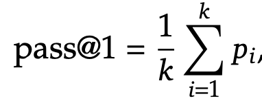

- DeepSeek-R1 정량적 결과

  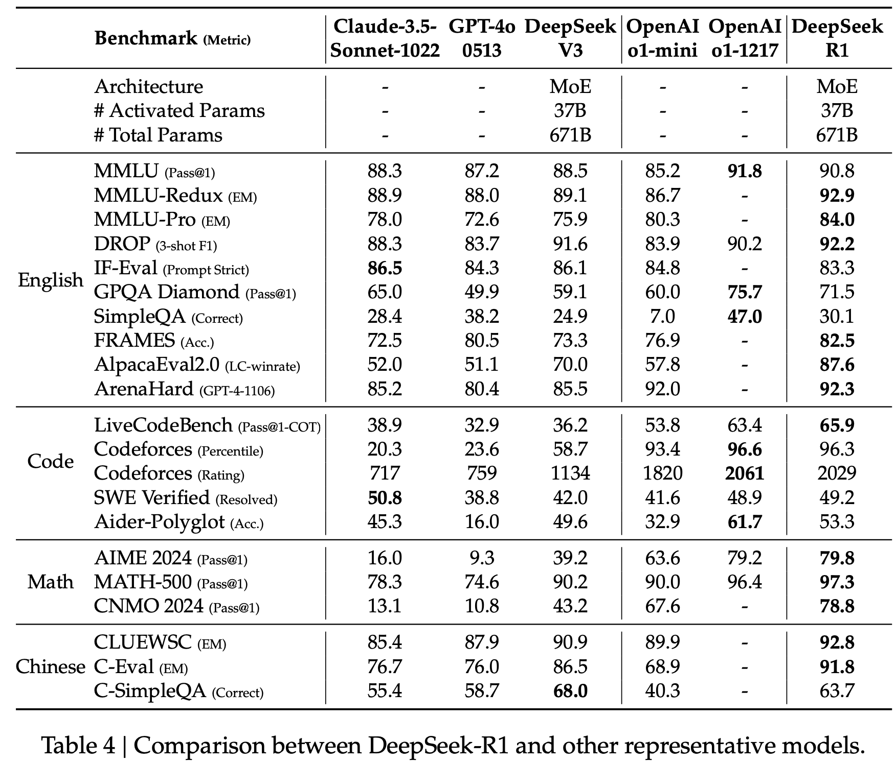

- Distilled Model 정량적 결과

  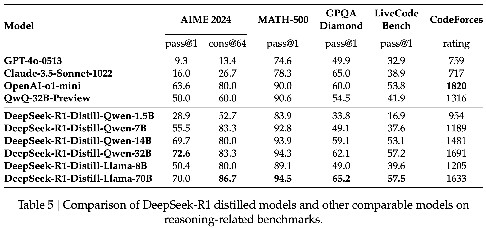

- Ablation Study

  - Distilled model vs. RL model

    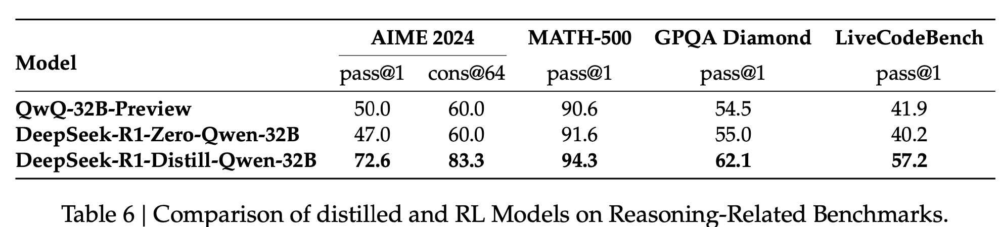

    - Insight: 향후 레이아웃 생성 모델 개발할 때도, 매우 큰 (ex. 671B) 모델을 학습시키고, 그 결과를 가지고 distillation하는 것도 좋은 연구 방향으로 보임

### Unsucessful Attempts

- Process Reward Model (PRM)
  - 한계
    1. fine-grained step을  general reasoning시에 explicitly 정의하기 어려움
    2. 중간 intermediate step이 correct/wrong을 따지기 어려움
    3. reward hacking이 발생해 역효과 & 방지를 위해 재학습하는데 학습 비용 발생
- Monte Carlo Tree Search (MCTS)
  - Alpha-Go에서 영감을 얻은 방법
  - 문제를 여러개로 쪼개어 actor / value model을 동시 학습
  - 바둑과 달리 real QA는 가짓수가 무한히 많고, search-space가 "well-defined"되지 않는 문제가 있어 maximum extension limit을 넘기기 일쑤.