# [Retrieval] RECO: RETRIEVAL-ENHANCED CONTRASTIVE VISION-TEXT MODELS

- paper: https://arxiv.org/pdf/2306.07196
- github: X
- ICLR 2024 accepted (인용수: 23회, '25-02-13 기준)
- downstream task: (Fine-grained) Classification, T2I, I2T Retrieval

# 1. Motivation

- CLIP과 같이 대용량의 Web-crawled dataset을 기반 contrastive learning으로 학습한 Vision Language Model의 경우 "fine-grained entities"를 인식하는데 어려움이 있다.

  - Fine-grained entities: "Yellow bellied flycatcher", "2012 Tesla Model S"
  - Coarse entities: "Bird", "Car"

- Model의 parameter에 Fine-grained한 정보를 주입하여 암기하게 하지 말고, 외부 정보를 활용 (Retrieval-Augmented)하는 방법을 사용해보자.

  $\to$ Frozen CLIP 모델과 external memory를 활용하여 "fine-grained"한 정보를 검색하는 대안책을 제시한다.

# 2. Contribution

- Image와 Text representation간의 정렬을 enhance하는 **r**etrieval-**e**nhanced **co**ntrastive (RECO) 방식을 제안함.

  - Light-weight, single transformer layer를 활용해 기존 representation embedding을 retireved information으로 enhance시킴

  - 가설을 실험적으로 검증하고,  **uni-modal retrieval / cross-modal fusion** 방식 도입.

    - 가설1. 다른 modality간에 alignment보다, 같은 modality간의 alignment가 잘 된다.
    - 가설2. 다른 modality간의 fusion (cross-attention)하는 것이 상호보완적인 정보를 추출하는데 유리하다.

    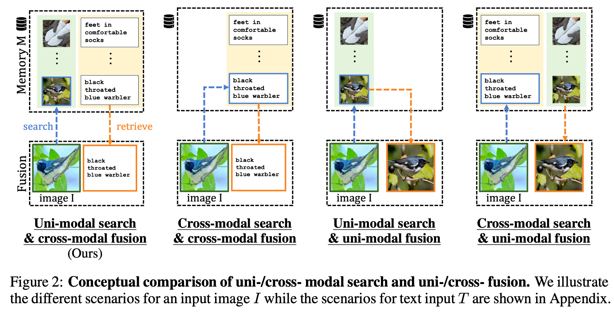

- Frozen-CLIP의 성능을 여러 fine-grained benchmark에서 향상시킴

  - Stanford Cars: +10.9
  - CUB-2011: +10.2
  - OVEN: +7.3

# 3. RECO

- Overview

  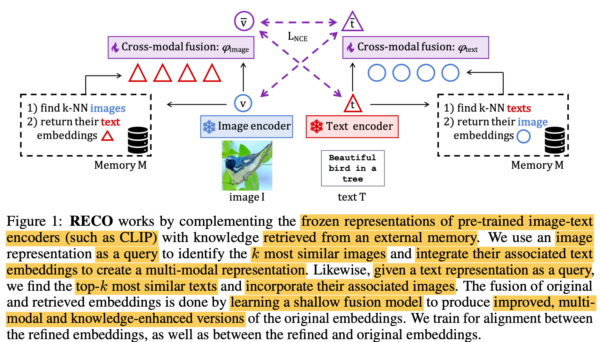

  - $\bar{v}$: RECO를 이용해 enhanced된 visual representation
  - $\bar{t}$: RECO를 이용해 enhanced된 textual representation
  - $v$: original visual representation
  - $t$: original textual representation
  - $\phi_{text}$: text fusion module
  - $\phi_{image}$: visual fusion module
  - $M$: Database
  - Image/Text encoder: text/image가 aligned된 모델. 본 논문은 CLIP 활용

  

  ## 3.1 Retrieving Cross-Modal External Knowledge

  - Memory

    - 메모리 내에서 query text (query image)와 가장 유사한 top-k개의 text (image) embedding을 nearest neightbor search 수행.

      - $KNN(\bold{v}, M), KNN(\bold{t}, M)$
      
    - 매우 크고 다양한 concept을 cover하고 있다고 가정 (데이터가 클수록 성능이 좋아짐)
  
      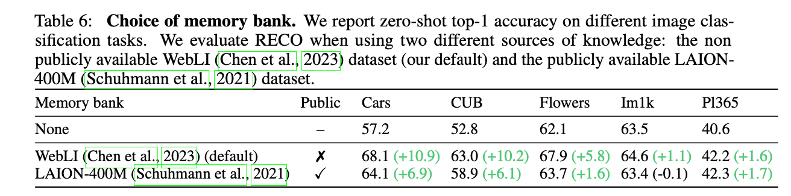
  
  - Uni-Modal search
  
    - 가설: Cross-modal 간의 유사도 정렬은 (상대적으로) uni-modal 간의 유사도 정렬이 안되어 있을 것이다.
  
    - Text는 text끼리 유사도 비교($t \to t$) 하고, vice-versa ($v \to v$)
  
      - $KNN_t^{v \to v}(\bold{v}, M)=\bold{T}^M_{NN(\bold{v}, \bold{V}^M)}$
      - $KNN_v^{t \to t}(\bold{t}, M)=\bold{V}^M_{NN(\bold{t}, \bold{T}^M)}$
  
    - 실험적으로 Uni-modal search가 좋음을 확인
  
      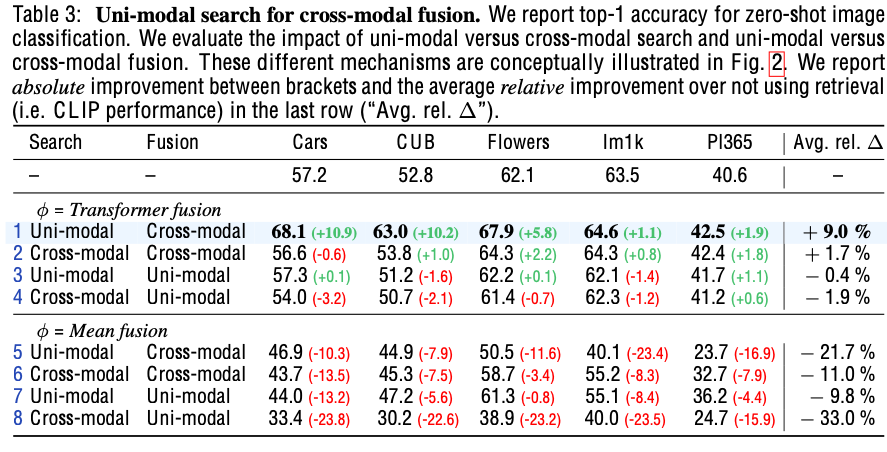
  
  - Cross-Modal Fusion
  
    - 서로 다른 modality로부터 complemantary한 knowledge를 fusion하는게 성능에 좋음을 확인
  
      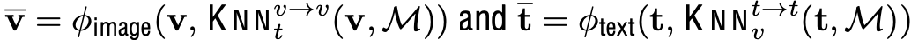
  
    - Fusion model ($\phi_{image}, \phi_{text}$)는 "학습"하는 방식이 "비학습" 방식보다 나음을 확인
  
    - 하나의 Multi-Head Self Attention (MHSA) transformer layer로 구현 $\to$ 3.16M parameters
  
      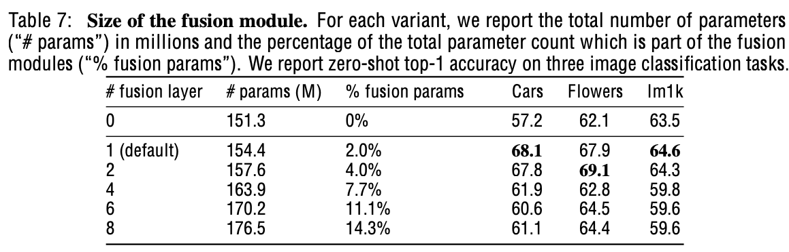
  
  - Learning 
  
    - Fusion module만 학습
  
      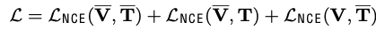
  
      - 특정 task에 따라 Text enhaced, Image enhaced embedding을 선택적으로 사용하지 않아도 됨
  
    - 학습 중에도 dataset *D*에서 retrieved-enhanced 하여 embedding을 학습
  
    - Fusion module만 학습 vs. Full-finetuning
  
      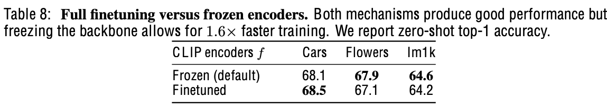
  
      - 성능은 비슷하고, 학습 속도가 x1.6배 향상

# 4. Experiments

- Training dataset

  - 구글 자체 미공개 dataset 을 사용 (Webli) 

- Memory dataset

  - Webli의 1B subset을 사용

- 정량적 결과

  - Zero-shot Image classification 

    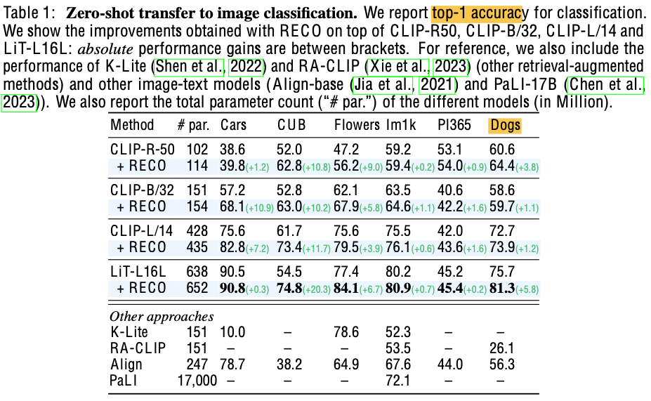

  - Open-domain visual entiy recognition (OVEN): 학습 시에 모델이 보지 못한 class를 예측

    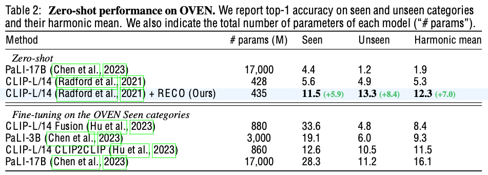

- 정성적 결과

  - T2I, I2T Retrieval

  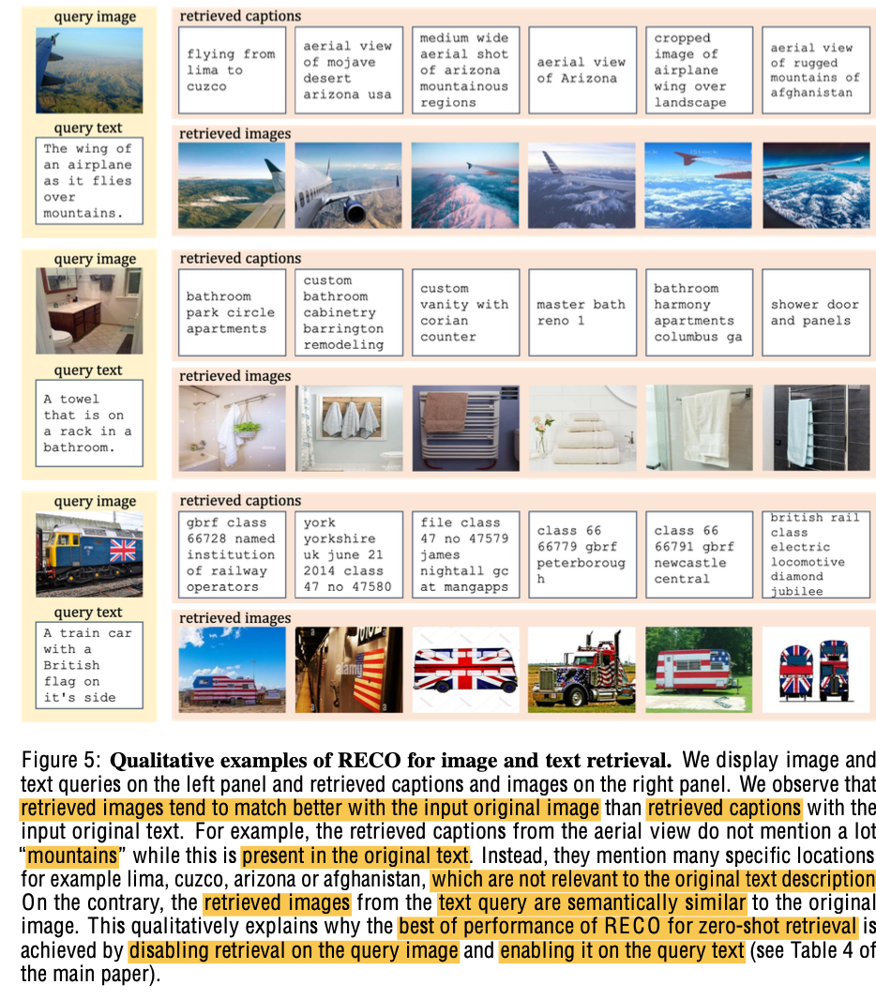

- Image classification

  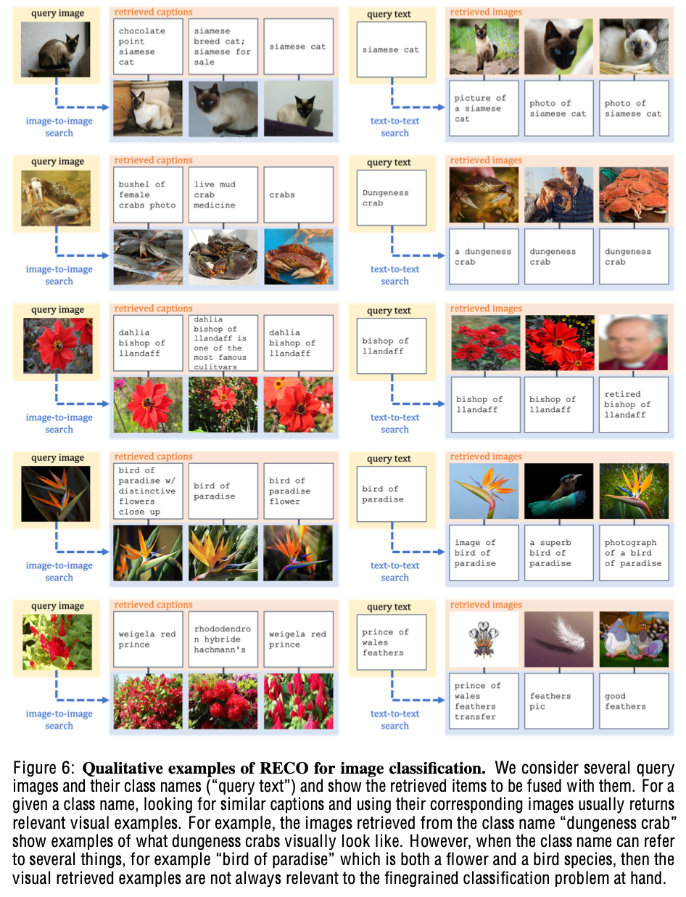

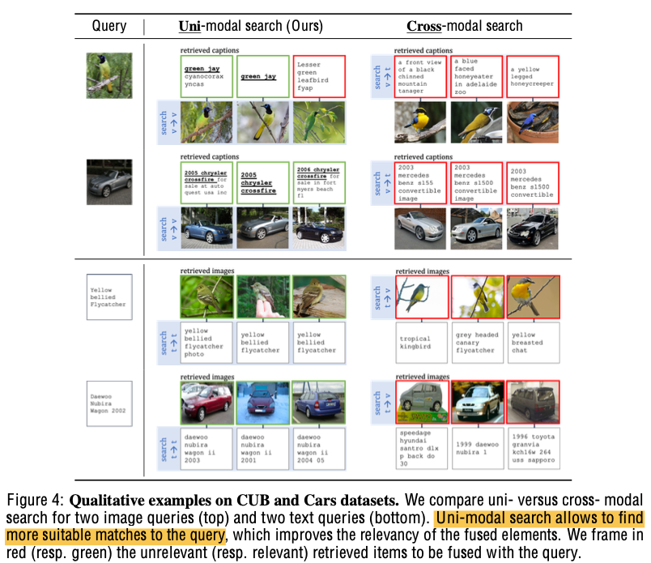

- Ablation Study

  - fusion module 유/무별 성능

    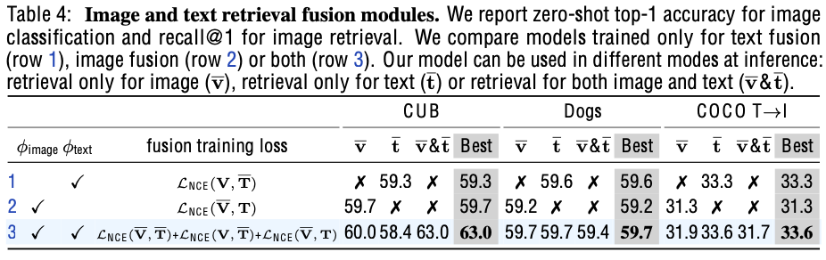

    - Task별로 Image, Text 전부를 enhance하는게 제일 좋지 않을 수 있음

      - Image classification: Image caption이 상대적으로 정형화 되어 있으므로, hallucination 우려가 적음

      - T2I Retrieval: 유사한 Text 문장에 표현하는 배경이 hallunication의 우려가 있음

        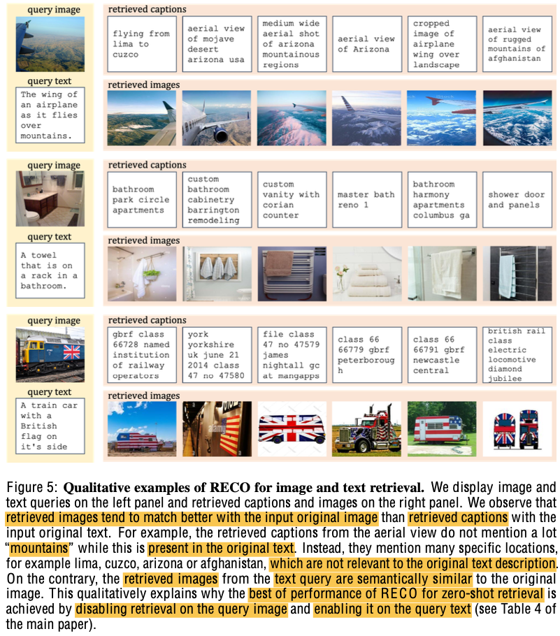

  - Parameter가 많아져서 성능 향상된건 아닌지 체크

    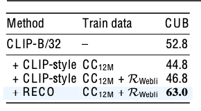

    - 동일 크기의 MLP 방식을 추가하여 학습한 방식보다 제안한 방식이 유용함을 보임

  - 학습 후 memory를 업데이트 했을때 성능 향상되는지 체크

    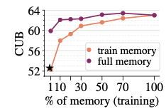

    - 학습시 사용한 DB랑 retrieved DB가 변경되더라도 성능에 향상을 보임

  - Retrieved sample 수에 따른 성능

    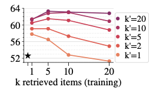