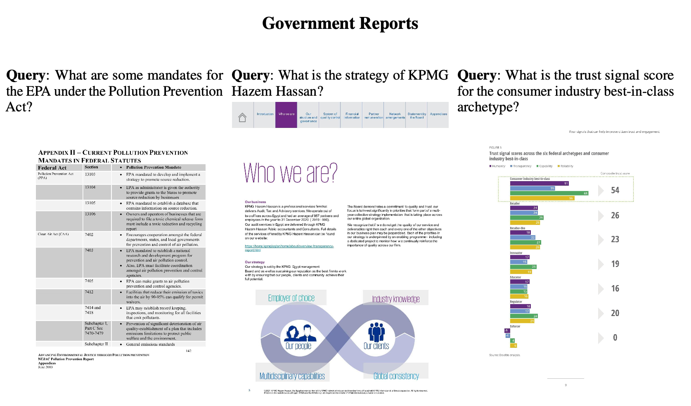
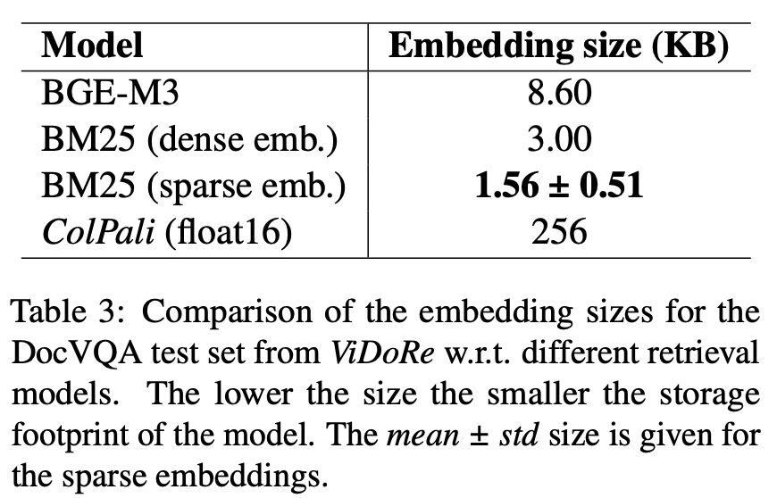

# [Retrieval] ColPali: Efficient Document Retrieval with Vision Language Models

- paper: https://arxiv.org/pdf/2407.01449
- github: https://github.com/illuin-tech/colpali
- huggingface: https://huggingface.co/vidore
- ICLR 2025 accepted (인용수: 17회, '25-02-15 기준)
- downstream task: (Visual-rich) Document Retrieval

# 1. Motivation

- 기존의 Document Retrieval task은 text-centric, text-only 검색만 다루고 있었음.

- 하지만, visually rich한 document (ex. 논문, report) 특성상 visual한 특성을 반영한 retrieval system이 필요로 함

  $\to$ Document의 visual한 특성도 고려한 Document retrieval benchmark과 baseline을 제안해보자!

# 2. Contribution

- **ViDoRe**
  - 기존의 text-centric system의 문제점을 지적함
  - 다양한 도메인과 언어 (영어, 프랑스어)로 구성된 Page-level document retrieval용 benchmark인 ViDoRe(**Vi**sual **Do**cument **Re**treival) 를 제안함
- **ColPali**
  - (Pali) VLM기반으로 document의 visual feature만 (purely)으로 retrieval하는 novel training 전략을 제안함. 
  -  (Col) Late interaction 기반으로 빠른 query matching을 제안함.
  - 제안한 benchmark에서 SOTA를 보임

# 3. ColPali

## 3.1 Problem Formulation

- Document retrieval := page-level retireval
- 목적: 산업계에서 실용적인 검색 시스템 (RAG)
  - R1: retrieval performance
  - R2: low latency: online querying phase에서 latency constraint 고려
  - R3: high throughput: indexation 수행 시 접근성이 빨라야함

## 3.2 Benchmark Design

- 다양한 orthogonal subtask & modalities 로 구성시킴

  - subtasks: medical, business, administrative, languages (English, French)

    - Academic tasks

      - 기존의 VQA benchmark의 triplet쌍 (question-page-answer)을 retrieval로 활용
        - question $\to$ query text
        - page (image) $\to$ golden answer

    - Practical Tasks

      - Industry에 실용적인 예시로 구성하기 위해 webcrawler + GPT Turbo 3.5를 활용해서 주제당 1,000 question queries로 bencmark를 구성 $\to$ 이중, Human Labeler가 전체 맥락이 page와 유사한 100개의 query를 선별

        

        

        

        

        

        - Web-Crawler

          - uer-defined query (ex. "Artifical Intelligence")를 GPT-3.5 Turbo로 brainstorming하여 유사 subject를 생성 $\to$ search topic을 broaden + deepen하는 효과

          - SerpAPI + filetype filter를 활용해 Google search engine에다가 해당 query를 가지고, worker들은 Web에서 연관된 document pdf를 탐색

            

          - 중복된 document search 방지를 위해 Bloom filter(?)를 활용해 SQLite database에 적재

        - Datamix

          - 각 주제별로 private infomation 포함되거나, visually rich하지 않으면 filtering하여 1,000개의 document를 선별

        - Query Generation

          - Claud Sonet을 활용해서 이미지당 3개의 question을 다음 prompt로 생성

            

        - Human Validation: Document와 무관한 질문을 filtering하도록 지시. Topic당 100개의 queries가 최종 남게됨

  - modalities: text, figures, infographics, tables, etc

    

- Evaluation Metrics: Document Retrieval에서 전형적으로 사용하는 metrics 사용

  - Recall@K
  - MRR
  - NDCG $\to$ 이걸 기준으로 Report

## 3.3 Assessing Current Systems

- **Unstructured** off-the-shelf tool를 활용해서 비정형 데이터를 정형화 (link: https://unstructured.io)

  

  - Deep Learning Vision model를 활용하여 Document Layout, titles를 검출
  - Chunking-strategy를 선택하면, "의미적으로 그룹"을 하여 text를 쪼갬
    - ex. *text-only*: text외에 visual element (figures, images, tables, etc)는 noise label로 간주하여 무시

- **Unstructured + X**: 

  - OCR-engine까지 활용하여 tables, charts, images의 text를 추출 
  - 해당 element 단위로 chunk
  - Claud-3 Sonet를 활용해 caption을 생성 (fully-fledged captioning strategy)

- **Embedding model**

  - Text encoder 중 SOTA인 BGE-M3를 활용 $\to$ 검토 필요
  - Chunk 단위로 max-pooling한 값을 page-level similarity score로 활용

- **Contrastive VLMs**

  - CLIP계열을 활용

- **Results**

  

  - Text Embedding 성능은 실제 Retrieval에 큰 영향이 없음 (BGE-M3 vs. BM25) $\to$ Text embedding 모델보다 chunking 등 text chunking전략이 중요하구나 (Unstructured로 text를 묶는 작업)

  - R1: Unstructured + X가 제일 좋음 

  - R2: 기존 PDF parsing 방식은 lengthy함 (특히 +OCR, +Captioning이.)

    

  $\to$ PDF parsing (PDF throughput)의 시간이 너무 오래걸려 비실용적임.

## 3.4 Late Interaction based Vision Retrieval

- Architecture

  

  - Baseline: Paligemma-3B

    - Projection dimension: 128

  - Late Interaction

    

    - **E**$_q$: query embedding $\in \mathbb{R}^{N_q \times D}$
    - **E**$_d$: document embedding $\in \mathbb{R}^{N_d \times D}$

  - Contrastive Loss

    - In-batch contrastive loss로 구성 (maximum negative + positive)

      

      

  - Dataset

    - 127,460 query+document 데이터셋 
      - Academic (63%) + synthetic (37%)로 학습
      - 단장의 document으로만 구성
      - 2%는 validation set

  - Parameters

    - projection layer는 random initialize
    - 16-bit 학습
    - LoRa로 학습 $\alpha=32, r=32$

  - Query augmentation

    - 5개의 unused token을 할당하여 query augmentation

# 4. Experiments

- R1: Performance

  

  - SigLIP: WebLI로 학습된 pretrained Sigmoid CLIP

  - BiSigLIP: SigLIP의 text encoder를 ViDoRe로 finetuning한 SigLIP

  -  BiPali: SigLIP의 image patch embedding을 LLM에 태우고 average pooling한 Dense vector로 retrieval하는 모델. ViDoRe로 finetuning

    - English에서는 BiSigLIP에 비해 성능이 하락 $\to$ NTP로 학습한 데이터가 ViDoRe보다 5배 많았음. 
    - French에서는 성능이 증가함 $\to$ LLM의 multi-lingual 때문으로 사료됨

  - ColPali: text token과 image patch 간의 interaction 덕분에 성능이 좋아짐.

    - 반면, ColSigLIP은 성능이 망가짐

      - 이는 SigLIP 특성상, patch embedding이 아닌, pooled token만 가지고 contrastive pretraining을 했기 때문으로 사료됨	

        

  - R2: Latencies & Memory Footprint

    - BGE-M3: embedding 추출 시 15ms
    - ColPai: 
      - embedding 추출 시 30ms
      - late interaction : 1ms
      - similarity score 계산 시 < 1ms

  - R3: Offline indexing

    - BGE-M3는 text embedding 단위가 chunk이므로, chunking하는 시간이 매우 오래 걸림 (layout detection, ocr, captioning)

    - ColPali는 image로부터 직접 encode를 하므로 추가 공수 X

  - (R4): Memory

    - 기존 text보다는 memory 비용이 많으 듦

      

  - Ablation study

    - Interpretability

      - query에 가장 연관된 image patch를 알 수 있음

        

        

    - Increasing Patch token vs. Model size

      - 결론: 둘다 중요

      

      - 3B + 1024 token $\to$ 3B+ 512 token: 30% 성능 하락

      - 3B + 1024 token $\to$ 8B + 62 token : 5% 성능 하락

      - Train Vision: Vision encoder까지 학습. 성능 향상 없음

      - No Mem. Tokens: Query augmentation이 English에서는 성능향상이 없었음. 하지만, French 에서는 성능향상이 있었음

        (Table 5 참고)

      - Ful IB Loss: In-batch내 negative를 전부 학습하는 것. hardest negative만 학습하는 것보다 미세한 (-2.4%) 성능 하락 있었음

      - TabF Tuning: 1.5K의 French document 추가 시, 성능이 향상