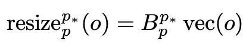
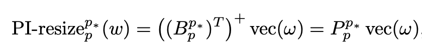

# [MM] **SigLIP 2**: Multilingual Vision-Language Encoders with Improved Semantic Understanding, Localization, and Dense Features

- paper: https://arxiv.org/pdf/2502.14786
- github: https://github.com/google-research/big_vision/blob/main/big_vision/configs/proj/image_text/README_siglip2.md
- hugging face: https://huggingface.co/collections/google/siglip2-67b5dcef38c175486e240107
- archived (인용수: 0회, '25-03-07 기준)
- downstream tasks: Zero-shot image classification, image-text retrieval, VQA, REC

# 1. Motivation

- 최근에 CLIP (SigLIP)기반 모델에 아래와 같은 다양한 VLM 성능 향상 논문들이 등장하였으나, single model에 통합된 사례가 없었음 $\to$ 통합해보자!

  - **captioning based pretraining**: image의 web-crawled noisy text말고, recaptioning한 text로 바꾸어 contrastive pretraining을 시도 (TIPS 논문)

    - TIPS: PaliGamma-3B로 recaptioning 수행.

      

  - **image-only self-supervised learning**: masked prediction (iBoT 논문) + self-distillation 기법 (SILC 논문)

    - iBoT

      

    - SILC

      

  - **online data curation**: Big batch (2*B)내에서 learnability scoring 값 기준으로 mini batch(B)용 sampling하는 방법 (ACID 논문)

    - ACID: Active Curation as Implicit Distillation

      

  - **auxiliary decoder**: SigLip 2 encoder뒤에 downstream task별 decoder를 두어 훈련시킴 (LocCa 논문)

    - LoCa

      

  - **support multiple resolutions & preserver native aspect ratio**: 이미지 원본 aspect ratio를 보존하며 (NaViT 논문) , 다양한 resolution으로 학습 (FlexViT 논문) $\to$ NaFlex variant

    - NaViT

      

      

    - FlexViT

      

    - **diverse data-mixture leads to improved multilingual & fairness**: 학습 데이터의 geo-localization과 (No-Filter 논문) 성별에 따른 bias를 debias하는 filter (Clip-the-Bias 논문)를 적용한 training pipeline 제안 

      - No-Filter

        - Webli 데이터 (90%) + geo-localization 고려한 데이터 (10%)로 학습

        

      - Clip-the-Bias

        - 특정 단어가 특정 성별에 bias된 걸 착안하여, paraphrased된 단어로 대체 (ex. machines $\to$ computer)

          

# 2. Contribution

- 다재다능한 Visual Encoder SigLiP2를 제안함

  

  - Strong Multi-Lingual 능력
  - Dense feature 이해
    - LocCa기반 head (ARef+GCap) + Semantic segmentation + Depth Estimation
  - Backward Compatibility
    - 기존에 SigLip, Clip 대체 가능
  - Native aspect ratio + 다양한 resolution 보존 가능
  - 작은 small model (thanks to distillation)

# 3. SigLip2

### 3.1 Training recipe

##### 3.1.1 Architecture, training data, environment

- Architecture
  - MAP head: SigLip은 CLS token이 없으므로 Mean Average Pooled 결과를 활용하여 Constrastive learning 수행
  - Tokenizer: Multilingual Gemma tokenizer 사용
    - vocab size: 256k (lower-case only)
- Training data
  - WebLI data: 10B image + 12B alt-texts (109 languages) 
    - 90%는 Engish web pages + 10%는 Non-english web pages로 구성
- Environment
  - 2048개의 TPUv5e chips $\to$ 32K batch size

##### 3.1.2 Training with Sigmoid loss & decoder

- Sigmoid loss + Auxiliary decoder의 loss를 동일하게 주어 학습

  - Sigmoid loss: Text / Image embedding간의 binary classification으로 positive/negative 학습

  - Auxiliary decoder: coordinate를 예측 (ARef) + 주어진 coordinate의 region caption 예측 (GCap)

    - coordinate는 Open-vocab. 논문을 참고해서 pseudo label 생성

      - Open-vocab. dectector (using n-grams) $\to$ 여기서는 fixed object categories 활용

        

        - OWL-ViT L/14

          

      - parallel decoding으로 50% 확률로 번갈아 학습 수행

        - parallel decoding은 mask token $\to$ caption token을 self-attention (no causal attention)으로 예측

        

##### 3.1.3 Training with self-distillation & masked prediction

- Local-to-Global consistency 기반 self-distillation 수행 (SILC 논문)

  - student: local view만 봄. SGD로 업데이트

  - teacher: 전체 view를 봄 (global). Teacher의 EMA로 업데이트

    $\to$  두 output이 동일하도록 학습

- Masked prediction기반 self-distillation 수행 (TIPS 논문)

  

  - student: 50%의 visual token을 봄 (50% masking)
  - teacher: 전체 visual token을 봄

$\to$ 해당 auxiliary loss는 학습 80%된 시점에서 추가함

### 3.2 Adaptation to different resolutions

##### 3.2.1 Fixed-resolution variant

- fixed-resolution의 variant를 얻기 위해, 전체 학습(NaFlex)의 95%된 checkpoint를 불러와 positional embedding을 target sequence length로 resize 수행 (FlexViT의 PI-resize 적용)

  

  

  

  

  

##### 3.2.2 Variable aspect and resolution (NaFlex) 

- 다양한 sequence length (FlexViT), aspect ratio (NaViT)를 다룰 수 있는 버전 (NaFlex)
- Document understanding, OCR, 등 다양한 task에 활용 가능한 장점이 있음

## 3.3 Distillation via active data curation

- Teacher (SigLIP2 So400m)모델로부터 data curation을 수행 (ACID)
  - Learnability를 teacher / student간의 loss 차이로 정의하여, learnability가 큰 sample만 가지고 mini-batch를 꾸림
  - 64K에서 optimal bach 32K를 매번 구성

# 4. Experiments

- Zero-shot classification

  

- Multimodal Retrieval (T2I, I2T)

  

- Document Retrieval + OCR (aspect ratio / resolution이 바뀌는 경우: NaFlex variant vs. Flixed variant)

  

  - resolution이 작은 경우 (small sequence length): NaFlex > Fixed 

    - HierText, Screen2Words, SciCap

    $\to$ aspect ratio distortion때문으로 사료됨

  - natural image인 경우: Fixed > NaFlex

    - ObjectNet, INet, COCO

    $\to$ 논쟁은 있으나, distillation step이 좋은 효과를 발휘했기 때문으로 보여짐

- VLM에 적용 (PaliGemma 2)

  

- Dense predictions

  - Semantic segmentation, Depth estimation, surface normal estimation

    

- Open vocabulary segmentation

  

- Open vocabulary detection

  

- Cultural Diversity

  

- Fairness

  