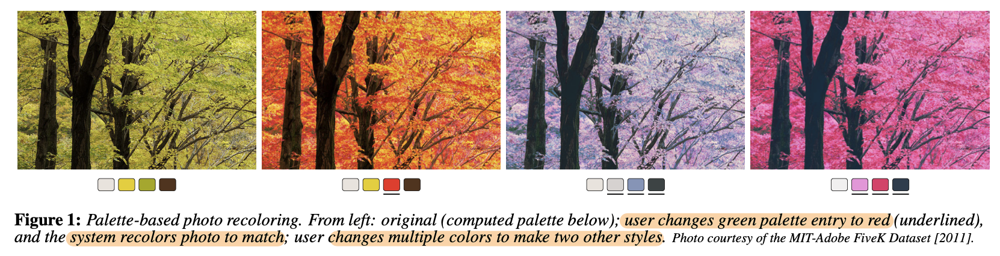
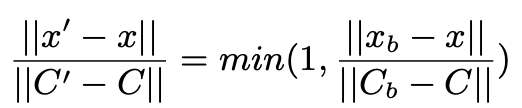
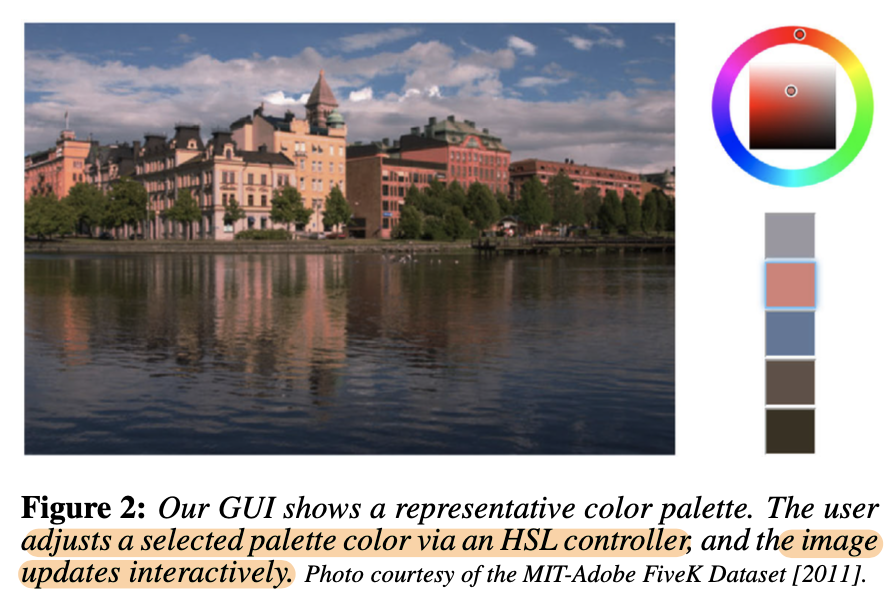
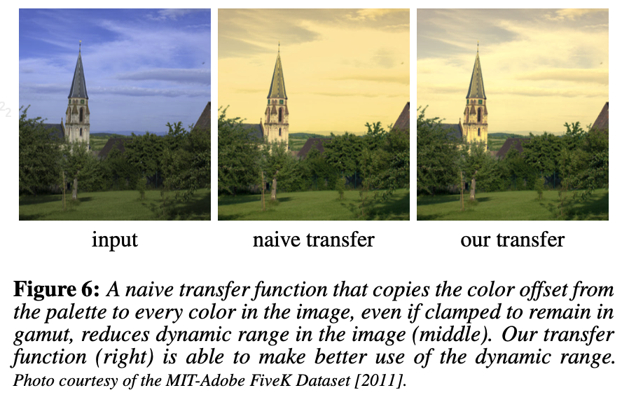
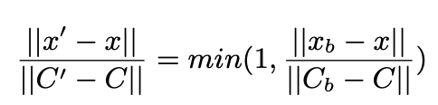
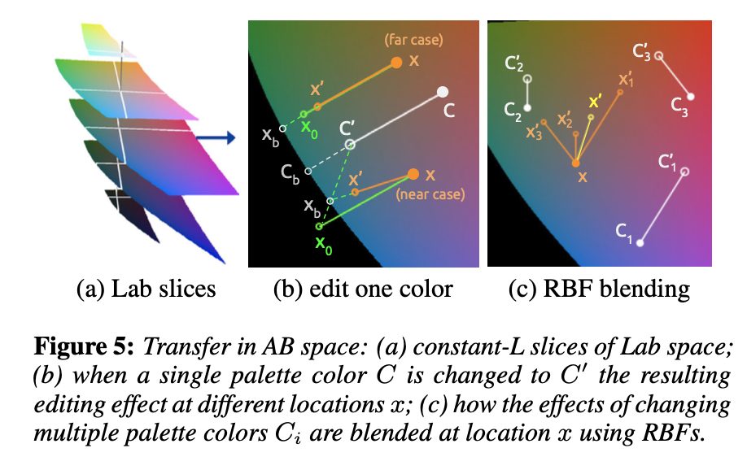
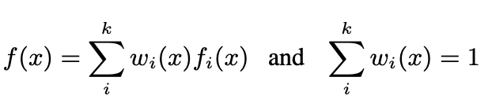
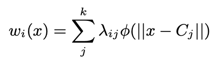
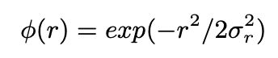

# [Design] Palette-based Color Recoloring

- paper: https://www.ohadf.com/papers/ChangFriedLiuDiVerdiFinkelstein_SIGGRAPH2015_small.pdf
- github: https://github.com/b-z/photo_recoloring
- ACM SIGGRAPH 2015 accepted (인용수: 306회, '25-03-26 기준)
- downstream task: color palette generation

# 1. Motivation

- 이미지 편집 app.를 이용할 때, 창의성을 탐험하는데 매우 중요한 것은 **interactive** 기능이다.

- 하지만 기존에 나온 non-expert용 (GMM기반, rule-based)은 해당 기능이 없거나, expert용 (Adobe, IPhoto)는 RGB space / LAB space에 대한 이해가 있어야 사용가능했다.

  $\to$ 손쉬운 사용 & 표현의 한계를 모두 해결하는 app을 만들어보자

  

# 2. Contribution

- Color palette 추출 및 추출된 색상을 변경하는 알고리즘을 제안

  - color palette = 이미지 내의 다양한 색상을 간추려 만든 small set (ex. 5개)

  - 색상 보간방법: RBF (Radial Basis Functions)기반 palette 내 중심이 되는 색상을 기준으로 자연스럽게 보간하는 방식을 제안

  - 색상 변경 공간: LAB color space

  - 변경시 부자연스러운 이슈 해결

    - **전제조건**

      - palette내 color가 변할 때, 다른 color도 거리가 유사할수록 같은 방향으로 색상이 더 강하게 변화함

      - 이렇게 변화하면, 출력 화면별 표현 가능한 색상공간 (Color Gamut)을 벗어나, 색상 정보가 훼손될수 있음.

      - Naive하게 color Gamut의 min, max로 clamping 시에, color gradient 깨지는 문제 발생 $\to$ Gamut 경계를 넘지 않도록 radial falloff 도입

        - $C_b$: palette내 변화한 color
        - $C$: palette내 오리지널 color
        - $x$: 이미지 내 임의의 palette 외 color
        - $x_b$: palette 색상($C$)이 변경된 방향 & 크기로 색상 $x$가 변화할 경우, Color Gamut 경계선에 해당하는 color
        - $x'$: palette 색상($C$)이 변경된 방향 & 크기로 색상 $x$가 변화할 경우, 변화한 color

        $\to$ Color gamut으로 압축하되, 자연스럽게으로 색상 변화가 유지됨

    - 뿐만 아니라, **밝기 역전현상**을 피하기 위해, (밝기 순서가) **일관된 색상**으로만 변경 가능하도록 GUI차원에서 subtle한 제약을 가함

- Web browser에서 java로 돌면서 실시간으로 video까지 recolor할 수 있음 (60ms)

- Palette-based recolor 외에도 stroke-based interface, fully-automated palette improvement, 다장 이미지 동시편집 기능도 있음

# 3. Palette-based Color Recoloring

## 3.1 User Interface

- 목표 4가지

1. **Simple**: 디자인 비전문가인 사용자가 배우고 사용하기에 **단순**해야 함.

   ex. 색상 이론, 다양한 색상 공간에 대한 지식 없어도 사용

2. **Expressive**: 유저의 needs를 가능한 달성할 수 있도록 **충분한 자유도**를 보장

3. **Intuitive**: 유저가 달성하고자 하는 바가 있을 때, 해당하는 바를 달성할 기능을 **빠르고 쉽게 찾**을 수 있어야 함

4. **Responsive**: 유저의 디자인 경험을 헤치지 않을 정도로 **interactive frame rate**이 보장되야함

- 결과 (https://recolor.cs.princeton.edu/demo/index.html)

  

## 3.2 Automatic Palette Selection

- 적당한 갯수의 palette를 자동 완성하는게 중요

  - k가 너무 작으면? 표현되지 못할 색상이 존재함
  - k가 너무 크면? 유저가 너무 많은 색상을 변경해야 원하는 바를 달성하게됨

  $\to$ k=[3,7]를 추천하되, 유저가 k를 선택하도록 함

- Weighted K-means clustering

  - 매우 큰 이미지의 경우 pixel 단위의 색상 ($255^3$)을 k-means clustering하기엔 속도가 너무 느림 $\to$ $b<<255$의 bin으로 quantize하여 해당 pixel의 색상을 bin으로 분류하여 K-means clustering 수행

    $\to$ 이미지 크기의 상관 없이 속도 보장됨

  - i번째 bin의 색상의 픽셀 갯수 ($n_i$)에 가중치를 두어 k-means clustering 수행

  - k-means clustering 초기값은 $n_i$값이 큰 순으로 결정

  - 나머지 weight $n_j$에 대해 ($1-exp(-d_{ij}^2/\sigma_a^2)$))를 곱하여 크기를 줄임 $\to$ $n_j=n_i$일수록 작은 값으로 됨으로써, 같은 색상이 초기값으로 선택되지 않게 하는 효과 (**orthogonalization**)

    - $d_{ij}$: i번째 색상 ($c_i$)과 j번째 색상($c_j$)간의 LAB 공간상 색상의 거리
    - $\sigma_a$: falloff ratio. 80으로 정함

- Black palette 이슈 해결

  - 위 방식을 토대로 k color를 정하면 항상 black이 나오는 (어두운 색상) 이슈가 존재 $\to$ k+1개의 color로 palette를 구성하고, 제일 어두운 색상은 제거하는 방향으로 해결

## 3.3 Color Transfer Goals

- 3.1에서 정의한 목표 중 "expressive"와 "Intuitive"를 만족하기 위해 아래 7가지를 만족해야 함

1. Interpolation: Palette의 color($C_i$)는 유저가 변경할 경우, 변경된 색으로 변환해야 함

   $C_i'=f(C_i)$

2. In Gamut: 변경된 Color는 gamut $G$내에 존재해야 함 $f(p \in G) \in G$

3. Pixel Continuity: Transfer Function은 pixel color *p*에 대해 연속성을 가져야 한다. $lim_{q \to p}f(q) = f(p)$

4. Palette Continuity: Transfer Function은 palette 변화에 대해 연속성을 가져야 한다. $lim_{\bar{C} \to C}f_{\bar{C}}(p)=f_C(p)$

5. One-to-One: 입력이 다르면 출력은 달라야 한다. 즉, 같은 입력만 같은 출력이어야 한다. $f(p)=f(q) \to p=q$

6. Monotonicity in *L*: Transfer Function은 Luminance *L*에 대해 단조증가여야 한다. $L(p) < L(q) \to L(f(p)) <= L(f(q))$

7. Dynamic Range: Transfer Function은 input의 gradient는 output의 gradient와 mapping되어야 한다. 즉, 같은 방향으로 transfer 되어야 한다.

- 유저가 두 색상을 바꿀 경우, interpolation하는 중에 monotonicity 요구사항을 위배할 수 있음 $\to$ 가능한한 이를 만족하도록 수정하고자 함

## 3.4 Monotonic Luminance Transfer

Luminance의 단조증가 특성을 유지하기 위해 두 가지 방식을 제안

1. GUI

- *L*: LAB space의 L

- 변경된 색상 $C_i'$에 대해 luminance $L_i'$를 기준으로 *relative ordering* 

  ex. if $L_{i<j} < L_j \to L'_{i<j} < L_j$

- GUI는 유저가 $C_i \to C_i'$로 바꾼 경우, 알아서 $L_{j>i}' = max(\bar{L_j'}, L_{j-1}')$를 적용한다.

  - $\bar{L}_j'$= 유저가 가장 최근 변경한 Palette 내 j번째 색의 Luminance

2. Transfer function

- $f_L, f_{ab}$두가지 함수를 통해 구현
  - $f_L$: 이웃하는 두 palette의 entry값의 weighted combination으로 구현
  - In-gamut & Pixel continuity & Palette continuity는 만족
  - 여러톤의 grey의 경우 One-to-one, Dynamic range는 불만족 가능성 있음 $\to$ less critical

## 3.5 Color Transfer

- Palette color가 변경된 방향으로 모든 이웃하는 색상도 변경되어야 함 (naive vs. Ours)

  

- 하지만, Gamut을 넘으면 안되므로 constrain을 가함

  

  - $C_b$: palette내 변화한 color
  - $C$: palette내 오리지널 color
  - $x$: 이미지 내 임의의 palette 외 color
  - $x_b$: palette 색상($C$)이 변경된 방향 & 크기로 색상 $x$가 변화할 경우, Color Gamut 경계선에 해당하는 color
  - $x'$: palette 색상($C$)이 변경된 방향 & 크기로 색상 $x$가 변화할 경우, 변화한 color

  $\to$ Color gamut으로 압축하되, 자연스럽게으로 색상 변화가 유지됨

- 같은 밝기(L)별 Gamut 모양 / Single color 변경(b) / Multi color 변경(c)

  

- Multi color 변경 시나리오

  - Weighted RBF

  

  

  

  $\to$ 음의 weight는 반대 방향의 결과를 초래하므로, 0으로 clamp하였음

## 3.6 Acceleration

- RBF interpolation 연산 최적화 과정

  - $w_i$는 초기 palette 색상이 정해지는 순간 1회만 계산하면 됨
  - 전체 색상 중 RGB 공간에서 균일하게 샘플링하여 일부 ($g \times g \times g$)만 caching해놓자!
  - 최종 output color ($f(x)$)계산할 때 해당 weight들은 caching한걸 활용, 나머지는 실시간 계산 수행

  

  - Top: g=12는 g=64에 비해 140배 빠르지만, 성능은 비슷함

  - Bottom

    - Transformation (grid): $g \times g \times g$rodml grid 포인트 각각에 대해 RBF 보간을 수행하여 색상 변환값을 미리 계산하는 시간. 
      - 시간복잡도 = $T g^3$, *T*는 color 1개를 변환하는데 걸리는 시간
    - Interpolation (pixels): 실제 이미지 픽셀마다, 주변 grid 포인트 8개 참조해서 trilinear interpolation으로 최종 색상 계산
      - 시간복잡도 = $Ip$, $I<<T$는 trilinear interpoliation하는데 걸리는 시간, $p$는 픽셀 수

    $\to$ RBF 보간 계산이 시간소요가 많으므로 caching을 적당히 해야 한다.

# 4. Experiments

- 정성적 평가

  - Amazon Mechanical Turk을 이용해 baseline들과 비교
    - baseline: (2개의 Photoshop 전문가 툴, GMM사용한거, Hue blend)

- 정량적 평가

  - 속도

  - CIEDE2000 distance: 국제조명위원회(CIE)가 제안한 색상 거리 공식으로 **사람의 실제 색 인지 방식**에 더 가깝도록 설계된 **색 차이(ΔE)** 측정 방식입니다.

    **📐 수식 구조 (개념 수준 요약)**

    CIEDE2000에서 두 색상 $\mathbf{L}_1^, a_1^, b_1^*$ 와 $\mathbf{L}_2^, a_2^, b_2^*$ 간의 거리:

    $\Delta E_{00} = \sqrt{ \left( \frac{\Delta L{\prime}}{k_L S_L} \right)^2 + \left( \frac{\Delta C{\prime}}{k_C S_C} \right)^2 + \left( \frac{\Delta H{\prime}}{k_H S_H} \right)^2 + R_T \left( \frac{\Delta C{\prime}}{k_C S_C} \right) \left( \frac{\Delta H{\prime}}{k_H S_H} \right) }$

    - $ \Delta L{\prime}, \Delta C{\prime}, \Delta H{\prime} $: 밝기, 채도, 색상 차이
    - $S_L, S_C, S_H$ : 각각 밝기/채도/색상 보정 스케일
    - $k_L, k_C, k_H$ : 가중치 (보통 1로 설정)
    - $R_T$ : 색상-채도 간 상호작용 보정항

  - **🎨 예시로 이해하기**

    - ΔE₀₀ ≈ 1.0 → 사람 눈으로 거의 구별 불가능
    - ΔE₀₀ ≈ 2~3 → 아주 약간 차이 남 (보통 허용 범위)
    - ΔE₀₀ > 5 → 대부분 사람이 쉽게 색 차이 느낌

- 정량적 결과

  - CIEDE2000

    

  - 속도

    

- 정성적 결과

  - baseline 비교

    

  - 색상에 따른 ours 결과

    