# [Agent] AGENT S: AN OPEN AGENTIC FRAMEWORK THAT USES COMPUTERS LIKE A HUMAN

- paper: https://arxiv.org/pdf/2410.08164
- github: https://github.com/simular-ai/Agent-S
- ICLR 2025 accepted (인용수: 11회, '25-03-31 기준)
- downstream task: MLLM for computer tasks in real-world environment

# 1. Motivation

- 현재 기술에서는 실제 환경에서 Computer tasks를 자동화 하기 위해 3가지 기술적 한계가 존재함

  1. Domain-specific 정보 취득의 어려움

     ex. 전문화된 최신 도메인 정보가 필요, 지속적으로 진화하는 app & web에 대응해야함

  2. 긴 작업 계획 (Long task horizons)

     $\to$ multi-step planning으로 해결해야 하는 문제가 많음. 중간 목표 (intermediate subgoals) 달성 여부를 tracking해야 함

  3. 동적 & 비균일한 인터페이스를 다루어야 함

     $\to$ visual & textual 정보를 처리하고, 광범위한 action space 안에서 작업해야 함

  $\to$ 유저의 task를 잘개 쪼개어 Next action들을 planning하고, ACI (Agent-Computer Interface)를 통해 MLLM의 reasoning 능력을 끌어내는 방법은 없을까?

# 2. Contribution

-  Computer를 사람처럼 다루는 새로운 agentic framework, Agent S를 제안함

  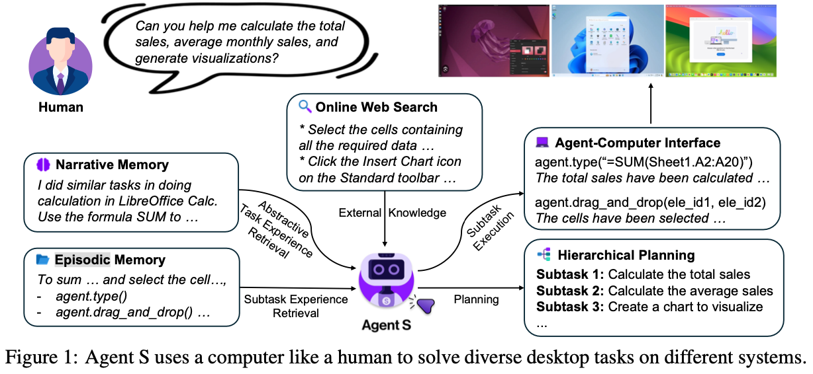

  - Experience-Augmented Hirerarchical Planning 방법을 제안함 $\to$ 유저의 **complex, long-horzon task**를 **executable subtask**로 바꾸는 역할

    - Online Web Knowledge: 최신 (Up-to-date) 지식을 모아놓은 database

    - Narrative Memory: 과거 task experience interaction data를 고차원으로 저장해 놓은 database. $\to$ Agent에게 문맥에 맞는 task planning을 하도록 돕는 역할 (RAG)

    - Episodic Memory: 매우 구체적이고, step-by-step subtask experience를 저장해 놓은 database $\to$ Agent의 Planning ability를 향상시키기 위해 사용

      $\to$ task를 성공적으로 수행한 experience의 모든 데이터는 Narrative, Episodic memory에 요약 & 평가되어 지속적으로 improve되게끔 저장됨

  - Self-supervised continual memory update방법을 제안함 $\to$ 초기 cold-start에 유용함
  - **MLLM**기반의 GUI agent이 computer task를 수행하기 위해 필요한 **Agent-Computer Interface**를 제안함
    - 전처리 layer (추상화 layer)로, grounding, safety, efficiency를 향상시키는 목적.
      - dual-input strategy: screentshot + accessibility tree (html) 입력
      - bounded action space: LLM이 이해할 함수형태로 제공 (ex. $click(element\_id)$)

- 다양한 Computer use task에서 SOTA (WindowsAgentArena, OSWorld)

  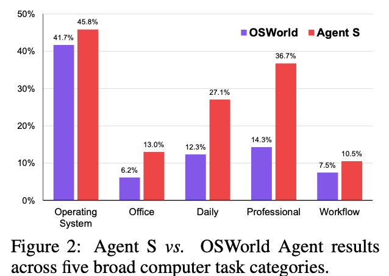

# 3. Related Work

## MLLM Agents

- Agentic system에서 reasoning backbone으로 MLLM이 도입
  - LLMs with Memory, Tool use, Structured Planning, Act in external environments와 증강하여 사용되곤 함
- Software Engineering의 경우, Agent-Computer Interface (ACI) for MLLM을 통해 computer를 제어함

## GUI Agents

- 연구가 Web interface뿐만 아니라, mobile 환경, 그리고 OS-level environment로 이동하는 추세
- 행동 복제 (Behavioral cloning)기반 Reinforcement Learning, In-context trajectory examples, state-dependent offline experimence, 그리고 reusable skill generation 등의 연구가 진행되었음

## Retrieval Augmented Generation (RAG) fror AI Agents

- 신뢰할 만한, 최신 외장 지식을 MLLM 입력으로 사용하는 사례가 많음.

# 4. Agent S

- Overall diagram

  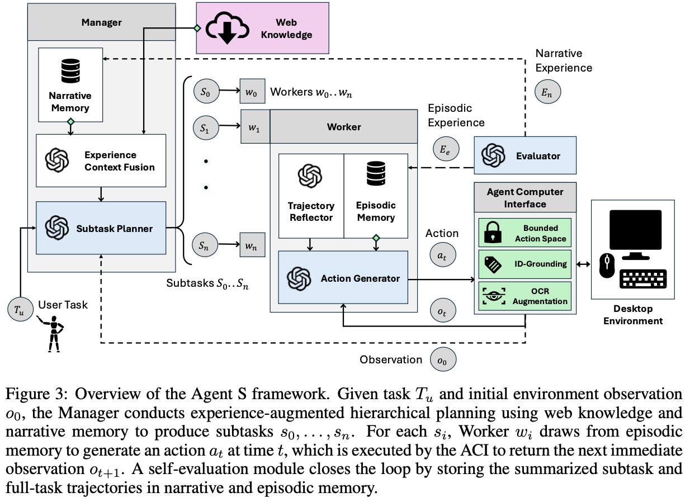

## 3.1 Experience-Augmented Herarcical Planning

- 복잡한 User task ($T_u$)를 executable subtask로 쪼개어, 해당 task를 달성하도록 Plan을 짜는 역할
- High-level planning + Low-level execution을 가능하도록 하기위해 2가지 data를 사용
  - external **web-based** experience
  - internal **task-specific** experience

### Manager ($G$)

- Plan (subtask)을 생성하는 역할

- input

  - user task $T_u$
  - ACI로부터 initial environment observation $O_0$ 
    - Annotated Accessibility Tree
    - Screenshot

- output

  - Observation-aware query $Q$

    `How to do {something}`

    - 역할
      - Online Web Search (Perplexica Search Engine)의 query로 활용되며, external knowledge를 검색하는데 쓰임
      - Narrative Memory ($M_n$)에서 유사한 task experience를 embedding기반 similarity search로 쓰임
        - success/fail은 self-evaluator $S$ module이 제공
        - Successful / failed tracjectory에 대한 요약된 memory $E_{n_u}$를 제공 $\to$ No human-feedback / ground-truth required

- Experience Context Fusion module

  - Reasoning backbone: ChatGPT-4o, Claud-3.5

  - Online websearch, narrative memory에서 각각 retrieved한 정보를 취합해서 detailed subtasks를 생성

    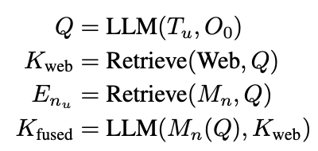

  - Subtask $s_i$별로 연관된 Contextual information $C_{s_i}$을 생성함

- Worker

  - subvtask $s_i$을 sequentially 처리하는 모듈 $<w_0,..., w_n>$

  - Multi step으로 처리함

  - input: Contextual information $C_{s_i}$, subtask $s_i$, 그리고 user task $T_u$ $<C_{s_i}, s_i, T_u>$

  - output: Episodic memory $M_e$에서 embedding similarity기준으로 데이터를 추출

    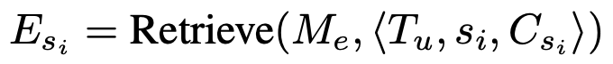

    - Episodic memory $M_e$: complete plan, specific grounding actions, summaries from subtask trajectories 중에 successful만 저장

  - Trajectory Reflector ($TR_i$)

    - 전체 episode $E_{s_i}$를 보고, reflective advice를 제안하여 대안이 될만한 strategies를 제공하거나 반복적인 action을 회피하도록 유도함
    - Reasoning backbone: ChatGPT-4o, Claud-3.5

  - Action Generator 

    - input: $TR_i$의 reflection, subtask experience $E_{s_i}$

    - output: **single structured response** 생성$(a_j$)

      - 이전 action status check

      - observation 분석

      - semantic next action (?)

      - grounded next action (?)

        $\to$ templated chain-of-thought을 제공함으로써 improved reasoning & results

  - Self-Evaluator

    - 전체 experience를 **observation** 후에, Experience summaries를 생성하여 Manager, Worker module에게 **textual reward** $r$을 제공함

    - subtask에 대해 DONE signal이 생성됨 $\to$ Worker의 memory (Episodic memory $M_e$)를 complete epoisode에 대한 summary로 **update**

    - Complete user-provided task에 대해 DONE signal이 생성됨 (SUCCESS) OR maximum limit에 도달함 (FAIL)$\to$ Narrative memory $M_n$를 entire task competion process에 대한 summary로 **update**

      $\to$ 지속적인 **storing, retrieving** self-evaluated task experience는 점차 Agent S의 **성능을 향상**시키는 역할

## 3.2 Memory Construction & Update

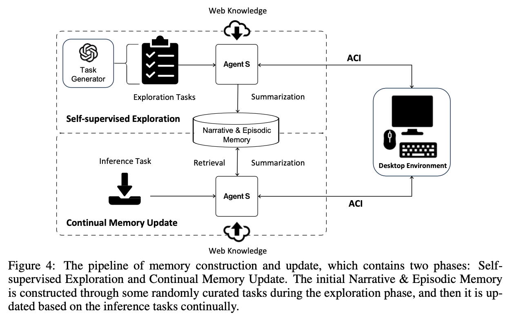

- Self-supervised Exploration기반 초기 memory construction
  - Synthetically generated task를 통해 narrative memory $M_n$, Episode memory $M_e$를 구축함
    - Environment independent task: **task generator**에게 OSWorld, WindowsAgentArena의 top-50 most common  task를 생성하도록 함
    - Environment dependent task: **task generator**에게 environment를 고려하여 OSWorld, WindowsAgentArena의 초기 셋팅값을 사용하여 new task를 생성하도록 함
  - Task가 생성되었으면, Agent S에게 web knowledge $K_{web}$만 사용하여 full task에 대한 experience ($E_n$), subtask에 대한 experience($E_e$)를 취득함
    - Key for $E_n$: $Q$
    - Key for $E_e$: $Q, s_i, C_{s_i}$

## 3.3 Agent-Computer Interface

- Vision-augmented accessibiility tree를 통해 **grounding** 능력을 향상시키고, agent의 action을 bound시켜 **discrete valid action space**을 제공하는 역할

### Perception & Grounding

- MLLM의 한계: 정확한 pixel space coordinate를 pinpoint 하는 grounding 능력이 부족함 $\to$ grounding이 매우 큰 bottleneck임

- 하지만 Desktop environment tasks를 수행하기 위해서는 해당 능력이 필수임

  $\to$ **이미지** 뿐 아니라, **parsable Accessibility Tree**를 함께 제공

   -  Parsable Accessibility Tree? 모든 요소의 coordinate 정보, state 정보가 index가능한 형태로 저장

     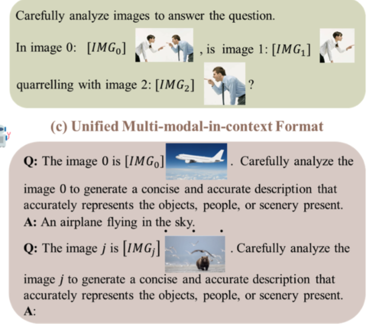

     	- 어떻게 indexing? 모든 요소를 integer값으로 사전에 tagging하여, MLLM이 indexing가능하도록 전처리 작업을 수행함
      - 추가로, accessibility tree에 없는 이미지 속 text는 OCR module로 추출한 text를 accessibility tree에 추가. 
        - accessibility tree 존재 유무는 IoU (Intersection over Union)으로 판단

### Constrained Action space with Concurrent Feedback

- 적절한 타이밍에 적절한 action을 하기 위해서는 action space를 bound해야함

- Action spaces

  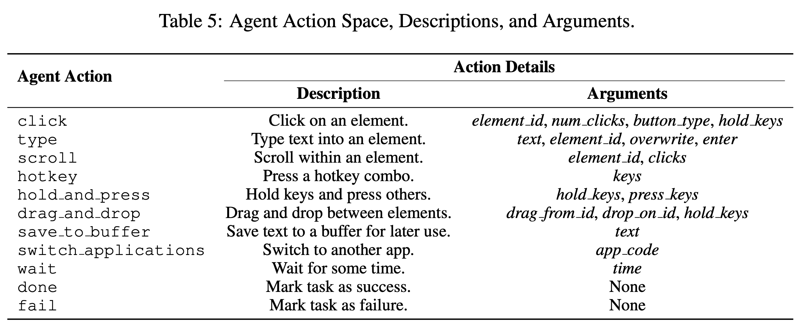

# 5. Experiments

## Benchmarks

- OSWorld
  - 다양한 real-world computer tasks로 구성된 MLLM용 benchmark
    - OS
    - Office (LibreOffice Calc, Impress, Writer)
    - Daily (Chrome, VLC Player, Thunderbird)
    - Prfessional (VS Code, GIMP)
    - Workflow (multiple apps)
- WindowsAgentArena: Window OS에 국한된 benchmark

## Baselines

- Reasoning model: GPT-4o and Claude-3-Sonnet
- OCR: PaddleOCR
- Embedding model: *text-embedding-3-small*

## Main Results

- 정량적 결과

  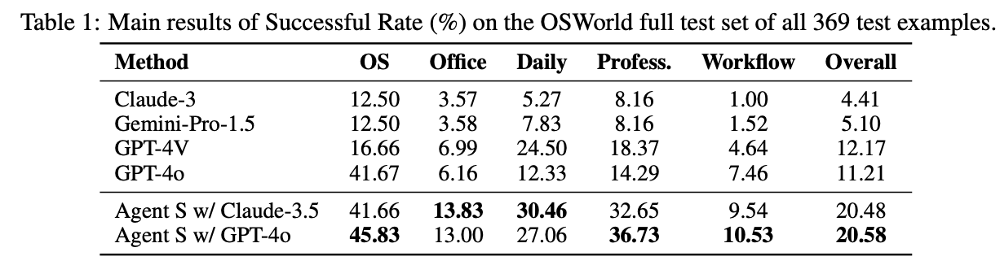

  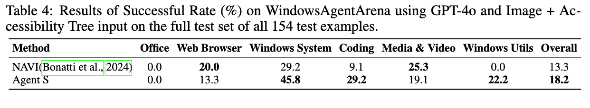

- 정성적 결과

  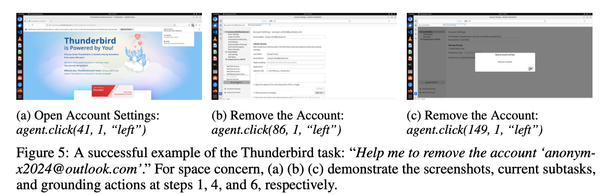

## Ablation Studies

- Test set

  - 65개의 instance로 구성함

- 각 모듈별 성능에 기여하는 정도

  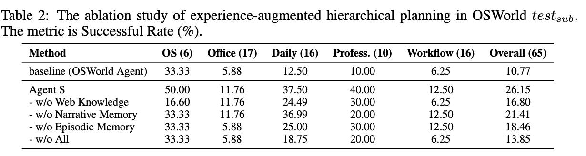

  - Web Knowledge > Episodic > Narrative 가 제일 중요한 성능 향상 요인

- ACI vs. LLM + Hirarchical Planning 여부 (Fig.6) / Self-evaluator의 성능 기여 정도 (Fig. 7)

  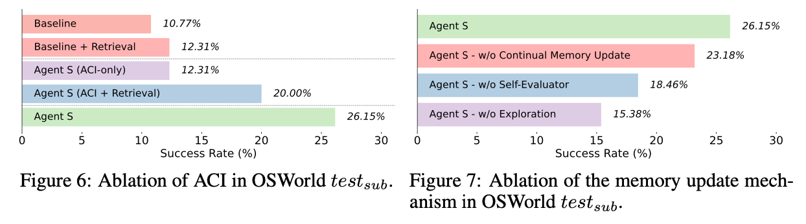

  - Fig. 6
    - Baseline: GPT-4o
    - Baseline + Retrieval: GPT-4o + Experiential Learning (DB의 update)
    - Agent S: GPT-4o + ACI (grounding + action space bounding)
    - Agent S (ACI + Retrieval): GPT-4o + ACI + Experiential Leraning (DB의 update)
    - Agent S: GPT-4o + ACI + Experiential Leraning (DB의 update) + Manager (Hirarchical Planning)
  - Fig. 7
    - w/o Continual Memory update: Self-supervised Memory construction (Exploration) 만 하고, memory를 update안하는 경우
    - w/o Self-Evaluator: Self-Evaluator의 summary를 저장하지 않고, full trajectory를 저장하는 경우
    - w/o Exploration: Self-supservised Memory construction (Exploraiton)도 없는 경우

- Error Analysis (중복 포함)

  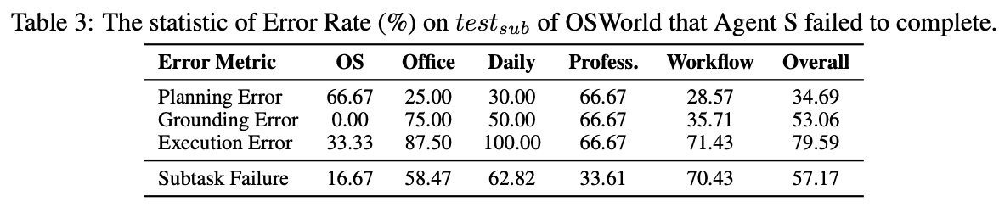

  - Grounding Error: pixel좌표를 잘못 가져옴
    - Grounding Error가 제일 큰 비중을 차지함. (Execution Error는 여러가지 에러에 의해 유발되기 때문)
  - Planning Error: subtask를 제대로 나누지 못했다든지, subtask goal과 다른 plan을 세웠다든지, etc