# [Retrieval] NV-Retriever: Improving text embedding models with efective hard-negative mining

- paper: https://arxiv.org/pdf/2407.15831
- github: X
- huggingface: https://huggingface.co/nvidia/NV-Retriever-v1
- archived (인용수: 1회, '25-04-06 기준)
- downstream task: MTEB (t2t retrieval, reranking, summarization, semantic textual similairity, clustering, classification)

# 1. Motivation

- Embedding 모델을 finetuning할 때, **false negative**로 인해 고품질의 hard negative sample을 contrastive learning을 위해 추출하는 것은 어렵다.

  $\to$ False negative을 teacher ensemble 기반으로 새로운 알고리즘을 적용해서 retrieval 학습을 수행해보자!

# 2. Contribution

- FN을 효율적으로 제거하여 retrieval accuracy를 향상시키는 **postivie-aware hard-negative mining (HNM)**기법을 제안
- 다양한 teacher / HNM 방법들에 대한 실험으로 retrieval model이 얼마나 hard-negative에 sensitive한지 분석
- MTEB에서 SOTA 성능을 보임

# 3. NV-Retriever

- InfoNCE loss

  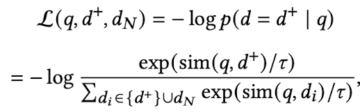

  - positive sample의 유사도는 maximize
  - negative sample의 유사도는 minimize

- Naive Top-K (Hard-negative mining)

  - similar candidate 중 top-K개를 negative sample로 지정 $\to$ dataset에 따라, false negative (positive인데, negative로 잘못 label된 samples) 이슈
  - 특히 검색을 수행하는 corpus가 클수록 해당 이슈는 심해짐

- Top-K shifted by N

  - N+1 ~ N+K 번째만 hard negative로 sampling $\to$ query와 negative간의 relavance score를 고려하지 못함. 또한 매우 가치있는 hard negative를 놓칠 우려가 있음

- Top-K with absolute threshold (TopK-Abs)

  - Absolute threshold보다 높은 similarity score 를 갖는 negative는 무시

- [제안] 두가지를 제안함

  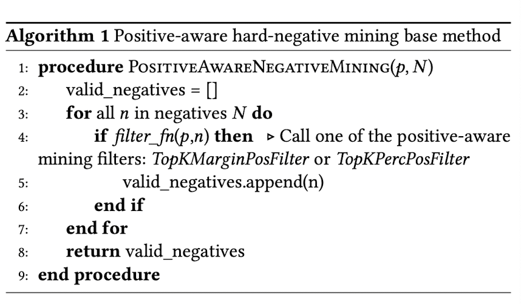

  - Top-K with margin to positive threshold (TopK-MarginPos)

    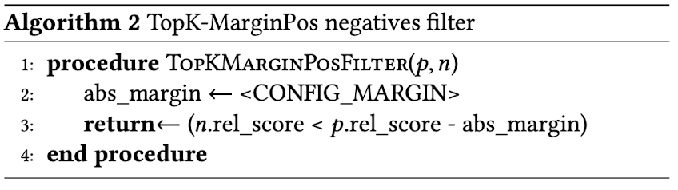

    - margin을 두고 max negative score는 positive - margin 보다 작아야함

  - Top-K with percentage to postivie threshold (TopK-PercPos)

    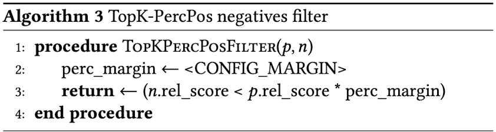

    - positive score보다 일정 percentage 이하로 낮아야함

# 4. Experiments

- baseline model: *e5-large-unsupervised* or *Mistral-7B-v0.1 base*
- dataset
  - train: Natural Question, Stack exchange, SQUAD
  - eval: MTEB Retrieval / BEIR benchmark (NQ, HotpotQA, FiQA-2018)

##  4.1 RQ1. Using different teacher model for mining

- Teacher model
  - *e5-large-unsupervised* (334M param.): E5 model을 CL로만 학습
  - *e5-large-v2* (334M param.): 위 모델을 SFT
  - *snowflake-arctic-embed-l* (334M param.): pretrain + SFT를 artic-embed model로 수행
  - *e5-mistral-7b-instruct* (7.1B param.): decoder-only mistral with CL
  - *NV-Embed-v1* (7.8B param.): Mistral-based + bi-directional + latent attention
- Student model
  - *E5-large-unsupervised*
  - Dataset별로 각 teacher model이 할당되어 hard negative mining 수행

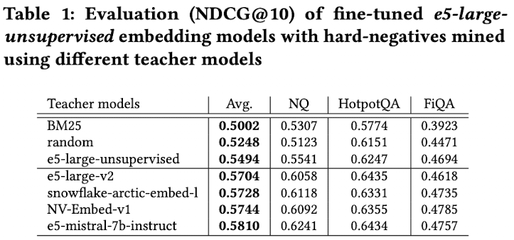

- *e5-mistral-7b-instruct* > *NV-Embed-v1* > ... > BM25

## 4.2 RQ2. Ensembling hard-negatives from different teacher models

- Ensemble하게된 동기: Teacher 모델별로 hard-negative sampling한 결과가 서로 다름 (similarity < 30%)

  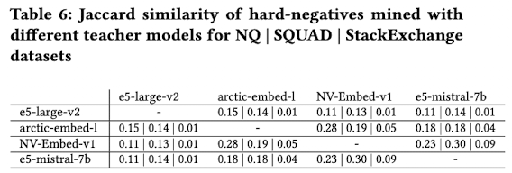

- Ensemble 적용 방법 (2가지)

  - *Cross-sample ensembling*: query별로 teacher를 sampling해서 해당 teacher의 hard negative로 학습
  - *Intra-sample ensembling*: query별로 4개의 teacher별 top-1을 뽑아서 hard negative로 학습
    - dedup: duplicated sample은 제외
    - dup: duplicated sample도 포함

  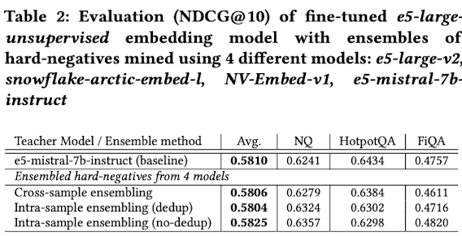

  - *Intra-sample (dup)* > *Intra-sample (de-dup)* > *Cross-sample* > *Single best teacher (baseline)*

## 4.3 RQ3.a Comparing methods for mining hard-negatives

- *TopK-shifted by N* vs. *TopK*-Abs vs. *TopK-MarginPos* vs. *TopK-PercPos*

- baseline teacher model: *e5-mistral-7b-instruct*

  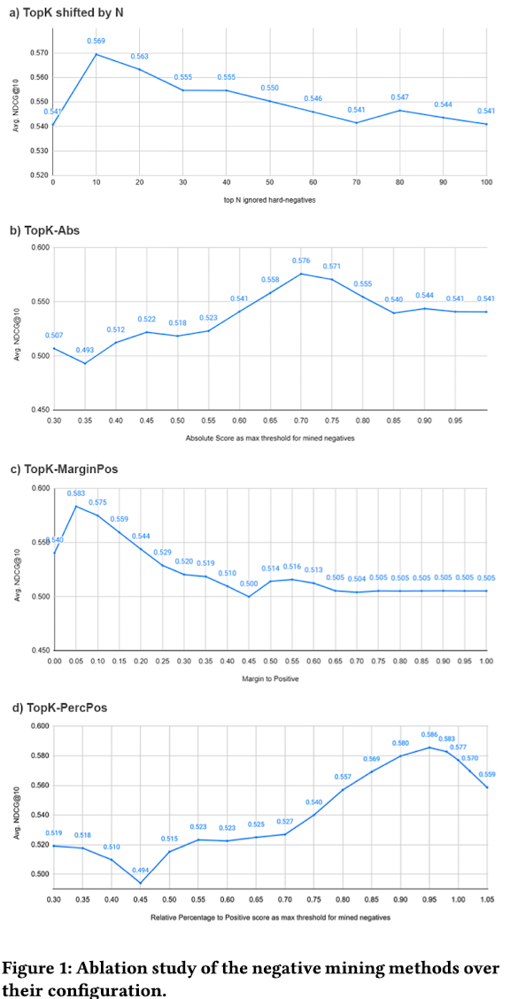

  - *TopK-PecPos* > *TopK-MarginPos* > *TopK-Abs* > *TopK shifted by N*

- Mined negatives에서 sampling하는 방법 

  - *Sampled Top-K*: 상대적 다양성을 위해 top-k 중에서 randome하게 n개를 sampling

  - *Top-1+sampled top-K*: top-1 hard negative은 선택하고, top-k중에 나머지 n-1개를 sampling

    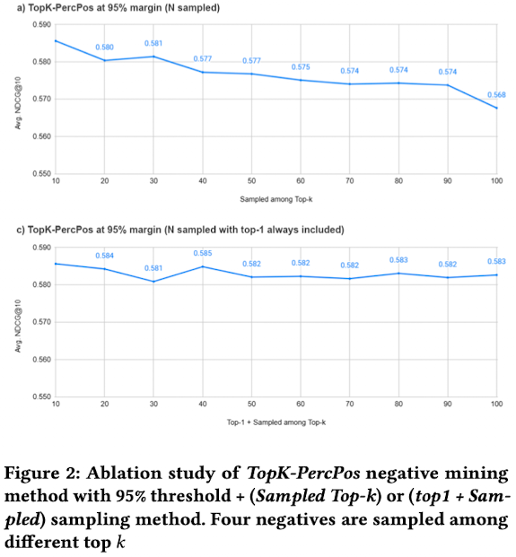

    - *Top-1+sampled top-K* > *Sampled Top-K*

  - 최상의 조합 결과

    - base model: *e5-large-unsupervised*

      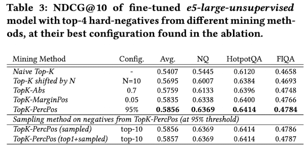

      - *Naive Top-K* vs. *TopK-PercPos*: False Negative를 제거하는게 얼마나 중요한지 알 수 있음

    - base model: *Mistral-7B-v0.1*

      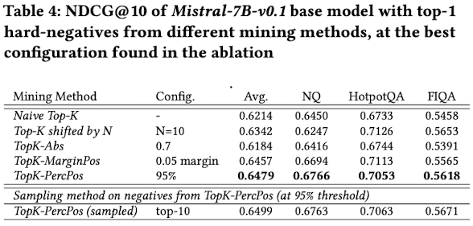

      - Model이 좋아지니까 성능 향상폭이 더 크다

## 4.4 RQ3.b Comparing mining methods at scale with NV-Retriever-v1

- 모델

  - student: *Mistral-7B-v0.1*
  - teacher: *E5-Mistral-7B*

- 학습 파라미터

  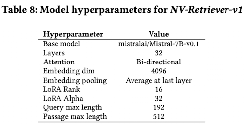

- 학습 데이터셋

  

- MTEB benchmark 결과

  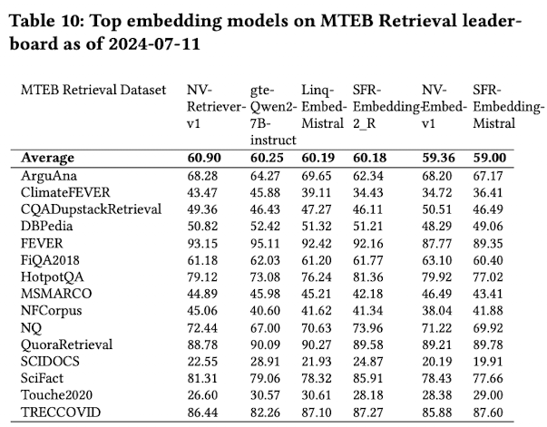

## 4.5 Effects of positive-aware neg. mining

- LLM-as-a-judge를 통해 해당 알고리즘의 hard-negative와 naive-topK hard-negative 간의 query와 유사도를 비교함

  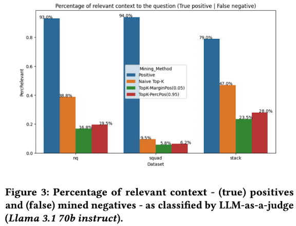

  $\to$ 2배 이상 잘 걸러짐을 확인