# [Layout] DocMark: Adaptive Markup Language Generation for Contextually-Grounded Visual Document Understanding

- paper: https://www.arxiv.org/pdf/2505.05446
- github: https://github.com/Euphoria16/DocMark (깡통)
- CVPR 2025 accepted (인용수: 0회, '25-05-12 기준)
- downstream task: Visual Document Understanding (Document VQA, etc)

# 1. Motivation

- Visual document understanding에 있어 challenging한 점은 이미지 내의 **visual** content와 **layout** 정보를 **인식**하는 것이다.

- 기존의 VQA task는 brief answer만 제공하기 때문에  comprehensive description을 사전학습한 LLM의 detailed reasoning이 불필요했다. 

- 또한, chart와 같이 이미지 내 structural interpretation을 이해하려면, 다양한 영역을 참고하여 답변해야 하는 경우도 종종 있다.

  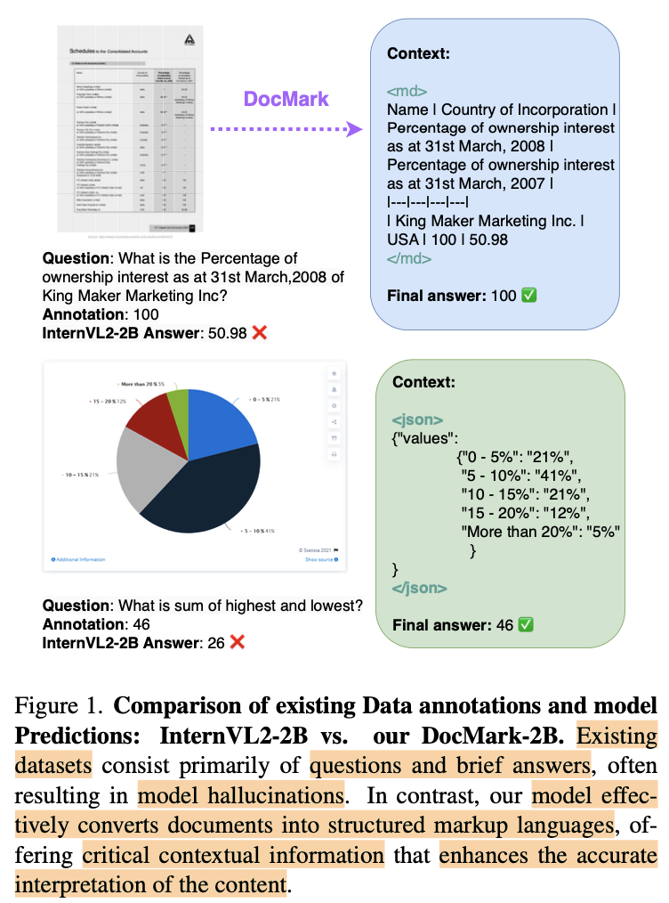

  $\to$ 기존의 VQA로는 효율적인 분석이 어렵다.

  - Document image는 *markup language* source code와 link되어 있고, 해당 structure는 pretrained LLM이 잘 이해할 수 있다.

    $\to$ markup language 결과를 중간과정에 CoT처럼 출력하도록 한 후에 답변을 유도하면 어떨까?

# 2. Contribution

- Visual Document Understanding을 새롭게 학습하는 pipeline을 제안 (DocMark-Pile, DocMark-Instruct)

- 2개의 fine-grained structured dataset을 제안

  - Domark-Pile: Image to Markdown 사전학습용 데이터 (3.8M paired data)

    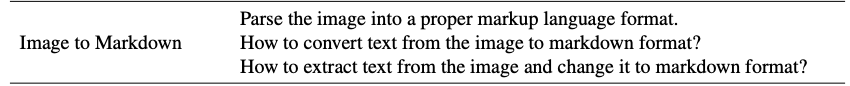

  - DockMark-Instruct: Chain-of-though-like reasoning 데이터. (624K annotations by Chatgpt 3.5)

    $\to$ Plain Text, Markdown, LaTeX, HTML, JSON, Tikz로 구성

- 다양한 document understanding tasks에서 State-of-the-Art

# 3. DocMark

## 3.1 DocMark-Pile

### Dataset Statistics

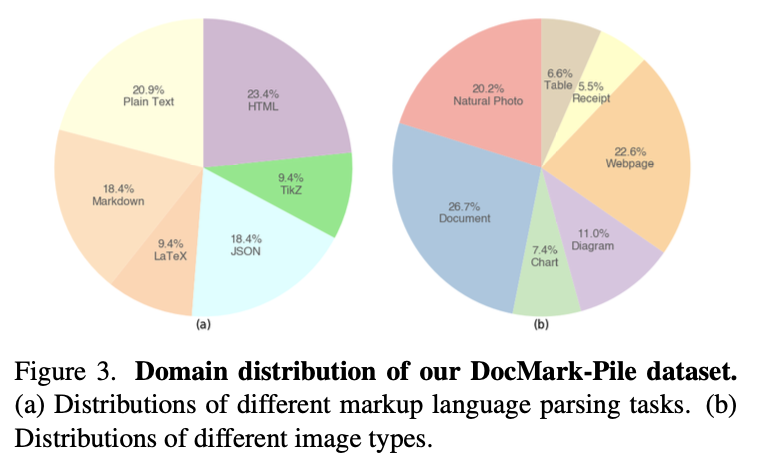

- 3.8M paired dataset (6개의 format이 고루 다양하게 분포)
- Special tokens (<md>, </md>, <json>, </json>, etc)를 annotation에 추가

### Multi-Task Pretraining for Markup Language Conversion

- markup langauge의 장점
  - 다양한 요소들간의 구조를 정의하고, 내용을 효율적이고 구조적으로 전달 가능함
  - 6개의 markup langauge 사용
    - plain text
    - Markdown
    - LaTeX
    - HTML
    - Json
    - Tikz

### Specialized Task Design

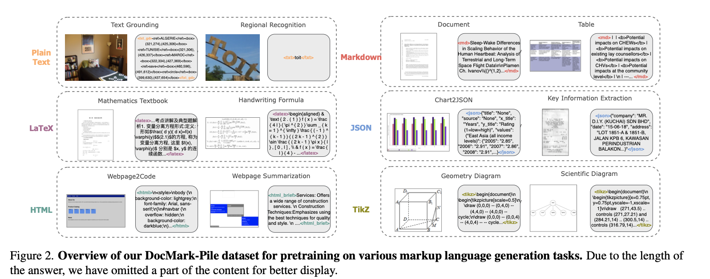

- Plain Text
  - natural photos, regional text 이미지 사용할때 해당 포멧 적용
  - dataset: TextOCR, COCO-Text, HierText, LSVT, RCTW-17, CTW1500
  - 용도: 홍보용 포스터, signage, product lables, image subtitles, etc
  - 좌상단 $\to$ 우하단 순서로 tblr 형식의 bbox로 text 추출
- Markdown
  - bold, italics, headings, lists formatting 적용
  - HTML, LaTeX와 쉽게 호환 가능함
  - PDF: archive에 있는 논문 데이터 활용
    - PDF $\to$ LaTeX $\to$ Markdown 으로 추출 ([16] 논문 방식 참고)
  - Table: PubTabNet, SynthTabNet, TabRecSet, TableGraph, SciTSR과 같은 공개된 데이터셋을 사용
    - Table $\to$ HTML $\to$ Markdown으로 추출
- LaTeX
  - 수학, 과학책으로부터 Mathpix를 사용하여 LaTeX format을 추출.
  - Handwritten mathematical expression dataset (HME100K, MathWriting)으로부터 LaTeX format 추출
  - Rendered image를 추가로 활용
- HTML
  - webpages $\to$ HTML 추출 (+ Screenshot image)
  - 정보가 sparse하게 저장되기 때문에 비효율적임 $\to$ summarization task 도입하여 해결 (title, content, essential info추출)
- JSON
  - CORD, POIE, SVRD, WildReceipt, XFUND, PlotQA 등의 공개된 데이터를 활용
  - Python dictionary의 key를 정의하여 저장
    - Title, source, x-axis, y-axis, value
  - Random하게 chart title을 변형하여 Matplotlib로 rendering 후에 사용
- Tikz
  - scientific figure 뿐 아니라, 수학 도형, 도식 등 다양한 component rendering에 활용
  - DaTikZv1, DaTikZv2 데이터셋 활용
  - 추가로, 수학&과학 책에서 TikZ code를 추출하여, 오류없이 rendering되는 코드에 한해 re-generate하여 학습에 활용.

## 3.2 Adaptive Markup Language Generation During Finetuning

- Adaptive Generation Pipeline

  - markup language결과를 부수적인 context cue로 활용.

  - **Adaptive**: 모델이 자동으로 적절한 markup language로 추출하도록 answer 전에 intermediate step으로 markup lanuage 예측을 수행

    - *Two-round process*

      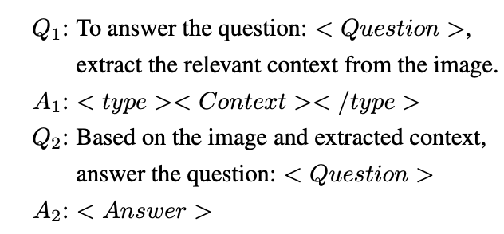

- DocMark-Instruct: CoT Reasoning Data Construction

  - ChatGPT-3.5를 활용하여 additional annotation을 추출 $\to$ **624K** annotations

- Training

  - $A_1, A_2$ 두 개의 answer에 대해 Cross-Entrophy Loss 적용하여 학습

- Inference

  - $Q_1$만 입력하여 final response를 추출함.

# 4. Experiments

- Model Architecture

  - Image encoder: InterViT
  - Text encoder: InternLM-2B / 7B

- Image 전처리

  - InternVL2처럼 $448 \times 448$의 subimage maximum 12개를 입력

- Pretraining hyperparameters

  - epoch : 1
  - learning rate: 2e-5
  - batch size: 128

- Finetuning hyperparameters

  - epoch: 1
  - learning rate: 1e-5
  - batch size: 128

- Evaluation Metrics

  - LaTeX format: Accuracy
  - ChartQA: AP@strict / AP@slight / AP@high
  - Key Information Extraction: FUNSD, SROIE
  - TiKZ format: image similarity, code similarity

- 정량적 결과

  - Specialized Tasks (ChartQA, LaTeX, KIE, TikZ)

    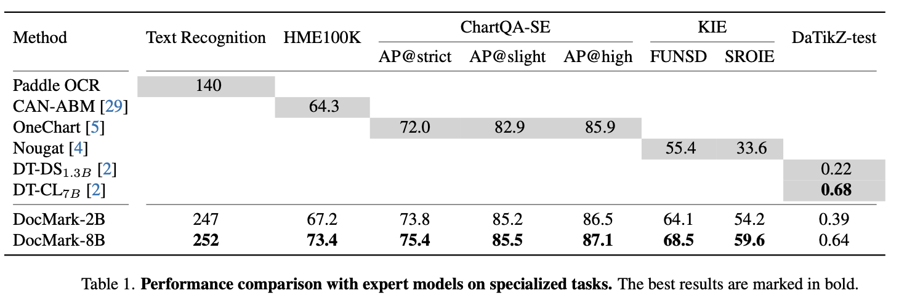

  - Document Understanding tasks (Document VQA)

    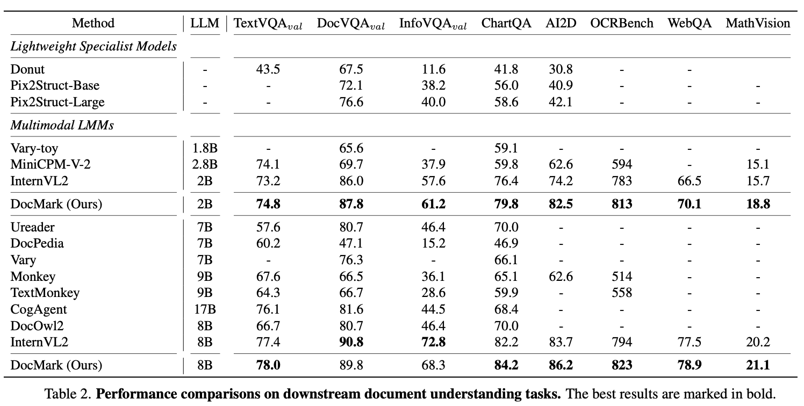

- 정성적 결과

  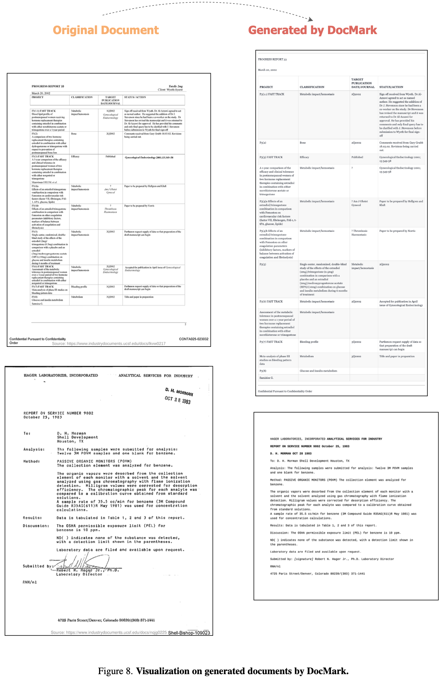

  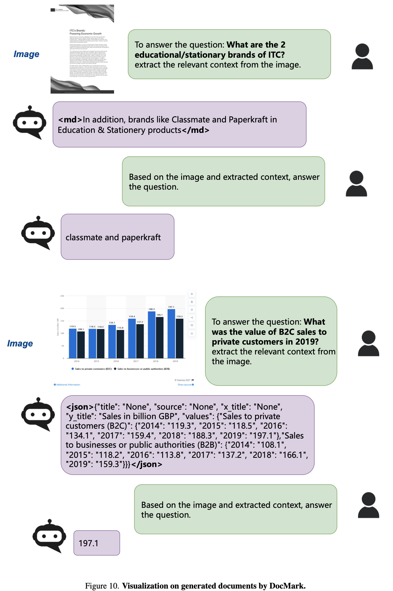

  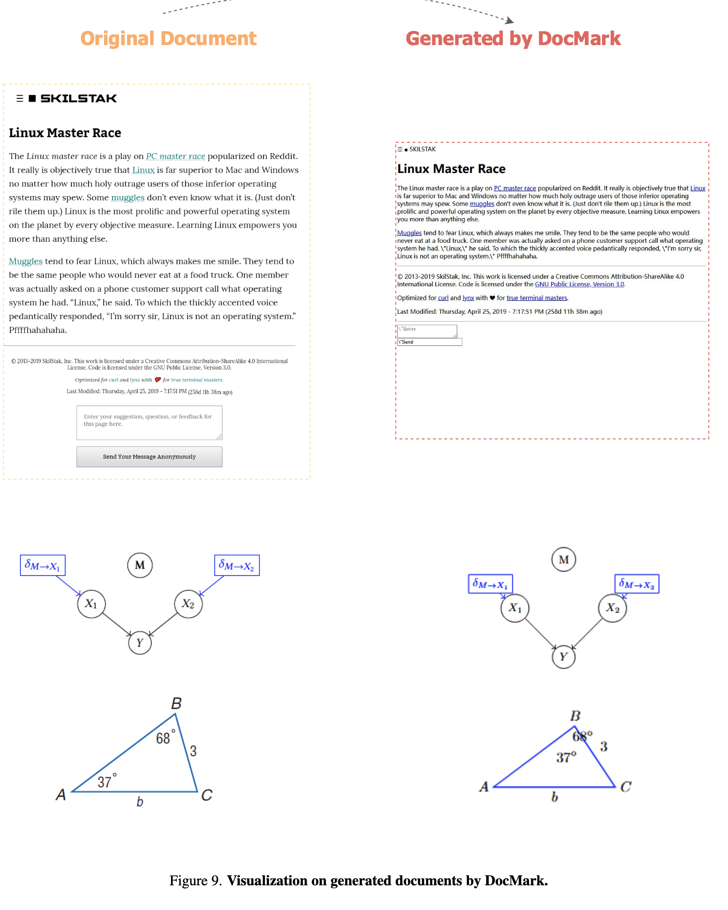

- Abliation Studies

  - Pretrain만 제거 / 모두 제거

    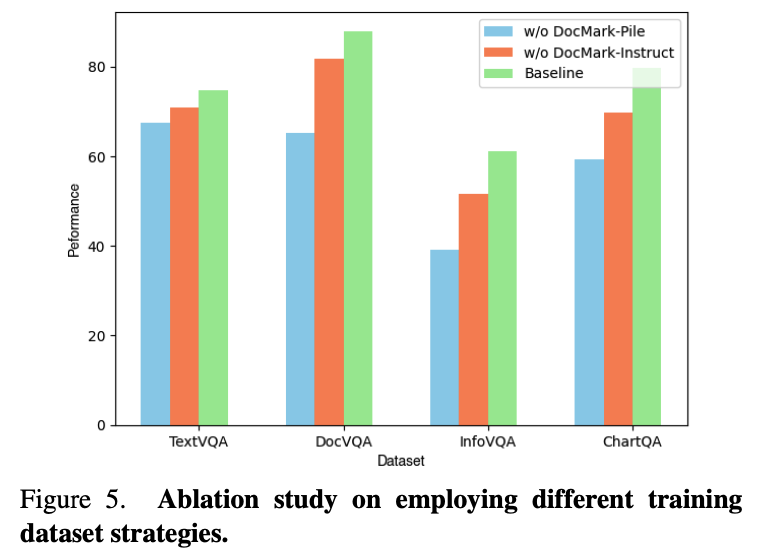

  - 다른 모델 (Qwen2-VL / LLaVA-OneVision)

    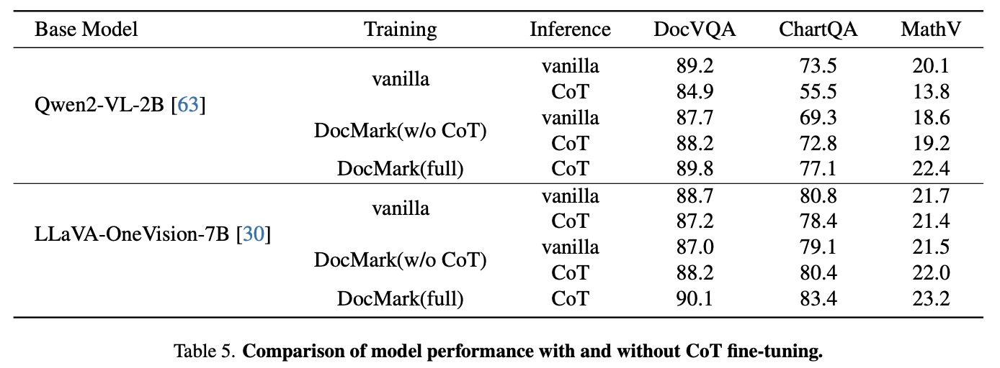

  - Token 수 비교

    