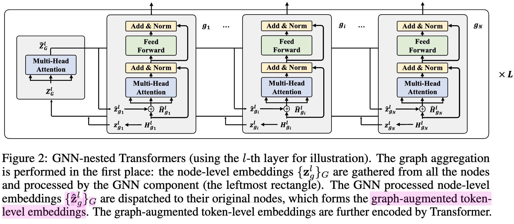

# [IR] GraphFormers: GNN-nested Transformers for Representation Learning on Textual Graph

- paper: https://arxiv.org/pdf/2105.02605
- github: https://github.com/microsoft/GraphFormers
- NeurIPS 2021 accepted (인용수: 245회, '25-10-21 기준)
- downstream task: WIKI, 논문 인용 여부, Shopping 목록 link예측 task

1. Motivation

- textual graph를 이해하는 모델로 최근에 PLM (Pretrained Language Model)과 GNN (Graph Neural Network)를 cascaded하는 방식의 연구가 진행되고 있다.

- 하지만 이는 textual feature간의 독립된 모델링을 하므로 한계가 있다.

  - node간의 정보 교환이 전혀 없는 구조

    

    ex. "Notes on transformers" 에서 neighbor에 "tutorials on machine translation"이 있다면, 전자부품이 아닌 transformers는 AI 모델 구조임을 알수 있음.

  $\to$ GNN기반으로 PLM 내부에 모델링한 component 를 nested하는 새로운 방법을 제안해보자!

# 2. Contribution

- GNN과 PLM을 fusion하기 위해 GNN component을 PLM의 중간 TRM (Transformers) alyer중간에 nested하게 넣는 GraphFormers를 제안함
  - node의 text encoding된 정보간의 교환을 통해 center node embedding에 neighbor 연결 정보를 추가된 embedding을 추출할 수 있게됨
- 단순한 학습기법보다 우수한 학습기법을 제안함
  - 1st iteration
    - progressive learning으로 node를 초반에는 오염시킨 뒤, 학습
    - 취지: center node가 neighbor에 비해 정보량이 많기에, shortcut으로만 학습될 위험이 존재하므로 이를 해결
  - 2nd iteration
    - unpolluted data로 학습
- 연결된 노드간의 상호 종속적인 특성으로 인해 불필요한 계산량 증가를 초래함 $\to$ 이를 해결하는 unidirectional graph attention을 제안함
  - 기존재하는 neighbor node를 encoding (caching)해두어 재사용할 수 있음
- DBLP, Wiki에서 SOTA성능을 냄

# 3. GraphFormer

- 목표: 생성된 embedding에는 node간의 관계(relationship between the nodes)를 capture해야함
  - $x_q, x_k$ 두 노드가 연결되었는가를 정확히 예측 수행해야함

## 3.1 GNN-nested Transformers

- input node

  - center node + neighbor nodes $\to$ sequence of tokens로 tokenize
    - word embedding + positional embedding으로 구현

- 여러개의 GNN-nested Transformers multiple layers로 구성

  

- Graph Aggregation in GNN

  - layerwise graph aggregation을 통해 neighborhood 정보가 개별 (center) 노드에 증강됨 (token-level embedding과 함께 concat하여 사용)

    

    - $\hat{z_g}$: GNN-process **node-level** embedding
      - $z_g=H_g[0]$
    - $H_g$: **token-level** embedding

    

    - **B**: learnable position bias
      - center-to-center
      - center-to-neighbor
      - Neighbor-to-neighbor

- Text Encoder in Transformer

  - TRM을 통해 token-level embedding 추출

    

    

- Algorithm

  

### 3.2 Model Simplification

- input nodes들은 상호 종속되어 있기 때문에 매번 새롭게 계산해야하는 문제가 생김

  $\to$ center node만 neighborhood node를 참조해서 encoding을 실시간으로 하고, neighborhood node는 center node와 독립적이므로 저장해보자!

  - unidirectional graph attention 적용!

    

### 3.3 Model Training: Two-Stage Progressive Learning

- 학습 목적: link prediction

- loss

  

  - $h_q$: query의 node embedding
  - $h_k$: k개의 positive node embedding
  - $h_r$: in-batch negative node sample's embedding

- Two-stage Training

  - naive하게 학습하면 neighborhood node와 center node간의 정보격차가 심해 center node만 가지고 shortcut 학습하게 됨

  - 1st stage학습시 center node를 polluted시켜 neighborhood node를 기반으로 link를 예측하도록 함

    

    - input node의 subset token을 random masking 수행함

# 4. Experiments

## 4.1 Dataset

- DBLP: paper citation graph
- Wikidata5M: Wikipedia 의 첫번째 문장 기반으로 reference link
- ProductGraph: online product 데이터셋으로, 유저의 행동을 tracking하여 (Amazon, Nike shoes) 30분 내에 함께 browsing된 물건간의 graph로 연결됨
  - product에는 고유 text description이 존재 (product name, brand, saler, etc)

## 4.2 Evaluation

- Tokenizer = Wordpiece사용

- 5개의 neighbor를 사용

- Precision@1, NDCG, MRR

- 정량적 결과

  

  - PLM-only보다 PLM+GNN기반이 다 우수했음

- neighborhood를 늘리면 성능은 향상됨

  

- 하지만 속도는 줄어듦고 계산량은 증가함

  

  

- Ablation Studies

  