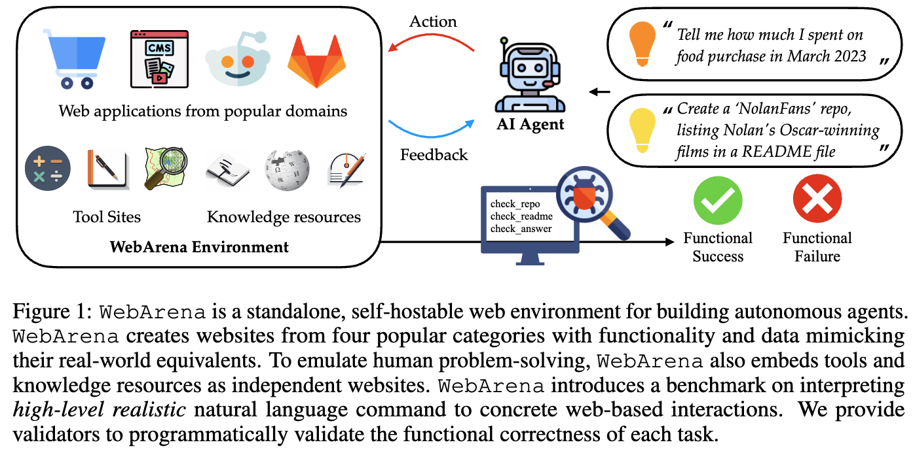
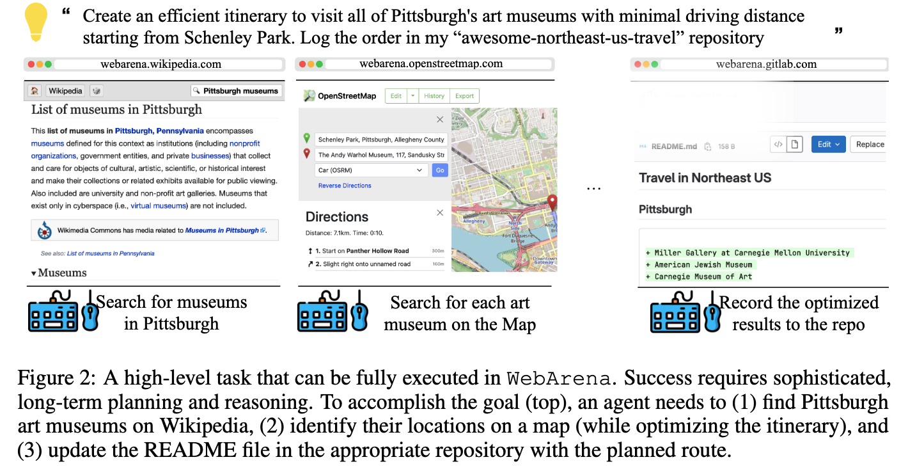
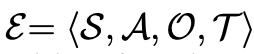

# [WebAgent] WebArena: A Realistic Web Environment for Autonomous Agents

- paper: https://arxiv.org/pdf/2307.13854
- website: https://webarena.dev/
- github: https://github.com/web-arena-x/webarena
- ICLR 2024 accepted (인용수: 401회, '25-06-05 기준)
- downstream task: Web task Automation

# 1. Motivation

- LLM의 발전으로 autonomous agents의 잠재력이 생겼지만, 기존에 agent들은 단순화된 synthetic 환경에서 생성되고, 평가되고 있어, 현실과의 괴리가 심했다.

  $\to$ language-gudied agent를 위해 *highly realistic* 하고, *reproducable*한 환경을 만들어보자!

  - 다양한 도메인 : e-commerce, social forum discussions, collaborative software development, content management
  - Tool-use: map, external knowledge, sratchpad, calcuator, etc

# 2. Contribution

- 여러가지 web task를 수행 가능한 Autonomous agents를 개발하기 위해 *Realistic*하고 *reporducible*한 웹 환경인 "WebArena"를 제안함

  

  - 수많은 문서 (English Wikipedia)를 취합해 domain-specific references로 활용할 수 있음

- 바로 사용 가능한 **812개**의 long-horizon **web-based tasks**를 제안함

  - 각 task는 고차원의 natural language intent로 구성됨

  - 기존 방식처럼 **surface form**만 보고 평가하는게 아닌, **구체적인 내용**을 보고 *functional correctness*를 평가함 $\to$ 이는 **sufficiently complex task**의 정답에 이르는 유효한 잠재적 paths (trajectories)를 수용함.

    

# 3. WebArena

## 3.1 WebArena: Websites as an Environment for Autonomous Agents

- 목표: *realistic*하고, *reproducible*한 환경을 구축하는 것
  - 재현 가능성: live website가 아닌, standalone 환경을 구축함으로써 달성함
    - CAPTCHAs에 걸리거나, 예측 불가능한 내용 수정을 당하거나, 예측 불가능한 configuration이 변화되는걸 방지함
  - 현실성: 다양한 카테고리에서 사용중인 사이트를 중심으로 open-source library를 통해 그들의 데이터를 import하여 환경을 구축함

### 3.1.1 Controlling Agents through High-level Natural Language

- Notations

  

  - $\Epsilon$: Environment (WebArena)
  - $S$: State space
    - $s_1^T$: step 1부터 T까지 전체 state history
  - $A$: Action space
    - $a_1^T$: step 1부터 T까지 전체 action history
  - $O$: Observation space
    - $o_1^T$: step 1부터 T까지 전체 observation history
  - $T$: Transition Function. ($T: S \times A \to S$) Deterministic함.

### 3.1.2 Website Selection

### 3.1.3 Observation Space

### 3.1.4 Action Space

## 3.2 Benchmark Suite of Web-based Tasks

### 3.2.1 Intent Collection

### 3.2.2 Evaluation Annotation

# 4. Experiments

# 5. Related Work