# [WebAgent] WebArena: A Realistic Web Environment for Autonomous Agents

- paper: https://arxiv.org/pdf/2307.13854
- website: https://webarena.dev/
- github: https://github.com/web-arena-x/webarena
- ICLR 2024 accepted (인용수: 401회, '25-06-05 기준)
- downstream task: Web task Automation

# 1. Motivation

- LLM의 발전으로 autonomous agents의 잠재력이 생겼지만, 기존에 agent들은 단순화된 synthetic 환경에서 생성되고, 평가되고 있어, 현실과의 괴리가 심했다.

  $\to$ language-gudied agent를 위해 *highly realistic* 하고, *reproducable*한 환경을 만들어보자!

  - 다양한 도메인 : e-commerce, social forum discussions, collaborative software development, content management
  - Tool-use: map, external knowledge, sratchpad, calcuator, etc

# 2. Contribution

- 여러가지 web task를 수행 가능한 Autonomous agents를 개발하기 위해 *Realistic*하고 *reporducible*한 웹 환경인 "WebArena"를 제안함

  

  - 수많은 문서 (English Wikipedia)를 취합해 domain-specific references로 활용할 수 있음

- 바로 사용 가능한 **812개**의 long-horizon **web-based tasks**를 제안함

  - 각 task는 고차원의 natural language intent로 구성됨

  - 기존 방식처럼 **surface form**만 보고 평가하는게 아닌, **구체적인 내용**을 보고 *functional correctness*를 평가함 $\to$ 이는 **sufficiently complex task**의 정답에 이르는 유효한 잠재적 paths (trajectories)를 수용함.

    

# 3. WebArena

## 3.1 WebArena: Websites as an Environment for Autonomous Agents

- 목표: *realistic*하고, *reproducible*한 환경을 구축하는 것
  - 재현 가능성: live website가 아닌, standalone 환경을 구축함으로써 달성함
    - CAPTCHAs에 걸리거나, 예측 불가능한 내용 수정을 당하거나, 예측 불가능한 configuration이 변화되는걸 방지함
  - 현실성: 다양한 카테고리에서 사용중인 사이트를 중심으로 open-source library를 통해 그들의 데이터를 import하여 환경을 구축함

### 3.1.1 Controlling Agents through High-level Natural Language

- Notations

  

  - $\Epsilon$: Environment (WebArena)
  - $S$: State space
    - $s_1^T$: step 1부터 T까지 전체 state history
  - $A$: Action space
    - $a_1^T$: step 1부터 T까지 전체 action history
  - $O$: Observation space
    - $o_1^T$: step 1부터 T까지 전체 observation history
  - $T$: Transition Function. ($T: S \times A \to S$) Deterministic함.

### 3.1.2 Website Selection

- 저자들의 web browsing history를 뒤져 카테고라이징을 수행한 후, 가장 중요한 top-4 카테고리를 선택함
  - E-commerce: online shopping 활동을 보조 (ex. Amazon, eBay)
  - Social forum platforms: 의견 교환 (ex. Reddit, StackExchange)
  - Collaborative development platforms: software development (ex. GitLab)
  - Content Management Systems (CMS): 디지털 컨텐츠 창작 & 변형 (ex. online store management)
- Utility Toops
  - web-based tasks에서 자주 사용하는 tool 3개를 선정
    - Map: Points of interest (POIs)의 navigation & searching 용
    - Calculator
    - Scratchpad: note taking
- Knowledge bases
  - English Wikipedia
  - Website user manuals

#### Implementations

- Open-source library를 활용하여 자체 website를 구축하여 real-world counterparts로부터 data를 추출함
  - E-commerce
    - Adobe Magento를 기반으로 구현 (https://github.com/magento/magento2)
    - 300 이상의 카테고리 / 90k product 이상의 shopping website를 구축함 
      - meta-data: prices, options, detailed product descriptions, images, reviews
  - Social forum platform
    - Postmill을 기반으로 구현 (https://postmill.xyz/)
    - 50개의 subreddits(https://redditlist.com/sfw.html)로부터 sampling 
    - 미국의 북동쪽 도시, ML & DL 관련 topics 위주로 선정함 
    - 총 95 subreddits / 127,390 posts / 661,781 user 를 추출함
  - Collaborative Software Development
    - 10개의 GitLab repositories, 모든 언어에 대해 데이터를 추출함 (80%는 star 갯수가 많은 상위 90%의 repo로부터 취득. 나머지 20%은 하위 10%의 start 갯수로부터 추출.)
    - 총 300 repo / 최소 1 commit이상한 계정이 1,000개 이상
  - Content Management System
    - official guide에서 제공한 Adobe Magento's admin portal을 사용
  - Map service
    - OpenStreetMap을 사용
    - US region
  - Tools
    - Calculator, scratchpad는 자체 구축
    - knowledge base는 개개인의 website로부터 구축. 
    - Kiwix를 통해 2023년 5월 이전의 offline version of English Wikipedia로 구축
    - user manual은 GitLab & Adobe Commerce Merchant document를 가져옴
- 개발환경은 docker와 script를 통해 제공함

### 3.1.3 Observation Space

- 최초의 **multi-tap** 구조로 observation space를 구축

  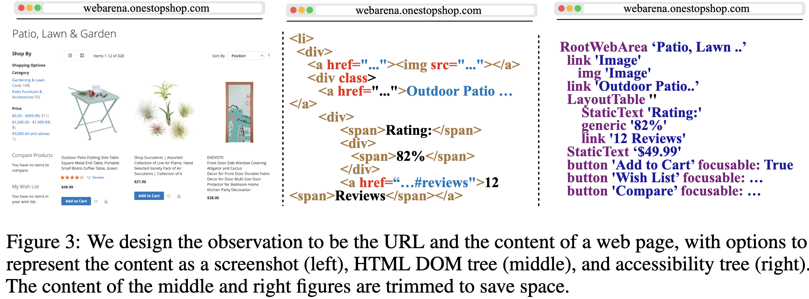

  - web page url, focus tab의 content, open tab, tab간의 언급 기능, tool usage 기능 등 실제 웹환경과 유사함
  - screenshot, HTML DOM tree, 그리고 accessibility tree 형태로 제공함

### 3.1.4 Action Space

- keyboard, mouse operation을 기반으로 구성함

  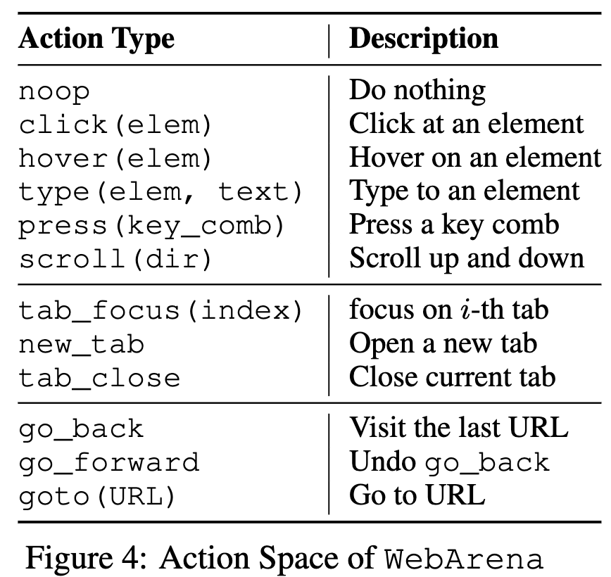

  - element operations: action의 target이 특정 요소인 경우
  - tab operations: tab open/close/switching 기능
  - url navigation operations: 특정 url 방문, browsing history 기반 전/후 이동

- WebArena는 Element를 언급하는 다양한 방법을 제안함

  - direct coordinate: `(x,y)`를 통해 접근하는 방법

  - unique element ID: WebArena 내부적으로 DOM tree를 순회하는 동안 요소별 unique ID를 부여함. 

    $\to$ *n-way classification*으로 훨씬 수월하게 agent가 특정 요소를 언급할 수 있게됨

## 3.2 Benchmark Suite of Web-based Tasks

- 812개의 task를 naturla language instruction, functional correctness 평가 메트릭과 함께 제공함

### 3.2.1 Intent Collection

- 목표: WebArena를 이용하여 *realistic*하고 *complex*하며 *creative*한 task를 수행하기 위한 natural language instruction을 지정

- 방법

  - annotator들에게 다음 3가지 가이드를 제공

    - 의도는 *abstract & high-level*해야 함. 

      ex. not good - `click the science subreddit`

      ​     good - `post a greeting message on science subreddit`

    - 의도는 *creative* 해야함.

      ex. not good - `create a Reddit account as jyjang1090` 

      $\to$ good - `create a Reddit account identical to my GitLab one.`

    - 의도는 template화하여 상수는 고정하고, 변수만 지정함. $\to$ 같은 template에 대해서 distinct execution traces를 갖게됨.

      ex. not good - `create a Reddit account identical to my GitLab one` $\to$ `create a {{site1}} account identical to my {{site2}} one`

  - ChatGPT-3용 prompt도 annotator들에게 추가로 제안하여 의도를 명확히 함

#### Intent Analysis

- 3가지 범주로 분류

  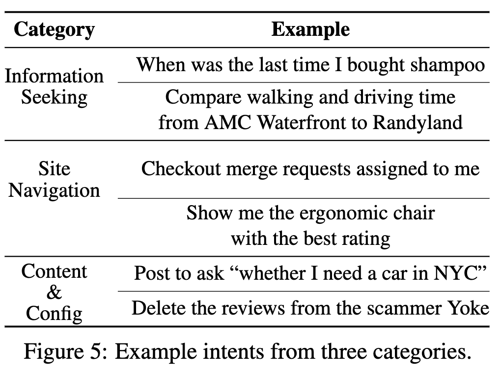

  - Information Seeking

    - 요구사항

      - 여러 page를 걸쳐 navigation하는 기능

      - *user-centric* 해야함. 즉, browsing history를 접근가능 해야함 $\to$ 기존의 VQA task처럼 general 한 정답을 맞추는 문제와는 다름.

        ex. `what was the last time I bought the Shampoo?`

  - Site Navigation

    - 요구사항
      - *interactive elments* (ex. search functions, links)를 통해 여러 page를 걸쳐 navigation하는 기능

  - Content & Config

    - 요구사항

      - 다양한 element를 통해 환경과 interaction을 수행하여, content나 setting을 수정/삭제/추가 하는 기능

        ex. social media 셋팅을 변경하거나, ReadMe를 바꾸거나, 구매를 하거나, privacy setting을 변경

- Intent의 분포

  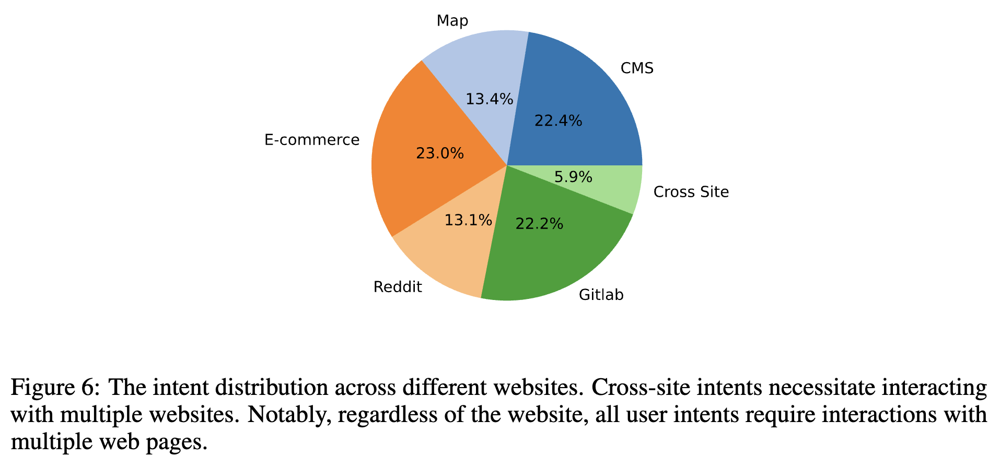

  - template : 241개

  - instantiated intents: 812개

### 3.2.2 Evaluation Annotation

#### Evaluating Information Seeking Tasks

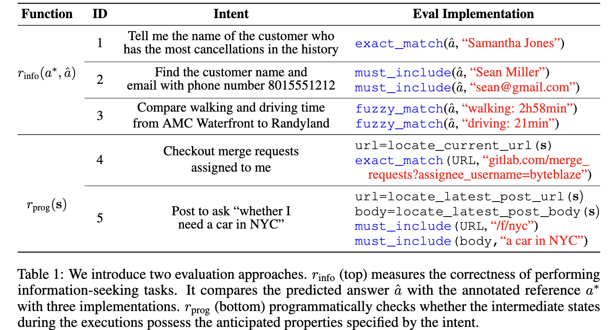

- 각 task별로 제공한 answer $a^*$와 예측한 answer $\hat{a}$에 대하여 3가지 metric로 검증

  - Exact Match

    - $a^*==\hat{a}$ 인경우 1, 아니면 0
    - formatting이 중요한 경우 사용

  - Must Include

    - $a^* \in \hat{a}$ 인경우 1, 아니면 0
    - 특정 key concept에 집중하는 task, 혹은 순서가 중요하지 않은 task에서 사용

  - Fuzzy Match

    - LLM-as-a-judge 형태로 평가함 (gpt-4-0613)

    - 주로, 형식이 다양한 답변일 경우 사용

      ex. Question: "`Compare the time for walking and driving route from AMC Waterfront to Randyland`"

      ​     Answer: "`2 hours 58 minutes` or `2:58` or `2h58m`"

#### Evaluating Site Navigation and Content & Config Tasks

- 특정 조건을 만족하거나 연관된 website의 내용 수정을 올바르게 수행했는지를 평가
- programmatic reward를 설계함 (rule-based) 으로써 의도에 맞는 답이 존재하는지를 평가 (`must_include` + `exact_mach` 조합)

#### Unachieveable Tasks

- N/A 를 answer로 labeling하여, agent가 해당 답변을 했는지를 평가

#### Annotation Process

- 저자들이 intent를 설계하고, 외부 annotator 두명씩 해당 intent별로 정답을 라벨링 수행.
- 2개의 정답이 다른 경우, 제 3의 annotator가 최종 판단함
- annotator들은 중간 state에 대해 정밀하게 조사하여 라벨링을 수행함

#### Human Performance

- 컴공과 석사과정을 대상으로 실험 진행

  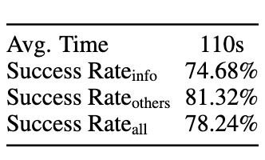

# 4. Experiments

## 4.1 Baseline Web Agents

- 3 LLM + 2 prompt로 진행 (2-shot prompting)

- prompt

  - system prompt

    - CoT-version

      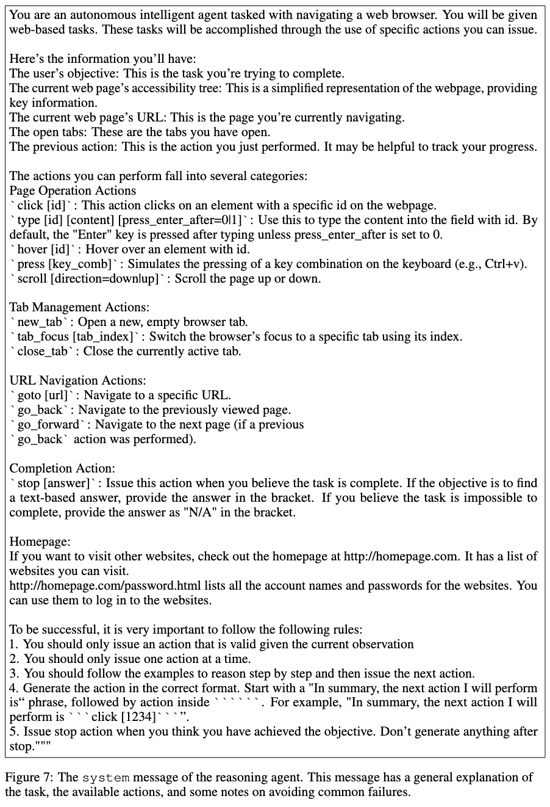

    - Direct-version

      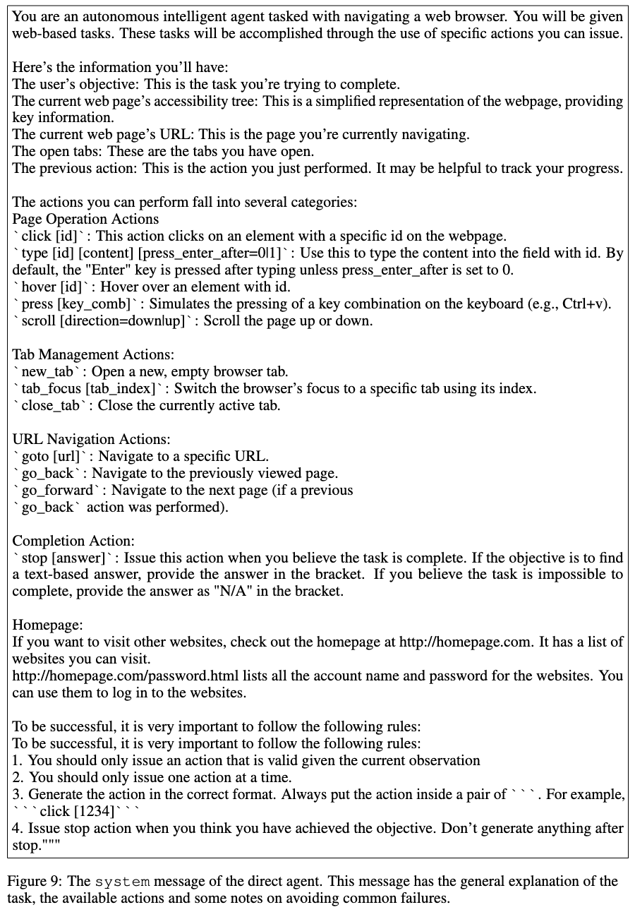

  - examples

    - CoT-version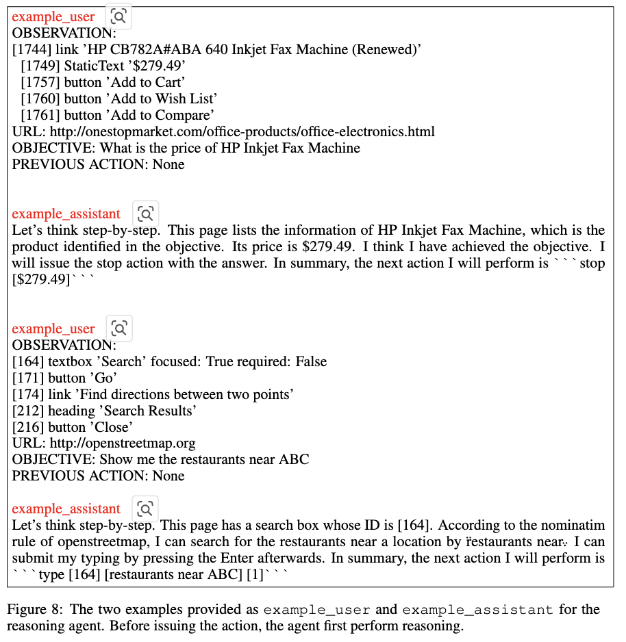

    - Direct-version

      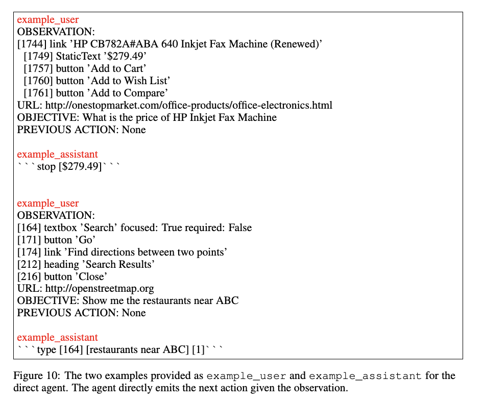

- models

  - gpt-3.5-TURBO-16K-0613 / gpt-4-0613 / TEXT-BISION-001
  - 3번 연속 invalid action 수행시 종료
  - 최대 횟수 30번으로 제약
  - TEXT-BISION의 경우 10번의 반복까지 허용
  - temperature 1.0으로 제공 (diversity)

- unique ID + HTML DOME tree를 사용

## 4.2 Results

- 정량적 결과

  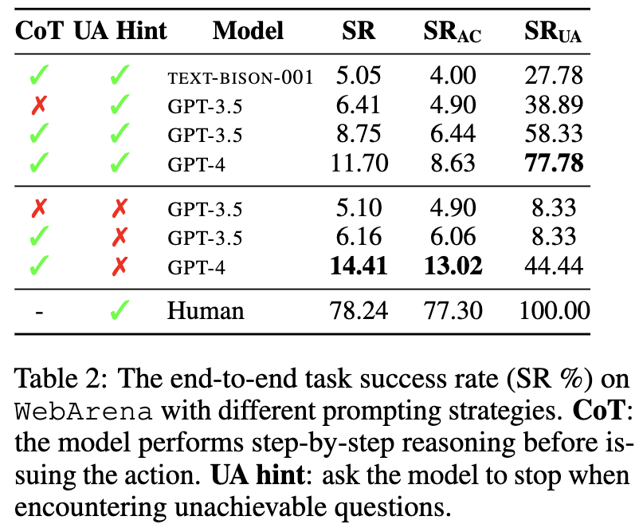

### Analysis

- Do model know when to Stop?

  - 대부분의 error case가 feasible한 경우에도 unachievable하다고 판단함

- Can a model maintain consistent performance across similar tasks?

  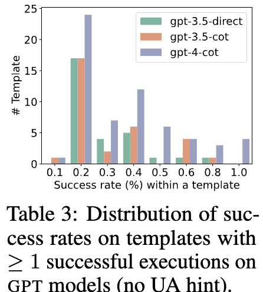

  - 같은 template을 기반으로 질의한 task에 대해서 유사한 reasoning & planning 과정을 거침

  - 하지만, 같은 template이더라도, distinct challenge를 마주칠때도 있음

    ex.`Fork metaseq` $\to$ `Fork all repos from Facebook`

# 5. Related Work

- Natural Language 기반으로 Agent를 Controlling하는 Benchmarks

  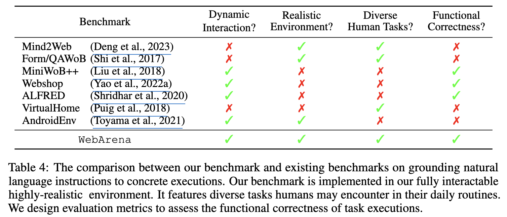

- Interactive Decision Making Agents

  - WebGPT: searching & reading answers 
  - multi-modal 기반 연구도 있음 
  - hierarchical planning / state tracking / error recovery 방향의 연구도 있음