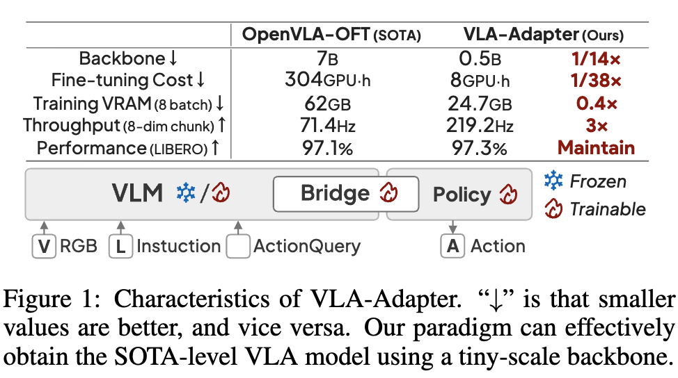
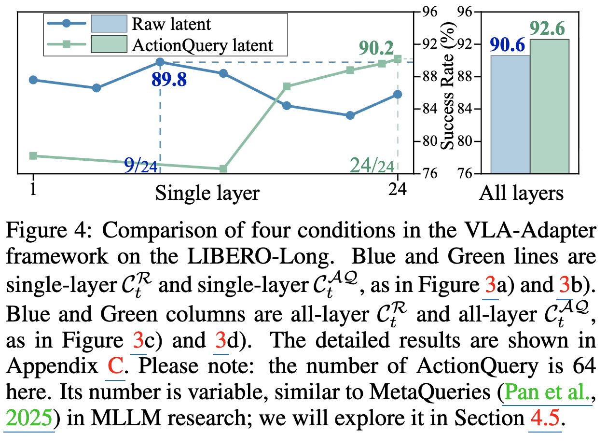

# [VLA] VLA-Adapter: An Effective Paradigm for Tiny-Scale Vision-Language-Action Model

- Paper: https://arxiv.org/pdf/2509.09372
- github: https://vla-adapter.github.io/
- archived (인용수: 0회, 25-09-17 기준)
- downstream task: Robot Simulation Benchmark (Vision + Language + Action)

# 1. Motivation

- 최근 Vision-Langauge 모델로 Action space (Policy model)와 align하기 위한 연구가 많이 진행되고 있다.

- 대부분이 Robotic data (V-L-A paired) 로 pretrain을 요구하여 training cost가 많이 든다.

  $\to$ training cost를 줄일수 있는 방안을 제안해보자!

# 2. Contribution

- Vision-Langauge space (VLM) & Action space (Policy)간의 bridging paradigm 효과를 분석한 최초의 논문

- 충분한 멀티모달 정보를 Action model (Policy Network)에 제공하여 VL & A의 간극을 줄여주는 **VLA-Adapter**를 제안

- 작은 규모의 parameter로 높은 성능(success-rate), 낮은 학습 비용, 빠른 추론 속도을 나타냄

  

# 3. Related Works

- Vision-Langauge-Action (VLA) Models

  - 주로 robot을 instruction으로 제어하기 위해 action의 sequence (trajectory)로 구성된 task
    - Single System: 해당 task용 Policy Network를 pretraining해야함
    - Dual System: VLM + Action 모델의 조합이 등장함. Latency issue 존재

- Bridging from Perception to Action space

  

  - VLM의 raw feature 사용
  - Action 전용 Learnable Query 사용

# 4. VLA-Adapter

### Overall framework

- 3-a, 3-b $\to$ Single Layer 

- 3-c, 3-d $\to$ All-layer

- VLM (Qwen2.5-0.5B / LLaMA2-7B / OpenVLA-7B)

  - Input

    - $X_t^v$: t step에서 3rd-view image

    

    - $X_t^g$: t step에서 gripper image

    

    - $L_t$: t step에서 instruction
    - $AQ_t$: t step에서 Action Query

  - Output

    - $C_t^R$: Raw latent
    - $C_t^{AQ}$: ActionQuery latent

### 어떤 VL의 latent가 Action Policy model이 예측하는데 가장 도움이 될까?

- $C_t^R$: Middle-layer가 action 예측에 필요한 VL embedding을 많이 보유

- $C_t^{AQ}$: Final layer가 action 예측에 필요한 VL embedding을 많이 보유

- Multi-layer feature를 넣는것이 Single alyer feature를 넣는 것보다 우수함

- ActionQuery latent가 항상 Raw latent보다 우수한가? $\to$ task마다 다르다.

  

### Policy with Bridge Attention

- Bridge Attention

  

  - input

    - $C_t^R$: t step VLM의 row latent
    - $C_t^{AQ}$: t step의 ActionQuery latent
    - $A_t^{\tau=0}$:  H-step denoising의 inital action
    - $P_t$: t step의 (robot arm) proprioceptive (고유수용성) state(상태)
      - 관절 위치 (Joint Positions) : ${q_1, q_2, q_3, q_4, q_5, q_6, q_7}$
      - 관절 속도 (Joint Velocities): $\dot{q}_1, \dot{q}_2, \dot{q}_3, \dot{q}_4, \dot{q}_5, \dot{q}_6, \dot{q}_7$
      - 그리퍼(Gripper) 상태: 로봇의 손 역할을 하는 그리퍼의 현재 열림 정도(폭)와 움직이는 속도: $\text{gripper\_width}, \text{gripper\_velocity}$ 

  - 1개의 self-attention + 2개의 cross-attention으로 구성

    - $C_t^R$을 key, value + $A_t^{\tau}$를 query로 cross attention

      

      - Raw latent는 0으로 초기화하여 learnable ratio $g$로 학습

    - $C_t^{AQ}$을 key, value + $A_t^{\tau}$를 query로 cross attention

      

      - Proprioceptive state $P_t$를 $C_t^{AQ}$와 concat하여 cross attention

    - $A_t^{\tau}$를 self-attention

      

- DiT (Diffusion as Tranformers)에서 L1 loss로 바꾼 모델

  

- Loss: L2 loss $\to$ L1 loss로 바꾼게 성능이 좋음

  -  L2 loss

    

  - L1 loss

    

# 5. Experiments

- Dataset

  - LIBERO-Long
  - LIBERO
  - CALVIN

- Experiment Setting

  - $B_1$: Qwen2.5-0.5B
  - $B_2$: LLaMA2-7B
  - $B_3$: OpenVLA-7B

- 정량적 결과

  - LIBERO-Long

    

  - LIBERO

    

  - Linear Probing

    

  - Inference Efficiency

    

- Real-world Scenraio

  

  

- Ablation Studies

  - ActionQuery 갯수에 따른 분석

    

  - Condfition Type에 따른 분석

    

  - Injection 정도에 따른 분석

    