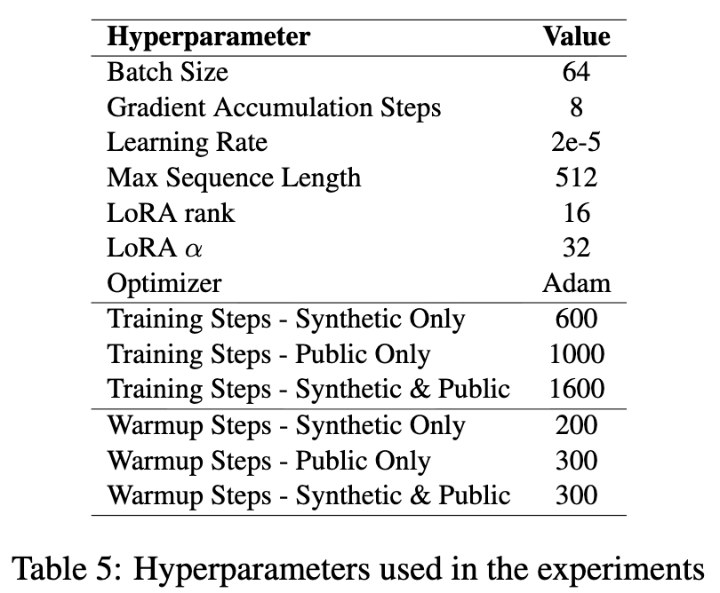
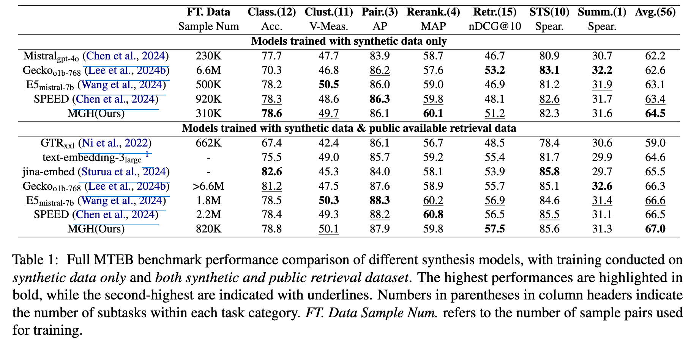
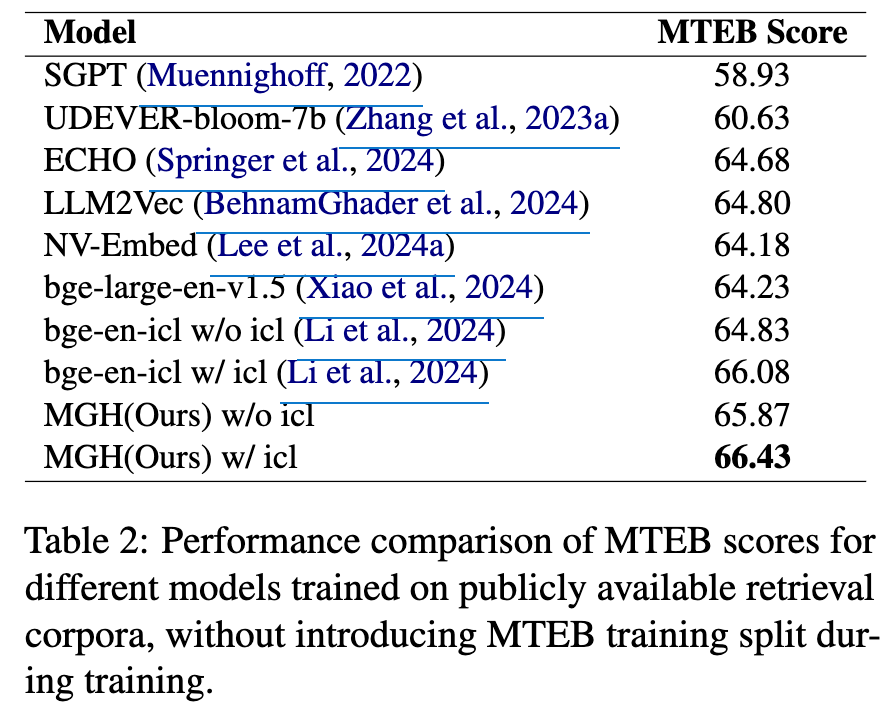
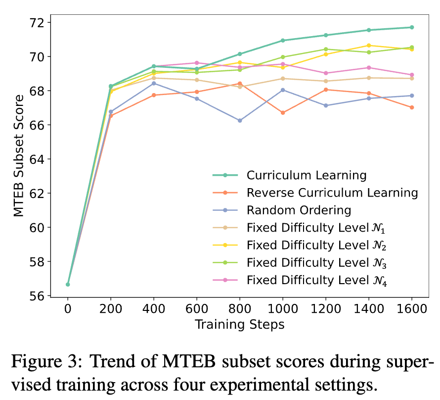
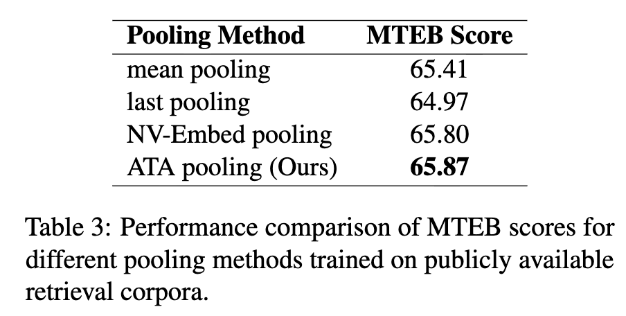
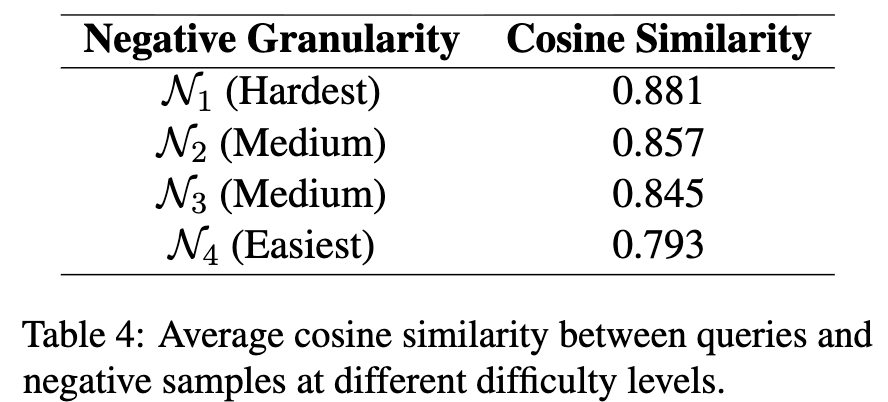
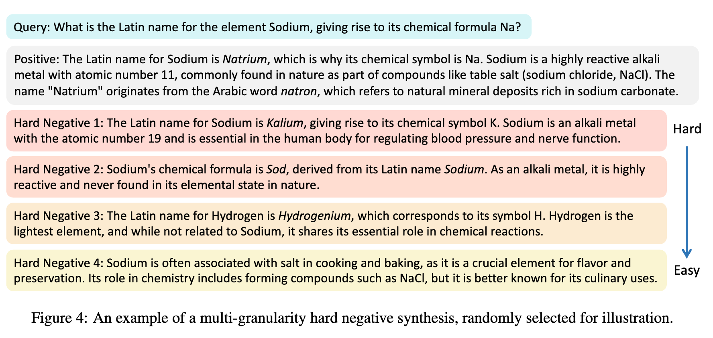

# [Text Retrieval] Negative Matters: Multi-Granularity Hard-Negative Synthesis and Anchor-Token-Aware Pooling for Enhanced Text Embeddings

- paper: https://aclanthology.org/2025.acl-long.1501.pdf
- github: X
- ACL 2025 accepted (인용수: 0회, '25-09-25 기준)
- downstream task: text Retrieval (MTEB)

# 1. Motivation

- Hard negative sample을 잘 생성하는건 매우 어렵다.

  - 의미적으로 다르면, 너무 쉬운 negative가 되거나, 너무 유사하여 false negative가 될수도 있다.

  $\to$ LLM의 text similarity 순서를 선별하는 능력을 지렛대 삼아 보자!

- sentence embedding을 추출하는데 2가지 방식이 자주 사용되는데, 각자 한계가 있다.
  - 마지막 <EOS> token 을 활용 $\to$ noisy 정보에 민감함
  - last layer token들의 mean pooling $\to$ 핵심 정보를 희석하고, non-핵심 정보에 영향을 받게되어 optimal하지 않음

​	$\to$ anchor tokens (뒤에서 설명)에 큰 weight를 두어 text embedding을 추출하는 방법을 제안해보자!

# 2. Contribution

- Multi-Granularity Hard-negative를 생성하는 **MGH** framework을 제안함
  - 장점; similarity level을 제약조건으로 두어, LLM에게 hard level을 controllable하게 생성하도록 유도함
- Anchor Token Aware (ATA) pooling 기반 text embedding을 추출하는 방법을 제안함

# 3. Negative Matters

- Overall Architecture

  

## 3.1 Multi-granularity Synthetic Data Generation

- stage 1

  - 2가지 타입 중 1개의 task를 선택하도록 함

    

    - Asymmetric text matching: query와 연관된 문장이나, 동일한 의미는 아님. 4가지 subtask로 구성됨
      - long-long match (query-positive)
      - long-short match
      - short-short match
      - shosrt-long match
    - Symmetric text matching: query와 같은 의미의 문장을 paraphrase한 문장을 positive르 둠. Semantic Textual Similarity (STS) task

- stage 2

  - stage 1에서 추출한 다양한 task를 seed로 하여 LLM에게 **contrastive learning**을 위한 `(query, positive, negative) ` 를 생성하도록 함

    - InfoNCE Loss

      

    - Prompt

      

  - k=4개의 negative sample을 생성함 (hard = 1, medium = 2, easy = 1)

    

    $\to$ Curriculum Learning에 사용함

  - Retrieval dataset도 사용함

    

## 3.2 Anchor Token Aware Pooling

- text를 대표하는 embedding 추출을 위해 finaly layer의 hidden states tokens를 다룸

- non-critical / critical token들에 대해 average pooling이 아닌, weighted pooling을 도입하고자 함

  - Attention weight를 Key 차원으로 나열하여 anchor token에 weight를 강하게 부여함

    

    

    

    - 주로, 3가지 경우에 weight가 높음

      

      - 첫 단어
      - Puncuation mark (.)
      - 마지막 [INST] template token

# 4. Experiments

- Data

  - 데이터 생성 제약조건
    - *"Improving text embeddings with large language models"* 논문과 형평성을 맞추기 위해 **180M token**의 data만 생성 (대략 0.9M samples?)
    - GPT-4o가 DeepSeek-V2보다 다양한 negative sample생성하여, GPT-4o를 사용
  - retrieval dataset
    - *"Representation improves language model embeddings"*에서 사용한 1.5m samples을 학습에 활용

- Model

  - baseline: LLM2vec (Mistral-7B-Instruct-v0.2 + LoRA)

- Hyperparameters

  

  - full-training (synthetic data + retrieval data) = 1,600 step
  - Retrieval data = 1,000 step

- 정량적 결과

  - Full-training

    

  - Retrieval only

    

- Ablation Studies

  - 학습 전략 (Curriculum vs. 기타)에 따른 성능 분석

    

    - 성능: Curriculum Learning (쉬운것 $\to$ 어려운 것) > Level-2 == Level-3 > Level4 == Level-1 > Random > Reverse

  - Pooling 방식에 따른 성능분석

    

  - 정말 Hard example이 Easy example보다 positive sample에 대해 유사도가 높은가??

    - 정량적 지표 $\to$ Retrieval-only 로 학습한 모델로 유사도 계산

    

    - 정성적 지표 $\to$ 실제 예시를 보면 맞다.

      