# [Agent] DeepAnalyze: Agentic Large Language Models for Autonomous Data Science

- paper: https://arxiv.org/pdf/2510.16872
- github: https://github.com/ruc-datalab/DeepAnalyze
- archived (인용수: 0회, '25-10-23 기준)
- downstream task: Deep Research,  Data Scientist workflow 자동화 (autonomous data science)

# 1. Motivation

- Raw data sources로부터 분석가 수준의 Deep research report를 자동화하는 "autonomous data science" 분야는 높은 기준으로 인해 도전적인 task이다.

  - Data preparation
  - analysis
  - modeling
  - visualization
  - report generation

- 기존에는 domain specific LLM / workflow-based agents로 성능이 많이 향상되었으나, 이는 아래 두 가지 능력에 있어 **완전 자동화**에 한계가 있고, predefined workflow에 의존적이다.

  - **autonomous orchestration**: 유저의 의도를 이해하고, 상호 종속적인 action sequences를 조율하는 능력
  - **adaptive optimization**: real-world environment과 상호작용하며 action을 반복적으로 수정하는 과정

- Search domain에 있어 **agentic training**에 성공사례 (search-R1, DeepResearcher)가 있음. 이를 Data science에도 적용해보면 어떨까?

  $\to$ end-to-end autonomous data science를 수행하기 위한 agentic LLM 를 제안해보자!

# 2. Contribution

- **Agentic Model**: 자동으로 data science task를 수행하는 Trainable agentic model인 **DeepAnalyze**를 제안함
- **Agentic Training**: 두 가지 해결 과제를 해결하기 위해 새로운 전략을 제안함
  - 문제 1. **reward sparsity**: long-chain (problem-solving) trajectory의 결과로 reward를 주기 때문에, 중간 중간 guidance signal이 부족함 (ORM: Output Reward Model의 전형적 한계) $\to$ 중간 중간 의미있는 supervision없이 불충분한 데이터 기반 trial-and-error exploration을 수행
    - 해결책 1. **curriculum-based agentic training paradigm**: **인간 data scientist**가 분석 능력을 배우는 과정을 motivation으로, 개별 skills (data preparation, data anaysis, data modeling, data visualization, etc)부터 학습하여 점차 open-ended data research까지 순차적으로 학습(**easy-to-difficult**)하는 패러다임.
  - 문제 2. **trajectory scarcity**: 문제를 해결하는 전 과정 (trajectory) 데이터셋이 매우 부족함
    - 해결 2. **data-grounded trajectory synthesis** framework를 통해 고품질의 reasoning & 상호작용 trajectory 를 자동으로 수집
- **Strong performance**: 12개의 benchmark에서 8B치고는 매우 훌륭한 결과

# 3. DeepAnalyze

## 3.1 Architecture

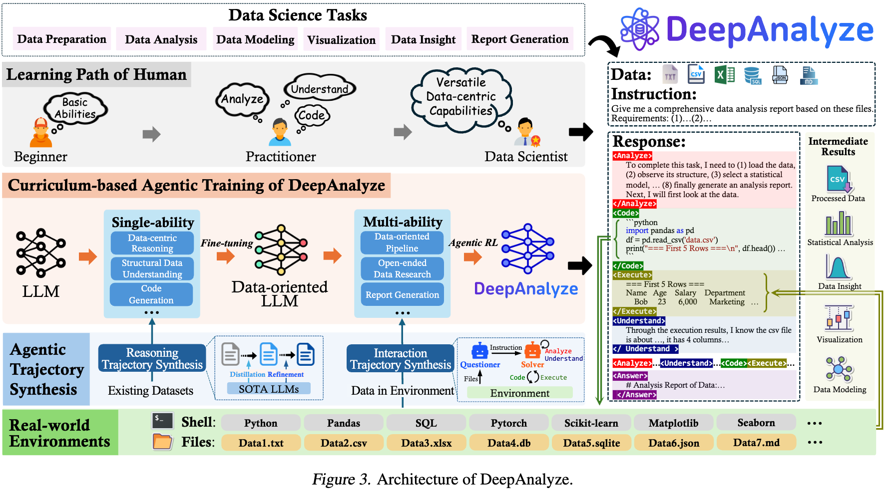

- Input Format

  - 기존에는 raw sources(databases, csv, xlsx files) $\to$ unstructured Markdown로 변형해서 풀고 있었음.

  - 이 방식은 LLM의 context length limitation으로 인해 small-scale 로만 제약됨.

  - 반면, human data scientist는 전체 record를 수동적으로 다 읽지 않고, 능동적으로 data source를 탐험하며, 필요시 계획을 세움 $\to$ 이 방식으로 해보자!

    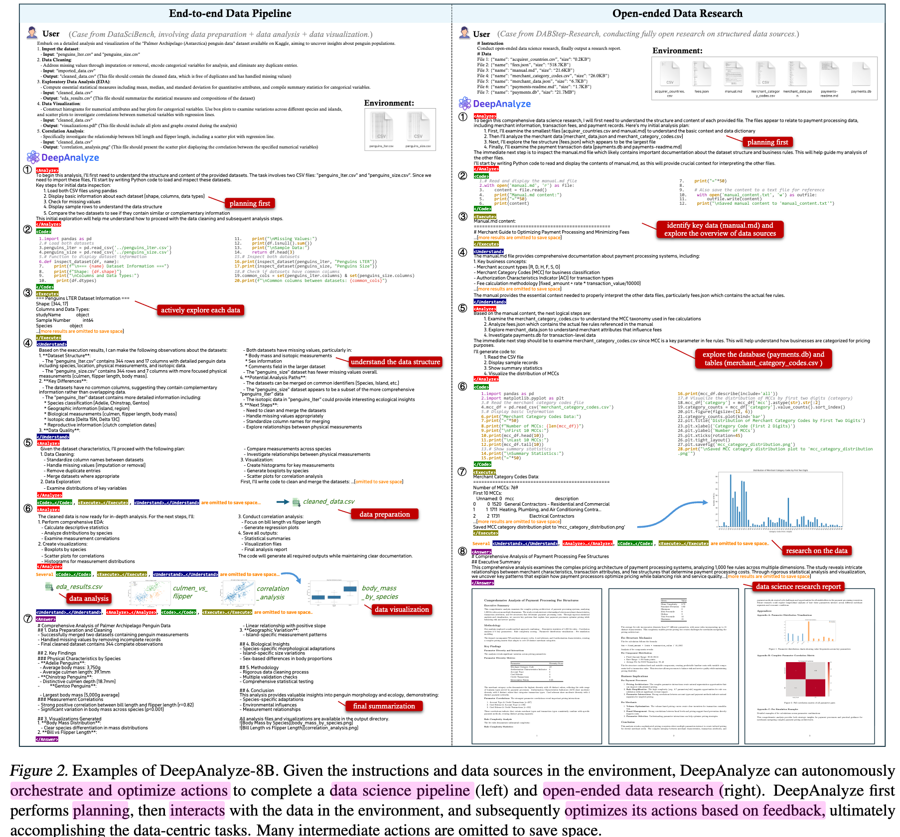

  - Interaction Pattern

    - analyze $\to$ code $\to$ understand $\to$ execute의 반복!

      - <Analysze>...</Analyze>: planing, reasoning, relfection, self-verification 등 text적으로 분석
      - <Understand>...</Understand>: data source의 문맥(databases, tables, documents, etc)을 이해하고자 함. 
      - <CCode>...</Code>: environment에 상호작용할 code를 생성. (python)
      - <Execute>...</Execute>: code를 환경에 실행하여 환경으로부터 feedback를 얻음
      - <Answer>...</Answer>: 최종 출력 (report) 생성

    - 위 5개의 special token을 vocabulary에 추가하여, 서로 다른 action간의 switching이 자동으로 되도록 함

      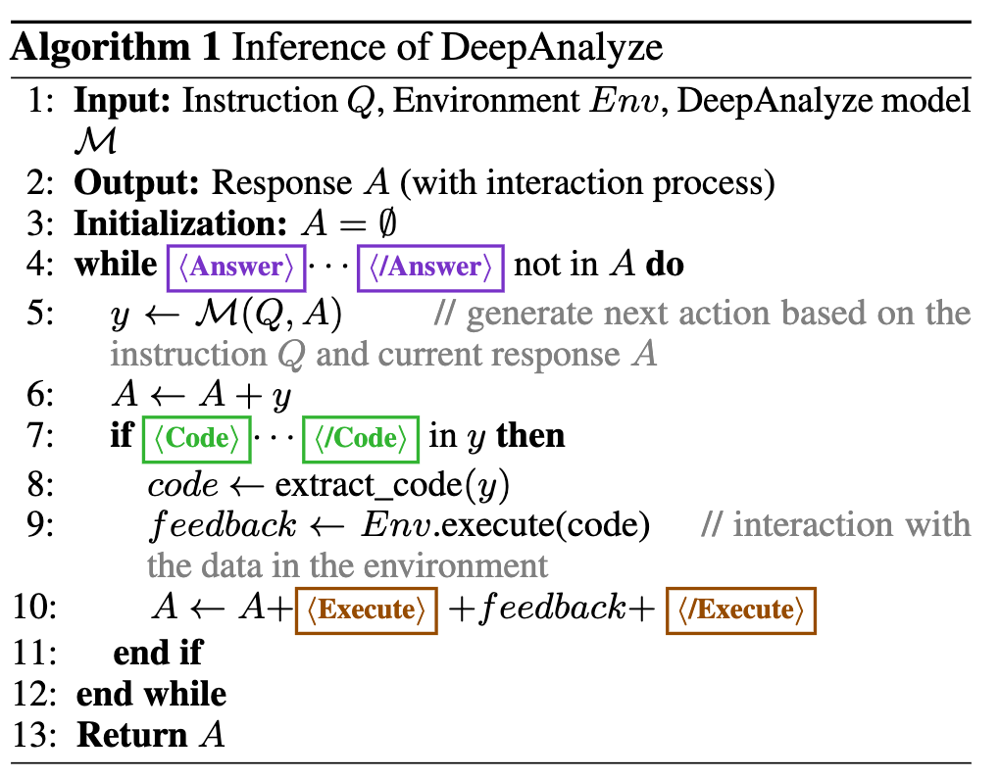

## 3.2 Curriculum-based Agentic Training

- 단순한 QA task와 다른점: reasoning, structured data understanding, code generation등 개별 task를 통합하는 능력(**composite ability**)

- human data scientist들이 개별 능력을 키우고, 분석능력을 키우듯 Curruculum기반 학습을 수행

  - Stage 1. Single-ability Fine-tuning

    - Abilities
      - Reasoning$\to$ Analyze token을 통해 호출
      - Structured data understanding$\to$Understand token을 통해 호출
      - Code generation$\to$Code token을 통해 호출
    - Reasoning data
      - long CoT 데이터를 추출

  - Stage 2. Multi-ability Agentic Training

    - 여러 능력들을 real-world 환경에서 agentic 강화학습을 통해 학습

    - synthesized interaction trajectory를 통해 cold-start (finetuning)

    - 이후 GRPO기반 RL을 통해  real-world와 상호작용 trajectory로 학습

      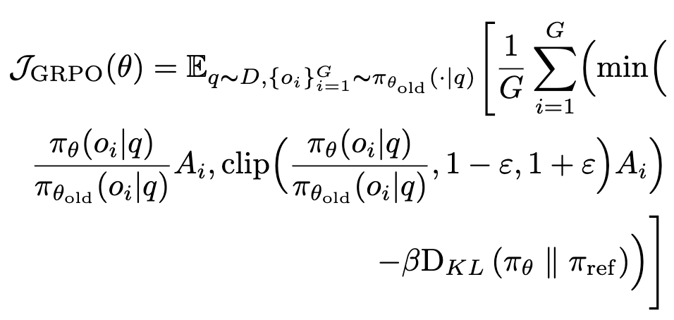

    - Hybrid Reward Modeling

      - 정답이 주어진 경우, rule-based reward + LLM-as-a-judge reward를 혼합하여 reward를 모델링

        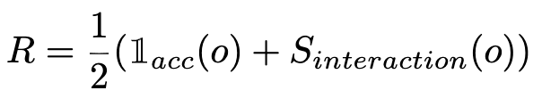

        - $\mathbb{I}_{acc}$: 0 혹은 1. 최종 결과가 정답인지 여부로 reward
        - $S_{interaction}$: 전체 trajectory의 quality에 따라 0~1사이 값 표현. 정확히 어떻게 계산했다고 명시되어 있진 않음

      - open-ended question의 경우, 최종 report quality를 5가지 축에 따라 LLM-as-a-judge로 점수 부여 후 Reward를 모델링

        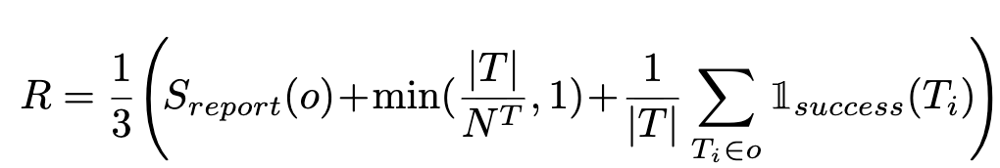

        - $S_{report}$ 5가지 축: usefulness, richness, soundness, interpretability, readability
        - |T|: 환경과 상화작용한 turn 횟수
        - $N^T$: 10. hyperparameter
        - $\mathbb{I}_{success}(T_i)$: 각 interaction이 성공했는지 여부

## 3.3 Data-grounded Trajectory Synthesis

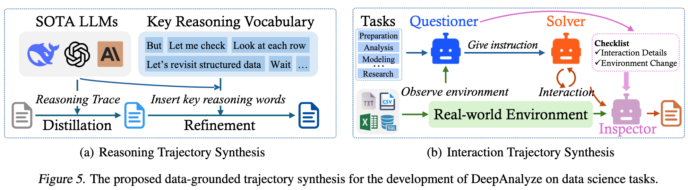

- curriculum-based agentic training은 고품질의 reasoning & trajectory data에 매우 종속적임
  - **Reasoning trajectory synthesis**: Structured data Instruction 데이터셋(TableQA, etc) 의 instruction-answer에서 DeepSeek-R1 같은 advanced LLM을 teacher모델로 활용하여 reasoning trajectory를 생성함
    - analyze: reasoning process
    - Understand: structured data understanding process
    - 추가로 keyword-guided refinement를 거침
      - "but/wait"같은 crucial role을 수행하는 reasoning vocabulary 문자를 추가하여 핵심 role이 되는 reasoning을 강조하도록 함
  - **Interaction Trajectory synthesis**: open된 benchmark는 대용량 structured data sources를 보유한 반면, multi-turn interaction trajectory가 없음. $\to$ 환경과 상호작용하기 위해 multi-agent system으로 role을 부여하여 trajectory를 가상으로 생성함
    - questioner: 평가의 척도가 되는 checklist를 생성 (instruction의 turn 제약 횟수, code library 등)
    - solver: environment와 상호작용하며 5가지 action으로 task를 수행함.
    - Inspector: solver의 trajectory를 평가하고, 환경 변화를 checklist를 고려해 해당 trajectory를 accept/deny결정

## 3.4 DataScience-Insturct-500K

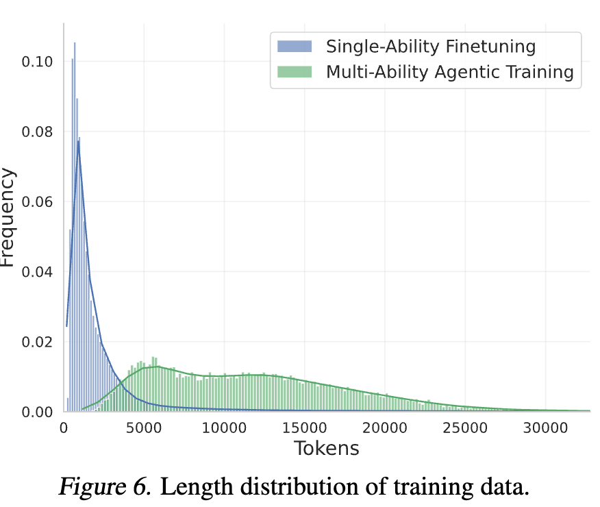

- Single-ability data: 470K (100K made by AM-DeekSeek-R1 + reasoning data)
- Multi-ability data: 35K (20K cold-start phase + 15K RL phase)

# 4. Experiments

- Benchmark

  - DataSciBench: data preparation, data analysis, data modeling, data visualizatoin, and data insight 전과정을 포함
  - DSBench: ModelOFF & Kaggle competion 기반으로 540-real-world task를 구축
  - DABStep: data agent benchmark (450-real-world data)
  - DABStep-Research: DABStep에 data science report generation을 추가하여 해당 논문저자들이 만듦
  - DS-100: code-generation benchmark
  - TableQA Benchmark: structured data (tables, etc)에 대한 benchmark

- Model

  - DeepSeek-R1-0528-Qwen3-8B를 backbone으로 DeepAnayze-8B를 구축
  - NVIDIA A800 gpu를 활용

- 정량적 결과

  - DataSciBench

    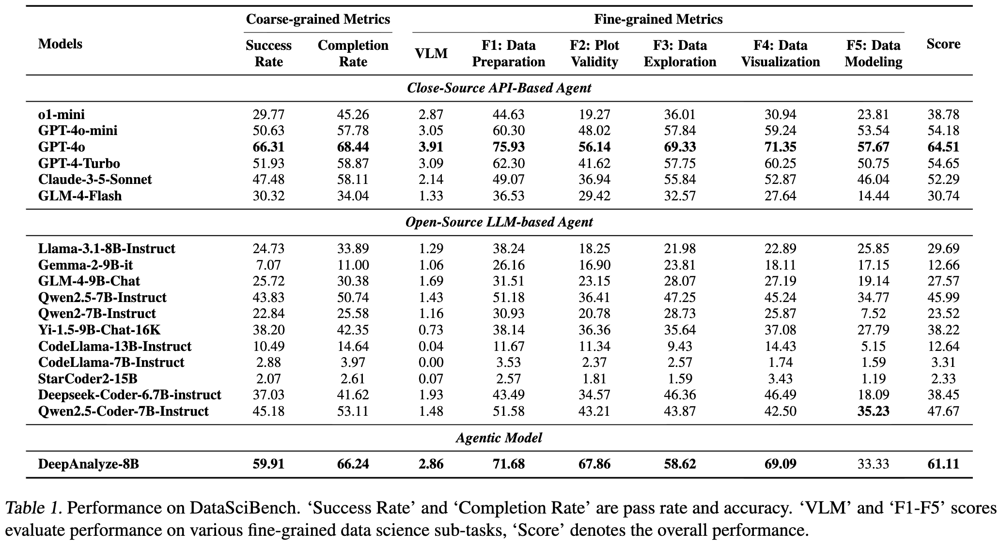

  - DSBench-data analysis

    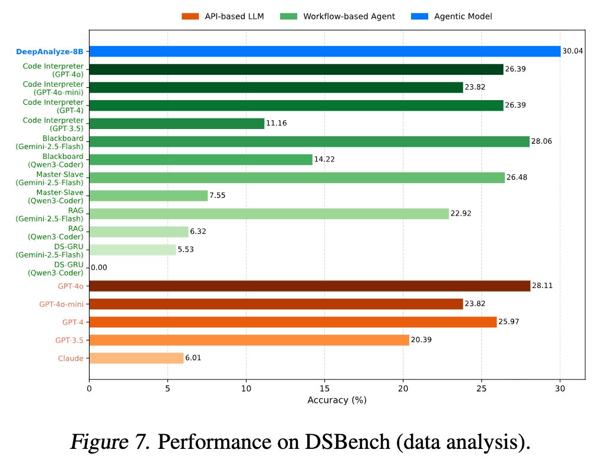

  - DSBench-data modeling

    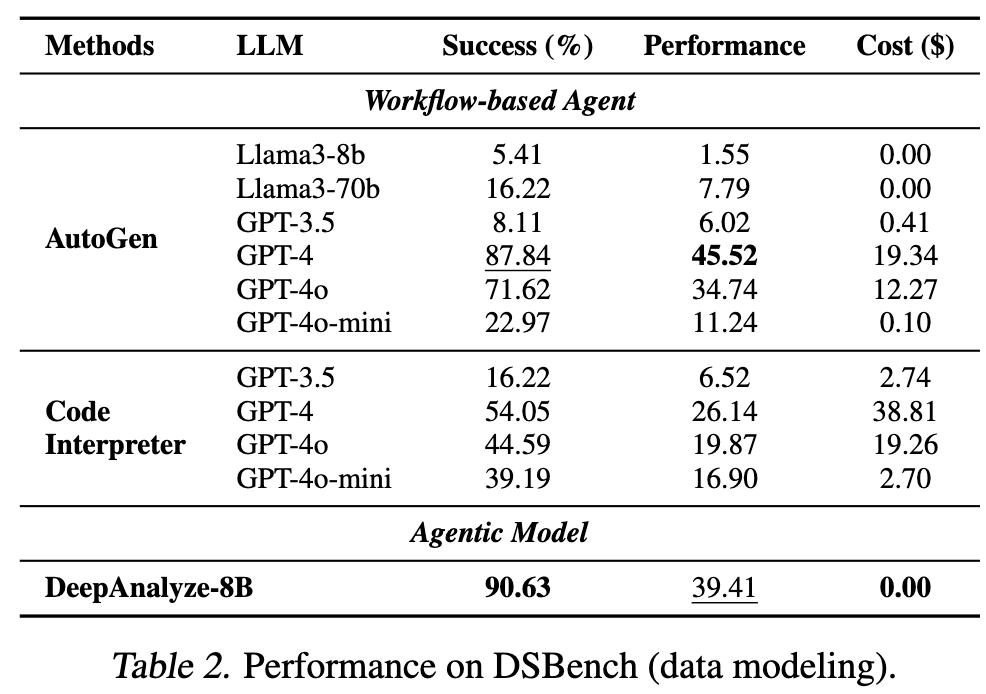

    - DABStep-Research

      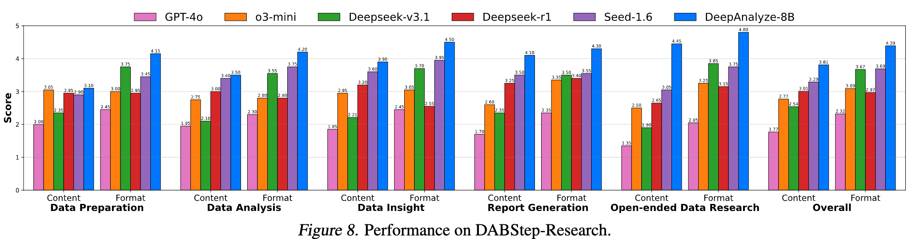
  
    - TableQA benchmark
  
      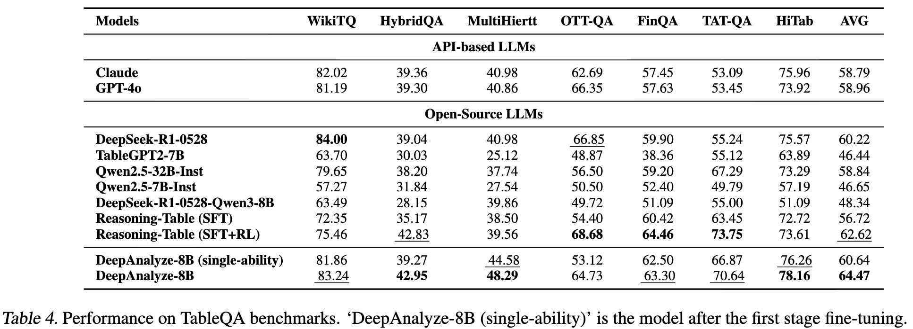
  
    - DS-100 
  
      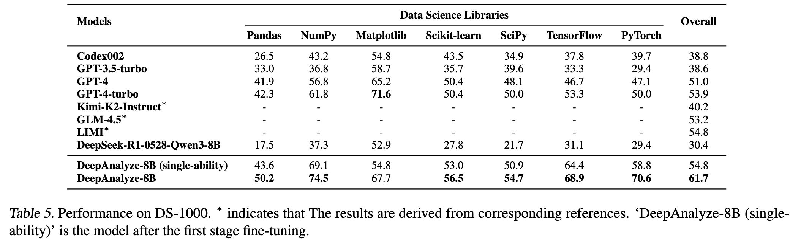
  
  - Ablation Study
  
    - Understand action 유무에 따른 결과
  
      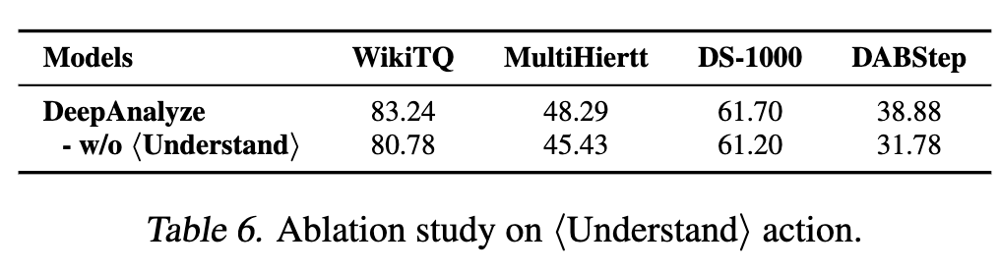
  
    - Curriculum-baased agentic training 유무에 따른 결과
  
      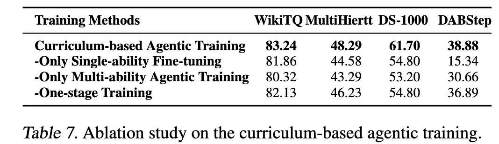
  
    - CoT Distillation + (keyword-based) Refine 유무에 따른 분석
  
      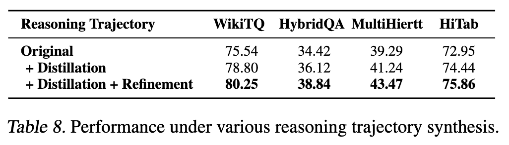
  
    