# [CL]\[MLLM] Scaling Language-Centric Omnimodal
Representation Learning

- paper: https://arxiv.org/pdf/2510.11693
- github: https://github.com/LCO-Embedding/LCO-Embedding
- NeurIPS 2025 accepted (인용수: 0회, '25-10-29 기준)
- downstream task: MIEB benchmark

# 1. Motivation

- MLLM기반의 backbone embedding은 generative pretraining 시에, multimodality간의 alignment가 잘되어 있음

  $\to$ text-only contrastive learning기반의 lightweight CL(Contrastive Learning)만으로도 다른 modality에 대해 retrieval 성능이 향상하지 않을까?

- CLIP기반의 embedding에 비해 MLLM기반의 embedding의 downstream task 성능이 좋은 원인에 대한 분석이 부족함

  $\to$ MLLM기반의 embedding 모델이 성능이 좋은 원인에 대한 시스템적인 분석을 해보자!

# 2. Contribution

- Language-centric paired data기반으로 multimodal embedding을 효율적으로 학습하는 Language-Centric Omnimodal Embedding framework를 제안함
  - text-only학습: lightweight CL로, pre-aligned generative embedding을 similarity-matching space로 mapping해주는 post-hoc refinement step
    - LoRA기반 학습을 통해 generative 능력 훼손 최소화
    - text의 embedding 분류 성능뿐 아니라 다른 modality (ex. image, audio)의 embedding 분류 성능도 향상됨을 발견
- MIEB benchmark에서 SOTA
- Generation-Representation Scaling Law (GRSL)의 이론적 배경을 제안
  - Generative 성능이 좋으면, Representation 성능도 좋아진다
  - 서남아시아 언어 (low-resource language) 대상으로 해당 이론을 실험적으로 입증

# 3. LCO-EMB (Language-Centric Omnimodal Embedding)

## 3.1 Laten Cross-Modal Alignment in MLLM

Anisotropy Degress & kernel-level similarity를 기준으로 평가 진행

- Anisotropy Degrees?

  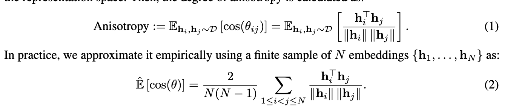

  - Random data points (*D*)로부터 임의로 추출한 임베딩 벡터간의 유사도를 N개에 대해 평균을 낸 값.

  - Random data 유사도가 특정 영역에 집중 되었으면 mode collapse를 의미함 $\to$ 낮을수록 좋다.

    

- Kernel-level Similarity?

  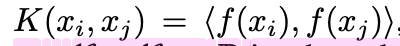

  

  - kernel (=non-linear activation, model output)의 출력값의 inner-product metric간의 거리값으로, 두 representation space간의 얼마나 유사한가를 나타내는 척도.

  - 본 논문에서는 image, caption에 대해 mutual kNN을 통해 얻은 data points에 대해 similarity structure (m)을 구하고, 이들간의 intersection이 되는 data point의 비율로 계산 

    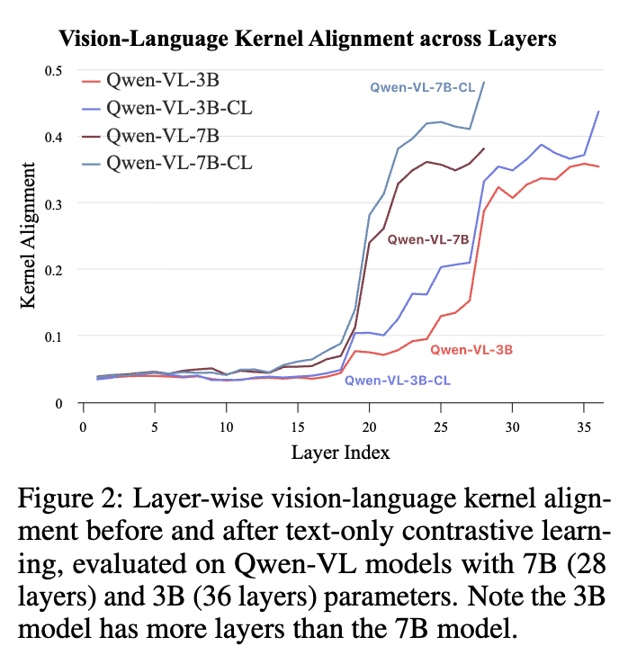

    - mini-batch 내에서 실제로 구현을 진행
    - 높을수록, 다른 modality간의 align이 잘되었음을 의미

    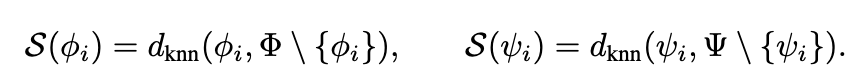

    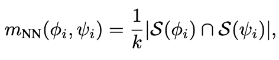

    - $\phi_i$: i번째 text embedding
    - $\psi_i$: i번째 image embedding

## 3.2 Language-centric Omnimodal Representation Learning

- overview

  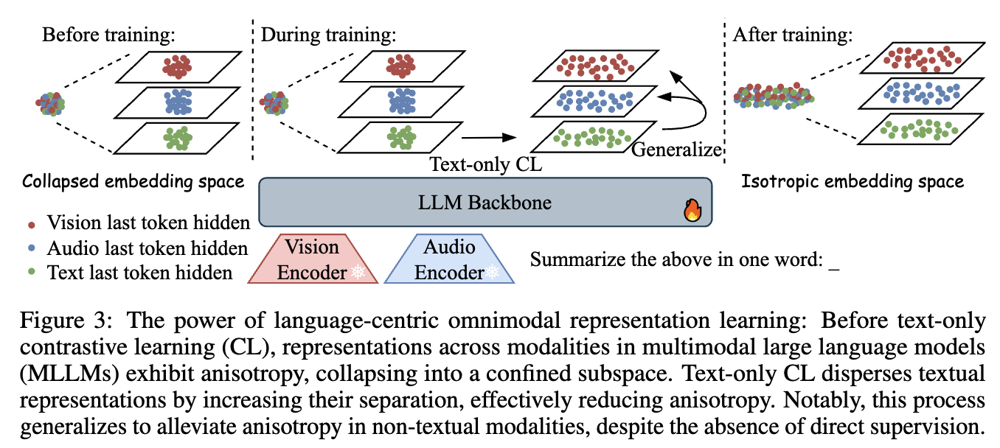

  - Modality-specific encoder, projector는 freeze하고, language decoder만 LoRA로 CL 학습

# 4. Experiments

- Training datasets

  - text-only training
    - All-NLI
    - Scale-1M
  - multimodal 추가 학습
    - 94K

- Evaluation datasets

  - MIEB-Lite
    - Linear probling, Retrieval (영어/비영어), Zero-shot Classification, Compositionality Evaluation, Vision-Centric QA, Document Understanding, Clustering, Visual STS, etc
  - 평가 metric
    - Recall@1

- 정량적 결과

  - MIEB-Lite (51 tasks) (= Vision Centric QA, Retrieval, Zero-shot Classification, Clustering)

    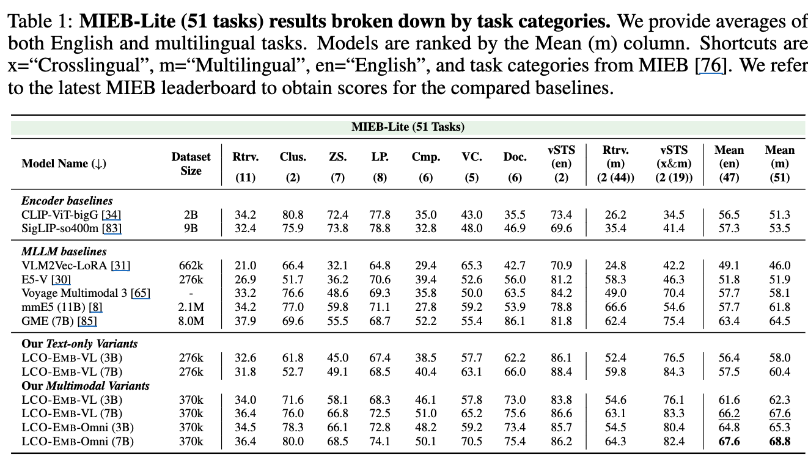

    

- Ablation Studies

  - Text-only variant

    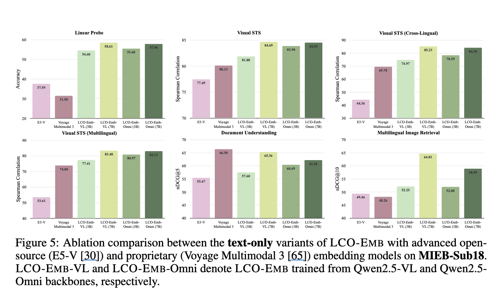

    - text-only training만해도 최신 embedding모델보다 성능이 좋다.

  - Training data & model soup에 따른 성능 분석

    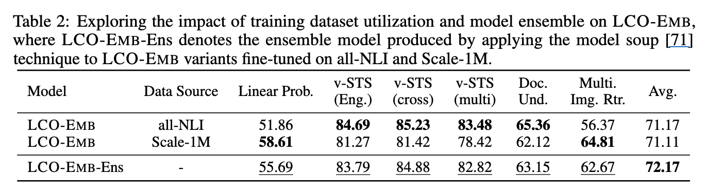

    - model soup: domain specific LoRA 학습 후, 해당 LoRA layer parameter를 평균취함

  - 학습 방식에 따른 성능 분석 (LoRA vs. Full-finetuning vs. LP vs. CLIP-style CL)

    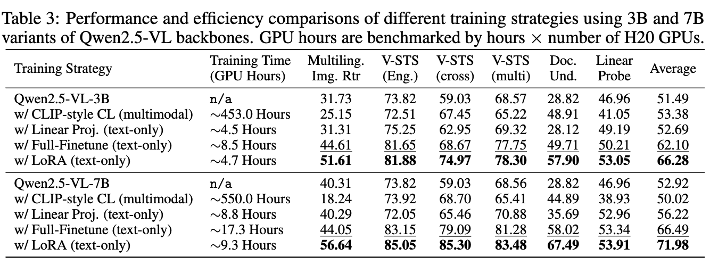

  - Generation-Representation Scaling Law

    - 한문장 요약: Generation성능이 좋은 모델의 representation 성능도 좋다.

      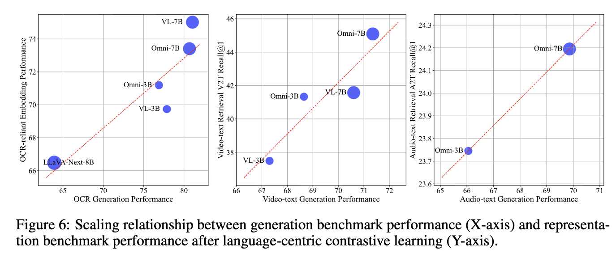

    - 서남아시아 언어 (Thai, Vietnamese, Malay, Lao) 와 같이 low-resource에서 실험해보자!

      - 29개의 책 (50,55 pages, 경제, 자연 과학, 기술, 역사, 정치, 예술, 심리학, 교육, 나라 리포트)

        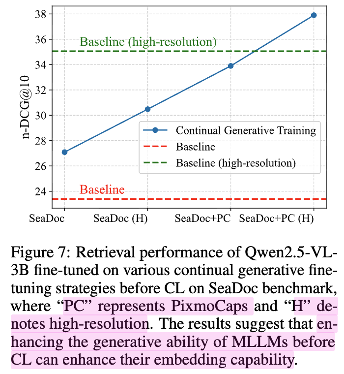