# [Retrieval] Jina-embedding V4: Universal Embeddings for
Multimodal Multilingual Retrieval

- paper: https://arxiv.org/pdf/2506.18902
- github: X
- huggingface: jinaai/jina-embeddings-v4
- archived (인용수: 9회, '25-11-04 기준)
- downstream task: Multimodal Retrieval, nlp-to-code retrieval, t2t retrieval

# 1. Motivation

- 다국어 / 다기능 / mulimodal embedding 모델을 개발하는데 어려움이 있음
  - Visually rich한 데이터, computer coding language, image 등
- Late Interaction style의 single tower LLM embedding을 만들어보자!

# 2. Contribution

- ViDoRe 등 **visually rich**한 데이터를 다루는데 능한 Jina-v3 (Qwen-2.5-VL-3B)기반 LoRA로 학습한 jina-embedding-v4를 제안함
- Multi-Lingual/Multi-domain 을 커버하는 benchmark인 Jina-VDR를 제안함

# 3. Jina-v4

- Background

  - Multimodal embedding 모델: 여러 modalities를 동일한 semantic embedding space로 projection하는 것

- jina-v4

  - task-specific한 instruction 없이 t2t, t2i를 동시에 학습 및 처리할 수 있음

  - late interaction기반으로 simailarity score를 연산함 (maxSim)

    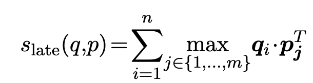

- Jina-VDR

  - ViDoRe는 QA task만 존재함
  - MIEB의 확장버전임 (MIEB + STS task for visually rich documents (screenshots))

  

## 3.1 Model Architecture

- Clip-style vs. jina style
  - Clip은 modality encoder가 분리
  - jina는 single modality로 truely multimodal encoder

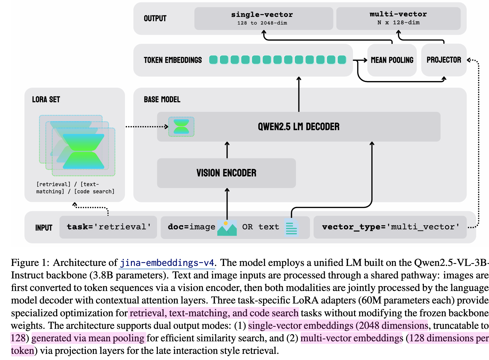

## 3.2 Dual Mode Output

- Single-vector embedding (dense)
  - 1 x d 차원의 embedding이 sample별로 생성
  - token dimension에 Mean-pooling 적용하여 계산
- Multi-vector embedding
  - n x d 차원의 embedding이 sample별로 생성
    - n: token-level

## 3.3 Task specialization with LoRA

- Task별로 LoRA adapter를 별도로 분리하여 학습을 수행 (약 2%==60M params.)

- Tasks

  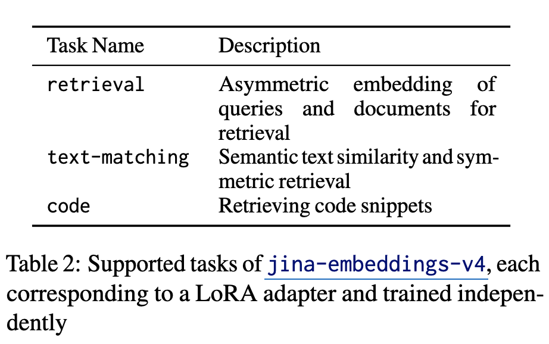

  - Asymmetric Query-Document Retrieval
  - Semantic Similarity & Sysmmetric Retrieval
  - Code (computer programming language) Retrieval

# 4. Training

## 5.1 Pair Training data

- 300 sources에서 취득한 t2t, t2i data로 구성
- website screenshots, rendered markdown files, charts, tables, 등등 wild data를 추가
- query는 keyword, key phrases, long descriptions, statements of facts를 사용

- Task-specific training

  - Multi-vector 기반 Matryoshka loss 적용

    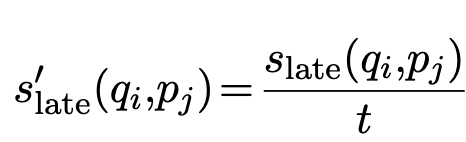

    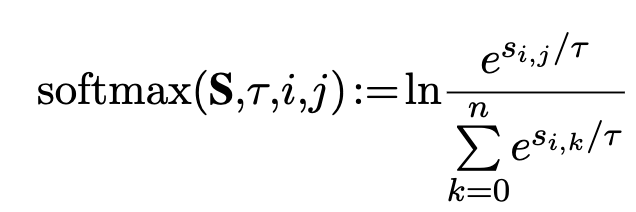

    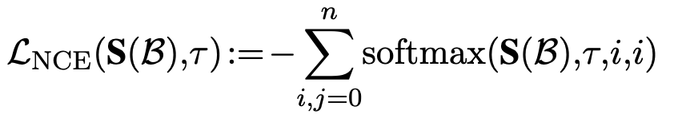

  - Single vector & Multi vector간의 KLD를 적용하여 error 분포가 동일해주도록 훈련

    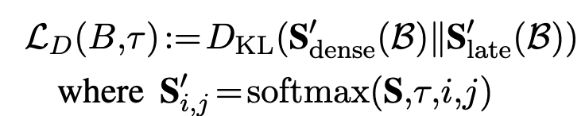

    - Multi-vector가 보통 less error를 띔

  - Total joint loss

    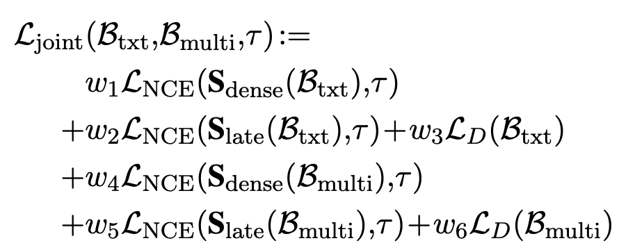

## 5.2 Asymmetric Adapter

- backbone: Qwen2.5-VL-3B-Instruct + Multi-vector projection layer + LoRA

- Asymmetric Retireval Adapter

  - Query / key에 별도의 LoRA adapter를 사용

  - prefix method를 사용

    - ex. "query: ", "key: "를 앞에 추가

  - hard negatives포함한 학습셋으로 학습 수행 + in-batch negative

    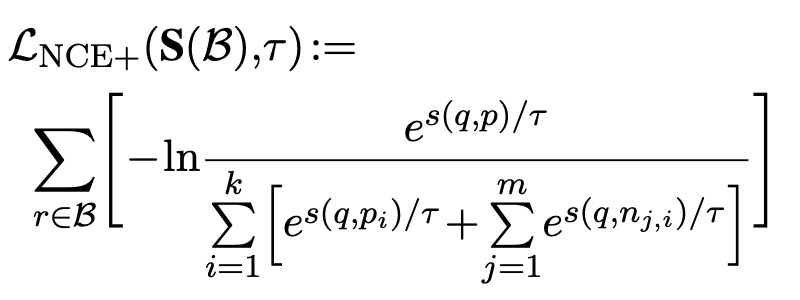

## 5.3 Text Matching Adapter

- similar values를 갖는 GT로 학습하는게 제일 좋았음

  - 유사도 score에 대한 정답이 있을 경우 ($s(q_2,p_2) > s(q_1,p_1)$ )

  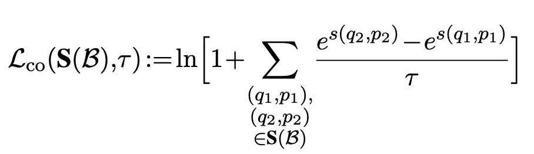

  - 유사도 score 정답이 없을 경우 InfoNCE로 학습

## 5.4 Code Adapter

- Language-to-Code retireval
- CodeSearchNet + StackExchangeQA datasets로 pretrain된 Qwen2.5-VL-3B을 사용
- CodeSearchNet, CodeFeedback, APPS, CornStack dataset으로 triplets기반 학습

# 5. Jina-VDR: Visually Rich Document Retireval Benchmark

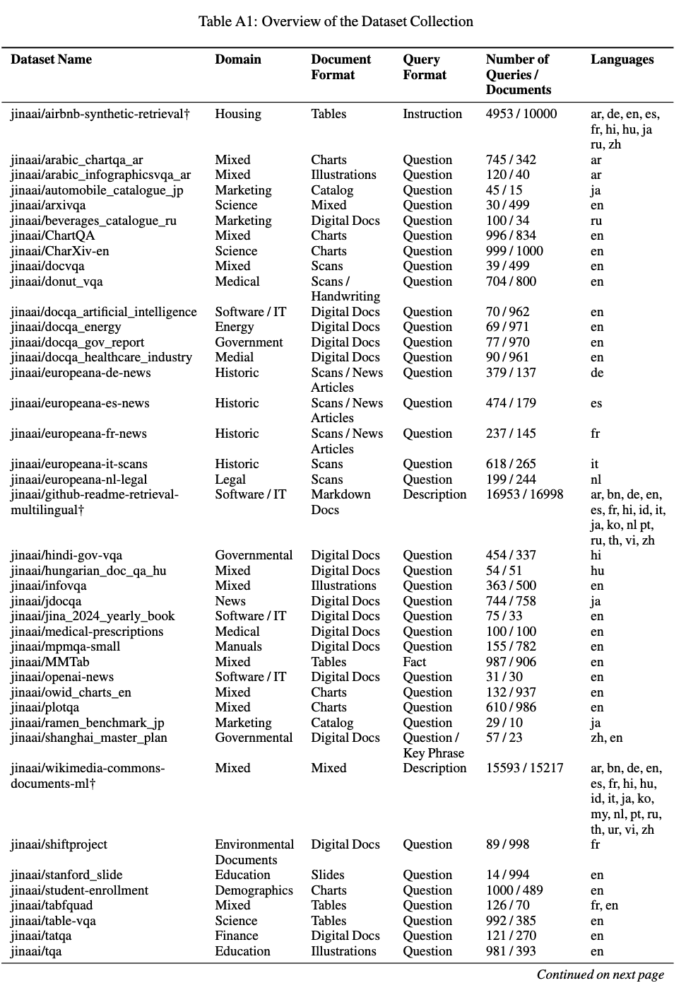

- Manually annotated + Synthetic Data Generation으로 구축

# 6. Experiments

- 정량적 결과

  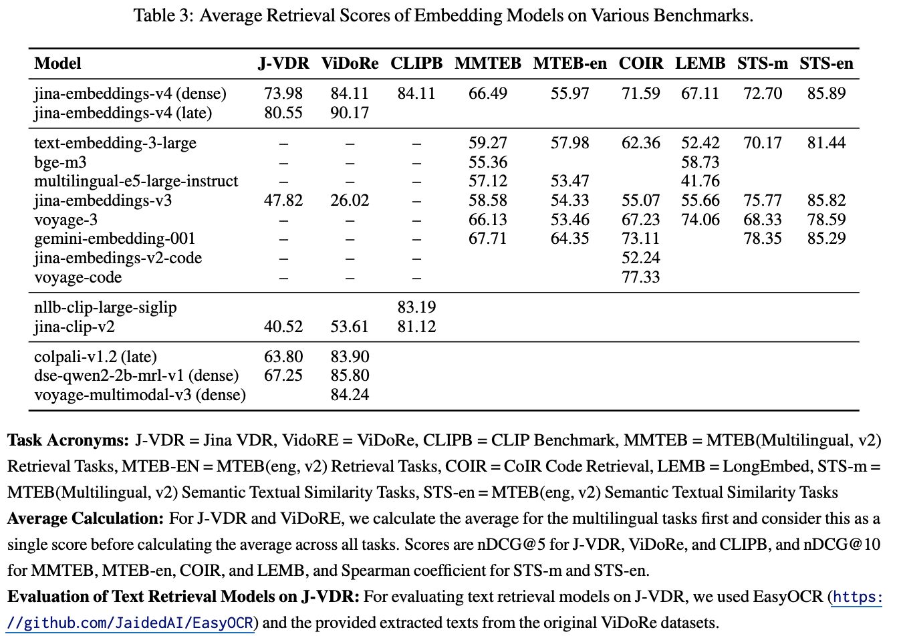

- Modality Gap

  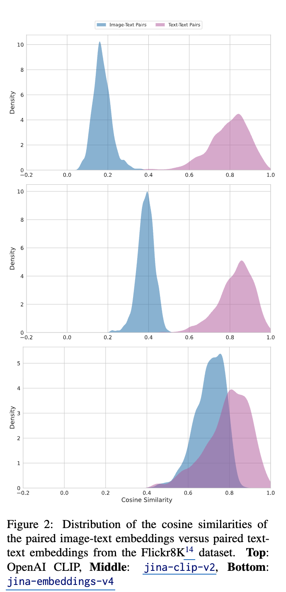

- Cone Effect

  - 더 다양한 분포로 학습됨 $\to$ embedding space를 넓게 활용함

    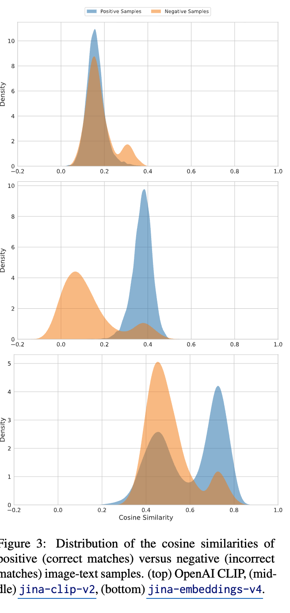