# [Layer] LayerD: Decomposing Raster Graphic Designs into Layers

- paper: https://arxiv.org/pdf/2509.25134
- github: https://cyberagentailab.github.io/LayerD/
- ICCV 2025 accepted (인용수: 0회, '25-11-14 기준)
- downstream task: Automatic graphic layout decomposition

# 1. Motivation

- 많은 그래픽 디자이너들은 layer representation으로 된 graphic design 기반으로 편집작업을 수행한다.

- Adoebe Photoshop, Powerpoint같은 authoring tool은 완성된 디자인을 raster image형태도 제공하여, layer정보가 손실된다.

- Raster Image는 layer정보 누락으로 편집하기 힘들다.

  $\to$ inverse composition task를 수행하는 프로세스를 제안해보자!

# 2. Contribution

- Iterative *top-layer* matting과 background completion (inpainting)의 조합으로 구성된 **LayerD**를 제안함

  - *top-layer*: occlusion없이 제일 앞에 등장하는 objects (주로 typography)

  - LayerD

    - 고품질 graphic design dataset으로 학습한 **top-layer matting model**
    - Off-the-shelf inpainting model

    $\to$ 기존에 방식들(detection + segmentation + layer ordering)보다 간결함

- 검증용 Qaulity metrics를 새롭게 제안함

  - Layer sequences간에 정렬 거리를 평가하는 Dynamic Time Warping

- Layer Decomposition task에서 SOTA성능을 냄

# 3. Related Works

## 3.1 Image Layer Decomposition

- alpha compositing기반 원본 이미지로 복원하는 연구
- natural image (not graphic image)에서 object level decomposition하는 연구
  - instance segmentation + depth estimation + background completion의 조합
- graphic image기반 decomposition을 VLM기반으로 수행하는 연구

## 3.2 Image Vectorization

- Raster 이미지 (통짜 이미지)를 SVG-based representation으로 변경하는 많은 연구들
- Text rendering parameter를 예측하는 연구 

## 3.3 Image Matting & Foreground Extraction

- Image Matting: 이미지 내 object의  alpha mattes를 예측하는 task와 background inpainting
- Foreground color estimation: foreground color를 결정하는 task
  - Energy-based, deep learning based가 있음

# 4. LayerD

- Problem Formulation

  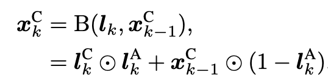

  - **l**$_{k>0}$: foreground images
  - **l**$_{0}$: background image
  - $l^A_k$: k번째 image의 alpha channel
  - $l^C_k$: k번째 image의 RGB channel중 1개
  - $x^C_k$: k번째 blended image의 RGB channel중 1개
  - B: Blending function

## 4.1 Approach

- Overview

  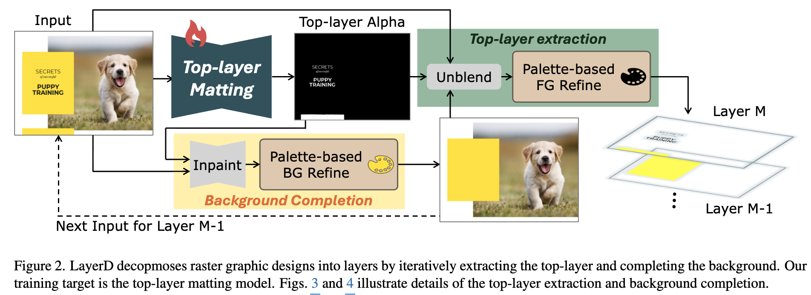

  - Iterative top-layer matting + background completion으로 구성

- Iterative Decomposition: front(*m=M*) $\to$ back(*m=1*)로 반복적으로 layer 이미지를 뜯어내는 과정

  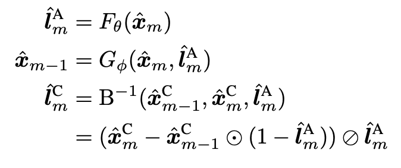

  - $F_{\theta}$: 이미지를 입력받아 top-layer(non-occluded object)의 alpha channel을 예측하는 model 
  - $G_{\phi}$: background completion (background inpainting) model : LAMA라는 모델 사용
  - $B^{-1}$: completed background & alpha map에서 RGB value를 예측하는 과정. alpha blending의 inverse process.
    - background와 foreground를 얼마나 blending할지 정하는 값 (0~1)으로, soft blending이 가능해짐

  - input: 통짜 이미지

    $\hat{x}_m=x$

  - output

    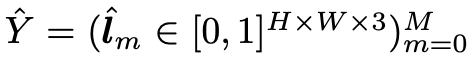

## 4.2 Training

- Top-layer Matting ($F_{\theta}$)

  - 학습셋 구성

    - 각 layer별 occlusion이 있는지 체크하고, non-occluded layer들의 alpha map들을 single alpha map으로 merge

  - Loss 

    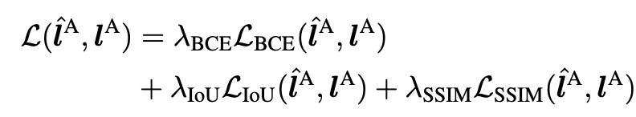

    - 초기에는 3개 term모두 활용
    - boundary quality향상을 위해 SSIM loss만 마지막에 활용

  - 중간 이미지 ()$1<m<M$ )들은 Background inpainting model의 결과를 활용하여 학습 수행 $\to$ inference time과 domain 격차 해소

- Background inpainting ($G_{\phi}$) $\to$ off-the-shelf model LAMA 활용

## 4.3 Palette-based Refinement

Background는 texture가 없는 flat한 요소/background에 놓인다는 사전 지식을 이용해 layer decomposition quality를 향상시켜보자는 취지

- Background refinement

  - Target area를 $F_{\theta}$가예측한 alpha map기반으로 추출하고, 그 주변의 color gradient를 계산하여 dominant color (palette)를 percentage기반으로 추출.
  - Lab Color Space상에서 가장 가까운 RGB value를 할당
  - Background Completion model이 예측한 Background에 생성된 artifact를 개선하는데 활용

  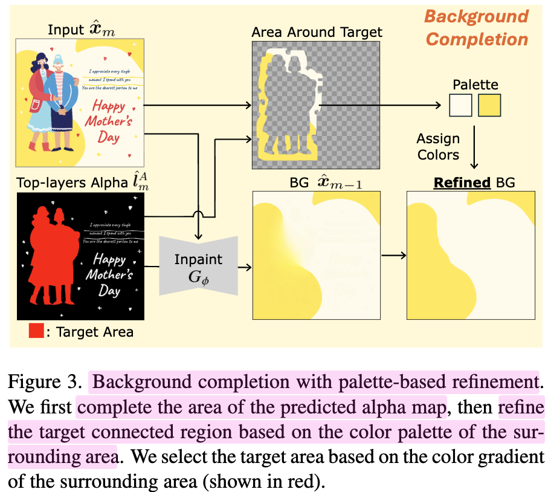

- Foreground refinement

  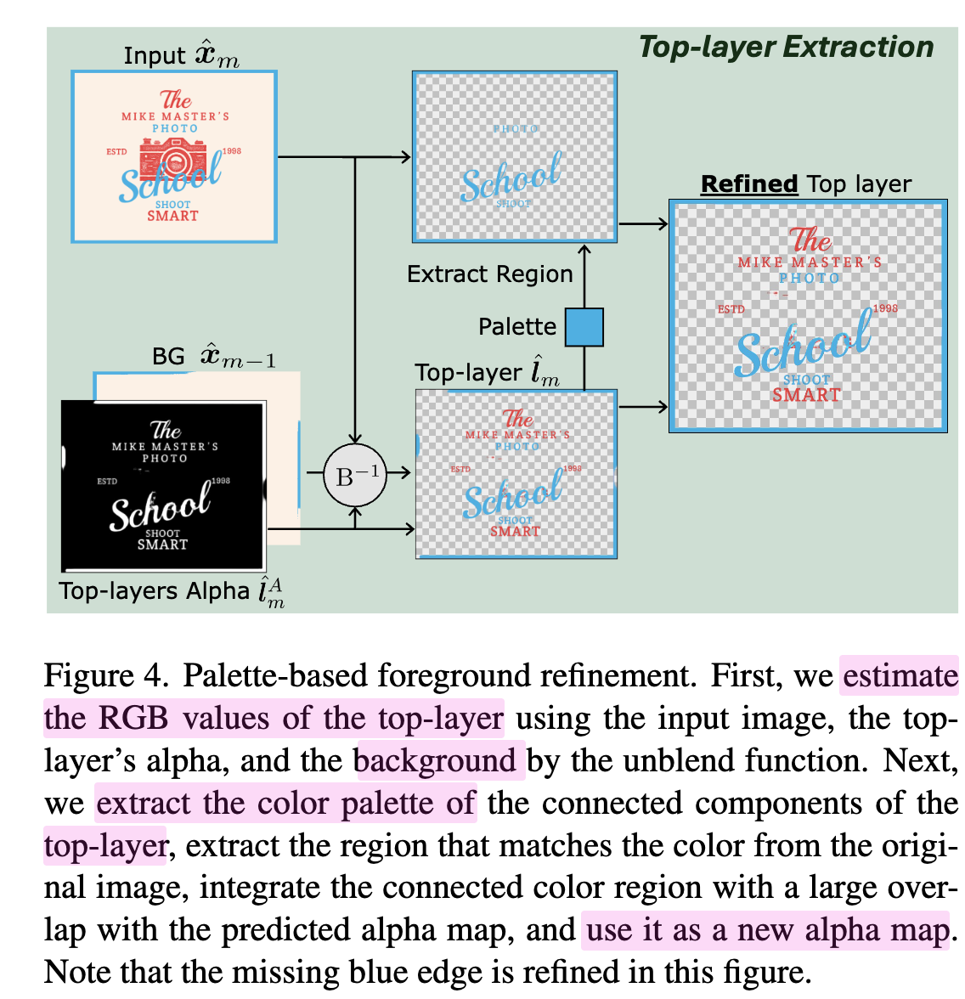

  - Foreground matting의 artifact를 개선하고자, rule-based refinement를 적용
    - 연결된 영역을 기준으로 alpha-map을 분리함 
    - olor gradient를 각 영역별로 계산하고 zero color gradient인 영역은 flat region으로 분류함
    - input image의 palette color와 matching하는 영역 (threshold 이상인 영역)에 대해 새로운 mask로 정의함
      - 추출된 mask 영역에서 top-layer matting & background 을 기반으로 alpha 값을 계산

## 4.3 Decomposition Metrics

- 정답셋의 layer와 예측한 layer갯수가 다를 경우, DTW기반 order-aware layer alignment 를 적용하여 계산

  - visaul qaulity: S개의 layer별 유사도 (e)의 평균값

    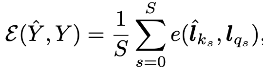

  - Granulairty: 요구되는 편집 갯수 (작을수록 좋음)로, 인접한 layer간의 merging을 허용함 (편집거리 +1)

    - (-1) * (soft IoU) + RGB 값의 L1 distance로 정의함

# 5. Experiments

- Dataset
  - Crello data기반 학습
    - train/val/test = 19,478 / 1,852 / 1,971
    - Layered 로 변경한 train /val pairs = 48,725 /4,674
  - Text는 unique한 domain 특성을 지니므로, Evaluation에서 text 요소는 decomposition에서 제외됨.

- Model 

  - Top-layers matting model: Swin-L + BiRefNet

- 정량적 결과

  - Granulairty (RGB-L1 /  softIoU)

    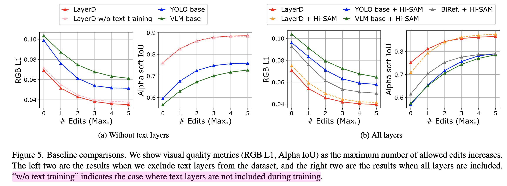

    - 검증시 text decomposition을 제외했음에도, text를 추가한 학습이 성능이 좋아진다고 함 
    - 이는 text도 vector shape의 variant이므로 decomposition 에 도움이 된다고 주장함

- 정성적 평가

  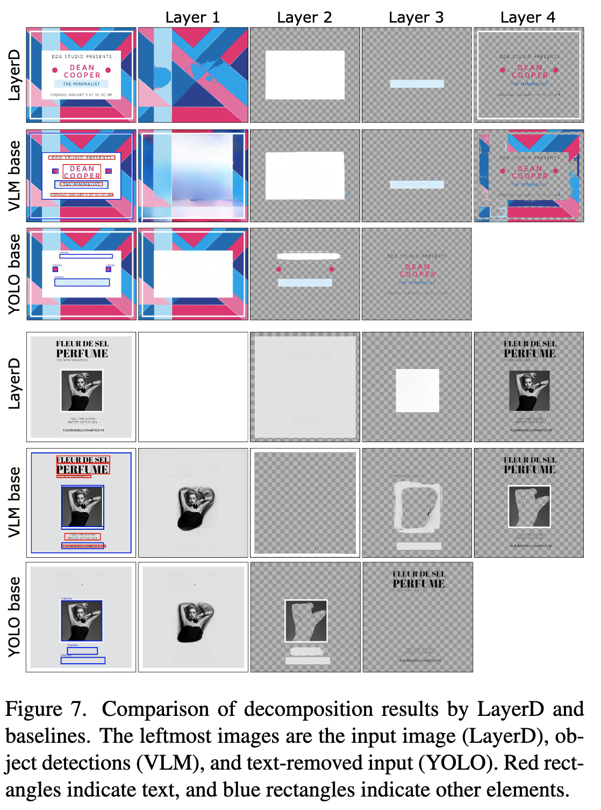

  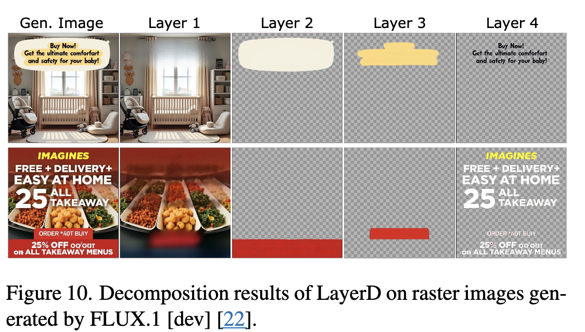

- Ablation 

  - Refinement 유무에 따른 분석

    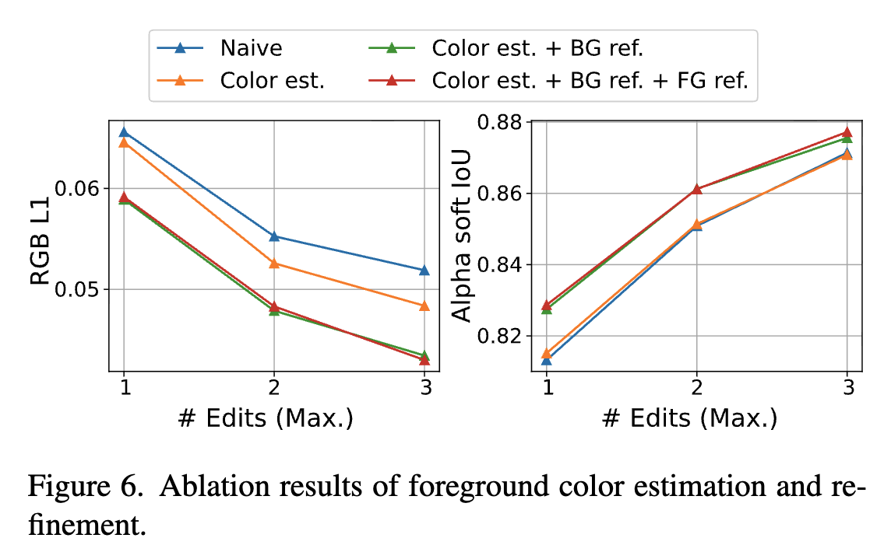

    - Naive: alpha matting을 predicted mask로 변경한 버전

    - Color est.: Inverse blending 적용한 버전

      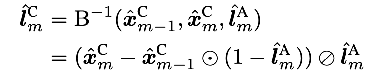

    - Color est. + BG ref.: Inverse blending + BG refinement 적용한 버전

  - 그 정성적 결과

    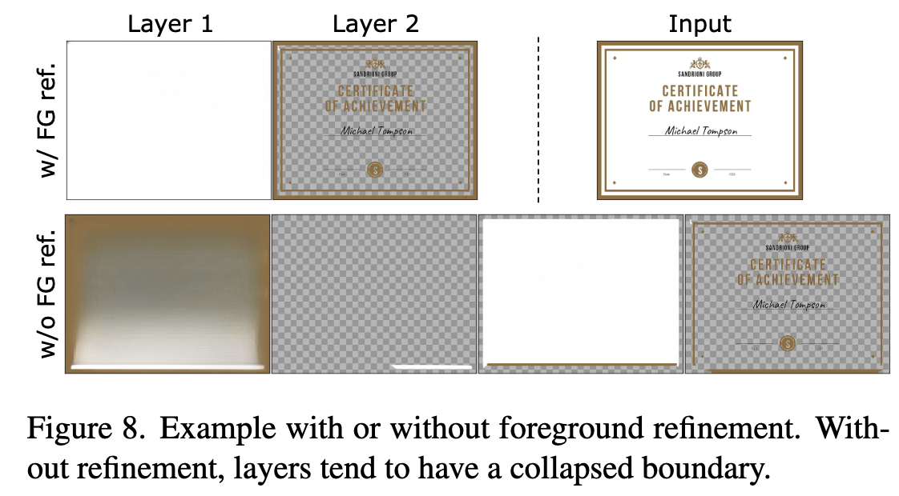

    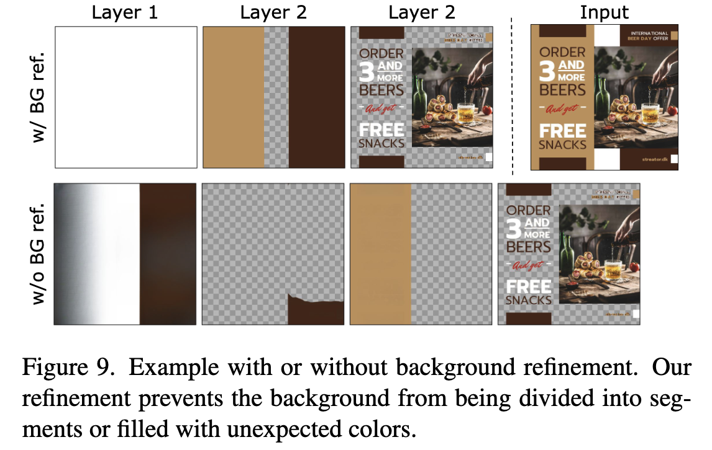