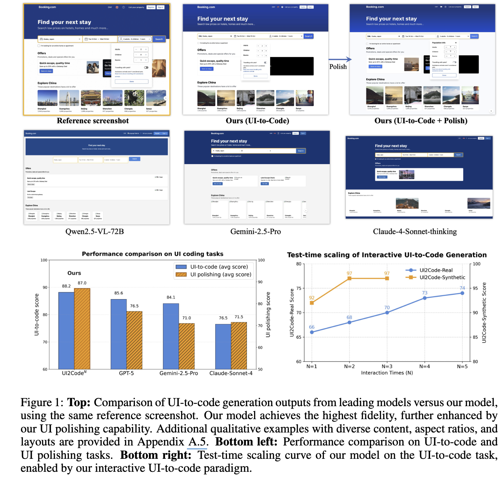
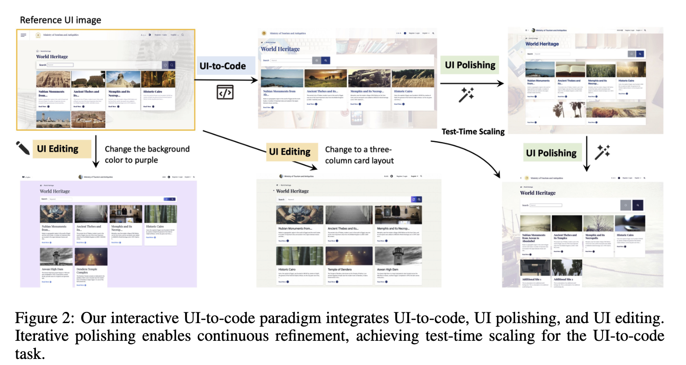
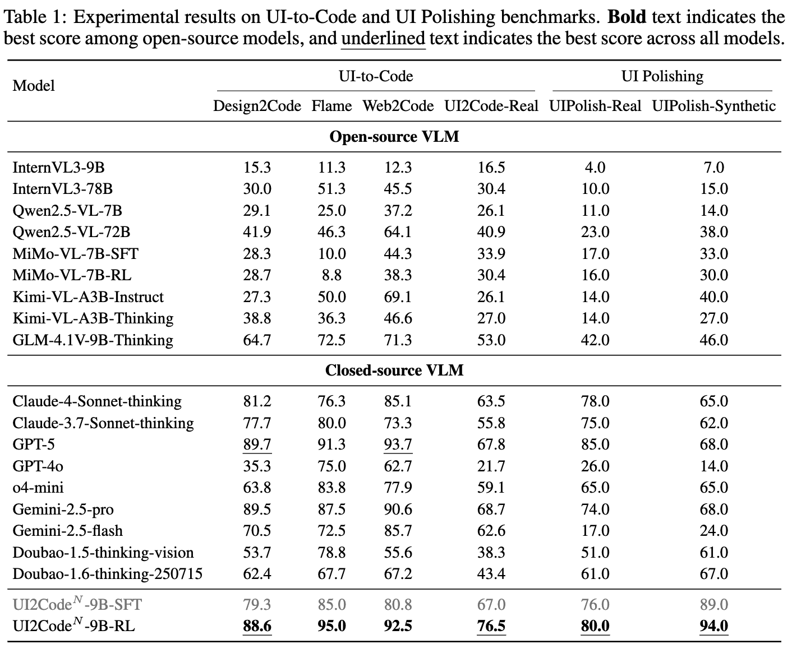
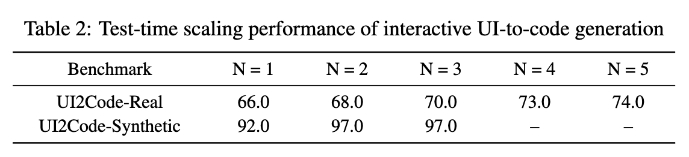
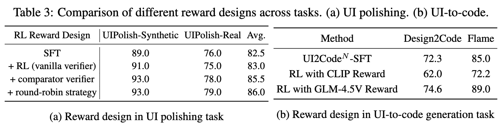
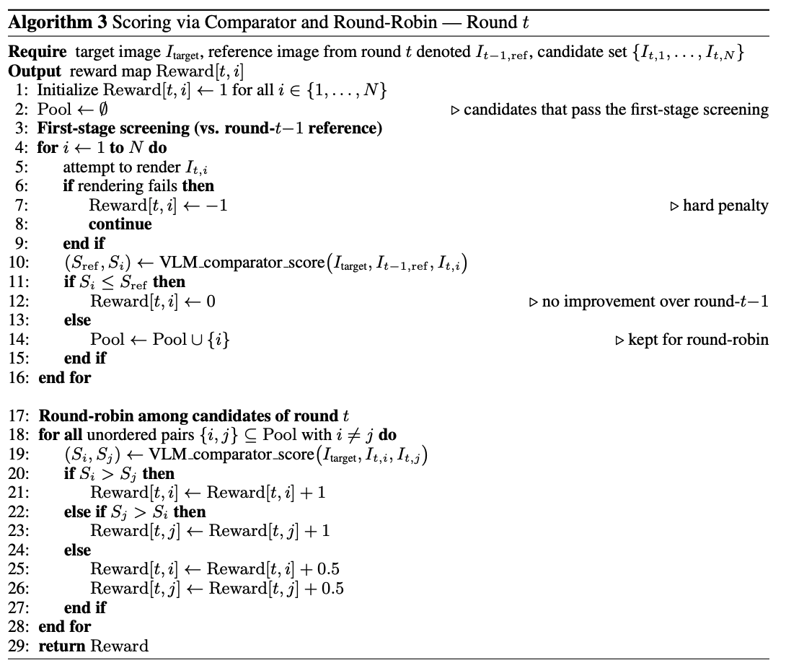
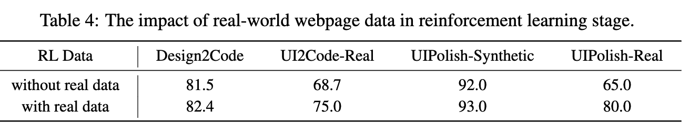

# [UI2Code] UI2Code_N: A Visual Language Model For Test-Time Scalable Interactive UI-To-Code Generation

- paper: https://arxiv.org/pdf/2511.08195
- github: https://github.com/zai-org/UI2Code_N
- archived (인용수: 0회, '25-11-17 기준)
- downstream task: UI-2-Code Generation

# 1. Motivation

Huggingface Daily paper 등재되어 보게됨

- front-end 종사자들의 UI coding의 과정은 시각적 관찰, reasoning, code 생성의 반복적이고 서로 얽힌 과정의 반복으로 이루어진다.

- 기존 연구들에서는 UI development의 과정을 end-to-end로 1번의 shot으로 해결하고자 했으나, 이는 해당 task의 난이도를 고려할때 최적이 아니다.

  - global 관점: 전반적인 layout을 이해하고 nested component를 인지해야함

  - local 관점: 시각적 디테일 (spacing, color, typography)를 이해해야 함

    

  $\to$ 성능이 제일 좋은 propreitary model(GPT-5)도 UI-to-Code  76점이다.

- 이는 두 가지 문제로 가정한다.

  1. 현존하는 VLMs는 Multimodal coding 능력이 부족함 (visual layout $\to$ executable code로 변환하는 능력)
     - 고품질 대량의 HTML + screenshot paired data가 부족함
     - Real HTML은 noisy + Synthetic HTML은 과도하게 simplify됨
  2. Single turn UI-to-code 생성하는 기존 방식은 실제 UI를 만드는 workflow와 gap이 있다.
     - UI-to-code는 인간이 시각적인 피드백을 rendering 결과로 받아, 다시 code를 짜는 반복적인 과정으로 이루어진다.
     - runtime 요소들 (font fallback, browser defualts, DPI scaling, etc)

$\to$ Multi-turn의 Interactive UI-to-code 패러다임을 제안해보자! (+Test-time scaling)

# 2. Contribution

- Visual feedback을 기반으로 반복적인 reasoning workflow를 탑재한 Interactive UI-to-code generation을 제안함
  - 자연스레 test-time-scaling을 지원하며, 평균 4-rounds 약 12%의 성능 향상을 보임
- 최초의 open-source VLM기반 UI-to-Code, UI-polishing, UI-editing을 지원하는 $UI2CODE^N$를 제안함
  - 3개의 연관 benchmark에서 SoTA
    - Design2Code / Flame-React-Eval / Web2Code
- Foundational coding VLM의 full training recipe를 제안함 
  - Pretraining + fine-tuning + Reinforcement Learning

# 3. Related Works

## 3.1 UI-to-Code Benchmarks

- Design2Code: real-world webpages를 기반으로 구축된 데이터셋
  - Visual-centric metric을 제안함
    - Clip similarity: target vs. rendering된 이미지간의 유사도 계산
    - Block-Match: 박스간의 matching으로 scoring
  - HTML상에서 외부 종속요소들은 제거하고, images 위치하는 부분에 placeholders를 배치함
  - 이후로 나온 WebGen-Bench는 자동화 agent의 interactivity & functionality를 평가함

##  3.2 UI-to-Code Datasets

- WebSight
  - 2M Synthetically generated screenshot-code set (Tailwind CSS 활용)
- Web2Code : LLM0-synthesized instruction-tuning dataset
- WebCode2M / Vision2UI:  Common Xrawl기반 pruning + filtering으로 구축한 real world website로 구축

## 3.3 UI-to-Code Generation Models & Systems

- Commercial agent workflow기반으로 데이터셋을 구축한 논문이 나옴
  - DECLARUI, DCGen, ScreenCoder

# 4. UI2Code

## 4.1 Interactive UI-to-Code Paradigm

- Motive: 사람 front-end developer가 webpage 제작할때처럼 code 작성 $\to$ rendering된 visual 결과를 기반으로 feedback 받아 재작업을 반복해보자
  - 즉, **interactive code**
- 추가적으로, 고급 front-end developer들은 rendering에 필요한 runtime factor도 충분히 고려해서 코드를 작성한다.
  - font fallback, browser defaults, DPI scaling
- 하지만, 기존 연구들은 single-turn기반의 image-to-text task로 접근하여 풀고 있었음. $\to$ 본 논문에서는 iterative interactive process를 세 단계로 제안함

1. UI-to-Code
   - UI image상에서 UIcode를 직접 생성함
2. UI Polishing
   - draft code를 세가지 입력으로 정제함
     - target Ui image
     - inital code
     - rendered output
   - 성능이 향상되는 근거
     - 이미지 기반으로 reasoning하는 VLM의 능력 덕분
     - test-time scaling으로 인함 (output quality vs. inference cost간의 trade-off는 존재함)
3. UI Editing
   - 시나리오: 기 존재하는 UI에서 타켓팅한 변경사항을 적용하고자 할 경우
   - input
     - visual reference
     - modification instructions
   - output
     - instruction에 있는 modification이 적용된 code

## 4.2 Multi-Stage Training

UI Coding을 수행하는데 있어 VLM들이 갖는 두 가지 한계점

- UI coding task 자체가 매우 어려움
  - 자연의 이미지와 분포가 매우 다른 UI-Style images를 잘 인지하고, fine-grained detail들(icons, fonts, line styles)을 잘 캡쳐 해야함
- 학습용 데이터셋의 부재
  - real webpage는 HTML, screenshot이 많지만, 외부 resource와 연결되어 직접적으로 활용할 수 없음
  - synthetic webpage는 과도하게 simplify되었음

$\to$ 세 단계의 학습 pipeline을 제안

- Large-scale real0-world webpage image-HTML로 pretraining하여 UI code에 대한 이해도 향상
- Clean, curated dataset기반 STF 수행하여 UI-to-Code, UI-polishing, UI-editing 능력을 향상
- RL을 통해 real-world 분포에 적응하도록 학습

### 4.2.1 Continual Pre-Training

#### Dataset

- Common-Crawl의 데이터셋 중, tag whitelisting, redundancy removal을 통해 10M의 paired 데이터셋을 구축
- Grounding 성능 향상을 위해  GEG (GUI Referring Expression Generation) 패러다임을 도입함
  - Screenshot의 특정 영역에 존재하는 요소의 bbox를 제공하였을때, HTML code를 생성하도록 하는 task
- 외부 UI-to-Code dataset도 학습에 활용함 (WebCode2M + WebSight)

#### Model

- GLM-4.1V-9B-Base기반으로 학습 수행

### 4.2.2 Supervised Fine-Tuning

#### UI-to-Code

- Chain-of-Thought 기반의 deep reasoning format으로 학습
  <think>{think content}</think><answer>{answer content}</answer>
- Claude-3-7-Sonnet-20250219-Thinking을 통해 다양하고 복잡하고 잘 구조화된 HTML 을 정답으로 인지함
- query는 inverse manner로 생성함

#### UI Polishing

- 입력의 다양화를 위해 VLM 여러개를 활용하여 학습셋을 구축함 (out model, GLM-4.5V, Calude-4-Sonnet)
- VLM이 생성한 비교문장을 도출함

#### UI Editing

- Addition, deletion, replacement, adjectment operations를 다룸
  - addition의 경우는 reverse manner로 구축함
- Heuristic rules, manual checks를 통해 학습셋을 구축함

### 4.2.3 Reinforcement Learning

- 장점
  - SFT처럼 token-level accuracy를 향상하기 보다는, visual similarity 기반의 학습을 유도함 (인간의 판단과 흡사함)
  - Screenshot만 있어도 가능하며, noisy HTML이 불필요함
- Loss
  - GRPO기반으로 학습
  - KLD + entropy regularization은 제외함
- 데이터
  - 12K real-world webpages
  - 30K LLM-synthesized examples
- Rewards
  - GLM-4.5V기반 visually similar 여부를 판단함 $\to$ 가끔 틀리기도 함
  - 여러분 수행하는 queries에 대해 독립적으로 평가하면 calibration drift가 유발할 수 있음
  - 이를 위해 여러 candidate를 종합해서 평가하도록 GLM-4.5V를 finetuning (round-robin)
    - rendering failure $\to$ -1
    - reference보다 안좋으면 $\to$ 0
    - 제일 좋으면 $\to$ 1

# 5. Experiments

## 5.1 Evaluation Setup

- Benchmarks
  - UI2Code-Real (115): 실제 웹 환경에서 추출한 in-the-wild soruces로 구성됨
  - UIPolish-bench (100): 100개의 synthesized web + 100개의 real-web으로 구성됨

- Evaluation Metrics
  - CLIP scoring
  - VLM scoring: target screenshot *A*, 첫 생성된 (rendering된) *B*

## 5.2 Main Results

- 정량적 결과

  

  - UI Polishing
    - Editing을 수행하고 나서, 더 나아졌는지 (win / lose)로 평가함
    - 정의상, 50%가 넘어야 나아졌다고 판단할 수 있음 (multi-image comparison)

- Test-time Scaling으로 성능 향상여부 분석

  

  - Real task는 더 어려우므로, 반복횟수를 증가시킬 수록 성능이 나아짐
  - Synthetic task는 상대적으로 쉬운 task이므로, N=3에서 성능이 수렴함

## 5.3 Ablation Study

- Reward에 따른 UI Polishing 성능

  

  - CLIP score보다는 VLM score가 좋았음

    - 단순히 시각적 유사성을 가지고 성능향상을 주는 reward signal을 만들지 못하기 때문.

  - 왜 round-robin이 다른 reward에 비해 좋은가?

    - 1대1로 모두 die-die를 띄면서 global하게 제일 좋은 후보 trajectory에 reward를 부여할 수 있음

      

    - 다른 reward는 local한 비교군끼리만 비교하므로 global하게 비교한 reward을 주지 못함

- Real-world Web page를 RL Stage에 넣는게 좋을까?

  