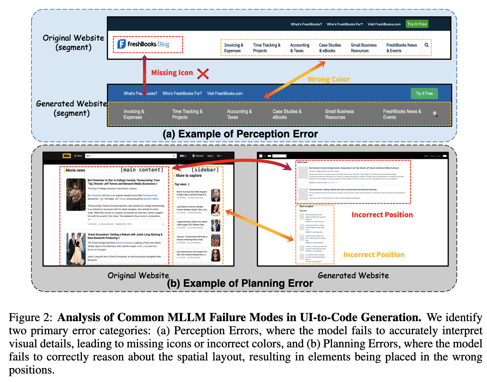
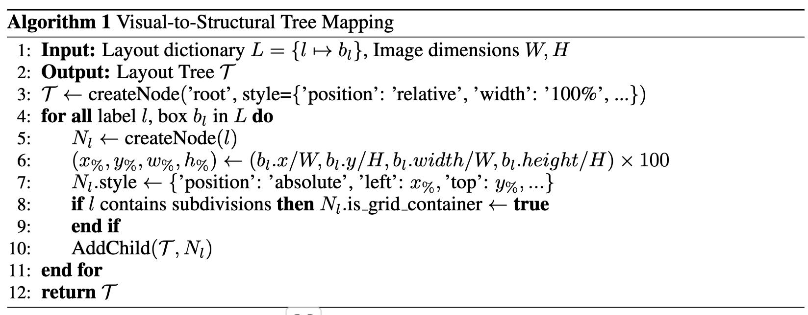

# [UI2Code] ScreenCoder: Advancing Visual-to-Code Generation      for Front-End Automation Via Modular Multimodal Agents

- paper: https://arxiv.org/pdf/2507.22827
- code: https://github.com/leigest519/ScreenCoder?tab=readme-ov-file
- archived (인용수: , 25-11-28 기준)
- downstream task: UI-to-Code Generation

# 1. Motivation

- MLLM의 code generation 능력이 비약적으로 향상되었음에도, 시각적 이해, 레이아웃 구조 계획, domain-specific code synthesis에 대한 이해 를 종합한 능력을 요구하는 screenshot 2 html code를 생성하는데 어려움을 겪는다.

- 이는 모델의 내재적인 능력 부족이라기 보다는, 단순한 end-to-end 접근법으로 풀기 때문에 너무 많은 짐을 한퀴에 지우기 때문은 아닐까?

  

  $\to$ UI-2-code task를 기능별로 세분화하여 agentic workflow로 해결해보면 어떨까?

# 2. Contribution

- 기존의 MLLM기반의 monolitic end-to-end UI-2-code task의 한계를 분석하고, 새로운 multi-agent framework 기반의 3가지 subtask로 재정의한 **ScreenCoder**를 제안
  - grounding: 핵심 UI 영역(header, sidebar, etc)을 의미적으로 라벨링하고 grounding 수행
  - planning: rule-based으로 구성되며, front-end domain knowledge 기반으로 hierarchical layout tree를 구성함
  - Generation: HTML & CSS code를 생성함
- ScreenCoder는 data-engine으로 활용할 수 있으며, 이를 통해 고품질 image-html 쌍 데이터셋 **Screen-10k**를 공개
- 평가셋 **ScreenBench**를 제안함

# 3. ScreenCoder

## 3.1 Motivation: 왜 MLLM이 UI-2-Code Generation에서 실패하는가?

- Perception Faliure: 미인지 / 오인지 요소들

  - element omission
    - 작거나 덜 중요한 요소를 놓치는 경우
  - element distortion
    - 요소의 속성을 잘못 예측한 경우 (input field $\to$ static element)

- Planning Failure: 인지된 요소들의 공간적 구조적 연관성 결여

  - 요소간 잘못 정렬: 의미적으로 잘못 분간

  - 구조적 incoherence: DOM-like structure $\to$ flat하게 검출

    $\to$ 이를 해결하기 위해서는 front-end layout convention에 대한 inductive bias를 주입해야함

$\to$ 분석 결과, 1번의 end-to-end 단조로운 작업으로 이 모든걸 model에게 수행시키는 것은, 과도한 짐을 주는 행위임.

## 3.2 Method

### 3.2.1 Grounding Agent: Overcoming Perception Errors

- 이미지 내 주요 요소들을 검출하고 의미적으로 labeling을 수행하여 *인지 오류*를 해결하는게 목적

  ex. 주요 요소: `sidebar, header, navigation`

- prompt를 통해 인지시킴

  ex. `where is the sidebar? Locate the header area.`

  

  - $b_i=(x_i,y_i,w_i,h_i)$

- 후처리 로직을 통해 보강

  - NMS (Non-Maximum Suppression): 중복으로 검출되거나 Conflict Resolution이 생긴 요소에 대하 filtering

  - Fallback recovery: 핵심 요소가 누락된 경우 보강해줌 

    ex. `a wide, short box at the top is likely a header`

  - Main Content Inference: 가장 영역이 넓은 핵심 요소가 검출된 다른 요소들과 안겹치도록 정의

- 추가 라벨이 필요하면 단순히 prompt에 추가만 하면 됨

### 3.2.2 Planning Agent: Correction Planning Errors

- Front-end의 사전지식을 통해 DOM-like tree를 추출함으로써 flat canvas 로 구조 추출을 잘못 수행하는 MLLM의 단점을 보완

  

  - 주요 요소 (header, sidebar)의 tree nodes부터 생성함 (%기반 좌표값)
  - 자식 노드와 디커플링하여 부모 노드를 CSS Grid로 생성

# 4. Experiments