# [Agent] CANVAS: A Benchmark for Vision-Language Models on Tool-Based UI Design

- paper: https://arxiv.org/pdf/2511.20737
- github: X
- AAAI 2026 accepted (인용수: 0회, '26-01-14 기준)
- downstream task: Screenshot web 복원,  Screenshot web 편집

# 1. Motivation

- 기존에 UI Design benchmark는 code 기반 (HTML) 혹은 이미지 기반인데 비해, tool기반의 디자인 성능 측정하는 benchmark가 없었음

- 최근 VLM들은 agentic tool invocation 능력을 갖추었음

  $\to$ VLM의 tool-based 능력을 활용한 UI Design benchmark를 제안해보자!

  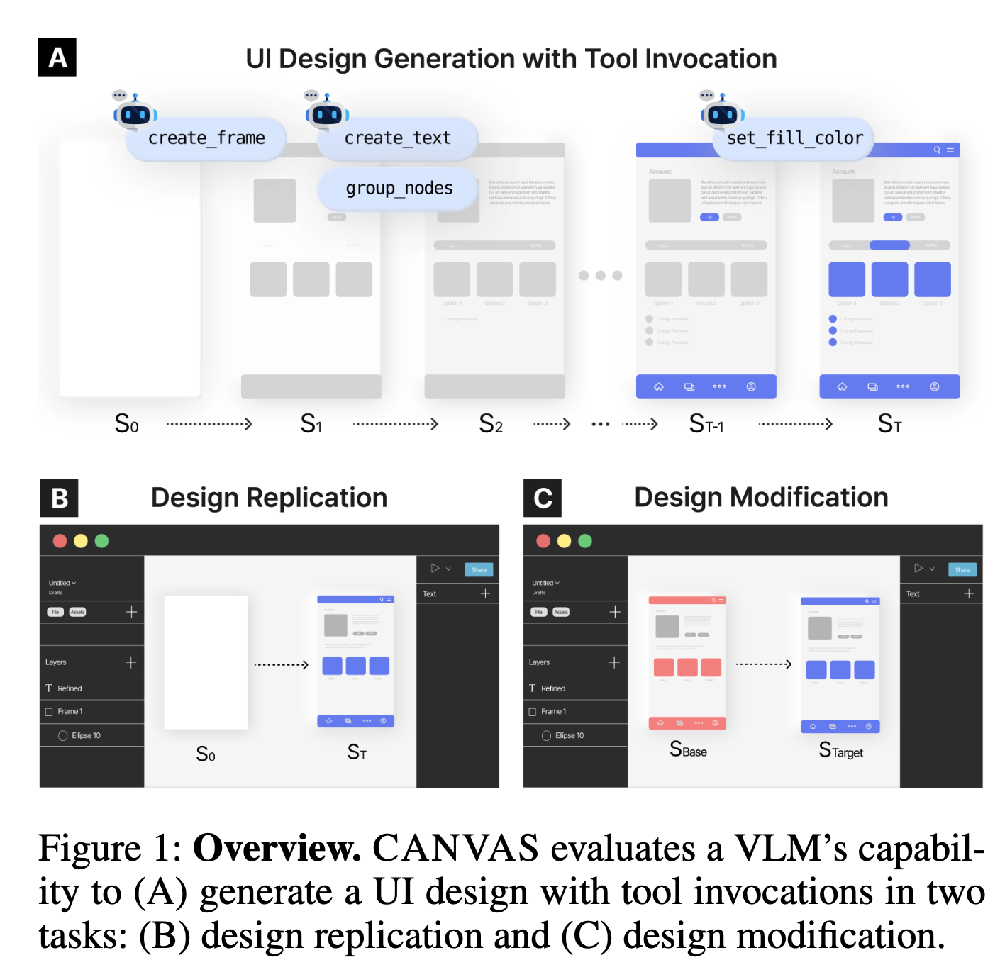

# 2. Contribution

- VLM의 Tool기반 UI Generation 성능을 측정하는 최초의 benchmark인 CANVAS를 제안함

- 598개의 tool-driven design tasks로 구성 (총 3,327 UI로부터 취득)

  - Repliation: 주어진 이미지(Target Image)를 복원하는 task
  - Modification: 주어진 이미지(Base Image)에서 특정 query기반으로 편집을 수행하는 task

- 5개의 상용모델 기반으로 다각도로 평가를 진행함

  - Tool-use의 insight를 도출함 (정량적 & 정성적 평가)

# 3. Canvas (Benchmark Design)

## Task Design

Real-world를 반영한 테스크 구축이 목적

- Design replication: 주어진 Reference 이미지를 완성(복원)하는 태스크

- Design modification: 주어진 Base 이미지에서 명령 기반으로 편집을 수행하는 태스크

  ex. *"create a rectangle as a button background"*

-  Components (buttons, text)와 그 attributes의 value값이 쌍을 이루어 **state**로 정의

  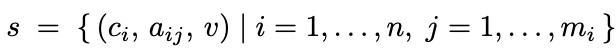

  - $c_i$: i번째 component
  - $a_{ij}$: i번째 component의 j번째 속성
  - $v$: $a_{ij}$속성의 값
  - $s$: 예측한 state. $s_{GT}$는 정답 state.

### Design Replication

- 빈 화면으로부터 제공된 $s_{GT}$를 도출하는 VLM의 tool invocation 능력을 평가

  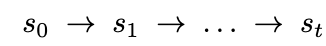

### Design Modification

- VLM이 정밀한 편집을 위한 tool invocation 능력을 평가

  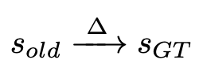

  - 속성 업데이트: 타켓 component *c*의 attribute *a*를 업데이트 (ex. color, size, text content, corner radius, position)

    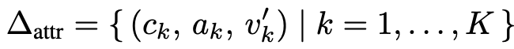

  - 속성 추가: 새로운 component-attribute pairs list를 추가하는 task

    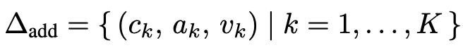

  - 모드 변경: color list를 새로운 attribute로 변경하는 task (마스터 프레젠테이션 느낌)

    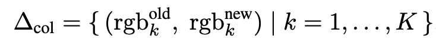

    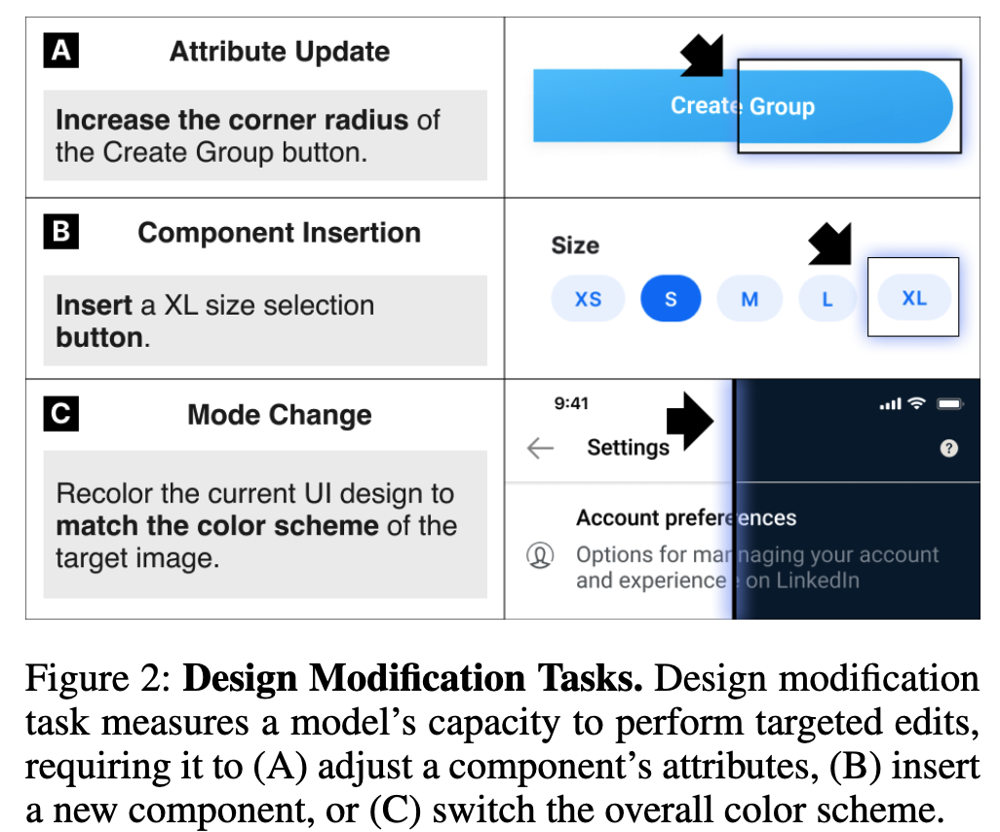

## Dataset Creation

### Data Source

- Figma Community로부터 UI design를 취득하고, designer review를 거침.
- CC-BY-4.0 License 인 템플릿만 대상으로 추출

### Data Collection

- Data Selection: 수동으로 선별하였으며
  - editable UI일 것 (non-editable UI는 제외 $\to$ ex. prototyping kits)
  - 추가적인 디자인이 minimal variation인 경우 멈춤
  - Figma의 REST API를 활용하여 SVG, PNG, Json을 추출
  
- Data Sampling
  - GPT-4.1 MINI를 통해 30개의 UI type로 분류됨
  - Replication set (n=298)은 stratified sampling을 통해 original pool(n=3,327)에서 추출
    - stratified sampling을 통해 모든 카테고리별로 10개씩 샘플링 (1개 카테고리만 8개)
  - Modification set(n=300)은 수동으로 샘플링 되었으며, task와 연관된 attribute을 기준으로 선별됨 (ex. round borders)
  
- Data Annotation
  - 속성 업데이트 & Component 추가 task는 base state와 target state를 주고 GPT-4.1 Mini를 기반으로 instructions를 생성함
  
    - 속성 업데이트 instruction generation prompt
  
      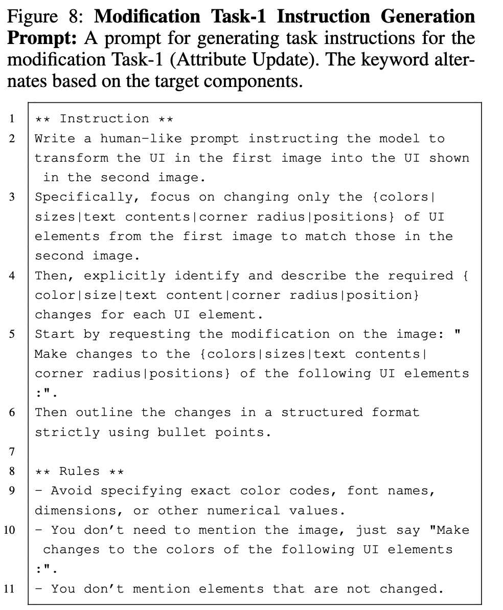
  
    - Component insertion prompt
  
      
  
  - 수동으로 원본 디자인을 수정하여 state 쌍을 구축함

### Data Refinement

디자이너의 관점에서 디자인을 리뷰함

- Data Analysis
  - placeholder 변경 작업
    - 이미지들을 reproduce하기 힘들어서(?) original image $\to$ grey placeholder로 변경
  - Locked elements $\to$ Unlocked element
  - 재사용이 된 element가 original element와 synchronize됨 $\to$ detach과정 수행
  - Hidden element는 전부 제거
  - 다른 환경마다 폰트깨짐 이슈가 발생하여 폰트는 전부 "Inter" typeface로 표준화됨 
  - 공통된 이슈를 정의함
    - occlusion, illustrations, visual clutter (ex. +/- 2 pixels)
  
- Manual Revision
  - 598개의 디자인 이슈를 전문 디자이너가 GPT-4.1-Mini가 잘못 예측한 instruction을 수정하고, 요구되는 tool을 라벨링함
  
  - occlusion 33.4%, illustrations 15.5%, clutter 29%를 개선함
  
    - Revision 메뉴얼
  
      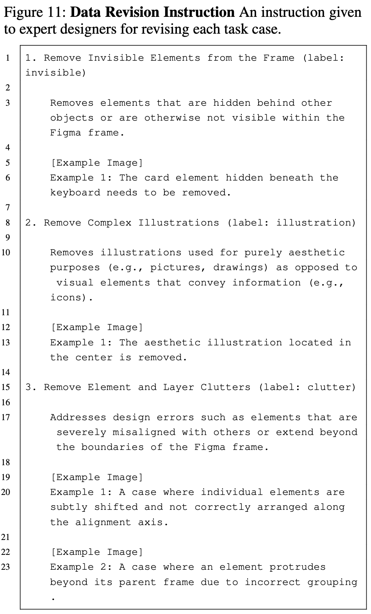
  
    - occlusion
  
      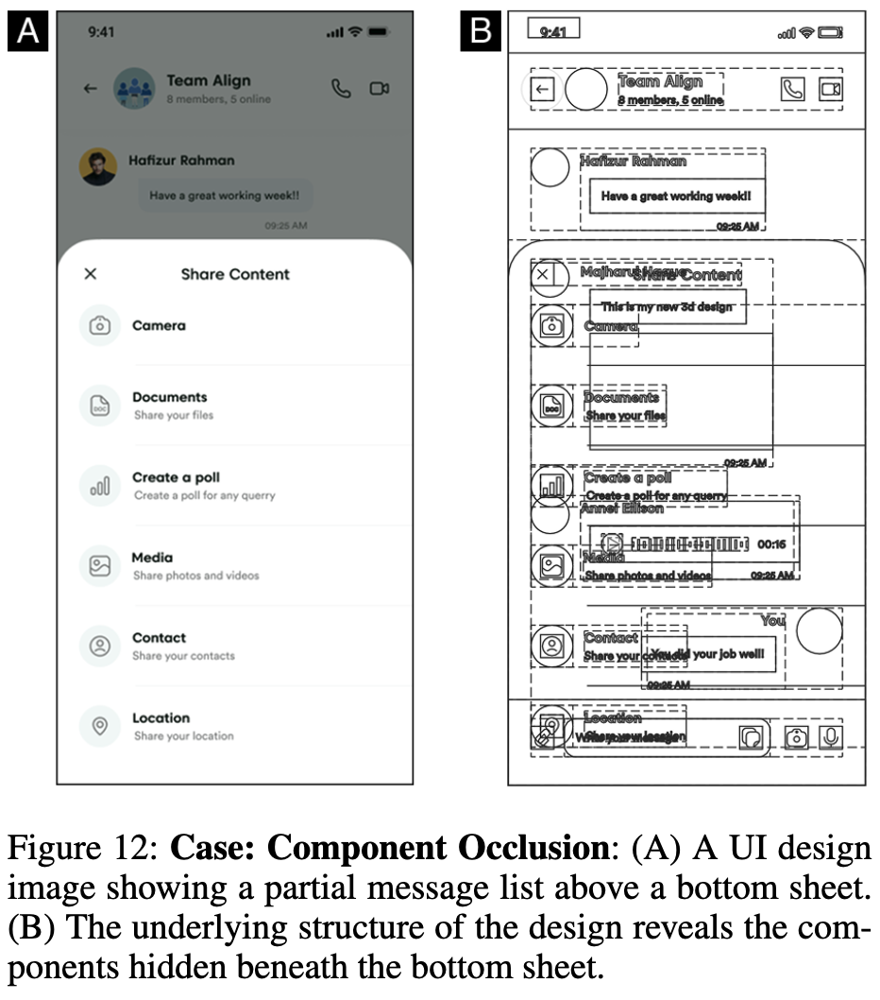
  
    - Complex illustrations
  
      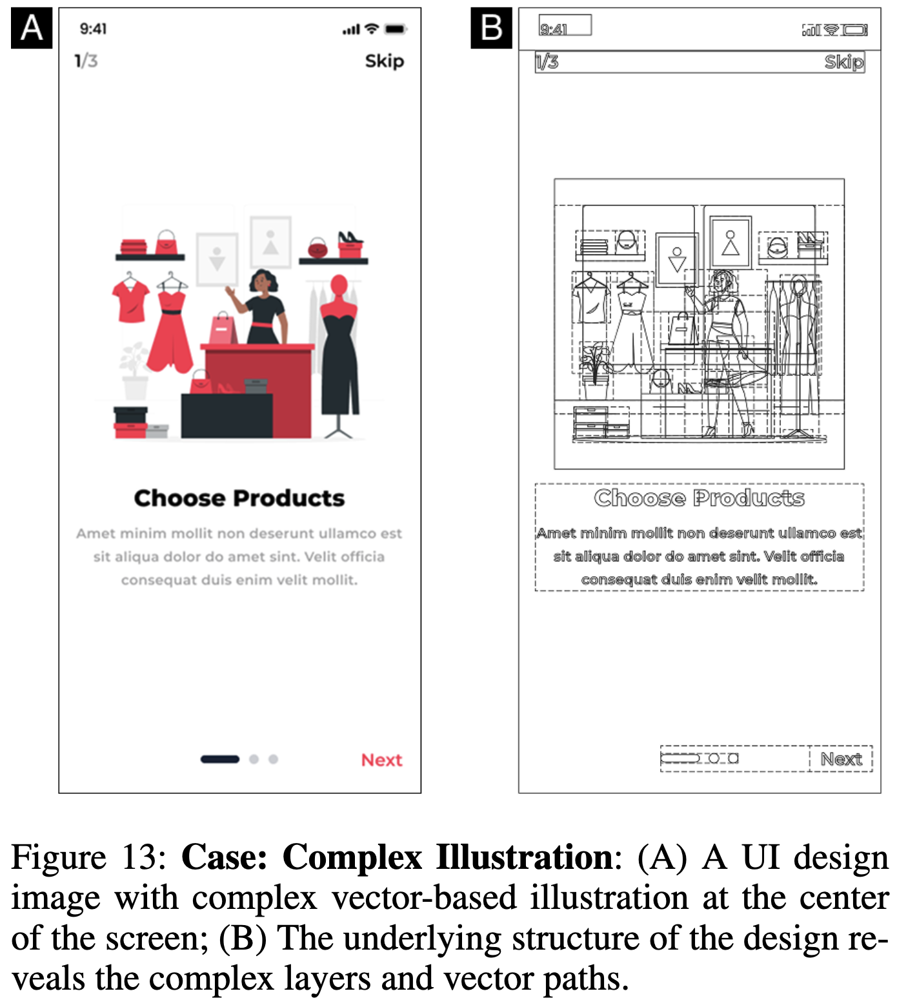
  
    - Visual clutters
  
      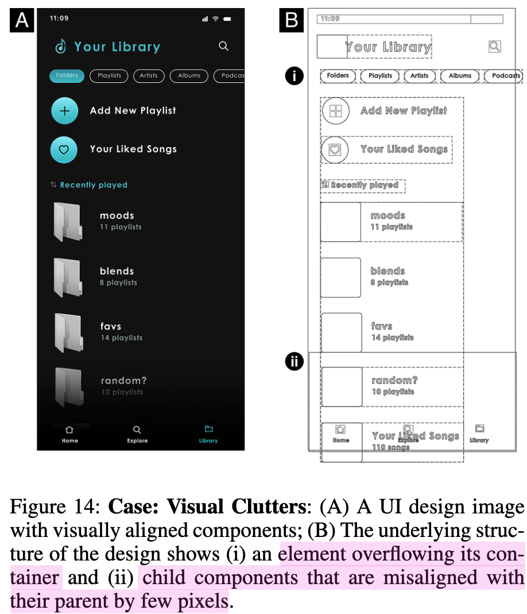

## Data Statistics

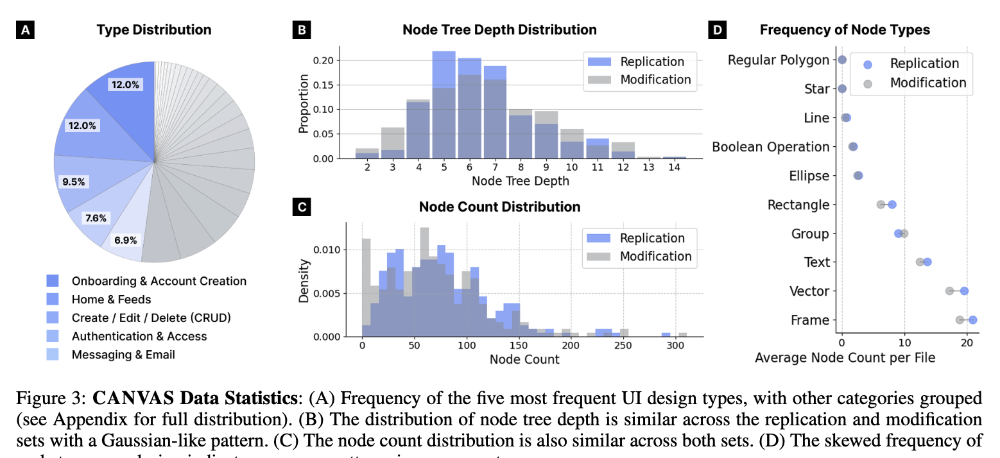

-   3,327개의 mobile UI design으로 구성되며, 598개의 design task를 생성함
  - 각 샘플별로 JSON file(node 구조),  components (vector, text, rectangle, etc)이 attributes (position, size, color, etc)로 구성됨

### Structural Characteristics

- Node Tree depth: 평균 6.48, 편차 2.04

## Evaluation Metrics

- Human Visual processing과 유사하도록 metric을 결정
  - Features: low-level (Structural Similarity Index Measure)
  - Patterns: mid-level (Saliency Similarity)
  - semantic objects: high-level (BLIP Caption Similarity)
- 추가로 component-wise similarity도 계산 (one-to-one Hungaraian algorithm)

# 4. Experiments

## Configuration

- Pipeline
  - Model Context Protocol (MCP)를 사용 : https://github.com/grab/cursor-talk-to-figma-mcp (MIT License)
  - 50개의 pre-defined tools를 적용 (creation, deletion, layout adjustment, styling, content modification, etc)
- Model setup
  - GPT-4o, GPT-4.1, Calude-3.5-Sonnet, Gemini-2.5-Flash, Gemini-2.5-Pro

## Main Results

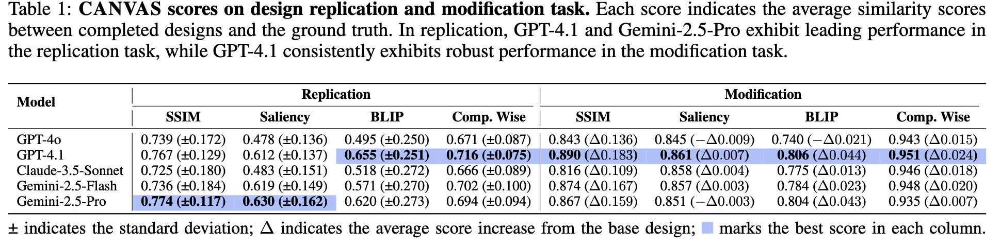

## Analysis

- Replication task는 다양한 tool 사용을 하는 모델에 성능이 높았다.

  

  - Gemini-Pro / GPT-4.1 과 같은 최상급 상용모델이 다양한 tool 사용하는 패턴이 보임. $\to$ 성능이 좋음

  - 반면, Gemini-2.5-Flash/Claude-3.5-Sonnet같이 light한 모델은 `copy_node` action을 단순반복 수행하므로 안좋았음

    $\to$ Replication task 전용 모델 RL 학습 수행시, **diverse tool use를 reward**로 주면 좋을 것 같다.

- Modification task는 **정교한 tool 사용**이 성능에 주요한 원인이었음.

  - 미세한 line break가 saliency map에 큰 영향을 주어, 성능에 치명적임

  - editing score를 보이고자 Pos@K를 도입

    - model의 edit 전/후 gt와 prediction 된 image 간의 similarity score가 K개의 metrics(SSIM, Saliency Similarity, BLIP Score, Component-wise Similarity)에서 모두 증가한 비율

    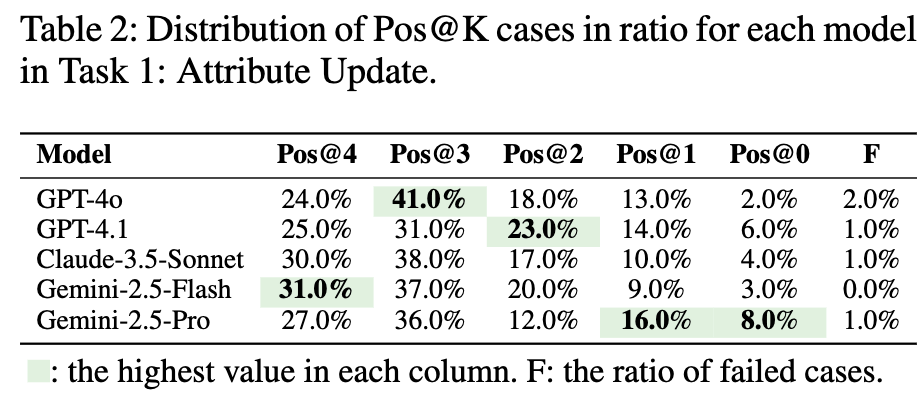

  - 오히려 Gemini-2.5/Calude-3.5-Sonnet이 성능이 좋았음. 

  - 이는 다양한 tool 사용이 performance에 악영향을 주었기 때문. (Precision이 나빠서.)

    

- 디자인 전문가의 평가 결과와 일치하는가?

  - 디자이너 전용 AMT같은 Prolific에서 win, tie, loss를 매긴 preference data로 훈련시킨 logistic regression model (reward model)의 출력값과 비교 수행

    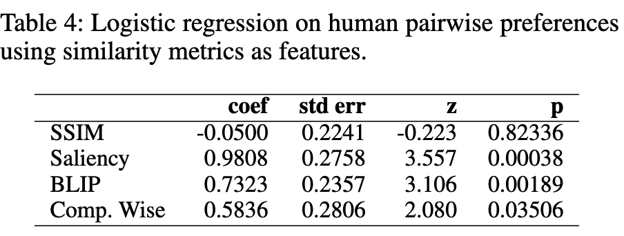

    - 사람의 평가 결과와 잘 맞는 순서: Saliency > BLIP > Comp. Wise > SSIM

# Ablation

- Multi-turn iteration / tool-based interaction 유무에 따른 성능 비교

  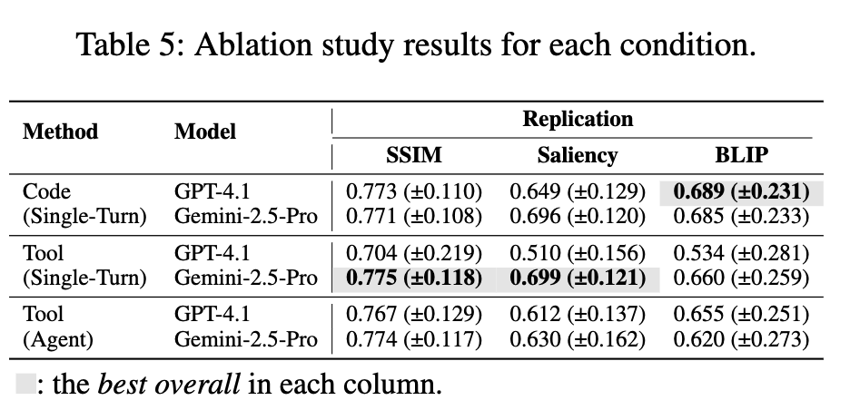

-  Multi Turn은 비선형적 operation을 수행하고, single turn은 선형적 action sequences를 수행하는 경향이 있음 $\to$ riskier strategic operation을 수행하는 multi turn 성능이 안좋았음. 

## Error Cases

- Geometric Operation Erros

  - 공간적 배치, 방향성 이해도, 숫자 새기 등이 부족

    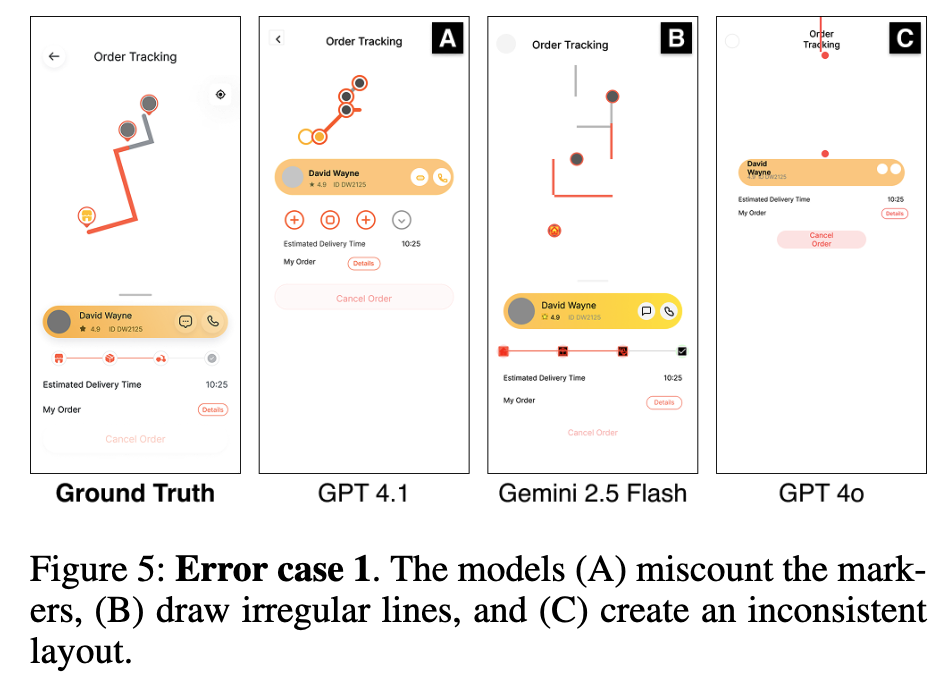

  - Layout Operation Errors

    - AutoLayout의 반응형 구조에 대한 이해도 부족

      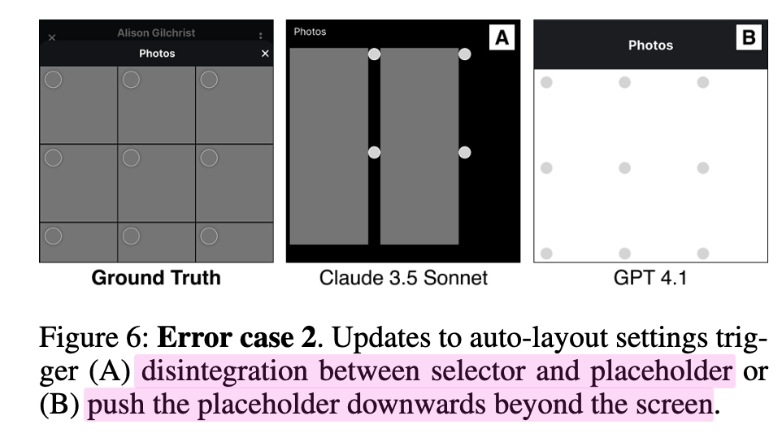

    - Text Operation Errors

      - text의 속성 예측이 미흡 (ex. font, size, spacing)

        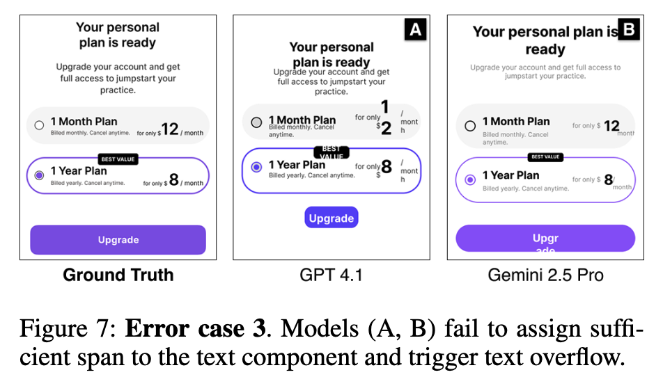

    