# [MM] KIMI K2.5: VISUAL AGENTIC INTELLIGENCE

- paper: https://arxiv.org/pdf/2602.02276
- github: https://github.com/MoonshotAI/Kimi-K2.5
- huggingface: https://huggingface.co/moonshotai/Kimi-K2.5
- archived (인용수: 33회, '26-04-02 기준)
- downstream task: multimodal 

# 1. Introduction

- 기존에 LLMs (Gemini 3 Pro / Claude Opus 4.5 / GPT-5.2)는 reasoning 능력 & agentic tool calling 능력의 향상이 되고 있다.

본 테크 리포트에서는 2가지 관점에서 성능을 더욱 끌어 올렸다.

- Joint Optimization Text & Vision

  - Early fusion vision(10) : text (90)로 token 비율을 학습하는게 middle / late fusion보다 성능이 나음을 실험적으로 증명했음

    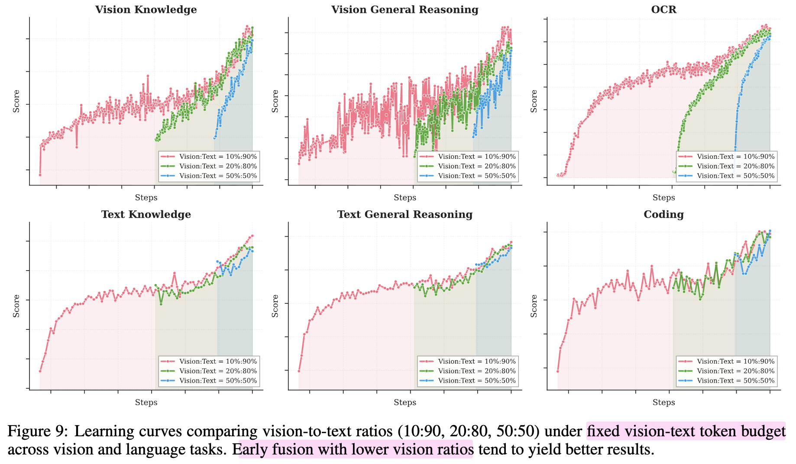

  - Video tokens는 4개의 연속된 frame에 대해 temporal axis로 patch level 평균을 취하였음 $\to$ 이미지 encoder의 강력한 feature를 그대로 활용할수 있게됨 + 4x 긴 비디오 처리가 가능해짐

  - zero-vision SFT를 통해 이미지+text pair가 없더라도, 수많은 text 데이터를 가지고, SFT를 수행함.

    - Early fusion Pretraining 덕분에 zero-vision SFT를 하더라도 vision text의 성능 하락 없이 tool-calling 능력 & visual reasoning 능력이 향상됨

  - 마지막으로 joint RL로 성능을 더욱 향상시킴

- Agent Swarm: Parellel Agent Orchestration
  - 매우 복잡한 테스크를 수행하기 위해 수백 reasoning steps를 처리하다보면 unacceptable latency + limit task complexity 이슈가 생김
  - Parallel-Agent Reinforcement Learning (PARL)을 도입하여 agentic RL 학습에 활용함으로써 tool execution을 최적화 시킴.
    - sub-agents 호출하는 orchestrator만 학습하고, sub-agents는 freeze함 $\to$ 학습 복잡도를 단순화하여 credit assignment ambiguity를 방지. 
    - 약 4.5배 latency 향상 + 성능도 72.8% $\to$ 79%로 향상 (item-level F1 score)

# 2. Joint Optimization of Text and Vision

## 2.1 Pretraining

- 기존 방식 (Qwen-3-VL)

  - 초기에 Text tokens만 학습하고, later stages (SFT)에 높은 비율(50%)로 visual token을 fusion하는 방식 (post-hoc add-on)

- 제안 방식 (Native Multimodal Pre-Trianing)

  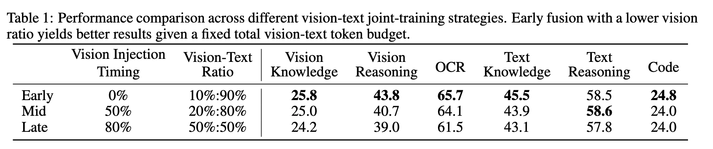

  - Pretraining시점부터 joint하게 visual + text tokens를 활용하는 방식
  - 단, visual token의 비율을 낮추는게 효과적임 (10%)

## 2.2 Zero-Vision SFT

- 기존 방식

  - Pretraining VLMs는 vision기반의 tool-calling을 수행하지 못해, cold-start 문제를 겪는다.
    - 즉, 수동으로 라벨링하거나 prompt engineering으로 CoT data를 생성하여 학습데이터를 만듦. $\to$ 제약이 있음

- 제안 방식

  - motivation: 고품질 text SFT 데이터는 다양하고 풍부하게 존재함. Pretraining시에 vision을 충분히 학습했으므로, zero-vision SFT를 통해 visual & agentic(tool-calling) 능력을 활용할 수 있음

    - object size 예측 (binarization & counting)

      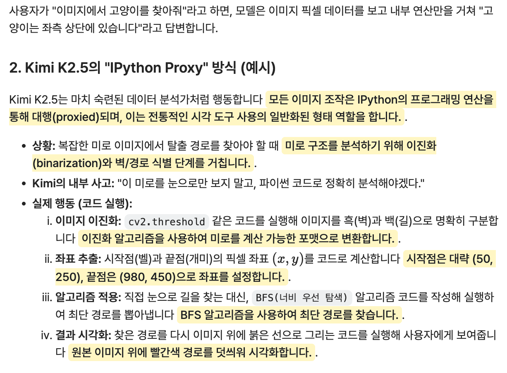

## 2.3 Joint Multimodal RL

- Outcome based RL

  - visual 입력에 대한 reasoning이 필수적이므로, 추가 RL 학습이 필요
    - Visual Grounding & counting
    - Chart & Document understanding : structuerd visual information & text 추출
    - Vision-critical STEM 문제들

- Rejection-Sampling Fine-tuning (RFT)를 통해 self-improving data pipeline를 중간에 추가 학습

- 그 이후 RL 학습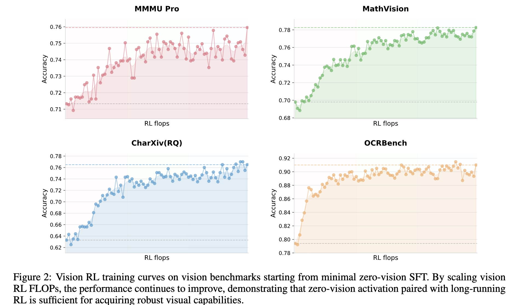

- Vision RL이 textual tasks의 성능도 향상시킴

  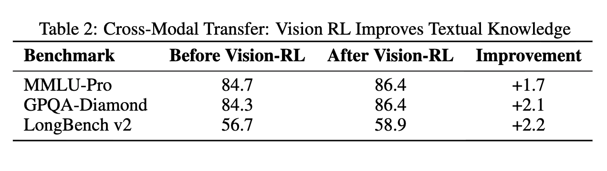

# 3. Agent Swarm(군중, 무리)

- 기존 agent system이 직면한 도전들

  - 순차적 tool-calling & reasoning steps $\to$ 복잡한 task 수행할 경우 context window를 벗어남

- Agent Swarm

  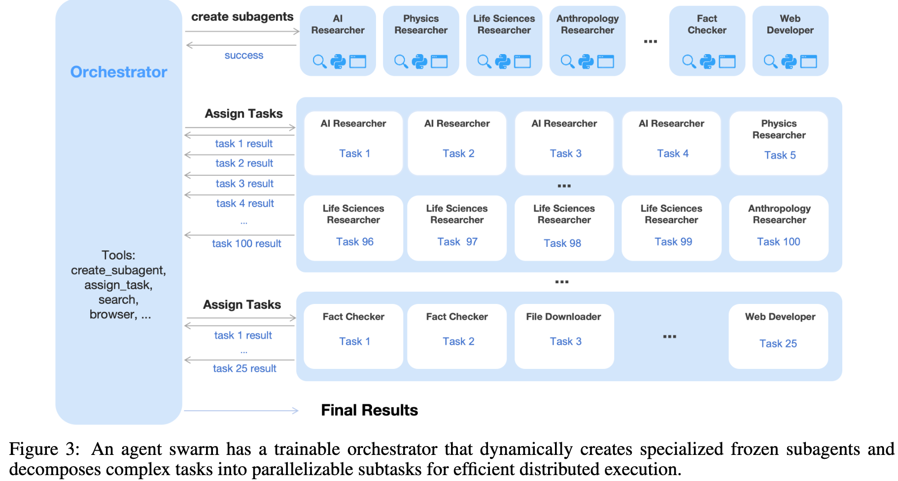

  - Dynamic하게 task를 분해하고, subagent를 초기화(호출)하며, 병렬로 subtask를 scheduling하는 방법

  - Orchestrator가 존재하며, 병렬로 처리해야 하는 subtask를 잘 계획하는 능력을 학습하기 위해 PARL (Parallel Agent RL)을 기반으로 훈련함

    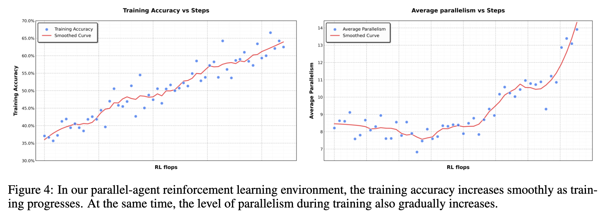

    - Orchestrator를 학습하는 동안 subagents 들은 freeze시킴 (trajectory를 reward에 미반영)

      - 이유
        - credit assignment ambiguity: 보상에 대한 credit(기여자)가 누구인지 outcome만 가지고는 판단하기 불분명하므로, orchestrator의 shceduling 능력에 대해서만 보상을 하기 위함 
        - training instability: end-to-end (orchestrator + subagents)를 동시 학습할 경우, 학습이 불안정해짐

    - PARL Reward

      - Orchestrator 학습이 어려운 이유
        - 환경과 상호작용하기 때문에 delay 존재
        - outcome이 pass일 경우만 reward가 반영되므로, inference대비 sparse함 (비효율적임)
        - non-stationary: 환경과 상호작용하므로, 정적인 셋팅이 불가함 (구현 난이도, 학습 불안정성, 등)

      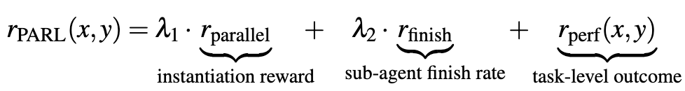

      - $r_{perf}$: overall success에 대한 보상
      - $r_{parallel}$: serial collapse(orchestrator 본인이 문제를 혼자 풀려고 하는 성질)를 막고, subagents를 호출하는 것을 장려하는 보상
      - $r_{finish}$: 거짓 paralleism을 통해 subagent 호출 남발을 방지하고자 (reward hacking), subtask의 성공여부를 보상으로 책정함
      - $\lambda_1, \lambda_2$: 학습 중에 0으로 annealing됨

    - Critical Steps

      - parallel-agent 셋팅에서 computationtal time cost를 계산하기 위해 *critical steps*를 아래와 같이 정의함

        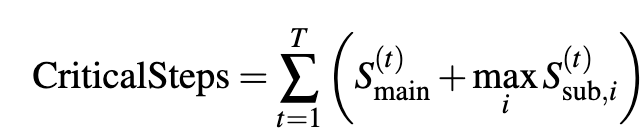

        - $S_{main}^{(t)}$: t번째 execution stage에서 main agent가 수행한 steps의 갯수
        - $S_{sub,i}^{(t)}$: t번째 execution stage에서 i번째 sub-agent가 수행한 steps의 갯수
          - max를 붙인 이유: sub-agent 중에 가장 늦게 수행한 step이 가장 많은 sub-agent의 time이 bottleneck이기 때문

      - Total steps보다 Critical steps로 train/eval 할때 제약을 주는 것이 훨씬 end-to-end latency에 효과적임

    - Real-world 문제 예시

      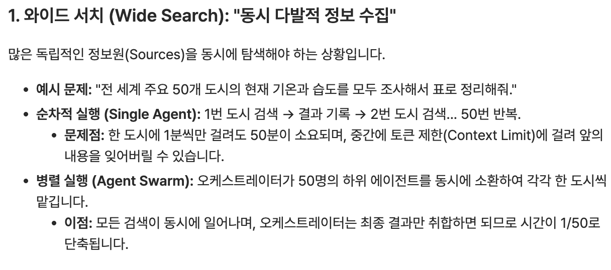

      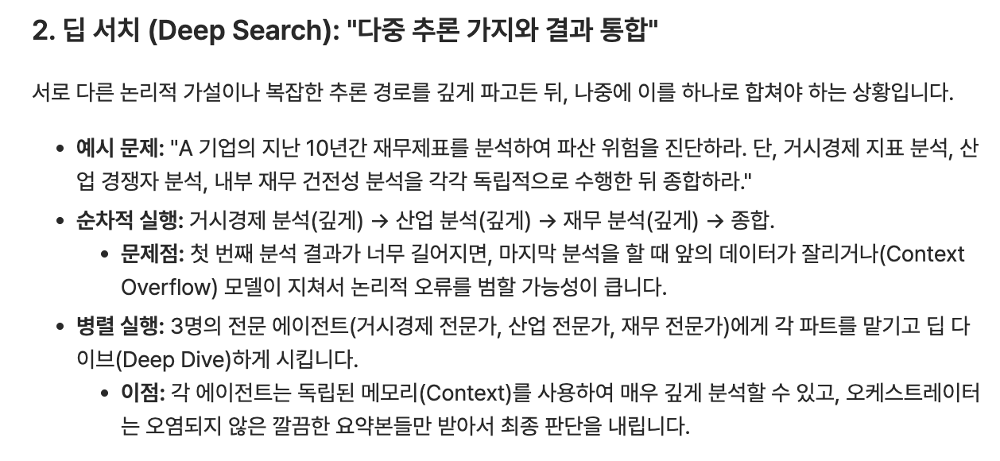

# 4. Methods 

## 4.1 Backbone: Kimi K2

- 1T param.을 갖고 MoE구조의 Transformers
- 15T 고품질 text token으로 pretraining되어 있음
- Token-efficient MuonClip optimizer로 되어 있음 (QK-Clip 적용)

## 4.2 Model Architecture

- Vision Encoder
  - SigLip-SO-400M로 초기화하여 학습된 MoonViT 사용 
    - NaViT 활용 (dynamic aspect ratio 입력 호환 가능)
    - Video frame의 경우, 4개의 연속된 frame을 1개로 temporal pooling
- MLP Projector

## 4.3 Pre-training Pipeline

- 학습 총량: 15T Tokens

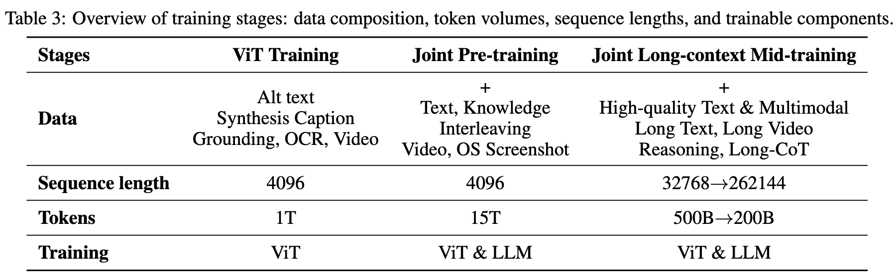

- ViT Training
  - CE loss만 가지고 학습 (no Contrastive Loss)
  - 2 스테이지
    - MoonViT-3D를 Moonlight-16B-A3B와 align하도록 훈련 $\to$ 고해상도 이미지 & 비디오 이해능력 
    - MLP만 훈련
- Joint Pre-Training
  - unique한 token 학습
- Joint Long-context Mid-training
  - Long context 학습

## 4.4 Post-Training

- SFT

  - Kimi K2로 생성한 고품질 후보 responses를 대상으로 사람 annotation + multi-stage prompt engineering으로 학습셋 구축

- RL

  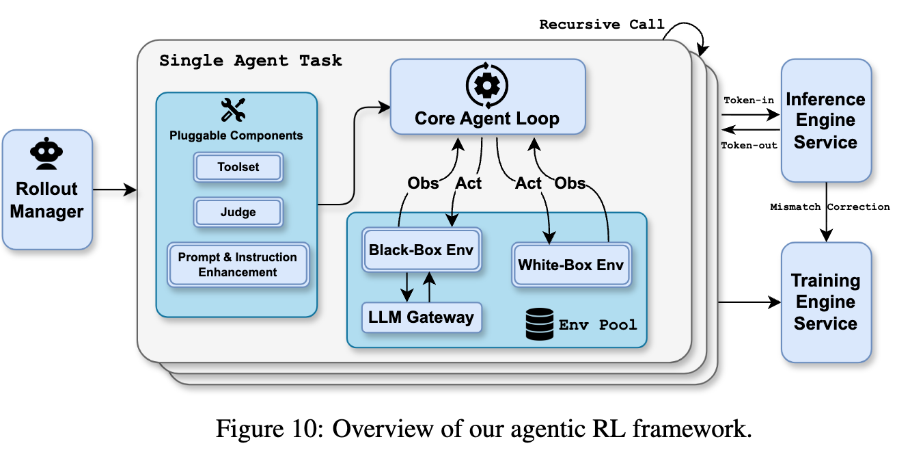

  - Text+Vision Unified RL framework

  - Rollout Manager가 최대 100,000개의 tasks를 관리 가능함 

  - asynchronous coroutine으로 독립적으로 agent task 실행 가능함

  - Plggable하게 Tool / Judge / Prompt 넣을수 있음

  - PPO Loss

    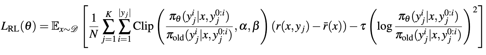

    - N: 전체 Token갯수
    - K: K번의 응답
    - $\alpha, \beta$: 최소, 최대값
    - Reward 함수
      - Open-ended task: Generative Reward Models 활용. Binary 심사관이 아니라, fine-grained한 evaluator로서, user experience에 중요한 value를 가지고 평가
        - ex. helpfulness, response readiness, contextual relevance, appropriate level of detail, aesthetic quality, strict instruction following, etc
      - Close-ended task: 정답과 비교

  - Token Efficient RL

    - Token 효율적으로 학습만 하다 보면, 복잡한 task 수행에 제약이 발생하므로, inference-time scalining 능력을 향상시키기 위해 *Toggle* reward 사용

      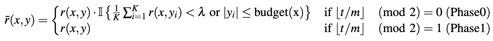

      - *m*: m번마다 toggle함

      - Phase0: budget limit phase

      - Phase1: scaling phase

      - Budget: correct response의 $\rho$ %로 제약을 검

        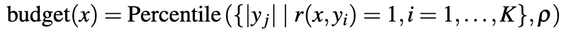

    - 결과

      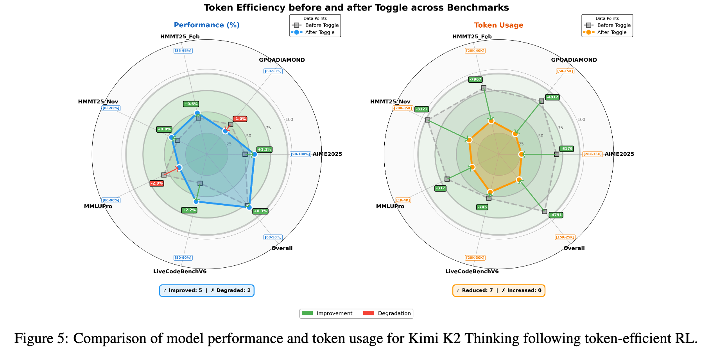

# 5. Experiments

- 정량적 결과

  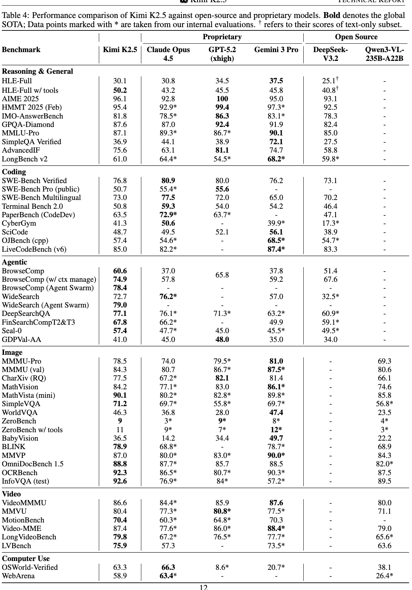

- Token Efficiency

  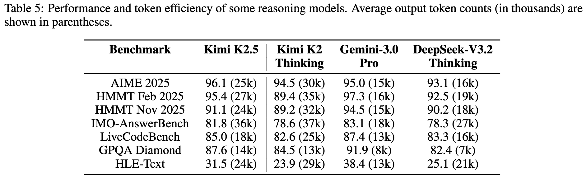

- Ablation Study

  - Agent Swarm 유무에 따른 성능 비교

    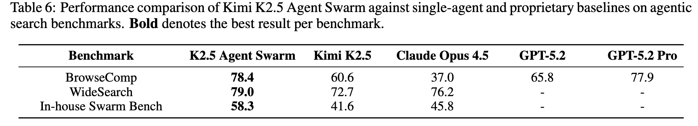

  - "cloud"가 호출하는 subagent들 & Agent Swarm 유무에 따른 RL학습 중의 성능 변화

    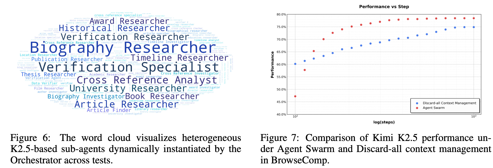

  - Agent Swarm이 절약해주는 시간

    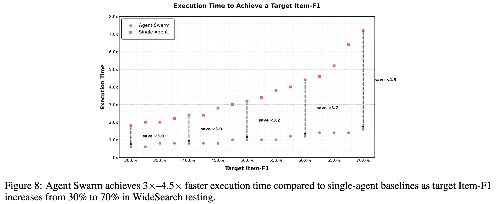

    - Task의 복잡도가 늘어날수록 최적화 되는 폭이 커짐
    - Target Item-F1: WideSearch 벤치마크에서 에이전트가 정보를 얼마나 정확하고 빠짐없이 찾아냈는지를 나타내는 **목표 성능 수치**를 의미.
      - 즉, 위 그래프에서 F1=70%의 의미는 해당 목표 수치에 도달하기 위해 필요한 Execution time을 의미함