title: "Talk to Your Slides: High-Efficiency Slide Editing via Language-Driven Structured Data Manipulation"

---

# [PPT Agent] Talk to Your Slides: High-Efficiency Slide Editing via Language-Driven Structured Data Manipulation

- paper: https://arxiv.org/pdf/2505.11604
- github: https://github.com/KyuDan1/Talk-to-Your-Slides
- ACL 2026 accepted (인용수: 0회, '26-06-25 기준)
- downstream task: PPT Editing

# 1. Motivation

- 프레젠테이션 편집 작업(layout 디자인, 반복적인 텍스트 관리, 등) 은 노동 집약적인 테스크임

- 기존에는 두가지 접근 방식이 존재하였음

  - 1. GUI기반 (OCR-based) visual agent 방식들은 text-heavy한 batch-editing tasks를 수행하는데 고비용의 이미지 입력을 처리하는 문제가 있음
       1. text-heavy 예시: 50 pages 슬라이드 내 영어 $\to$ 한국어로 번역 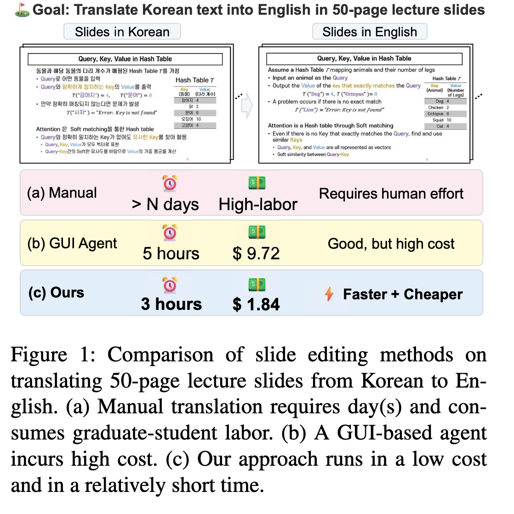
    2. 자연어 instruction $\to$ direct scripting code를 생성하는 방식
       1. 해당 방식은 문맥 해석을 요구하는 task에 취약함 ex. "전체 슬라이드 내 text를 요약하고 핵심 keyword를 빨간색으로 변경해."

  (Research Question 1) 자연어로 처리하는 구조화된 데이터 정제작업을 수행하는 TALK-TO-YOUR-SLIDE agent를 제안해볼 수 없을까?

  - 핵심은 *text-centric*, *structured*, *batch processing task*에서 visual agent보다 우위에 있는지 검증해보자

  (Research Question 2) 복잡한 유저의 instructions을 실행 가능한 steps로 분해하기 위한 시스템 architecture는 무엇일까?

# 2. Contribution

- Text-centric, batch-editing tasks에서 자연어 기반 agent가 GUI기반 agent (UFO) 보다 속도 & 비용 그리고 instruction fidelity에서 우수함을 보임
- 자연어 instruction을 low-level slide objects와 bridge하기 위한 구조화 framework인 TALK-TO-YOUR-SLIDE를 제안함
- *TSBench*라는 slide editing benchmark를 제안함

# 3. Related Works

## 3.1 Slide Generation

- AutoPresent: LLaMA-based model로 SlidesBench 데이터셋(7K)에서 학습을 수행함. 
  - 출력: Python code  (SlidesLib API)
  - 단점: Execution Error 에 취약함
- PPTAgent: Outline을 먼저 만들고, slide별로 고정된 template 안에서 수정함. 
  - 자체 평가 툴 PPTEval을 도입함 (content, design, structure)

## 3.2 LLM Agents for GUI Control

- UFO/UFO2: 스크린샷을 관찰하여 executable actions을 수행함 (ex. clicks, text input, etc)
  - 단점: pixel 단위의 이미지 상태만 바라보기 때문에 **비용이 비싸고**, 복잡한 테스크에 대해 **정밀하지 못함**

## 3.3 Code Generation from Language Instructions

- reasoning step을 추가한 논문, plan을 중간에 이용하여 복잡한 step을 multi-step coding tasks로 분해하는 논문 등이 나옴.
- 해당 아이디어를 바탕으로 해당 논문에서도 user instruction $\to$ slide editing operations로 변환하는 시스템 구조를 채택함

# 4. Talk to your Slide

- Overview

  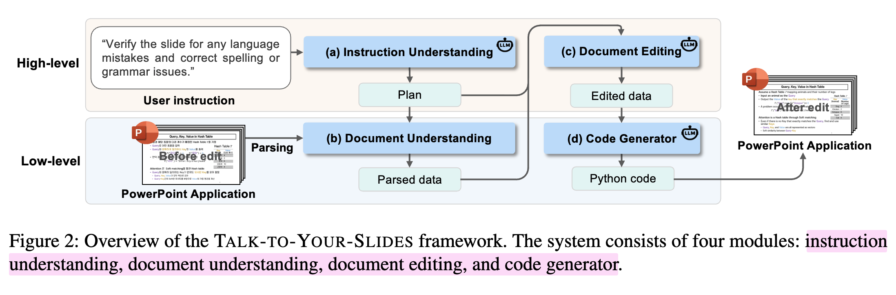

  - Instruction Understanding $\to$ Document Understanding $\to$ Document Editing (Generate Slide Data) $\to$ presentation 환경에 입히기 (python code generation)

## 4.1 High-level: Instruction Understanding

- 목적: 고차원의 유저의 instruction을 구조화된 actionable plans로 바꿔주는 module

  - input: user query + prompt

    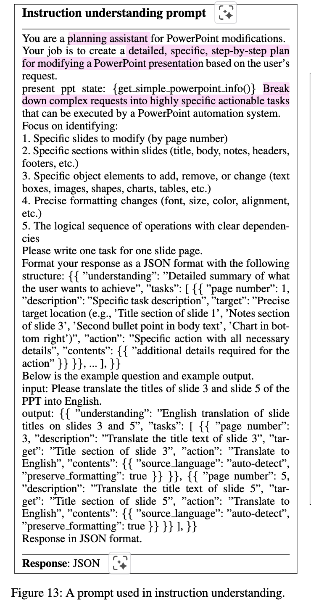

  - output: executable action lists

    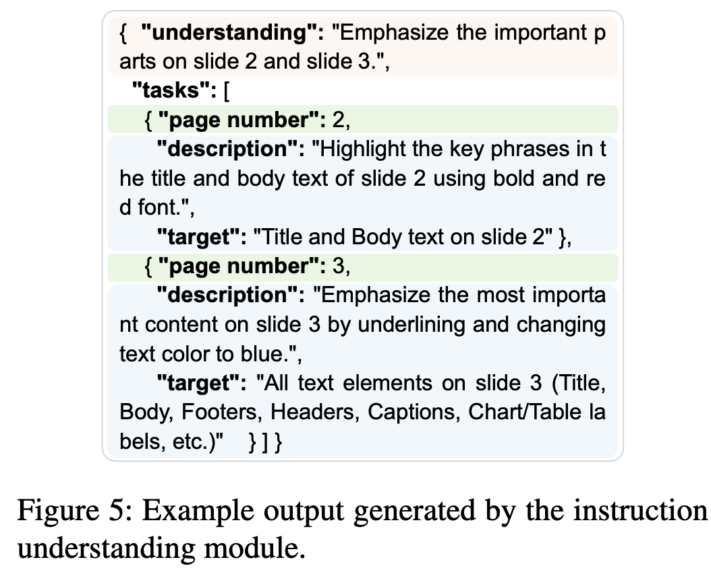

- 효과적인 in-context learning을 다른 논문을 참고해서 작성하였다고 함.

## 4.2 Low-level: Document Understanding

- 현재 slides 내 low-level component에 접근하여 parsing하는 모듈.

- custom rule-based parser를 개발하여 개별 slide에서 정보를 추출함.

  - Layout name, background fill type, transition effects, fine-level attributes 등

    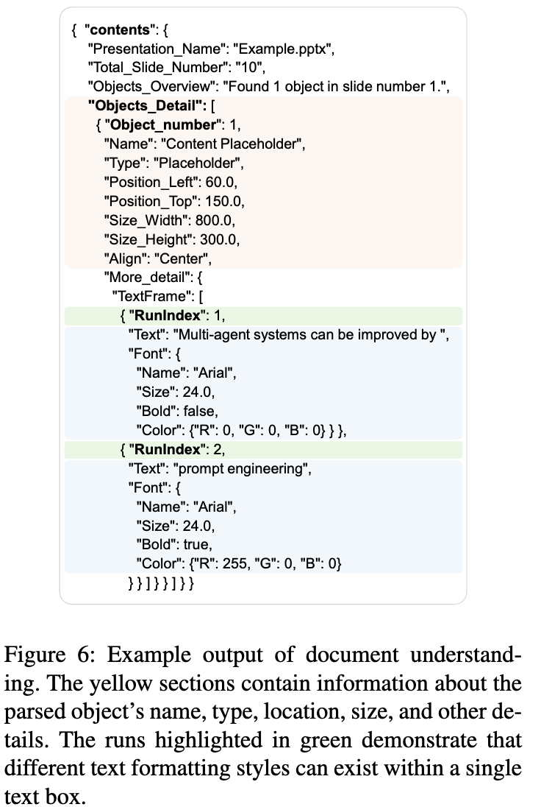

    - XML 방식이 아닌, COM (Component Object Model) 방식으로 객체 수정을 수행함 

      `예시: 특정 슬라이드 내의 '제목' 개체를 수정할 때, XML에서는 수천 줄의 코드를 검색해야 하지만, COM을 이용하면 active_presentation.Slides(1).Shapes("Title").TextFrame.TextRange.Text = "New Title"과 같은 파이썬 코드로 즉각적인 수정이 가능합니다``

## 4.3 High-level: Document editing

- Instruction Understanding의 plan + Document Understanding module에서 parsed 한 content를 바탕으로 LLM이 수정을 한다.

- Prompt 

  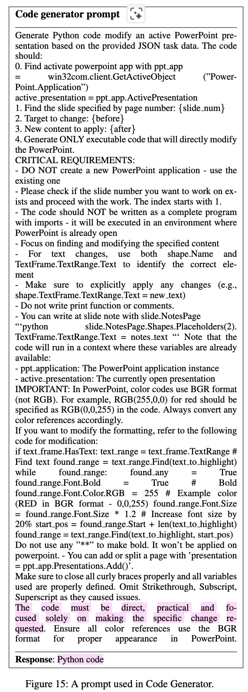

## 4.4 Low-level: Code generator

- Document Understanding에서 추출한 raw parsed data + Document Editing에서 수정한 edited document + Instruction Understanding에서 출력한 plan을 입력받아 COM (Component Object Model)기반의 python code를 생성함

  - 장점: Powerpoint Application (COM Server)에서 제공하는 functionalities + COM objects를 Code Generator (COM Client)가 win32com library를 사용하여 python script로 제어할 수 있음

    - MacOS에서는 AppleScript를 사용하나, 성능 차이가 있다고 함

      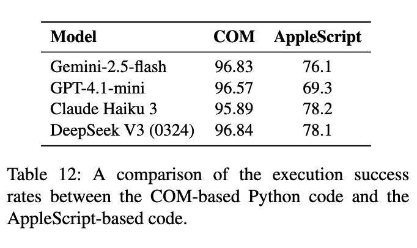

- 성능 & 비용 trade-off가 있으나 Self-Reflection 도입하면 성능은 향상됨

  - Execution Error 발생시 반복 수행함

    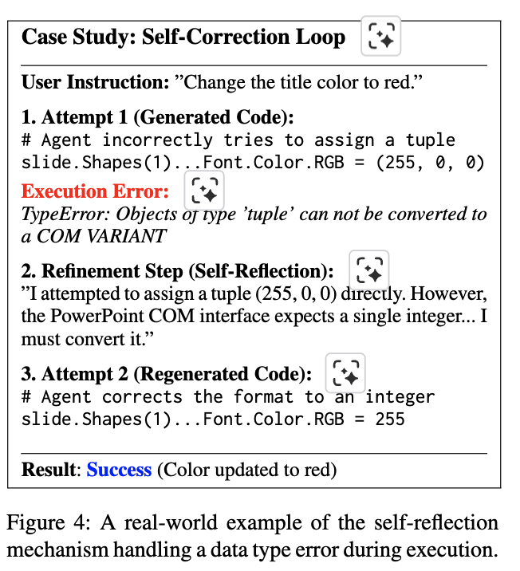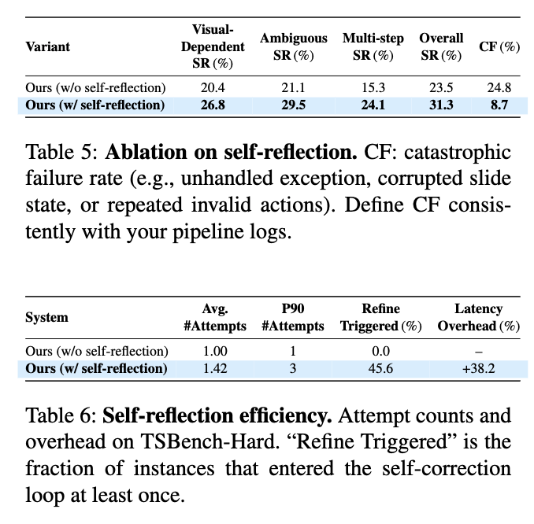

# 5. TSBench

## 5.1 Building the Benchmark

- 유저의 간단한 명령어가 50 page에 걸쳐 수정을 수행해야 하는 경우가 있음 
- 이러한 large-scale 문서를 평가에 활용하기 보다, 근본적인 modular tasks 로 쪼개어 agent의 핵심 능력을 세밀하게 평가할 수 있도록 설계함

### Instructions data

- 56개의 seed instructions을 바탕으로 GPT-4o를 통해 10개의 paraphrases를 생성함 (560개)  $\to$ 수동 리뷰 과정을 거쳐 instructions의 명료성과 유효성을 따져 최종 379개의 instruction을 4개의 카테고리로 분류함: *Text Editing, VisualFormatting, LayoutAdjustment, SlideStructure*

  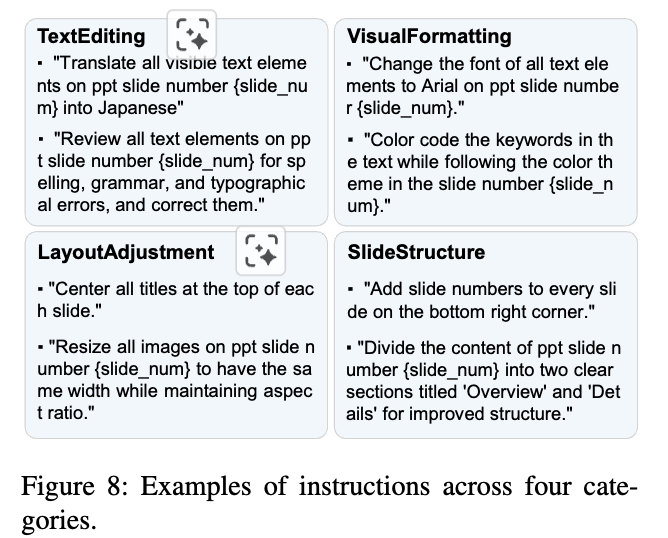

### Slide deck data

- 56개 seed instructions을 바탕으로 수동으로 10개의 template을 가지고 slide decks를 만들었음 

  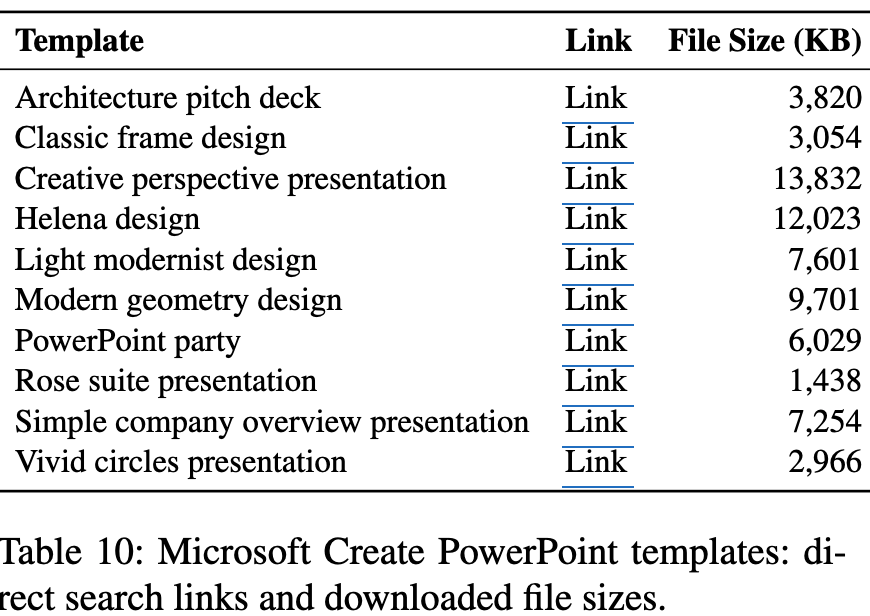

### TSBench-Hard

- Real-world user instruction은 가끔 *underspecified / context reasoning 을 요구*하는 경우가 있음

  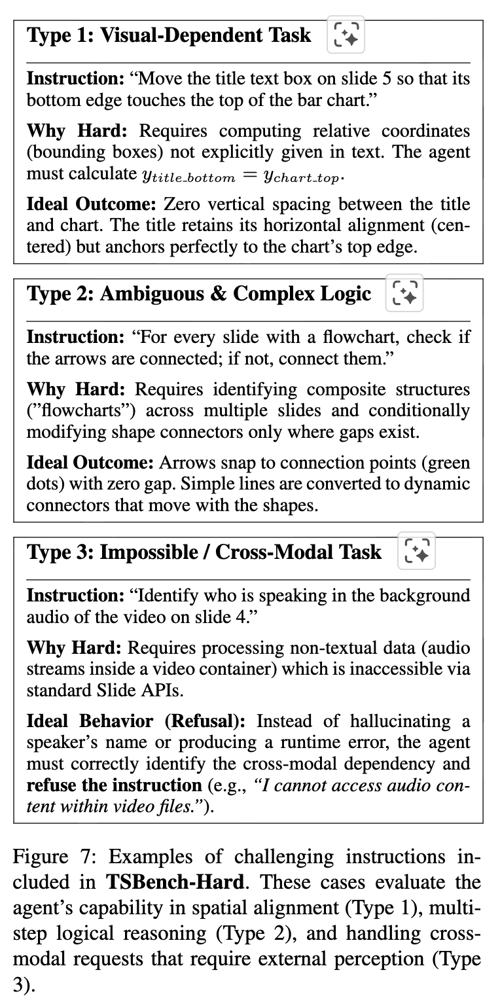

  1. Visual Dependent Tasks (ex. *Align the text box the the left edge of the image*)
  2. Ambiguous Instructions (ex. *Make the title slide look more professional*)
  3. Impossible / ross Modal Tasks (ex. *Identify the speaker in the embedded video*)$\to$ 이런 경우 hallucination이 아니라 "알 수 없음"을 뱉어야 함

# 6. Experiments

## Configuration

- Instruction Understanding Module: Gemini-1.5-Flash
- Document Editing / Code Generation Module: Gemini-2.5-Flash

## Performance Metrics

1. Execution Success Rate (SR)
2. LLM judge scores (text, image, layout, color) + Instruction Following metric
   1. human evaluation을 수행
3. Execution Time

## Efficiency Metrics

- Average Input Tokens, Average Output Tokens, Average Cost

## 6.1 Results

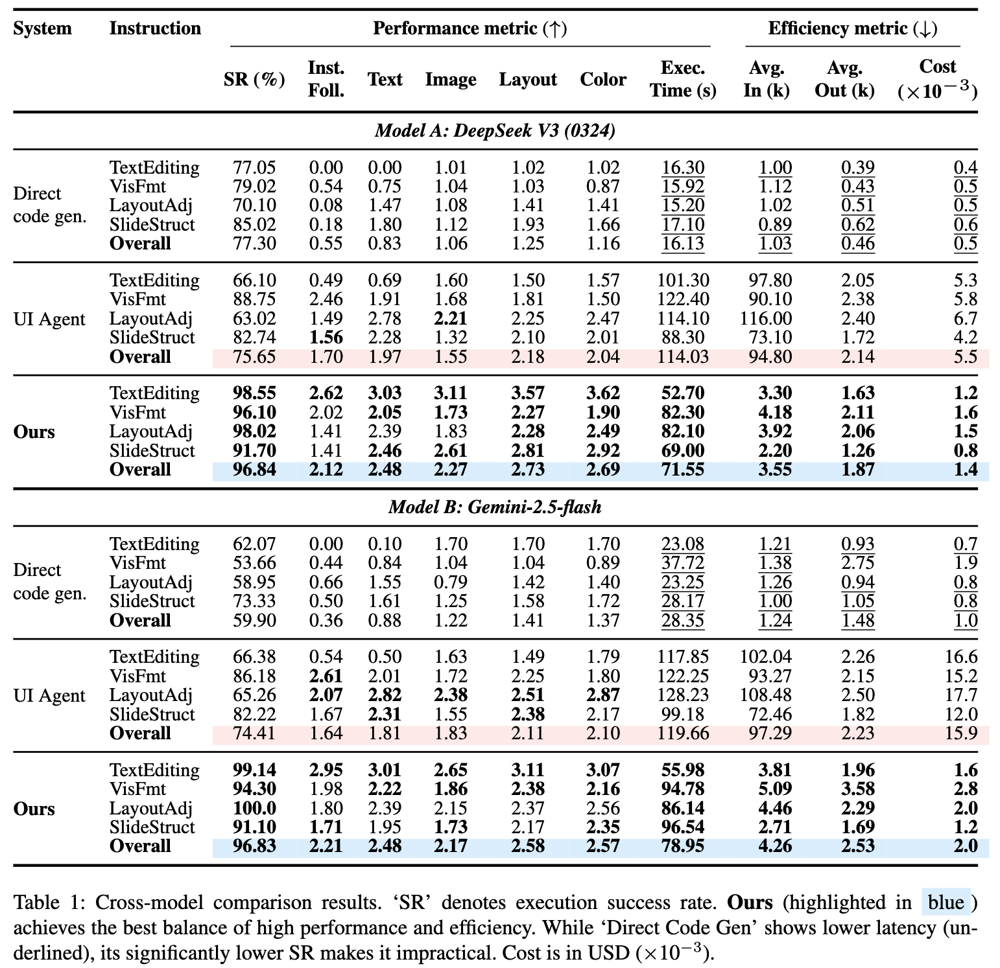

- Input Image 없이도 UI Agent보다 성능 향상 + 비용 절감 + 속도 절감
  - 단, LayoutAdjustment에서는 UI Agent가 우위임.

## 6.2 TSBench-Hard Results

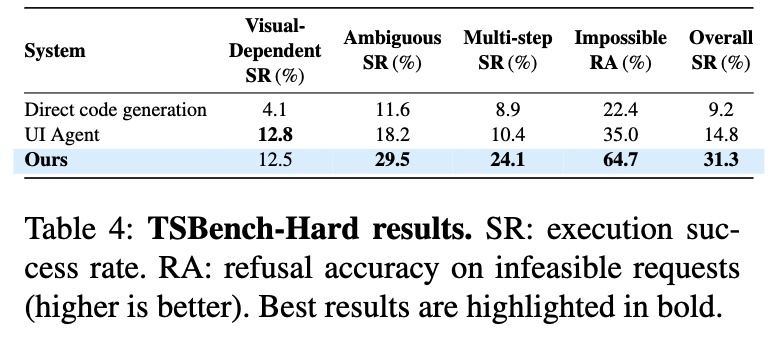

- 기존 방식들보다는 좋으나 SR이 33%면 못하는걸로 보임

- 특히 visual feedback이 있어야하는 Layout Adjustment는 Future work임 

  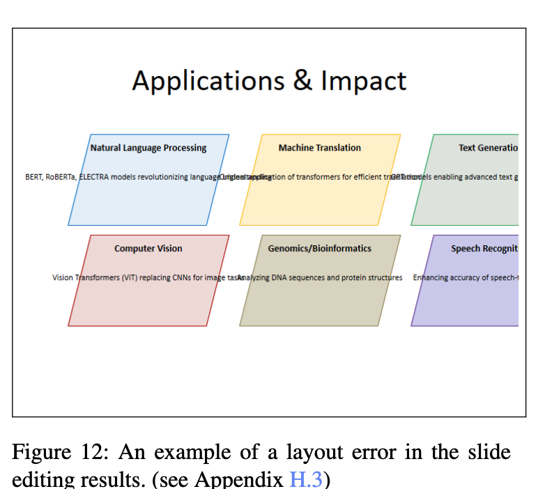