title: "Skilll-Guided Continuation Distillation for GUI Agents"

---

# [Agent] Skill-Guided Continuation Distillation for GUI Agents

- paper: https://arxiv.org/pdf/2606.18890
- ACL 2026 Findings (인용수: 1회, 26-09-04 기준)
- downstream task: GUI Agent
  - 주요 문서 편집 (ex. excel / word 등), software 작업 (ex. Chrome setting 변환 / 폴더 이름 변경 등), Web nevigation (ex. 빅마운틴에서 스탠포드대까지 걸리는 거리 계산)
- 주요 용어
  - policy-induced off-trajectory state: SFT로 학습한 baseline 모델이 잘못 예측한 trajectory로 잘못 도달한 상태 (ex. next 버튼 눌렀어야 하는데 previous 버튼을 눌러 이전 페이지로 돌아간 상태)
    - 임의로 망가진 state가 아니라, SFT로 학습한 모델이 편향된 실수를 **오답노트**로 활용하기에, 학습 효율이 좋다고 볼수 있음

# 1. Motivation

- 기존 GUI Agent는 대부분 전문가의 경로(trajectory)를 모방하는 학습 (SFT)을 하였음

- 하지만 이는 필연적으로 해당 데이터로 학습한 모델이 야기한 (학습 미달로) off-trajectory 로 야기된 unseen state에 대한 지도를 하지 못함 

  - 특히, Failure Cases 분석 결과 Trajectory 초기에 off-trajectory가 발생하였음

    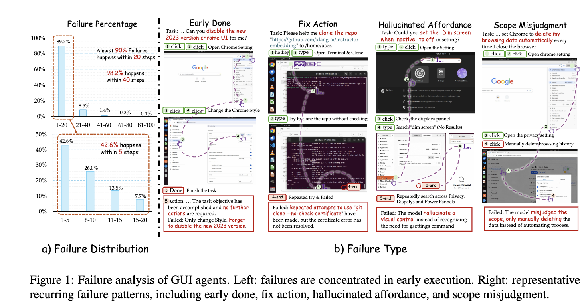

- 이를 해결하기 위해 Skill-Guided Continuation Distillation 방식을 제안해보자

# 2. Contribution

- 기존 방식 (SFT)들은 실제로 모델들이 직면하는 Off-Trajectory supervision하지 못하는 것을 문제로 정의하였고
- 해당 문제를 풀기 위해 Skill-Guided Continuation Distillation을 제안한다.
  - plain policy 모델의 trajectory를 추출한다.
  - failure case를 분석한 결과, 초기(< 20 steps)에 off-trajectory에 도달하는 경우가 90%에 육박함을 발견하였다.
  - 모델이 자주 틀리는 유형만 공략하고자, 초기 결과는 plain policy state + action history를 활용하여 데이터를 생성한다.
  - 이후 성공적인 연속된 trajectory를 구축하기 위해 Judge를 활용해서 Skills를 요약 생성해낸다.
    - Continuation Plans
    - Critical Targets
    - Failure Traps
    - Success Criteria
  - 이 skill을 토대로  roll-out을 하여 successful continuation trajectory를 확보한다.
- OSWorld-Verified 에서 30~50%의 성능 향상을 보였다. (success rate)

# 3. SGCD (Skill-Guided Continuation Distillation)

## 3.1 Preliminaries

- OSWorld 를 따라 input은 자연어 기반 instruction, inital state, 그리고 automatic verifier가 존재함

- Environment: Computer Use 환경. 도커 컨테이너로 구현되어 있고, 상태 최신화, 마우스 & 키보드 action 수행, rule-based final state 평가

- roll out

  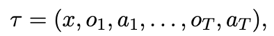

  - $x$: input instruction
  - $o_t$: observation state
  - $a_t$: action

- Plain policy model (=no skill guided)

  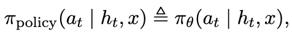

- Skill guided model

  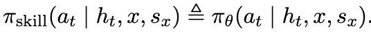

  - $s_x$: x번째 task의 skill

- SFT

  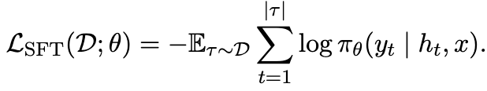

  - $y_t$: ground-trutn target

# 4. Method

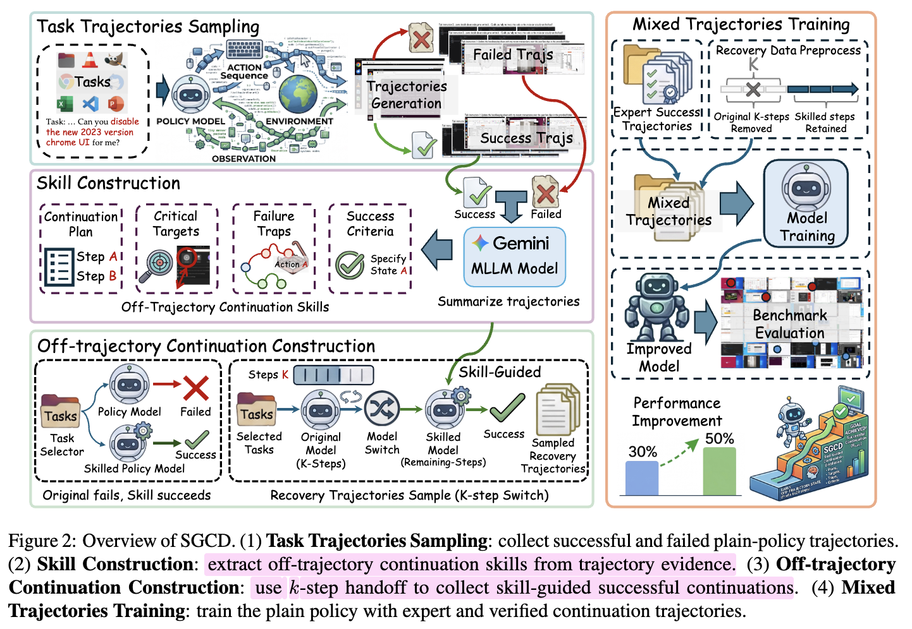

## 4.1 Motivation

- Failure 케이스는 반복된 policy model의 편향에서 기인하는 것을 확인 $\to$ Skill로 failure 가이드를 생성해줄수 있지 않을까?
- 4가지 순서
  - Step 1: Plain policy model로 tasks에 대해 **trajectory generation** $\to$ failure cases(off-trajectory)만 취합
  - Step 2: 상용 API로 failure trajectories를 요약하고 **Skill 4가지 생성** (task별로)
  - Step 3: Plain policy model의 첫 *k* steps 결과를 이어받아 Skill-Guided model이 잔여 step을 처리 $\to$ Success cases만 취합하여 학습셋으로 활용
  - Step 4: 기존 학습셋 (expert trajectories) + Step1에 sucess cases + Step 3의 success cases 로 학습

## 4.2 Step 1: Task Trajectory Sampling

- 환경에서 제공하는 Task verifier (rule-based)로 success / failure trajectory를 나눈다.

  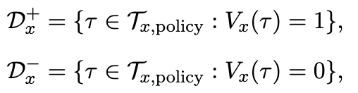

  - 현재 policy model이 실패하는 패턴을 학습하기 위해 trajectory를 생성하는 것

## 4.3 Step 2: Skill Construction

- Gemini-3-Pro를 써서 failure trajectories를 Skill 4종으로 요약

  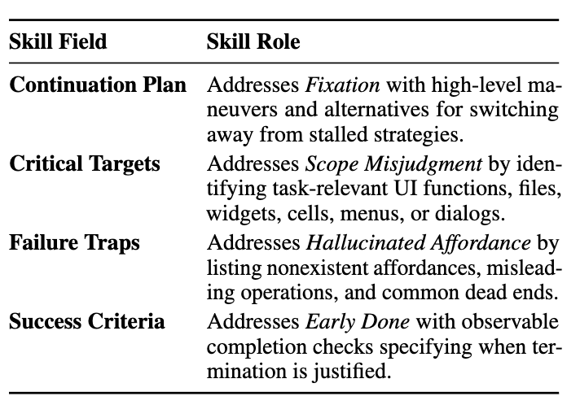

- 왜 성능에 긍정적일까?

  - web navigation, document editing 등은 정답 trajectory가 유일하지 않음
  - 반면 SFT 방식은 테스크별로 expert trajectory를 모방학습할 뿐, failure state는 학습하지 못함
  - 따라서, 다양한 off-trajectory 상황에서 대처하는 능력을 SGCD가 부여하기 때문임

## 4.4 Step 3: Off-Trajectory Continuation Construction

- Plain Policy 모델 : fail + Skill-Guided Policy 모델 : success 한 경우만 취합

  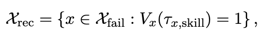

- *k* step 이전 history는 plain model 결과를 채택

  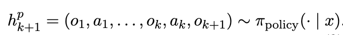

- *k+1* step 이후 history를 취득

  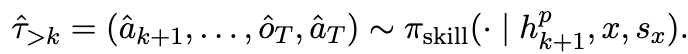

- 추가로, rule-based state evaluation은 최종 상태만 측정하므로, 과정중에 엉뚱한 trajectory 경로가 생기는 것을 방지하고자 LLM Judge로 추가 필터링을 수행함

## 4.5 Step 4: Mixed Trajectory Training

- *k+1* step 이후 history 경로만 학습에 활용

  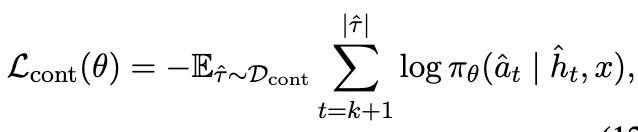

  - ablation에서 전체 trajectory를 학습하는 것보다 좋았음

    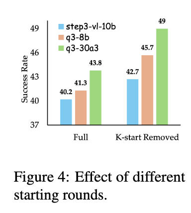

- 전체 loss

  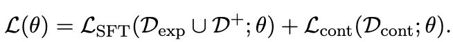

  - $D_{exp}$: expert trajectory
  - $D^+$: Step 1 success trajectory
  - $D_{cont}$: Step 4 trajectory

- iteration을 수행하면서 self-improvement process 로 고도화 할수 있음

  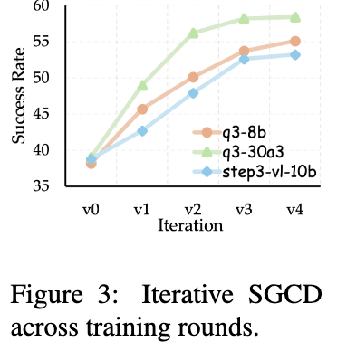

# 5. Experiments

## 5.1 Experimental Settings

**Backbone**

- Qwen-3-VL-8B
- Qwen-3-VL-30B-A3B
- STEP3-VL-10B

**Training Setting**

- H200 x 64대

**Metrics**

- Success Rate
- Continuation Success Rate

## 5.2 Main Results

- success rate

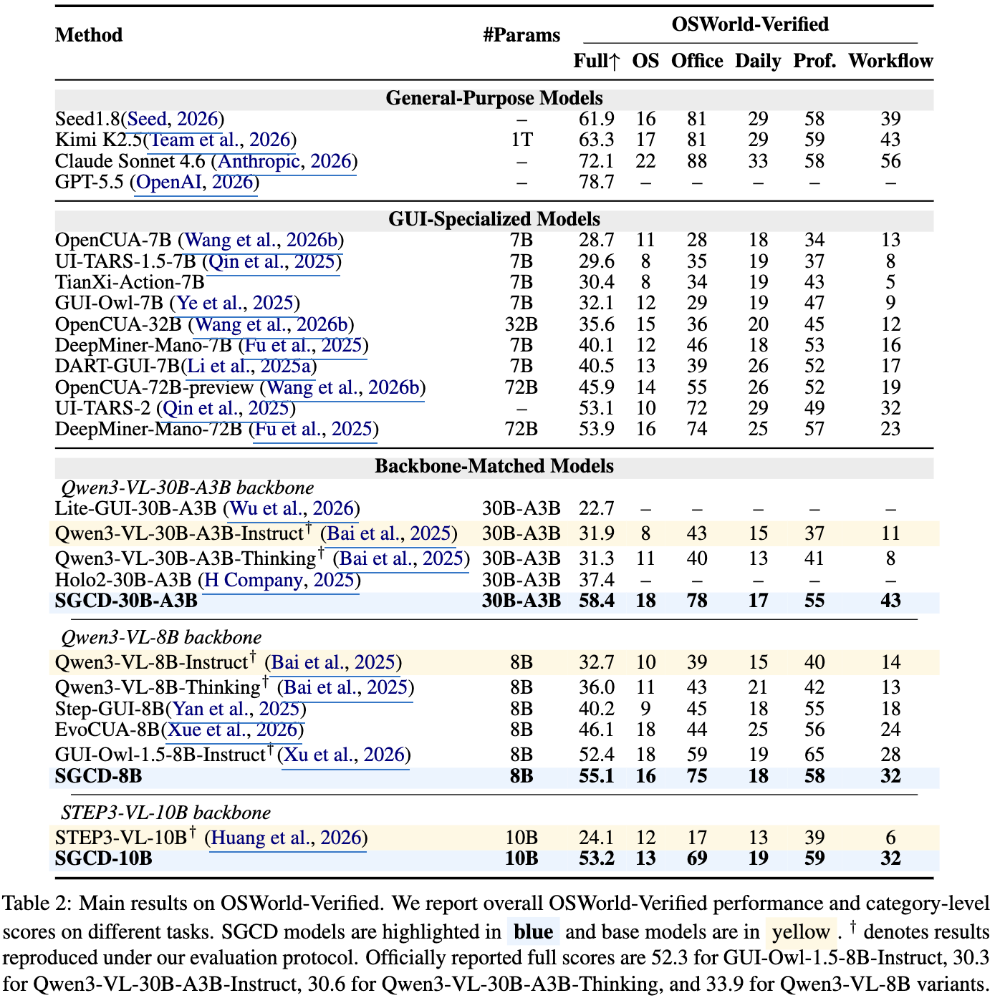

- continuation success rate

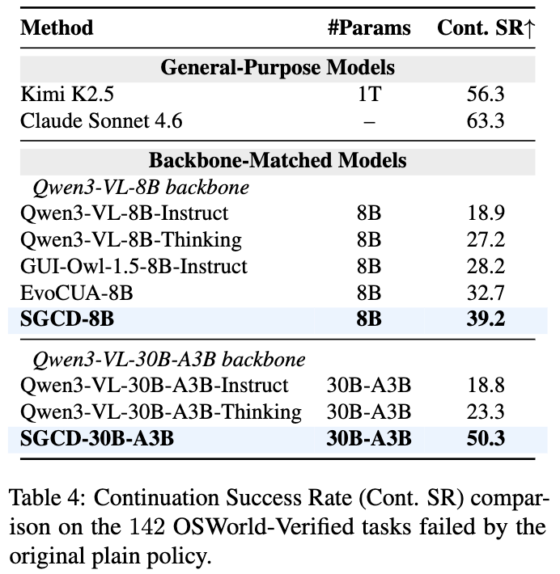

- Ablation Study

  - Skill component에 따른 성능 분석

    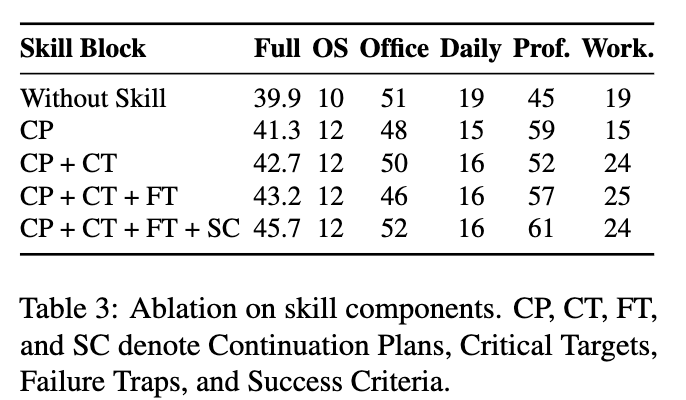