# [Agent] Multi-Step Tool-Calling over Korean Open Public APIs: A Benchmark and a Data-Synthesis Recipe

- paper: https://arxiv.org/pdf/2609.05395
- github: https://github.com/dneirfi/EDGE-KOPA
- EMNLP 2026 Industry Track accepted (Oral, 인용수: 0회, '26-09-11 기준)
- 저자: LG CNS (Dain Kim, Eungi Cho, Kyumin Kim, Shinyeong Noh, Kyuseong Lim)
- downstream task: Multi-Step Tool Calling (Function Calling) Agent
  - 한국 공공데이터 API를 여러번 연쇄 호출하여 질의에 답하는 테스크 (ex. "2021년 제주도 중학교 특수교육 대상 학생수는?")
- 주요 용어
  - **junction**: 앞 tool의 출력 필드가 다음 tool의 입력 인자로 넘어가는 이음새. $(T_i.f_i \to T_{i+1}.a_i)$
  - **cardinality**: 하나의 tool 호출이 반환하는 레코드 수. 한국 공공 API는 0 ~ 수십만까지 편차가 큼
  - **high-cardinality handoff**: 다수 레코드를 반환하는 출력이 junction을 통해 넘어가는 상황. 어느 값을 골라 다음 호출에 넣을지가 불확정이라 trajectory가 애매해짐
  - **structural fault vs environmental fault**: 바인딩 자체가 틀린 실패(스키마 불일치 등) vs 서버측 일시 오류(rate limit, timeout 등). 전자만 강하게 페널티

# 1. Motivation

- 데이터 주권(data sovereignty) 규제로 인해 공공기관은 상용 클라우드가 아닌 **on-premise 오픈소스 LLM agent**를 써야 하는 상황임

  - 다루는 데이터가 법령, 기업 공시, 교통 정보 등 기관이 공공 API로 제공하는 데이터임

- 그런데 이 환경에서 오픈소스 모델은 유독 성능이 낮음. 저자들은 두가지 원인을 짚음

  1. **entity code-lookup**: 단순 질의가 필연적으로 dependent chain이 됨
     - ex. "라이트론 전환사채 정보" $\to$ 먼저 `find_dart_corp_code`로 기업 고유번호를 얻어야 다음 호출이 가능
  2. **high-cardinality 응답**: 수천 ~ 수십만 레코드가 돌아오므로 reduction(줄이기) 또는 fan-out(각각 호출)이 필요함

- 오픈소스 모델은 두 경우 모두 실패함

  - prerequisite lookup을 건너뛰거나 (ex. API key 발급 없이 바로 호출 $\to$ Invalid API-key error)
  - multi-record 응답의 **첫 페이지만 보고 조기에 답변**함 (ex. 3페이지 중 1페이지만 보고 "23명" 이라 답)

  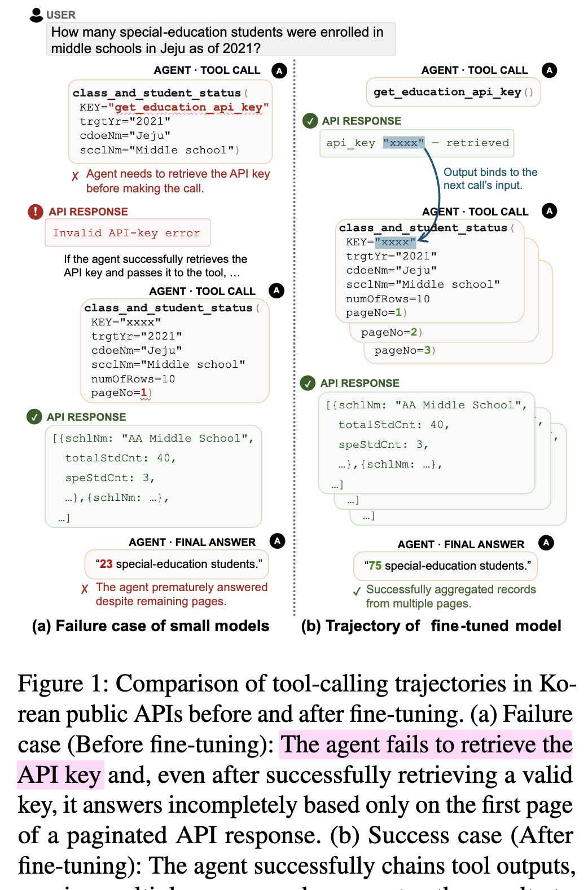

- 이를 측정할 벤치마크도 없고, 같은 제약(live endpoint + 다중 레코드)을 가진 학습 데이터도 없음

  - 기존 벤치마크는 emulated service (BFCL) 이거나 LLM user simulator 기반 hand-authored simulation ($\tau^2$-Bench) 임

  $\to$ (Research Question) live 한국 공공 API 위에서 multi-step tool-calling을 측정하는 벤치마크와, 같은 제약 아래 학습 데이터를 **실행으로 검증하며** 합성하는 방법을 만들어보자

# 2. Contribution

- **KOPA-BENCH** 제안: live 한국 공공 API 위의 multi-step function-calling 벤치마크
  - 10개 플랫폼 / 6개 도메인 / 145개 태스크
  - 각 태스크가 code-based lookup을 거치는 dependent call chain + high-cardinality 중간 결과를 요구함
- **EDGE** (Execution-grounded Dynamic Graph for tool-calling data synthEsis) 제안: tool dependency graph를 만들되, LLM이 제안한 edge를 **live API에 실제로 호출해서** 검증하고, 반복 실패하는 edge는 pruning하는 합성 파이프라인
  - high-cardinality 응답을 junction별 cardinality로 타이핑하여 bounded fan-out 또는 deterministic reduction으로 소화함
- 이 데이터로 GRPO 학습시 작은 오픈소스 모델이 크게 향상됨
  - KOPA-BENCH pass@1: 4B **+13pp**, 9B **+10pp**
  - 9B 모델이 같은 계열 untuned 27B에 근접 (0.4310 vs 0.4482, 파라미터는 1/3)
  - out-of-distribution인 **BFCL**에서도 향상 (multi-turn +4.04pp / +5.87pp)

# 3. Related Works

## 3.1 Function-calling Benchmarks

- API-Bank, BFCL: function-calling 평가의 기반
- ToolBench: 수천개 real-world REST API로 확장 / StableToolBench: live API 불안정성을 시뮬레이션 환경으로 대체
- $\tau^2$-Bench: user simulator를 두고 environment state 기준으로 채점
- 한국어: FunctionChat-Bench (범용 tool use), OrchestrationBench (구조화된 plan이 필요한 tool coordination)
- 단점: **live 한국 공공 API를 대상으로, 다중 레코드 응답을 연쇄시키는 세팅은 없음**

## 3.2 Function-calling Data Synthesis

- ToolACE: 합성 호출에 verification 단계 추가 / AWM: 일관된 응답을 주는 시뮬레이션 API 환경 안에서 호출 생성
- multi-step: Magnet, BUTTON, APIGen-MT $\to$ signature 매칭이나 LLM plan으로 함수를 이어붙임
- 단점: 공통적으로 **호출 간 링크를 live API에 대해 확인하지 않고 고정**하며, 각 호출이 단일 결과를 반환한다고 가정함
  - 즉, 불안정한 endpoint와 실제 공공 API의 multi-record 응답을 다루지 못함

# 4. KOPA-Bench

## 4.1 Platform Selection

- 세가지 기준으로 플랫폼을 선정함

  1. **domain coverage**: 공공기관이 실제로 공공 API에 의존하는 도메인 (교통, 금융, 교육, 법률, 정치, 지자체 행정)
  2. **API interconnectivity**: 연쇄된 multi-step reasoning이 가능해야 함
  3. **data licensing**: 공공누리(KOGL) 라이선스로 2차 저작물 허용

- 결과: 6개 도메인 / 10개 플랫폼

  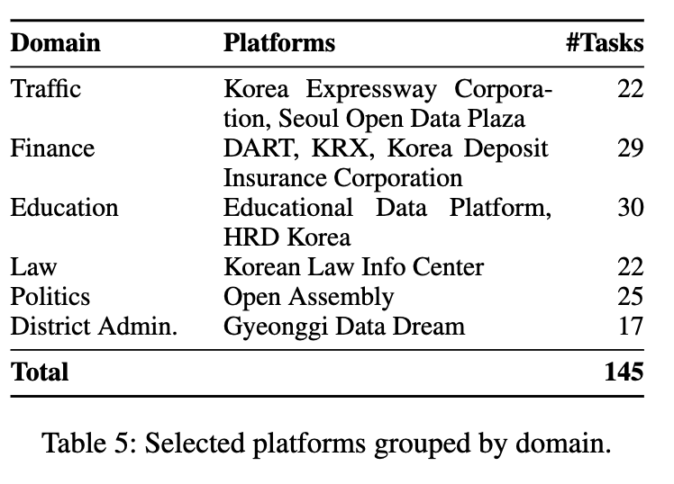

  - Traffic: 한국도로공사, 서울열린데이터광장 (22 tasks)
  - Finance: DART, KRX, 예금보험공사 (29 tasks)
  - Education: 교육데이터 플랫폼, HRD Korea (30 tasks)
  - Law: 국가법령정보센터 (22 tasks)
  - Politics: 열린국회정보 (25 tasks)
  - District Admin.: 경기데이터드림 (17 tasks)

- 태스크 난이도 통계

  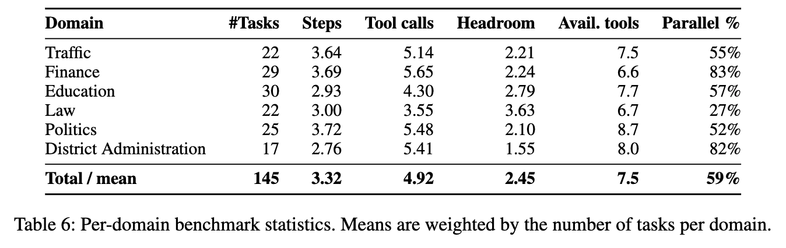

  - 평균 3.32 steps / **4.92 tool calls** (최대 14)
  - 태스크의 **59%가 parallel call**을 포함함
  - 평균 available tools 7.5개, headroom(=`max_allowed_calls`/optimal calls) 2.45

## 4.2 Tool Construction

- 플랫폼별 공식 문서를 파싱하여 **MCP 서버**로 구현함
  - 자연어 description이 붙은 typed function signature를 노출 $\to$ 표준 function-calling 인터페이스로 바로 호출 가능
  - 서버가 authentication, error handling, retry를 담당하는 API client를 내장함
  - 태스크별 environment state를 관리하고 평가 episode 시작시 초기화함 (ENVIRONMENT 기반 평가용)
- 총 **2,318개 function** / 10개 플랫폼, 전부 live endpoint에 연결됨

## 4.3 Task Generation

- 도메인 전문가가 도메인별로 chainable tool set을 설계하고, multi-step 호출이 **반드시 필요한** 질의를 작성함

  - 각 질의에 golden action (ground-truth optimal trajectory) + target response 또는 target environment state를 annotation

- 2단계 검증

  1. 태스크 작성자가 아닌 다른 전문가가 모든 태스크를 tool description 대조 감사 $\to$ **7개 태스크(4.8%)에서 오류** 발견
  2. golden trajectory를 실제 실행하여 나온 tool 출력을 frontier model (Claude Sonnet 4.6)에 주고 응답이 annotation과 일치하는지 확인 $\to$ 모델 실패 케이스 제외시 **80%가 1회 시도에 통과**

- 두 단계에서 걸린 태스크를 전부 수정하고 145개가 모두 통과할 때까지 반복함

- 태스크 예시 (Finance 도메인)

  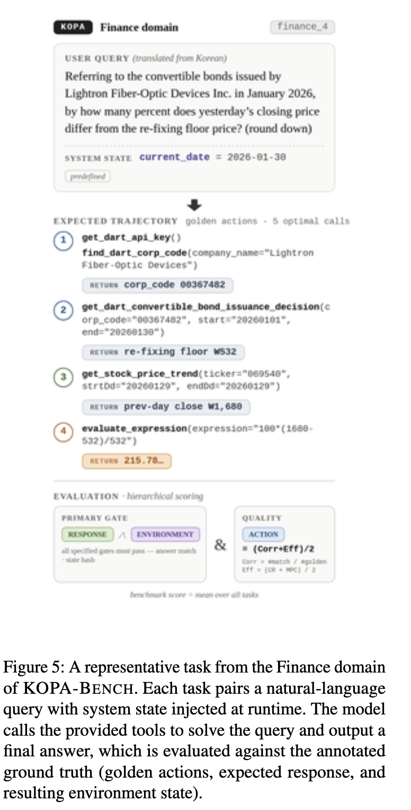

  - 질의: *"2026년 1월 라이트론이 발행한 전환사채 기준, 어제 종가가 리픽싱 최저가와 몇 % 차이나는가?"*
  - golden trajectory: `find_dart_corp_code` $\to$ `get_dart_convertible_bond_issuance_decision` $\to$ `get_stock_price_trend` $\to$ `evaluate_expression`
  - 시스템 프롬프트에 runtime state 주입 (`PredefinedSystemState`: `current_date=2026-01-30`, `ActionSystemState`: 에피소드 시작시 API key 발급 등)

## 4.4 Evaluation Methodology

- $\tau^2$-Bench를 따라 태스크별 `reward_basis` annotation으로 채점 지표를 지정함. 세 축으로 평가

  1. **RESPONSE**: 모델의 최종 답변이 golden과 일치하는가 (확정적 답이 있는 태스크)
     - String type (패턴 매칭 후 정규화, 실패시 LLM-as-a-Judge) / Number type (`\boxed{}` + sympy 기호 비교) / Judge type (Law 도메인 등 open-ended)
  2. **ENVIRONMENT**: 실행 결과로 남은 서버 상태가 golden state와 일치하는가
     - 태스크마다 MCP 서버 인스턴스를 새로 띄워 잔여 상태 격리, 종료시 **SHA-256 해시 비교**
  3. **ACTION**: 실행된 tool-call trajectory의 품질

- **왜 ACTION만으로는 부족한가** (핵심 주장)

  - golden action이 포함되어 있어도 *그것만* 실행했다는 보장이 없음
    - ex. golden이 `fillTank(amount=20)` 일 때 `[fillTank(20), fillTank(10)]`은 golden을 포함하지만 최종 상태는 틀림
  - 반대로 다른 경로로도 정답 상태에 도달 가능함
    - ex. `[fillTank(10), fillTank(10)]`은 결과가 같지만 strict matching에서는 감점됨
  - 따라서 ACTION은 **primary 성공 기준이 아니라, outcome 검증(RESPONSE/ENVIRONMENT)에 gating된 품질 지표**로 씀

- ACTION 점수 = correctness와 efficiency의 평균

  - Corr: golden action 중 predicted trajectory 어딘가에서 매칭된 비율 (함수명 동일 + 필수 인자 존재 + 불필요 인자 없음 + BFCL식 AST 타입 검사 + `value_compare_args` 값 일치). **순서는 강제하지 않음**
  - Eff: duplicate-call ratio와 minimal-path coverage의 평균

  $$
  \mathrm{CR} = 1 - \frac{N_{dup}}{N_{total}}, \quad \mathrm{MPC} = \frac{N_{opt}}{N_{total}}, \quad \mathrm{Eff} = \frac{\mathrm{CR}+\mathrm{MPC}}{2}
  $$

  - `max_allowed_calls`를 초과하면 Eff = 0
  - 최종 ACTION = $(\mathrm{Corr} + \mathrm{Eff})/2$

# 5. EDGE (Execution-grounded Dynamic Graph)

- 두 phase로 구성됨

  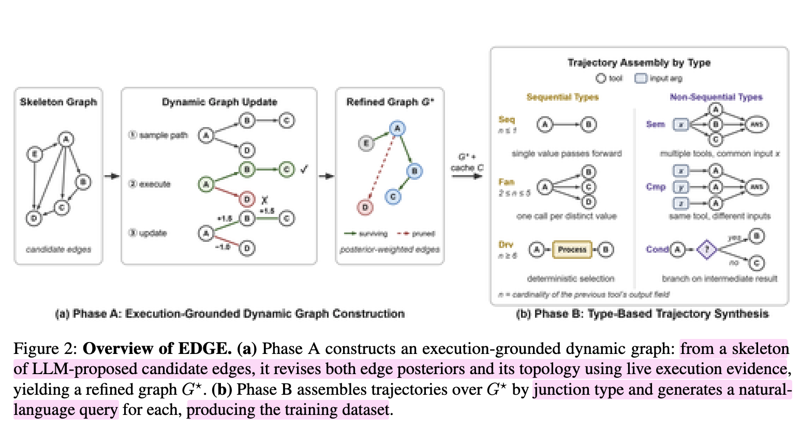

  - **Phase A**: LLM이 제안한 candidate edge를 live API 실행 증거로 검증/pruning하여 refined graph $G^\star$ 생성
  - **Phase B**: $G^\star$ 위에서 junction을 cardinality로 타이핑하며 trajectory를 조립하고, 각각에 대해 한국어 query와 answer를 생성

## 5.1 Problem Setting

- tool inventory $\mathcal{V} = \{v_1, \dots, v_N\}$, $N = 2{,}318$ (6개 도메인)
- 각 tool $v$는 live endpoint + JSON-typed signature $\sigma_v = (\mathrm{desc}_v, \mathcal{I}_v, \mathcal{O}_v)$ 를 가짐 (한국어 description, 입력 파라미터 스키마, 출력 필드 스키마)
- $v$ 호출시 레코드 집합 $R_v$ 반환. **cardinality가 0에서 수십만까지 변함**
  - 따라서 chain $u \to v$ 는 바인딩할 출력이 유일하지 않음 $\to$ 이것이 Phase B에서 풀 문제

## 5.2 Phase A: Execution-Grounded Dynamic Graph Construction

**Skeleton graph 구성**

- tool inventory를 노드로 하는 directed dependency graph $G = (\mathcal{V}, \mathcal{E})$ 를 만듦. edge $e = (u \to v)$ 는 "$u$의 출력 필드가 $v$의 입력 파라미터에 바인딩된다"는 주장임

- 모든 쌍 $\mathcal{O}(|\mathcal{V}|^2)$ 을 LLM으로 채점하는 건 불가능 $\to$ signature embedding 기반 dense retriever로 source tool당 top-$K$만 남김

  - 동일 도메인 15개 (`K`), 타 도메인 10개 (`K_x`) — 도메인 간 바인딩은 드물기 때문

- 각 candidate edge마다 LLM 1회 호출로 feasibility score $s_e \in [0,1]$, binding set $B_e$ (v의 파라미터 $\to$ u의 출력), 미바인딩 파라미터의 default 후보 $D_e$ 를 받음. 이를 파라미터별 source plan으로 컴파일

  $$
  \Pi_e(p) = \begin{cases}
  \textrm{UPSTREAM} \langle B_e(p) \rangle & p \in \mathrm{dom}(B_e) \\
  \textrm{DEFAULT} \langle d_p \rangle & p\ \textrm{generic} \\
  \textrm{CLARIFY} \langle D_e(p) \rangle & \textrm{otherwise}
  \end{cases}
  $$

  - UPSTREAM: 상위 tool의 출력에 바인딩 / DEFAULT: API key 등 generic 파라미터의 정적 조회 / CLARIFY: LLM 제안값 시도

- feasibility score가 threshold ($s_{min}=0.3$) 이상인 edge만 skeleton에 등록하고, feasibility-anchored Beta prior를 부여함

  $$
  \alpha_e = 1 + \kappa s_e, \quad \beta_e = 1 + \kappa(1 - s_e)
  $$

  - $\kappa$ 가 prior의 강도. 논문은 $\kappa = 2.0$ 으로 **일부러 약하게** 잡아 실행 증거가 prior를 뒤집을 수 있게 함

**Execution-grounded graph update**

- 매 iteration마다 path 배치를 샘플링해 **live API에 실제로 실행**하고, 결과로 edge posterior와 그래프 topology를 갱신함. 즉 그래프가 *dynamic*함

- edge 선택은 **Thompson sampling** (exploitation/exploration 균형). 각 edge의 성공률을 $\theta_e \sim \mathrm{Beta}(\alpha_e, \beta_e)$ 로 모델링하고, 현재 노드에서 나가는 edge마다 $\tilde\theta_e$를 샘플링해 최대값을 따라감. $\varepsilon$-greedy fallback 병행

  $$
  e^\star = \begin{cases} \arg\max_e \tilde\theta_e & \textrm{w.p. } 1-\varepsilon \\ \textrm{random outgoing edge} & \textrm{w.p. } \varepsilon \end{cases}
  $$

  - posterior의 평균이 아니라 **full posterior에서 샘플링**하므로, 시도 횟수가 적어 분산이 큰 edge도 계속 탐색됨
  - $\varepsilon$-greedy는 Thompson sampling만으로는 영영 안 뽑힐 cold-start edge에 탐색 하한선을 둠

- 경로의 첫 tool은 upstream 출력이 없으므로 실행 시점에 LLM 1회 호출로 인자를 채움 (rule-based fallback 있음)

- 실행 결과를 **structural / environmental** 로 분류하여 비대칭 업데이트

  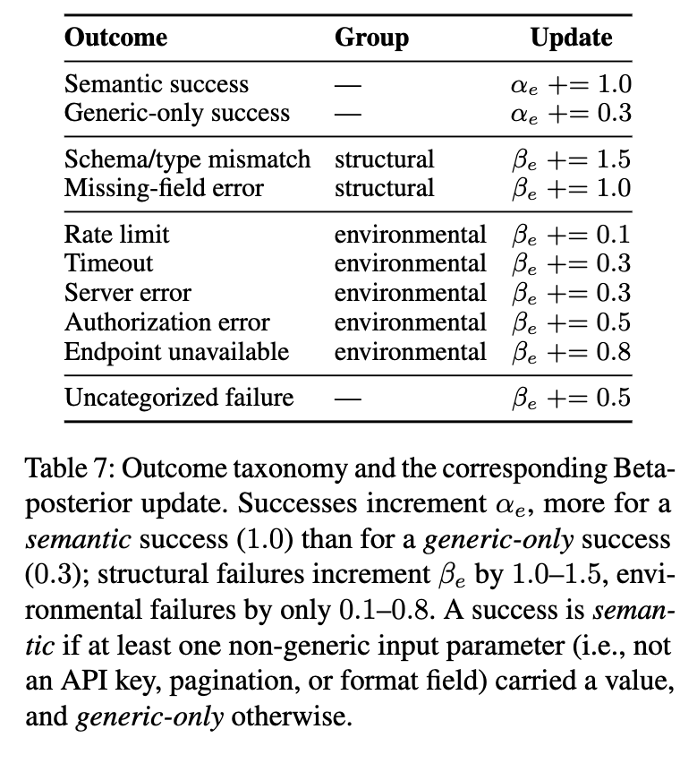

  - 성공: semantic success $\alpha_e \mathrel{+}= 1.0$ / generic-only success $\alpha_e \mathrel{+}= 0.3$
    - *semantic*의 정의: API key·pagination·format 같은 generic 파라미터가 아닌 입력이 최소 하나는 값을 실어 날랐을 때
  - structural 실패 (schema/type mismatch, missing field): $\beta_e \mathrel{+}= 1.0 \sim 1.5$
  - environmental 실패 (rate limit, timeout, server error 등): $\beta_e \mathrel{+}= 0.1 \sim 0.8$
  - **왜 비대칭인가**: rate limit이나 서버 오류는 바인딩이 옳든 그르든 무작위로 발생하므로, 올바르게 바인딩된 edge를 잘못 pruning하지 않으려면 약하게만 깎아야 함

**Pruning**

- 최소 $n_{min}$회 시도했고, viability threshold $\tau$ 를 넘을 posterior 확률이 confidence level $\varepsilon$ 밑으로 떨어지면 제거

  $$
  \mathrm{prune}(e) \iff n_e \ge n_{min} \wedge \Pr[\theta_e > \tau] < \varepsilon
  $$

- 이 루프를 수렴할 때까지 돌려 **refined graph $G^\star$** 를 얻음

- Hyperparameter

  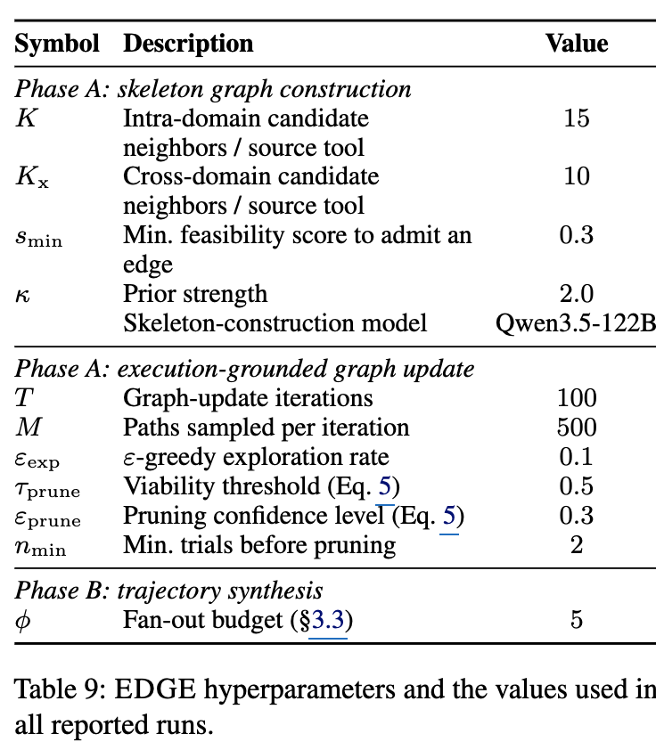

  - $K=15$, $K_x=10$, $s_{min}=0.3$, $\kappa=2.0$, skeleton 구성 모델 Qwen3.5-122B
  - $T=100$ iterations, iteration당 $M=500$ paths, $\varepsilon_{exp}=0.1$, $\tau_{prune}=0.5$, $\varepsilon_{prune}=0.3$, $n_{min}=2$
  - Phase B fan-out budget $\phi = 5$

- 수렴 과정에서 trajectory pass rate +31pp, step success rate +28pp 상승함

  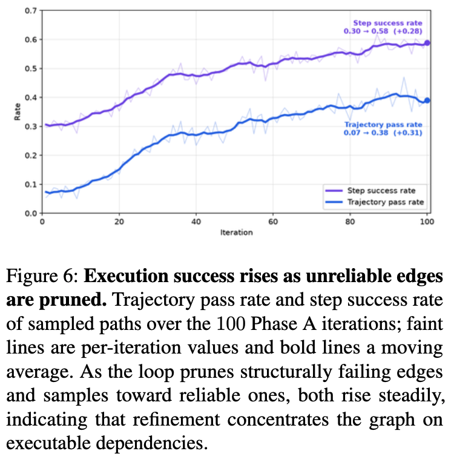

- prior vs posterior 산점도를 보면 retained/pruned가 **prior 축이 아니라 posterior 축 근처($\tau=0.5$)에서 갈림** $\to$ 결정이 LLM 판단이 아니라 실행 증거에 지배됨

  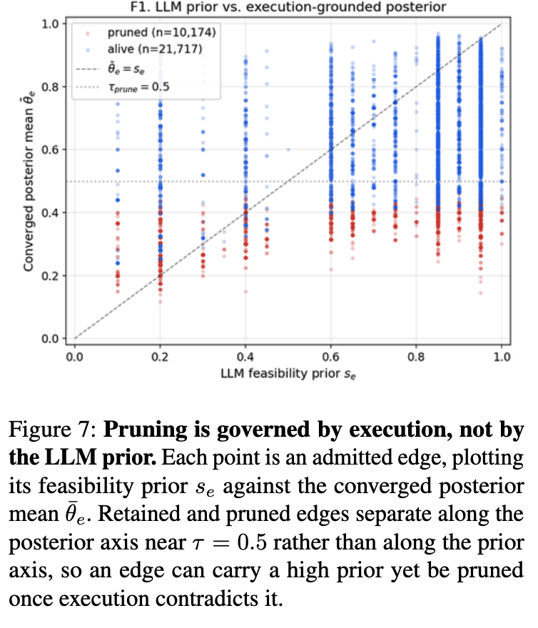

  - high-prior edge ($s_e \ge 0.6$)가 대각선 아래로 떨어지고, low-prior edge ($s_e \le 0.3$)가 위로 올라오는 양방향 교정이 일어남

## 5.3 Phase B: Type-Based Trajectory Synthesis

**Sequential trajectories**

- 검증된 edge graph 위에서 tool-call chain $(T_1, \dots, T_m)$ 을 합성함. junction $j_i = (T_i.f_i \to T_{i+1}.a_i)$ 의 출력 필드 값으로 다음 인자를 채우고, junction이 정하지 않는 인자는 validated cache $\mathcal{C}$ 에서 채움

- 문제: 한국 공공 API는 수천건 이상 반환하는 경우가 흔해서, junction이 **유일한 바인딩을 지정하지 못하고** 수많은 continuation을 만들어냄 $\to$ trajectory가 애매하거나 답이 없어짐

- 해결: **연결 필드의 cardinality $n_i$ 기준으로 junction을 타이핑**함 (fan-out budget $\phi = 5$)

  - **SEQ** (Pure Sequential, $n_i = 1$): 단일 값을 그대로 다음 tool로 전달
  - **FAN** (Fan-out, $2 \le n_i \le \phi$): 값마다 downstream 호출 1개씩 발행
  - **DRV** (Derived, $n_i > \phi$): 내부 process node를 삽입해 **bounded subset을 선택**한 뒤 진행
    - numeric 필드는 `max`, `min`, $\ge$, $\le$ / enum은 equality / date는 `date-after` / 타입 무관은 `most-frequent`
    - threshold·equality 필터의 pivot 값은 관측된 필드 값 중에서 골라, 필터 결과가 최대 $\phi$개가 되도록 함

- sequential trajectory의 구조 패턴은 junction type의 순서열 (ex. SEQ+FAN) 이고, 이게 나중에 query skeleton을 결정함

- 즉, 단일 값 흐름을 가정하는 기존 파이프라인이 버리거나 잘못 바인딩하던 many-record 응답을, **bounded enumeration (FAN) 또는 deterministic reduction (DRV)** 으로 안전하게 소비함

**Non-sequential trajectories**

- 명시적 템플릿으로 3종을 추가 합성하고, 실행에 성공한 경로만 남김
  - **SEM** (Semantic-parallel): 인자를 공유하는 독립 tool들을 호출하고 출력을 결합
  - **CMP** (Comparison): 같은 tool을 다른 인자로 호출하고 결과를 비교
  - **COND** (Conditional): 중간 결과에 대해 조건을 평가하고 해당 분기로 진행
- 단일 선형 chain으로 표현 불가능한 parallel / comparative / conditional 패턴을 커버함

**Query generation and validation**

- trajectory마다 LLM query generator가 **한국어 자연어 질의**를 만들고, 캐시된 실행 결과에서 답을 도출함 (trajectory 구조를 기술하는 type-specific prompt template 사용)
- 생성된 (query, answer, execution trace)는 3단계 validation을 통과해야 함
- **중요**: 학습 label은 오직 오픈소스 모델 출력에서만 나오고, 상용 모델은 검증에만 씀

## 5.4 Data Filtering

- 계산비용이 점점 커지는 3단계 cascading 파이프라인

  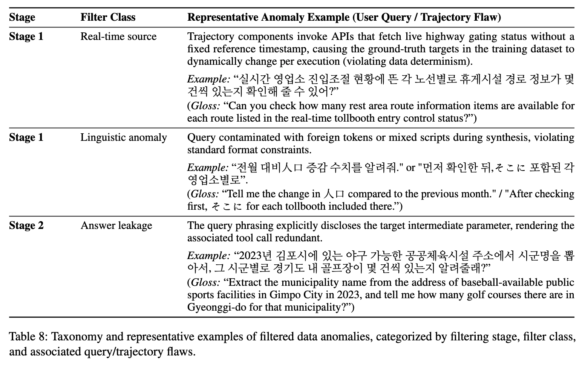

  - **Stage 1 (Rule-based)**: 결정론적 규칙으로 4종 제거
    - *non-reproducible* (고정 timestamp 없는 실시간 질의), *erroneous* (ground truth가 에러 신호), *redundant* (근사 중복), *malformed* (포맷/스키마 위반)
    - 실제 예: "실시간 영업소 진입조절 현황..." 처럼 실행마다 정답이 바뀌는 질의, "전월 대비 人口 증감..." 처럼 외국어 토큰이 섞인 질의
  - **Stage 2 (LLM-based static)**: LLM judge가 ill-posed 인스턴스 제거
    - *non-gradable* (자동 채점 불가), *answer-leaking* (질의가 정답/중간 파라미터를 이미 노출해 tool call이 무의미해짐), *decorative chains* (중간 호출이 최종 답을 제약하지 않음)
    - 뒤 두 개는 독립 LLM judge 2개의 합의를 요구함
  - **Stage 3 (Independent re-solving)**: ground truth 자체의 오류를 잡음
    - 기존 파이프라인은 ground truth를 고정 참조로 두지만, 여기서는 모든 태스크를 독립적으로 다시 풀어보고 **옳다고 판정되면 원래 저장된 답을 대체**함

## 5.5 학습 데이터 통계

- 총 **1,781 tasks**

  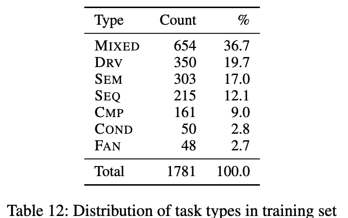

  - MIXED 654 (36.7%), DRV 350 (19.7%), SEM 303 (17.0%), SEQ 215 (12.1%), CMP 161 (9.0%), COND 50 (2.8%), FAN 48 (2.7%)
  - single-junction sequential 중 **FAN + DRV가 64.9% (398/613)** $\to$ 한국 공공 API에서는 one-to-many junction이 오히려 기본값이고, naive한 one-to-one 템플릿으로는 도달 불가능한 영역임

- 구조적 난이도

  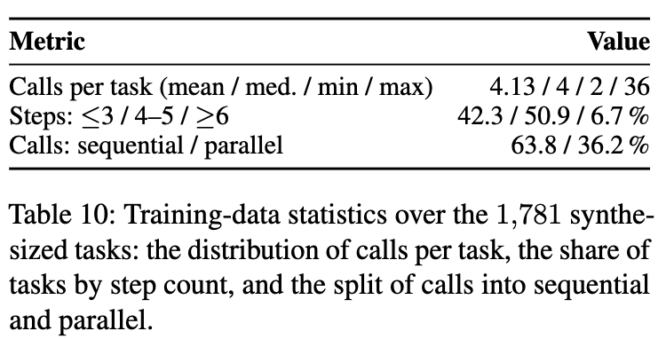

  - task당 평균 4.13 calls (최대 36), **57.6%가 4-hop 이상**, sequential : parallel = 63.8 : 36.2

- 기존 tool-use 데이터셋과의 비교 — 차별점은 **one-to-many chaining의 비율**

  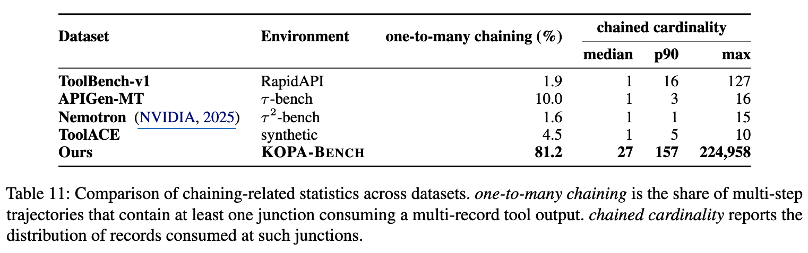

  | Dataset | one-to-many chaining | median cardinality | max |
  |---|---|---|---|
  | ToolBench-v1 | 1.9% | 1 | 127 |
  | APIGen-MT | 10.0% | 1 | 16 |
  | Nemotron | 1.6% | 1 | 15 |
  | ToolACE | 4.5% | 1 | 10 |
  | **Ours (KOPA)** | **81.2%** | **27** | **224,958** |

  - 기존 데이터셋은 전부 5% 미만 / median cardinality 한자리수. cardinality-based junction typing이 겨냥한 지점이 바로 여기임

# 6. Experiments

## 6.1 Experimental Settings

**Backbone**

- Qwen3.5-4B, Qwen3.5-9B

**Training Setting**

- EDGE 데이터 1,781 tasks 로 **GRPO** fine-tuning
- RESPONSE / ENVIRONMENT 두 축에 대한 **binary reward** $r \in \{0, 1\}$
- verl 프레임워크, 8 x H100 GPU
- task당 독립 rollout 4회 샘플링

**Metrics**

- KOPA-BENCH: pass@1 (4회 rollout 평균), pass@4 (4회 중 1회 이상 성공 비율), Action
- BFCL: Multi-Turn, Single (non-live), Single (live) — 공식 평가 repo 사용
- 추가로 8개 독립 seed로 재평가하여 95% CI 보고

## 6.2 Main Results

**KOPA-BENCH**

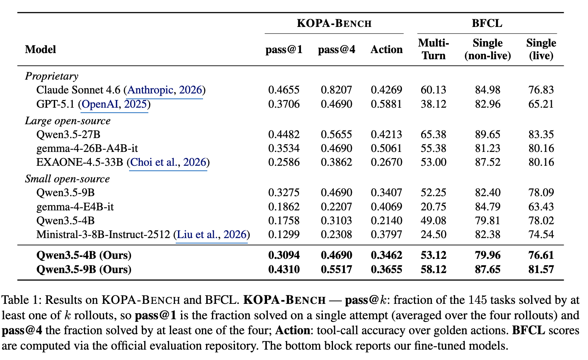

- 4B: pass@1 0.1758 $\to$ **0.3094** (+13pp)
- 9B: pass@1 0.3275 $\to$ **0.4310** (+10pp) $\to$ Qwen3.5-27B (0.4482)에 **1/3 파라미터로 근접**
- 참고로 Claude Sonnet 4.6가 0.4655, GPT-5.1이 0.3706 $\to$ **상용 모델도 이 벤치마크에서 절반을 못 넘김**
- 8 seed 95% CI가 base 모델과 **겹치지 않음** $\to$ 145개라는 작은 벤치마크 크기에도 통계적으로 유의함

  Table 4 첨부

  - 4B: [0.2762, 0.3100] vs base [0.1400, 0.1807]
  - 9B: [0.4040, 0.4235] vs base [0.3277, 0.3775]

**Out-of-distribution (BFCL)**

- 두 모델 모두 aggregate 점수가 base보다 향상 $\to$ EDGE 학습이 OOD 성능을 희생하지 않음
- **Multi-turn이 가장 크게 향상** (4B +4.04pp, 9B +5.87pp) 하여 single-turn 향상폭을 일관되게 상회함
  - 학습 분포는 거의 single-turn인데도 multi-turn이 좋아진 것 $\to$ multi-step tool-call trajectory와 multi-turn 대화 구조 사이의 **구조적 정렬** 때문으로 해석함

**Held-out platform 일반화**

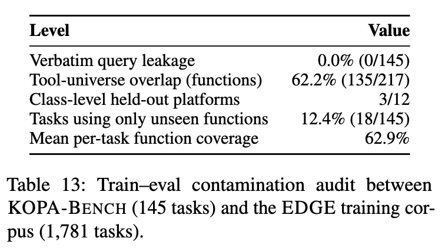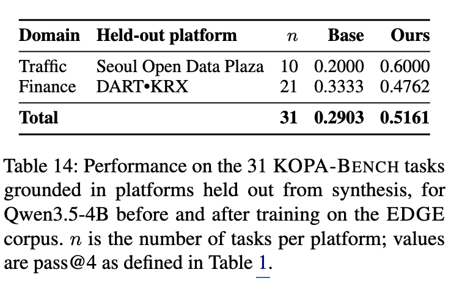

- 합성 단계에서 아예 제외한 3개 플랫폼(서울열린데이터광장, DART, KRX)에 속한 31개 태스크에서, 4B의 pass@4가 0.2903 $\to$ 0.5161 (**+22.6pp**)
  - 전체 벤치마크 향상폭 +15.9pp를 **상회함** $\to$ 플랫폼별 호출 절차를 외운 게 아님
- 오염 감사: **verbatim query leakage 0% (0/145)**, tool-universe overlap 62.2%는 설계상 공유되는 API pool일 뿐

## 6.3 Ablation Study

**(1) 학습 objective: SFT vs GRPO**

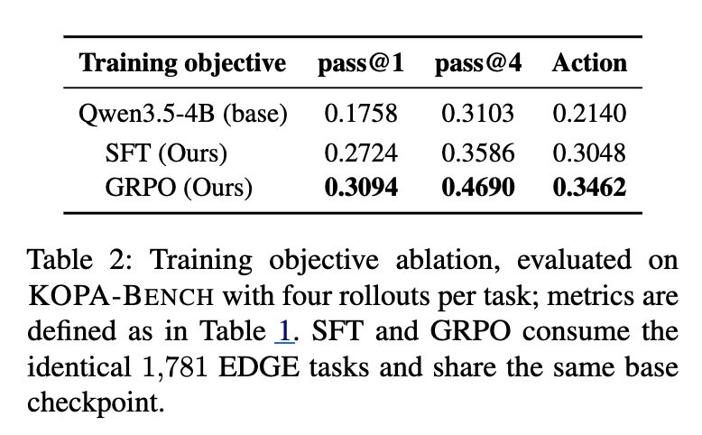

| Training objective | pass@1 | pass@4 | Action |
|---|---|---|---|
| Qwen3.5-4B (base) | 0.1758 | 0.3103 | 0.2140 |
| SFT (Ours) | 0.2724 | 0.3586 | 0.3048 |
| GRPO (Ours) | **0.3094** | **0.4690** | **0.3462** |

- SFT만으로도 pass@1 +9.7pp / Action +9.0pp $\to$ 향상의 대부분은 **objective가 아니라 EDGE corpus 자체**에서 옴
- GRPO는 그 위에 추가 향상, 특히 pass@4 (+11.0pp)에서 두드러짐
  - 동일 태스크셋을 쓰므로 이 격차는 **데이터 양이 아니라 태스크당 뽑아내는 신호량**의 차이임
  - SFT는 단일 검증 trajectory를 모방하므로 teacher가 상한이지만, GRPO는 프롬프트당 여러 rollout을 샘플링해 상대 보상으로 학습함. 하나의 질의에 여러 유효 trajectory가 존재하고 중간 실패가 흔한 이 도메인에서 더 유리함

**(2) trajectory 구성 (diversification)**

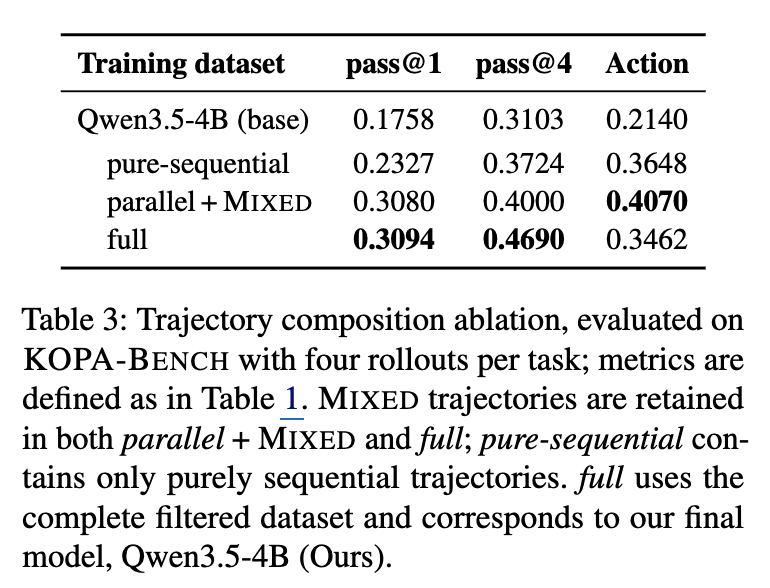

| Training dataset | pass@1 | pass@4 | Action |
|---|---|---|---|
| Qwen3.5-4B (base) | 0.1758 | 0.3103 | 0.2140 |
| pure-sequential | 0.2327 | 0.3724 | 0.3648 |
| parallel + MIXED | 0.3080 | 0.4000 | **0.4070** |
| full | **0.3094** | **0.4690** | 0.3462 |

- *pure-sequential*은 parallel composition을 한번도 못 보므로 뒤처짐
- *parallel + MIXED*는 pass@1에서 full에 근접하나 **pass@4에서 크게 벌어짐** (0.4000 vs 0.4690)
- Action은 *parallel + MIXED*가 더 높은데, 이는 full만 푸는 태스크가 long-horizon이라 효율 점수가 낮게 나오기 때문임 (품질 문제가 아니라 태스크 구성 문제)
- 결론: 두 계열이 상보적임 $\to$ sequential은 junction간 정밀한 output-to-input handoff를, parallel은 단일 chain으로 표현 못하는 비교/조건 패턴을 가르침. 최종 모델은 full mixture 채택

**(3) Data filtering 효과**

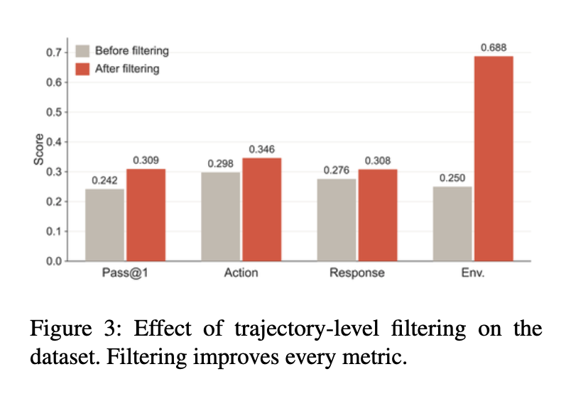

- 필터링으로 pass@1 0.242 $\to$ 0.309 (**+6.7pp**), Action·Response·Env 전 지표 상승
  - 특히 Env는 0.250 $\to$ 0.688로 급등

**(4) Execution-grounded dynamic graph 효과 (핵심 검증)**

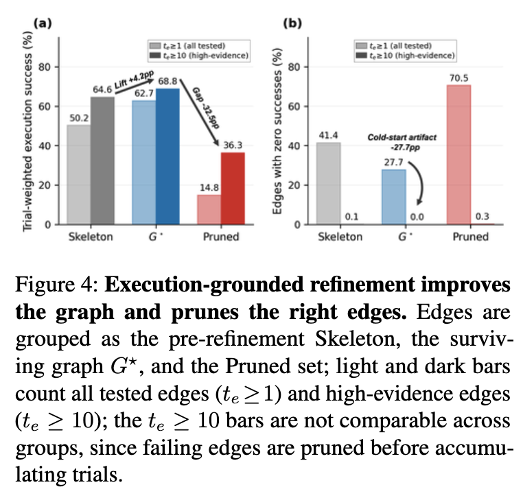

- 세 edge set의 실행 성공률 비교 — skeleton(LLM 판단만) / $G^\star$(수렴 그래프) / pruned(제거된 edge)
  - skeleton edge 중 실제 실행되는 건 **50.2%**
  - $G^\star$ 는 **62.7% (+12.5pp)**
  - pruned edge는 **14.8%** 로 $G^\star$ 보다 훨씬 낮음
- 두 집합이 동일한 LLM-proposed edge에서 출발했으므로, 이 차이는 **전적으로 실행 증거에서 옴**
  - pruning이 무작위였다면 두 집합의 실행률이 비슷해야 하는데 그렇지 않음 $\to$ live API가 실제로 거부하는 edge만 정확히 골라냄
  - pruned edge 중 **70.5%가 어떤 시도에서도 성공한 적 없음** (retained는 27.7%)
- skeleton은 "signature matching + LLM 판단 1회로 의존성을 고정하고 live endpoint에 확인하지 않는" 기존 합성 파이프라인(Magnet, BUTTON, APIGen-MT)의 controlled proxy 역할
  - 단, 저자들도 이건 end-to-end 재구현이 아니라고 명시함

# 7. Conclusion & Limitations

**Conclusion**

- live 한국 공공 API 위의 multi-step tool-calling을 다루기 위해 **KOPA-BENCH**(145 tasks, 10 platforms, 6 domains)와 **EDGE**(실행 기반 검증 합성 파이프라인)를 제안함
- 작은 오픈소스 모델을 이 데이터로 GRPO 학습하면 훨씬 큰 모델에 근접하고, BFCL 같은 OOD 벤치마크에도 일반화됨

**Limitations**

- **live endpoint 의존**: 스키마, 가용성, 반환 레코드가 시간에 따라 변함 (endpoint drift). 실시간 데이터 소스에 묶인 태스크를 필터링하고 environment state를 해시 비교로 평가해 완화했지만, 정확한 재현은 결국 통제 불가능한 공공 서비스의 안정성에 달림
- **한국 공공 API 한정**: 다른 언어, 상용/사설 API, 타 국가 행정 시스템으로의 전이는 미검증
- **비교 범위**: ablation이 EDGE의 controlled variant들(실행하지 않는 schema-only 세팅 포함)과만 비교함. 기존 합성 시스템을 이 tool inventory 위에서 end-to-end로 돌려본 **시스템 단위 비교는 열려 있음**
