# [LLM] Ministral 3: Cascade Distillation으로 만든 파라미터 효율적 소형 모델 패밀리

- paper: https://arxiv.org/pdf/2601.08584
- webpage: https://mistral.ai/news/mistral-3
- models: https://huggingface.co/collections/mistralai/ministral-3
- Apache 2.0 license, arXiv v1 ('26-01-13)
- 저자: Mistral AI (Alexander H. Liu, Kartik Khandelwal, Sandeep Subramanian, Victor Jouault 외 100여명)
- downstream task: 자원 제약(compute/memory-constrained) 환경용 범용 dense LLM + 이미지 이해
  - 3B / 8B / 14B 세 크기 × base / instruct / reasoning 세 변형 = 총 9개 모델
- 주요 용어
  - **Cascade Distillation**: 큰 부모 모델을 "prune → distill → repeat"으로 반복 축소하여, 각 자식 모델이 다음 자식의 초기값이 되는 파이프라인. from-scratch 대비 FLOP 효율적
  - **capacity gap**: teacher가 너무 강하면 오히려 student(pretraining)에 도움이 안 되는 현상. 저자들이 독립적으로 재확인함
  - **ODPO (Online DPO)**: 현재 policy에서 두 응답을 샘플링해 reward model로 순위를 매기는 online 선호 최적화. 무한 생성 등 model-induced artifact 완화에 유리
  - **PWRM (Pairwise Reward Model)**: 두 후보 응답 중 어느 쪽이 선호되는지 예측하는 pairwise reward model. ODPO의 랭킹 신호원

# 1. Motivation

- 소형 dense 모델을 **from-scratch로 학습하면 비용이 큼**
  - Qwen3는 36T tokens, Llama3는 15T tokens로 학습됨
  - Ministral 3는 강한 24B 부모 모델(Mistral Small 3.1)을 활용해 **1~3T tokens**만으로 경쟁력 있는 소형 모델을 만듦
- 목표: compute/memory 제약 환경(엣지, on-device 등)에서 쓸 수 있는 **파라미터 효율적**이고 **이미지 이해까지 되는** open-weight 모델 패밀리
- 핵심 질문: 큰 부모 모델의 지식을 작은 자식들로 어떻게 효율적으로 이전(transfer)할 것인가
  - $\to$ (제안) iterative pruning + distillation 을 결합한 **Cascade Distillation**

# 2. Contribution

- **Ministral 3 패밀리 공개**: 3B / 8B / 14B × (base / instruct / reasoning) = **9개 모델**, 전부 Apache 2.0, 이미지 이해 포함, context 최대 256k (reasoning은 128k)
- **Cascade Distillation** 학습 레시피 제안: from-scratch 대비 훨씬 적은 예산으로 경쟁력 확보
  - 예: Ministral 3 14B Base가 부모 Mistral Small 3.1 Base에 근접하면서 **40% 이상 작고** 짧은 학습 horizon으로 달성
- 선행 연구의 세 가지 발견을 독립적으로 재확인
  1. **capacity gap** 존재: pretraining에서는 더 강한 teacher가 더 강한 student를 만들지 못함. 단 post-training은 강한 teacher에서 이득을 봄
  2. distillation은 pretrained teacher보다 **post-trained teacher**에서 하는 편이 낫다
  3. teacher는 **human-preference로 튜닝된(선호 최적화)** 쪽이 SFT만 된 쪽보다 낫다

# 3. Model Architecture

- decoder-only transformer (Vaswani et al., 2017), 크기별로 스케일만 다름
- 공통 설계: **GQA** (query head 32 / KV head 8), RoPE, SwiGLU, RMSNorm, vocab **131K**, context 최대 **256K**
  - long-context 확장: **YaRN** + position-based softmax temperature scaling (attention layer)
  - 3B 모델은 **tied input-output embedding**으로 임베딩 파라미터가 전체를 잠식하는 것을 방지

  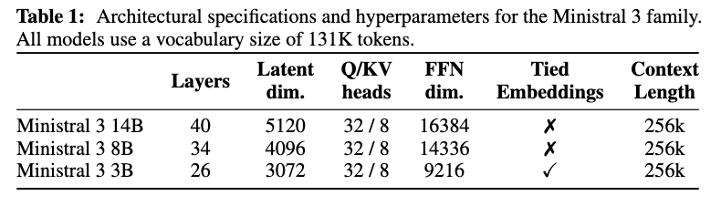

  - 14B: 40 layers, latent 5120, FFN 16384, tied ✗
  - 8B: 34 layers, latent 4096, FFN 14336, tied ✗
  - 3B: 26 layers, latent 3072, FFN 9216, tied ✓

- **Vision encoder**: 410M ViT (Pixtral과 동일 구조)를 Mistral Small 3.1 Base에서 복사해 **frozen**으로 사용. pretrained projection layer는 버리고 모델마다 새 projection을 학습

# 4. Training Recipe

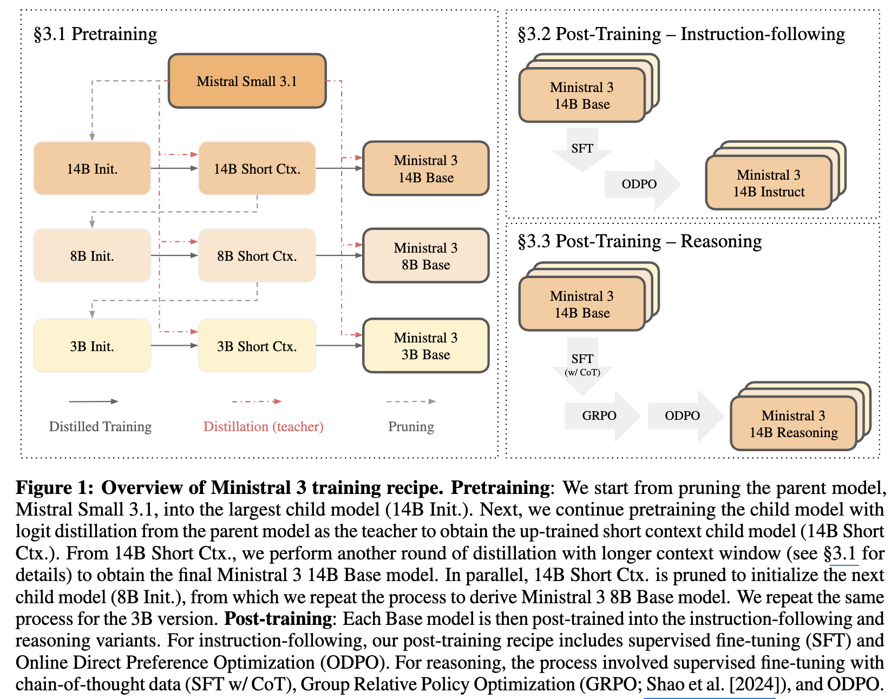

## 4.1 Pretraining — Cascade Distillation

- Mistral Small 3.1 Base(MS3.1, 24B)에서 시작하는 **"prune → distill → repeat"** 반복

  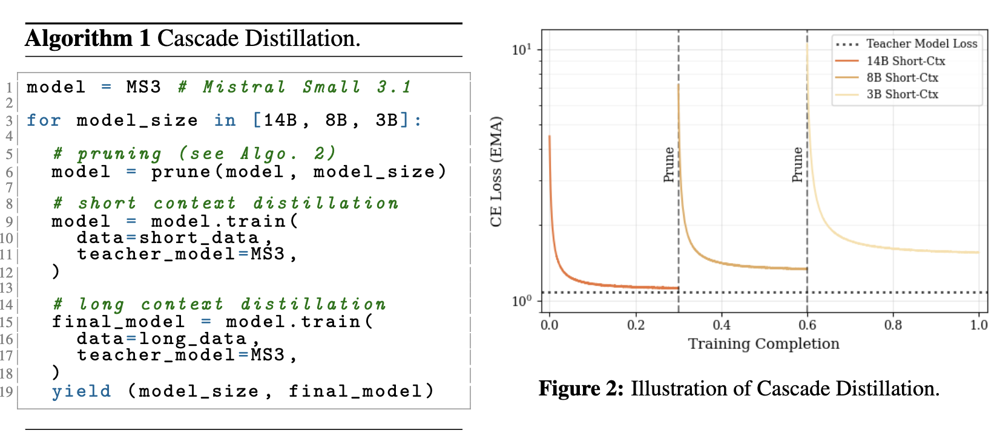

  1. **Prune**: 더 큰 pretrained 모델을 pruning하여 자식 모델 가중치 초기화
  2. **Distill**: 갓 pruning된 모델을 teacher(=MS3.1) logit distillation으로 up-training
  3. **Repeat**: 14B → 8B → 3B 순으로 반복 축소 (각 자식이 다음 자식의 시작점)
  - 모든 단계의 teacher는 부모 MS3.1로 고정
  - 전 과정을 pruning을 곁들인 **부모 모델의 continual pretraining**으로 볼 수 있으며, data mix를 한 번만 통과해 **data repetition을 피함**

- **Pruning 기법 3종** (Minitron 계열, validation set에서 중요도 평가)

  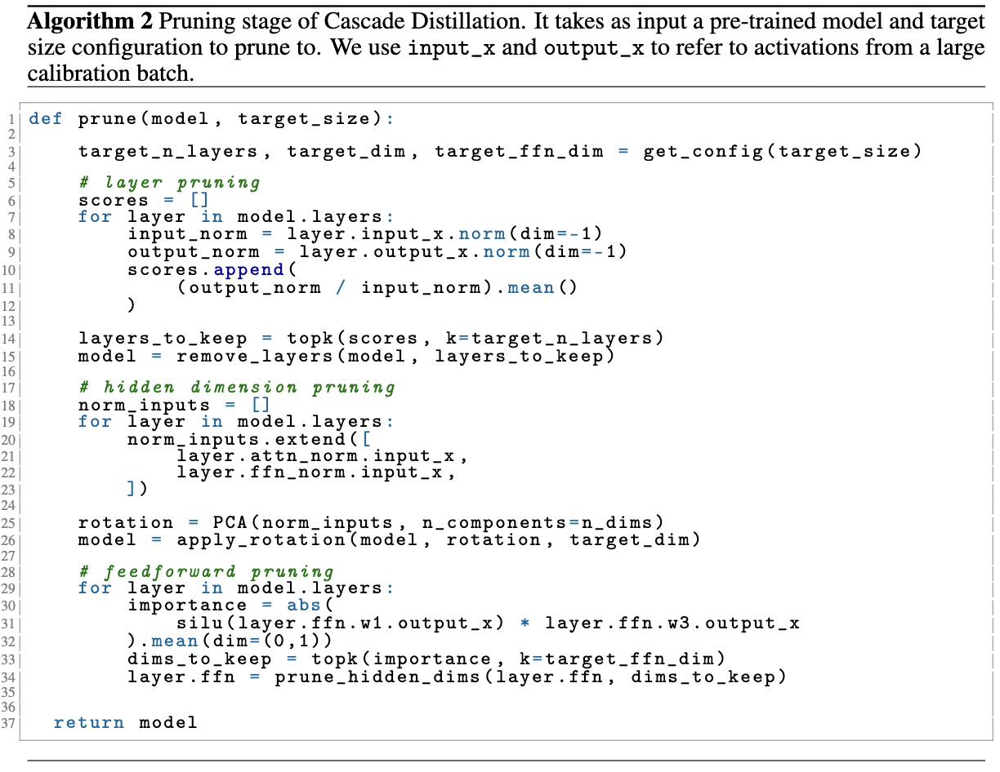

  - **Layer Pruning**: 각 layer의 input/output activation norm 비율을 layer 중요도 proxy로 사용 (counterfactual perplexity보다 단순하지만 강력)
  - **Hidden Dimension Pruning**: attention/FFN norm activation에 PCA를 적용, 전 네트워크에 일관된 단일 rotation matrix로 저차원 투영 (explained variance 최대화)
  - **Feedforward Dimension Pruning**: SwiGLU $W_2(\mathrm{SiLU}(W_1 x)\ast W_3 x)$ 에서 dim별 평균 절대값을 importance로 삼아 상위 dim만 유지

- **Distillation**: text-only + interleaved(text+image) 혼합 데이터에 대해 forward KL logit distillation
  - forward KL 단독보다, distillation objective와 next-token prediction objective의 계수를 다르게 가중하는 편이 더 좋음
  - 2-stage: **(1) Short context** (context 16,384) → **(2) Long context** (16,384 → 262,144, YaRN + temperature scaling)

## 4.2 Post-Training — Instruct

- 고품질 multimodal + text-only instruction 데이터로 fine-tuning, 2단계 구성

- **SFT**: fp8 quantization으로 실행, teacher는 **Mistral Medium 3**에서 logit distillation (pretraining과 달리 더 강한 teacher 사용). vision encoder는 frozen, adapter만 학습
- **ODPO (Online DPO)**: 각 예제마다 현재 policy에서 $T{=}0.7$로 두 후보를 샘플링, **PWRM**으로 랭킹
  - classic DPO loss를 PWRM의 binomial 확률 출력으로 개선(hard label → 확률 가중 two-sided loss)
  - 안정화: (1) PWRM temperature로 win/loss 확률 보정, (2) $\beta$-rescaling
  - 무한 루프 응답을 자동으로 "loser" 처리, 생성 중 **tool 실행 허용**(tool-use 성능 향상)
  - 결과 모델: **Ministral 3 14B/8B/3B Instruct**

## 4.3 Post-Training — Reasoning

- pretrained checkpoint(ODPO 아님)에서 시작, **SFT (w/ CoT) → GRPO → ODPO** 3단계
- **Reasoning SFT**: short/long CoT 혼합. long CoT에는 reasoning 전용 system prompt를 prefix. 포맷 불량/과도 반복/언어 전환 예제를 lightweight filtering
  - **3B SFT 이슈**: vanilla SFT는 장황하고 무한 생성이 심한 모델을 낳음 → **Magistral Small 1.2**를 teacher로 logit distillation하여 verbosity 감소 및 이후 RL 안정화
- **GRPO (2-stage)**:
  - **STEM RL**: math/code/visual-reasoning QA로 학습 (엄격한 multi-step 필터링)
  - **General RL**: chat/instruction-following/open-ended로 확장. LLM judge가 atomic rubric으로 채점, reward = 만족한 heuristic 비율
  - 최대 생성 길이 32K → 80K로 확대 (RL 중 truncation이 상당해서, 긴 출력을 허용하니 추가 성능 이득)
- **ODPO**: RL 후 alignment 단계. reward model 채점 전에 thinking chunk를 제거하는 점만 instruct와 다름
  - 결과 모델: **Ministral 3 14B/8B/3B Reasoning**

# 5. Results

- 외부 모델(Qwen3, Gemma3)도 **자체 평가 파이프라인으로 재실행**하여 공정 비교
- 평가 벤치마크: General(MMLU, MMLU-Redux, ARC-Challenge, RACE, TriviaQA, NaturalQS, AGIEval), Math&Code(MATH, GPQA Diamond, MBPP, LiveCodeBench), Multimodal(MMMU, MathVista), Post-training(Arena Hard, WildBench, MM MTBench, AIME 2024/2025, HMMT 2025, PhyBench)

## 5.1 Pretraining Results

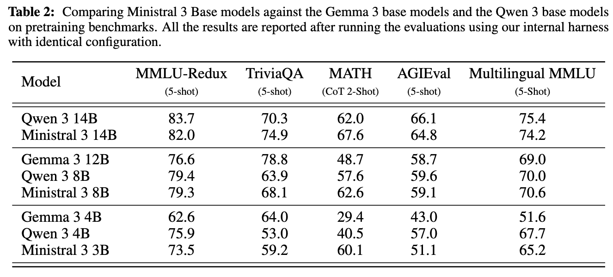

- **14B**: MMLU-Redux 82.0, MATH 67.6, TriviaQA 74.9 — Qwen3 14B를 TriviaQA·MATH에서 능가, Gemma 12B를 전 항목에서 크게 상회
- **8B**: 더 큰 **Gemma 3 12B를 TriviaQA 제외 대부분에서 능가** (파라미터 효율성)
- 3B는 같은 경향이나 모델 간 격차가 더 벌어짐

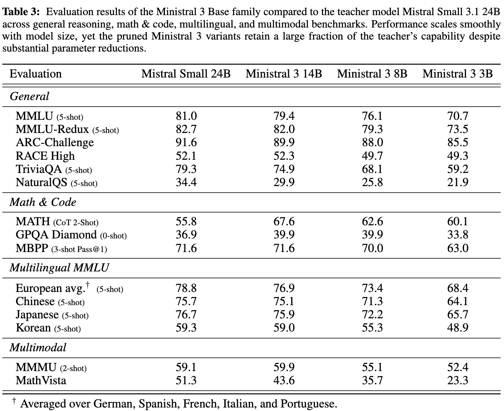

- pruning된 자식들이 파라미터를 크게 줄이고도 **teacher 능력의 큰 부분을 유지**함을 보여줌 (예: 14B MMLU-Redux 82.0 vs teacher 82.7)

## 5.2 Post-training Results

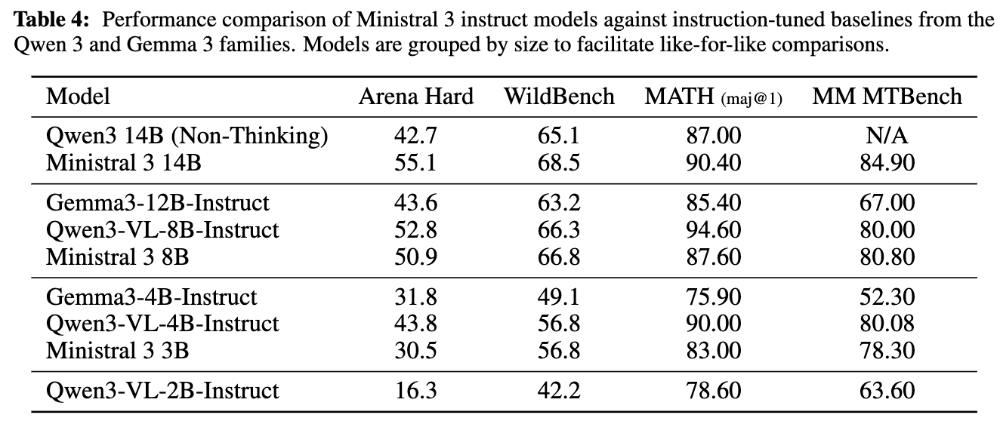

- 14B: Arena Hard 55.1, MATH 90.40 — Qwen3 14B(Non-Thinking) 대비 전반 우위
- 8B: Qwen3-VL-8B-Instruct와 접전, Gemma3-12B-Instruct 상회

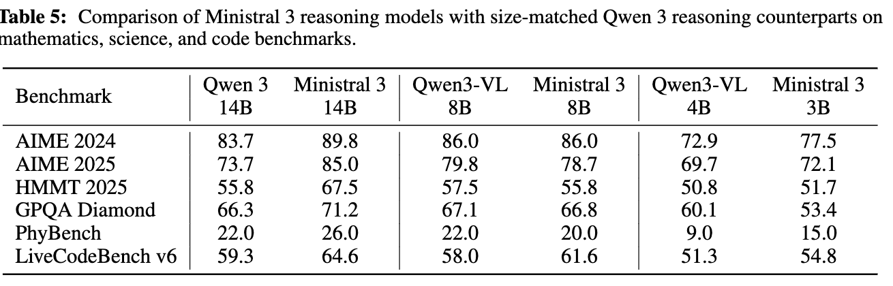

- 14B: AIME 2024 **89.8**, GPQA Diamond 71.2, LiveCodeBench v6 64.6 — 동급 Qwen3 14B를 전반적으로 상회
- 8B도 Qwen3-VL-8B와 경쟁력, 특히 LiveCodeBench(61.6 vs 58.0), HMMT 등에서 우위

# 6. Discussions (핵심 분석)

## 6.1 Teacher 선택 (Distillation)

- **Stronger teacher does not lead to better results (pretraining)**

  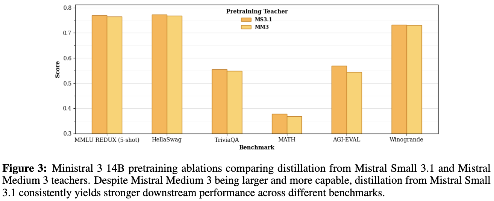

  - FLOP-matched 세팅에서도 **더 약한 MS3.1이 더 강한 Medium 3보다 downstream이 일관되게 좋음** (capacity gap 재확인)
  - 단, **post-training**에서는 더 강한 Mistral Medium 3.1에서 distill하는 편이 이득

- **Teacher version (base/instruct) matters**

  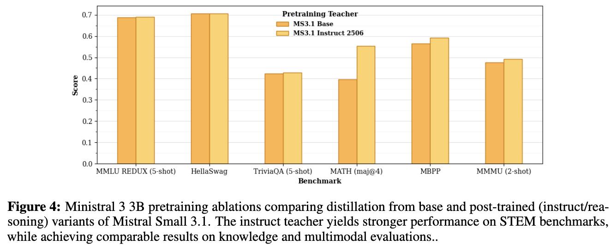

  - post-trained teacher가 특히 MATH/code에서 강한 향상, MMMU 등 multimodal에도 소폭 일관된 이득, knowledge(MMLU/TriviaQA)에는 미미
- **Human-preference tuned teacher가 더 좋음**: SFT checkpoint보다 선호 튜닝된 checkpoint에서 distill하는 편이 항상 크게 나음. student가 자체 선호 튜닝을 거친 뒤에도 이 이득이 유지됨

## 6.2 Model Verbosity

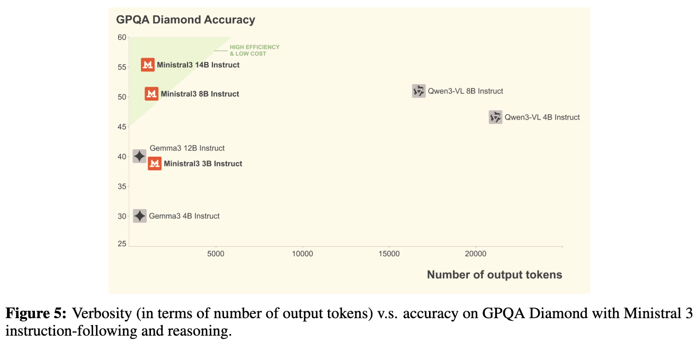

- Ministral 3 Instruct는 "Reasoning RL" 없이 "General RL"만 하므로 Qwen3와 verbosity 특성이 다름 (더 적은 토큰으로 높은 정확도 = high efficiency, low cost 영역)
- 참고: Long CoT 데이터 비율을 늘리면 STEM 성능은 오르지만 과도한 self-reflection/backtracking을 유발 → 범용 chat 모델엔 부적절

## 6.3 ODPO for Reasoning

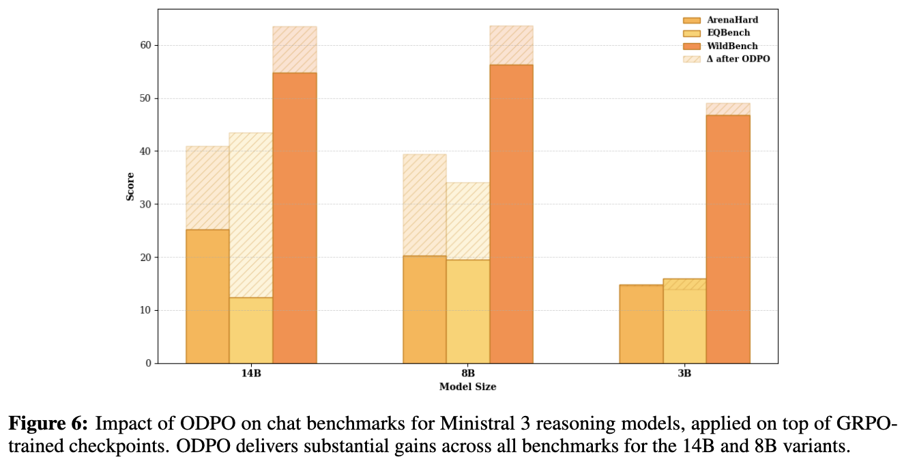

- reasoning 모델은 문제 해결력은 좋지만 일반 대화 품질이 뒤처지는 경향 → RL 후 ODPO로 크게 개선 (14B/8B에서 alignment 벤치마크 대폭 상승)
- 3B는 public 벤치마크 향상은 미미했으나 내부 human eval에서 더 나아 ODPO checkpoint를 release candidate로 선택

# 7. Conclusion

- 큰 teacher(Mistral Small 3.1, Medium 3)에서의 **iterative distillation(Cascade Distillation)**으로 3B/8B/14B × base/instruct/reasoning **9개 효율적 dense 모델**을 구축
- 모두 vision 지원, 최대 256K context, Apache 2.0 open-weight
- from-scratch 대비 훨씬 적은 학습 예산(1~3T tokens)으로 동급/상위 크기 모델과 경쟁

## Takeaways

- pretraining distillation에서는 **teacher가 너무 강하면 손해**(capacity gap)이나, post-training에서는 강하고 preference-tuned된 teacher가 유리 — 단계별로 teacher 전략을 다르게 가져가야 함
- pruning(activation-norm layer pruning + PCA hidden pruning + SwiGLU FFN pruning) + logit distillation의 조합이 소형 모델 생산의 실용적 레시피
- reasoning 모델의 대화 품질 저하는 RL 이후 ODPO로 회복 가능
