# [LLM] Magistral: 증류 없이 순수 RL만으로 만든 Mistral의 첫 추론 모델

- paper: https://arxiv.org/pdf/2506.10910
- models: https://huggingface.co/mistralai/Magistral-Small-2506 (Apache 2.0)
- Mistral AI, 2025-06-12 (arXiv v1)
- 저자: Mistral AI (Abhinav Rastogi, Albert Q. Jiang, Andy Lo, Guillaume Lample 외 100여명)
- downstream task: reasoning (수학 AIME/MATH, 코딩 LiveCodeBench/Aider, STEM GPQA)
  - long chain-of-thought을 뽑아내는 reasoning 모델을 **RLVR (Reinforcement Learning from Verifiable Rewards)** 만으로 학습
- 주요 용어
  - **RLVR**: 정답 여부를 규칙 기반으로 검증 가능한(verifiable) 문제(수학 답, 코드 테스트 통과 등)에 대해 보상을 주는 RL. reward hacking 여지가 적음
  - **cold-start (reasoning trace 증류)**: 기존 reasoning 모델의 CoT를 SFT로 미리 주입하는 것. Magistral **Medium은 이걸 안 쓰고 base 모델에서 곧바로 RL**을 돌림 (from scratch)
  - **Clip-Higher**: GRPO의 upper clipping threshold $\varepsilon_{high}$ 를 키워 low-probability 토큰이 성장할 여지를 줘서 entropy collapse를 막는 기법. $\varepsilon_{high}$ 를 $0.26 \sim 0.28$ 로 튜닝
  - **asynchronous generation**: generator가 trainer를 기다리지 않고 계속 rollout하며, in-flight 생성 중에도 NCCL로 가중치를 갈아끼우는 온라인 RL 파이프라인. KV-cache는 갱신하지 않아도 off-policy correction 덕에 성능 유지
  - **language consistency reward**: CoT와 최종 답변이 사용자 언어와 같으면 주는 보상. mixed-language 출력을 억제

# 1. Motivation

- reasoning 모델(o1, DeepSeek-R1 등)은 긴 CoT로 어려운 문제 성능을 끌어올림. 그 핵심 레시피가 **RLVR**임
- 하지만 대부분의 공개 reasoning 모델은 **기존 모델의 CoT를 증류(distillation)** 하거나 남의 RL 구현을 재활용해서 만들어짐
  - $\to$ (Research Question) 남의 trace/구현에 기대지 않고, **자체 모델과 인프라만으로 순수 RL을 밑바닥부터** 돌리면 reasoning의 한계를 어디까지 볼 수 있는가?
- 부가적으로 풀고 싶은 문제들
  1. RL을 돌리면 모델이 영어·중국어·러시아어를 섞어 쓰는 **language-switching**이 생김 → 사용자 관점에서 부적절
  2. text 데이터로만 RL을 돌리면 multimodal·instruction following·function calling 같은 초기 능력이 망가지지 않을까?
  3. 작은 모델은 순수 RL로는 증류 SFT baseline을 못 넘는다는 게 통설(DeepSeek-R1) — 정말 그런가?

# 2. Contribution

- **Magistral Medium**: Mistral Medium 3 위에서 **cold-start trace 없이 순수 RL만으로** 학습한 reasoning 모델
  - AIME-24 pass@1에서 base 대비 **거의 +50%** 향상, LiveCodeBench(v5) +30pp
- **Magistral Small (24B)**: Magistral Medium의 trace로 SFT cold-start 후 RL을 얹은 모델. **Apache 2.0으로 공개**
- 자체 **비동기(asynchronous) 온라인 RL 인프라** 상세 공개 — generator를 멈추지 않고 계속 갱신하여 on-policy에 가깝게 유지
- **다국어 유지 기법**: CoT와 최종 답변을 사용자 언어로 쓰게 하는 간단한 reward 설계
- RLVR literature에 대한 반례/보강 제시
  - 작은 모델도 순수 RL로 증류 SFT baseline을 **넘을 수 있음**
  - text-only RL이 **multimodal 추론 능력을 오히려 향상**시킴 (free lunch)
- 실패한 실험들(partial reward, entropy bonus)까지 투명하게 공유

# 3. Methodology

## 3.1 RL 알고리즘 (수정된 GRPO)

- 기본은 **GRPO** (Group Relative Policy Optimization) — critic 없이 프롬프트당 여러 생성의 평균 보상을 baseline으로 사용
- Magistral의 수정 사항들

  1. **KL divergence 제거**: reference policy를 유지하는 계산 비용이 아깝고, 어차피 policy가 크게 벗어나므로 KL penalty를 **완전히 없앰**
  2. **Loss normalization**: group 내 length bias를 없애기 위해, token-wise loss를 다 더한 뒤 group 전체 생성 길이 $\sum_{i=1}^{G}|o_i|$ 로 나눔
  3. **Advantage normalization**: $\hat{A}_{i,t} = r_i - \mu$ (group 평균만 빼고), 추가로 minibatch 단위로 $\hat{A}^{norm}_{i,t} = (\hat{A}_i - A^{mean})/A^{std}$ 정규화
  4. **Clip-Higher**: upper clipping을 $\varepsilon_{high}$ 로 키워 entropy collapse 방지. $0.26 \sim 0.28$ 사이로 튜닝 (안정성에 결정적)
  5. **non-diverse group 제거**: 한 group이 전부 정답이거나 전부 오답이면 advantage가 0 → 배치에서 제외

  $$
  \mathcal{J}_{GRPO}(\theta) = \mathbb{E}\Big[\frac{1}{\sum_i |o_i|}\sum_{i=1}^{G}\sum_{t=1}^{|o_i|} \min\big(\rho_{i,t}\hat{A}^{norm}_{i,t},\ \mathrm{clip}(\rho_{i,t}, 1-\varepsilon_{low}, 1+\varepsilon_{high})\hat{A}^{norm}_{i,t}\big)\Big]
  $$

  - $\text{s.t. } \exists\, 1 \le m < n \le G,\ r_m \ne r_n$ (동일 보상 group 배제)

## 3.2 Reward shaping (4개 축)

- 생성물을 formatting / correctness / length / language consistency 네 축으로 채점

  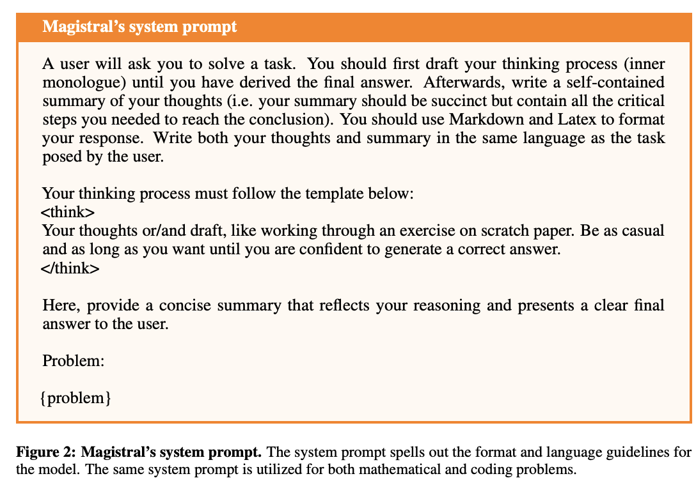

- **Formatting**: `<think>...</think>` 태그가 정확히 한 쌍, 수학은 `\boxed{}`, 코드는 markdown 코드블록 필수. 위반시 reward 0으로 즉시 탈락, 통과시 0.1 부여 후 채점 진행
- **Correctness**: 형식 통과분에 대해
  - 수학: 마지막 `\boxed{}` 를 여러 파서 + **SymPy** 기호 비교로 정답 판정, 맞으면 +0.9 (총 1.0)
  - 코드: 첫 코드블록 추출, C++은 C++20 10초 timeout 컴파일, 테스트 20개 랜덤 샘플(각 4초/300MB)을 **전부 통과**해야 +0.9
- **Length penalty**: soft penalty. 완성 길이가 $l_{max}-l_{cache}$ 를 넘어서면 선형으로 최대 $-0.1$ 까지 감점

  $$
  R_{length}(y) = \begin{cases} 0 & |y| \le l_{max}-l_{cache} \\ -0.1 \cdot \frac{|y|-l_{max}+l_{cache}}{l_{cache}} & l_{max}-l_{cache} < |y| \le l_{max} \\ -0.1 & l_{max} < |y| \end{cases}
  $$

- **Language consistency**: 영어 문제의 10%를 프랑스어/스페인어/이탈리아어/독일어/중국어/러시아어로 번역해 학습. (problem, thoughts, answer) 세 파트에서 LaTeX·코드를 제거한 뒤 **fastText 분류기**로 언어를 판정, 셋이 모두 같은 언어면 +0.1

# 4. Infrastructure

- 분산 온라인 RL을 3종 worker로 구성: **Trainers**(가중치 원본·gradient update), **Generators**(최신 policy로 rollout), **Verifiers**(보상 계산)

   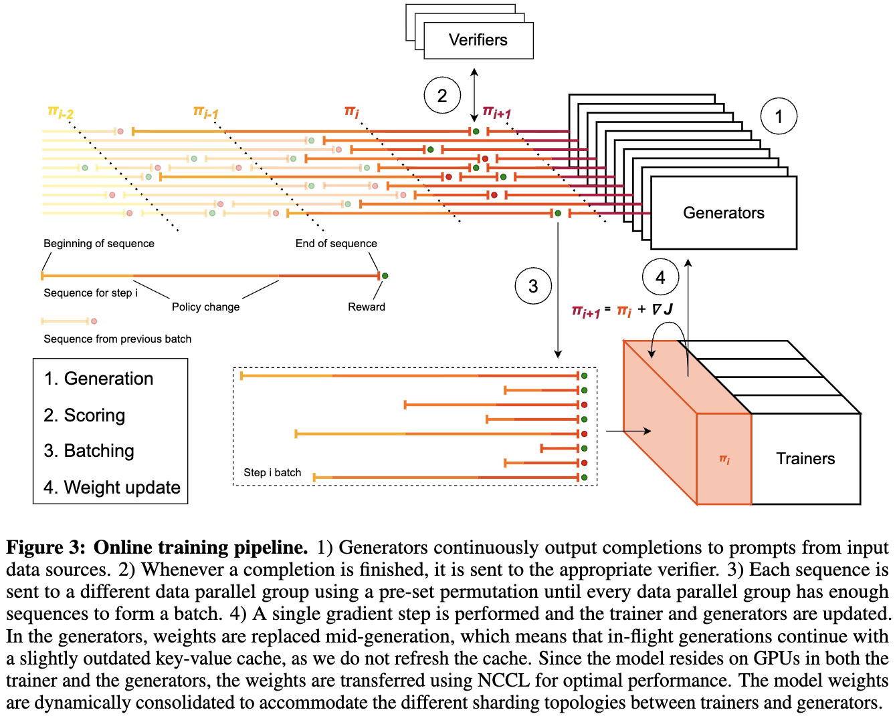

- **Asynchronous generation** (핵심)
  - generator를 trainer와 동기화하지 않고 **최대 throughput으로 계속** 돌림. trainer는 완료된 group을 모아 update하고, 새 가중치를 **NCCL로 in-flight 생성 도중에 교체**함 (생성 중이던 시퀀스는 버리지 않음)
  - GPU-to-GPU broadcast로 가중치 1회 업데이트가 5초 미만
  - 가중치가 바뀌어도 **KV-cache는 재계산하지 않음** — off-policy correction(clipping) 덕에 성능 저하 없음
- **Trainer optimization**: 배치를 "고정 토큰 수"가 아니라 "고정 완성 개수"로 정의. greedy collation으로 microbatch 간 workload를 균일화해 padding을 **19% 절감**

# 5. Data curation

- **verifiable solution만** 사용: 수학은 수치·수식 답, 코드는 테스트가 딸린 문제

## 5.1 Math
- **Format filtering**: 700k 노이즈 문제에서 시작 → proof/multi-part처럼 검증 어려운 것 제거, 객관식을 statement 기반으로 변환. 699k → **501k**
- **Difficulty filtering** (2단계, 핵심)
  1. Mistral Large 2로 문제당 16개 샘플링 → 너무 쉽거나(전부 정답) 아예 못 푸는 것 제거 → 이 curated set으로 작은 RL 체크포인트 학습(채점 전용)
  2. 이 **더 강해진 RL 모델**로 원본 전체를 재채점 → 다시 16개 샘플, 여전히 어려운 문제 유지. 다수결 답이 ground-truth와 불일치하면 **ground-truth 자체가 틀렸을 가능성** → 제거
  - 약한 모델 1-pass로는 진짜 어려운 문제를 "불가능"으로 오분류해 버려서, 강한 모델 2-pass가 필수였음. 최종 **38k**

  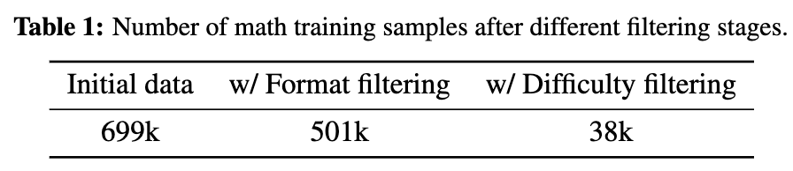

## 5.2 Code
- 다양한 출처의 코드 대회 데이터. solution/test 없는 문제 제거, test 합의(agreement)로 잘못된 테스트를 보정하거나 생성. Python/C++로 복제. 최종 **35k**

  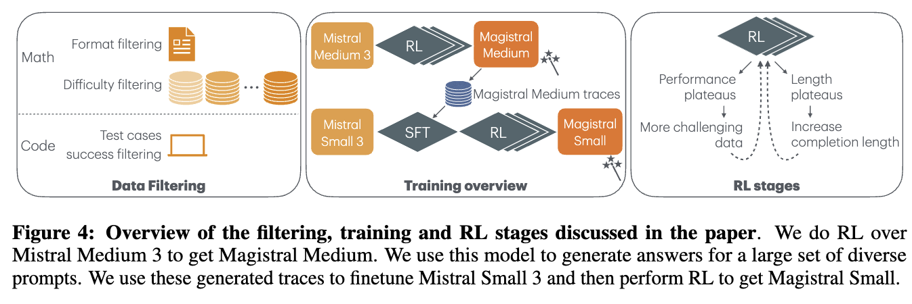

# 6. Experiments

## 6.1 Magistral Medium — reasoning RL from scratch

- Mistral Medium 3 Instruct에서 시작, cold-start 없이 순수 RL. 다단계로 진행하며 다음 3조건 유지
  1. **데이터가 너무 쉬워지지 않게**: 성능 오르면 더 어려운 split 투입, 이미 다 푼 문제 제거
  2. **생성 길이가 계속 자라게**: length penalty 미적용 구간 $l_{max}-l_{cache}$ 를 16k → 24k → 32k로 상향
  3. **KV-cache 메모리 억제**: 길이 증가에 맞춰 concurrent request $n_{async}$·batch $n_{batch}$·minibatch $n_{minibatch}$ 축소 (8k→4k→2k)

  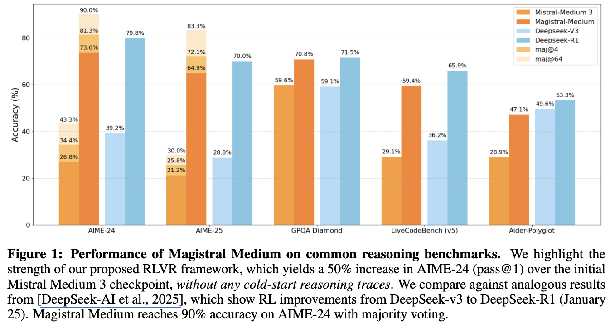

- **결과** (Table 2, DeepSeek 논문의 대응 실험과 비교)

  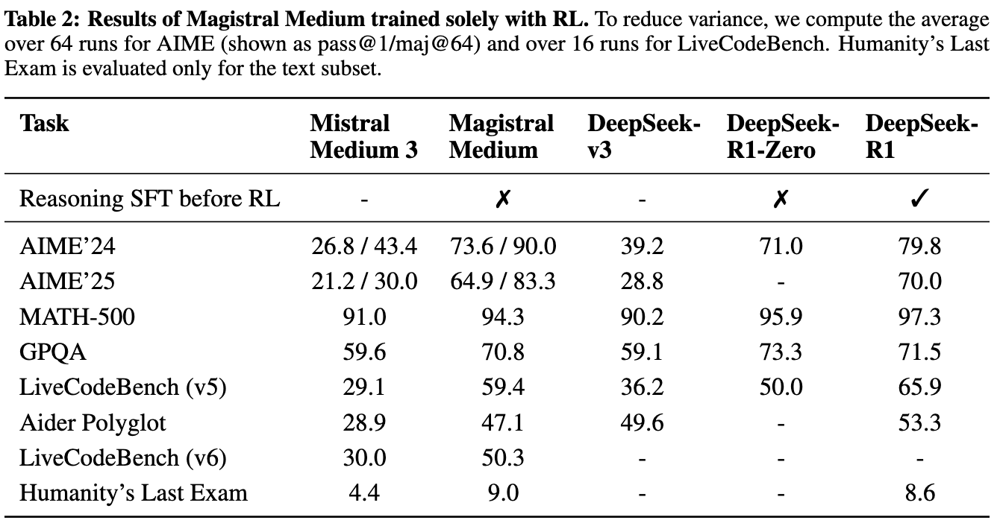
  
  - AIME'24 pass@1 26.8 → 73.6 (**거의 +50%p, cold-start trace 없이**), LiveCodeBench(v5) 29.1 → 59.4 (+30pp)
  - SFT 증류를 거친 DeepSeek-R1에 근접하거나 일부 항목(GPQA)은 상회

## 6.2 Magistral Small — SFT cold-start 위 RL

- Magistral Medium의 정답 trace(초반 짧은 CoT 제외)로 Mistral Small 3를 4 epoch SFT → 그 위에 RL(batch 2048, $l_{max}-l_{cache}$ 32k, temp 1.0, $\varepsilon_{high}=0.3$)
- **세 패러다임 비교** (Table 3, 24B)

  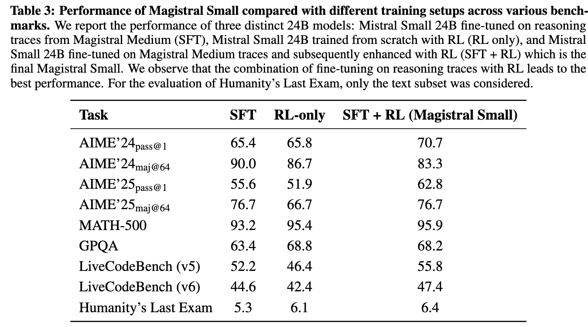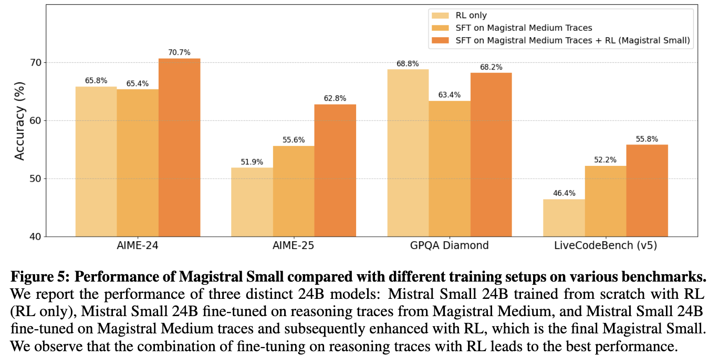
  
  - **RL-only만으로도 증류 SFT와 대등** (AIME'24 65.8 vs 65.4), MATH·GPQA는 오히려 상회 → 작은 모델은 RL로 SFT를 못 넘는다는 통설에 대한 반례
  - SFT + RL 조합이 최고 (여러 벤치 +5pp 이상)

## 6.3 다국어 성능
- Magistral Medium의 AIME'24를 6개 언어로 번역 평가 

  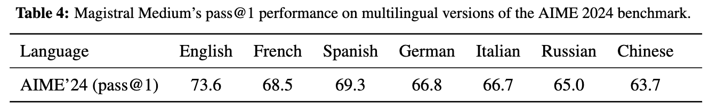
  
  - 영어 대비 4.3~9.9% 하락(1~3문제 수준). **CoT와 답변 모두 입력 언어로** 수행됨

## 6.4 Ablation

- **Cross-domain 일반화** (24B): math만 RL해도 코드가, 코드만 RL해도 math가 향상

  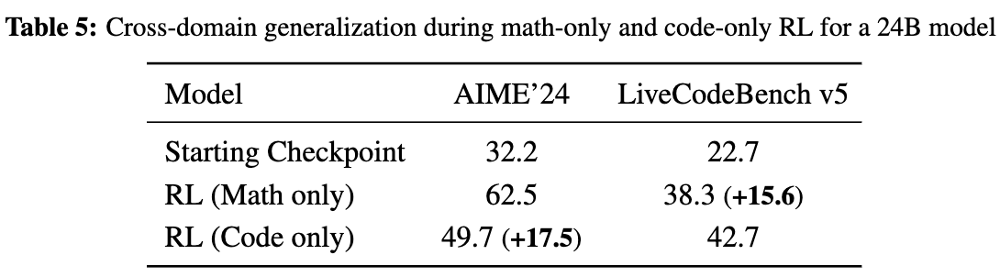
  
- **Batch/minibatch size**: $n_{batch}=n_{minibatch}$ 이고 batch가 충분히 크면 성능 유사. minibatch를 batch보다 작게 쪼개(off-policy 심화) 성능 급락. → $n_{async}/n_{batch}\le 2$, $n_{batch}=n_{minibatch}$ 유지

  - batch: reward를 통해 gradient를 계산하여 model weight 업데이트하는 단위
  - mini-batch: optimizer update 단위

  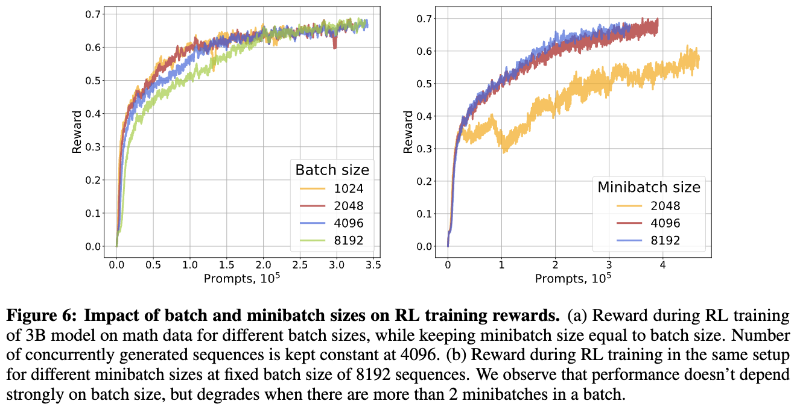

- **Advantage normalization**: minibatch/group/none 간 유의한 차이 없음 → minibatch normalization 채택

  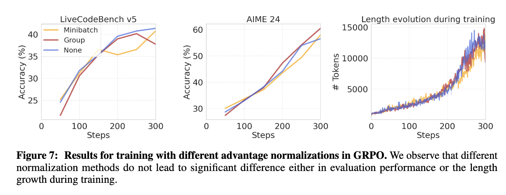

# 7. Analysis

## 7.1 RL은 가중치를 저차원 공간에서 움직인다
- 중간 체크포인트 가중치를 PCA(top-2 eigenvector)로 투영, $(\alpha_1, \alpha_2)$ 평면에서 reward·output length를 시각화

  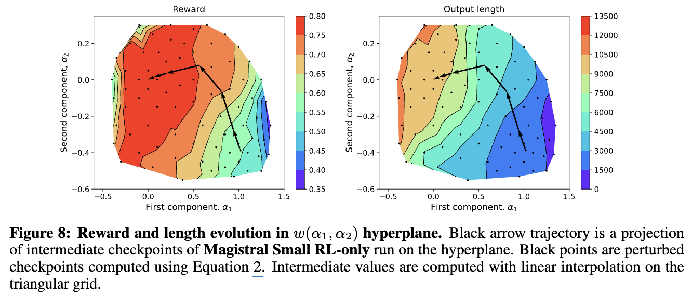

  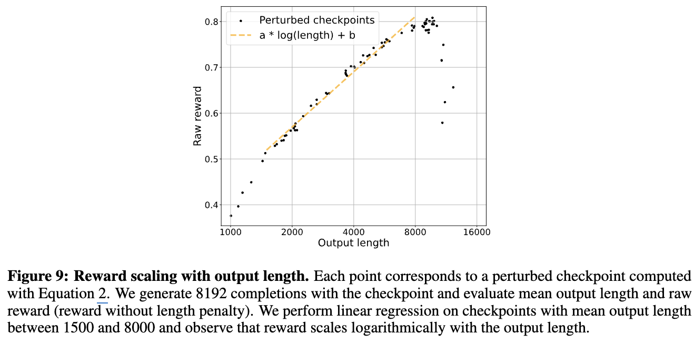

- 뚜렷한 **"length 방향"** 이 존재 — 오른쪽→왼쪽으로 갈수록 평균 reward와 output length가 함께 증가하다 length penalty에 닿는 지점에서 멈춤
- **completion length 증가가 성능 향상의 주 자원**이며, raw reward는 length에 대해 **로그 스케일**로 증가

## 7.2 Multimodal free lunch
- 초기 체크포인트(Mistral Small/Medium 3)는 vision encoder를 가진 multimodal 모델. **text-only RL**을 했는데도

  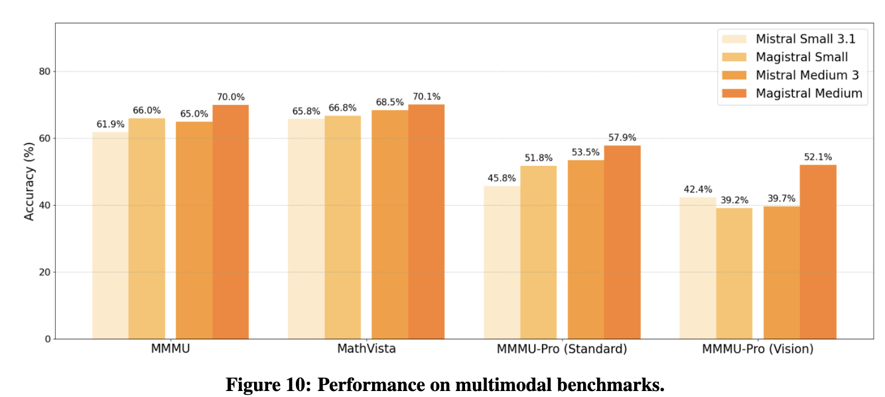

  - multimodal 능력이 유지될 뿐 아니라 **향상**됨: MMMU +5% (70%), MMMU-Pro-Standard +4.4% (57.9%), MMMU-Pro-Vision +12% (52.1%)
  - text 추론 능력이 이미지 질문으로 전이됨

## 7.3 다른 능력 유지

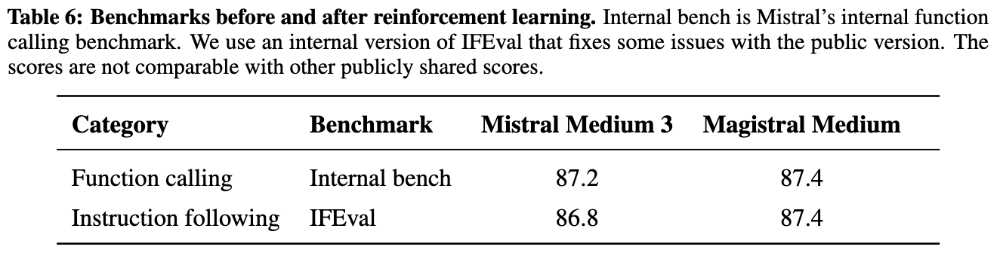

- function calling(내부 벤치 87.2 → 87.4), instruction following(IFEval 86.8 → 87.4) 모두 유지/소폭 향상 → out-of-the-box 통합 가능

## 7.4 실패한 접근들 (투명 공개)
- **코드의 partial reward**: 통과 테스트 비율로 보상. 학습은 빨랐으나(데이터 3배 적게 버림) LiveCodeBench 최종 2% 하락, 길이 성장도 느림 → 오답에 false signal을 줘서 폐기

  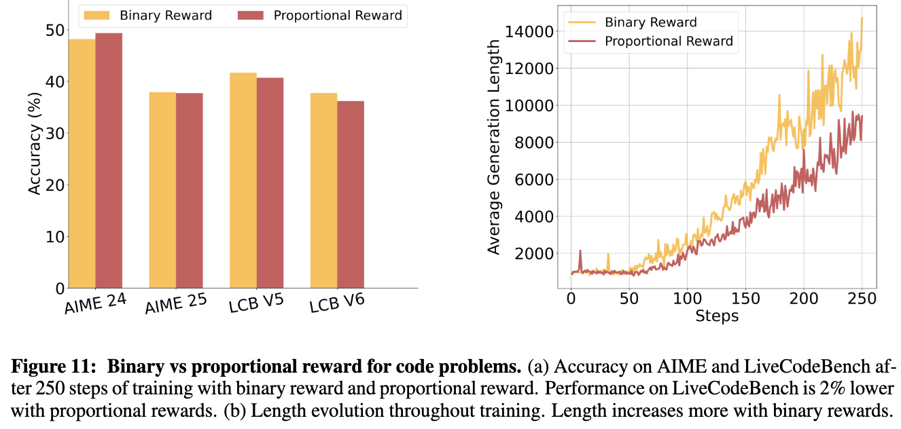

- **Entropy targeting (entropy bonus)**: entropy bonus 계수가 데이터셋에 매우 민감(math-only는 entropy 하락, math+code는 폭발). 불안정 → entropy bonus 대신 **$\varepsilon_{high}$ 튜닝**으로 exploration 제어

  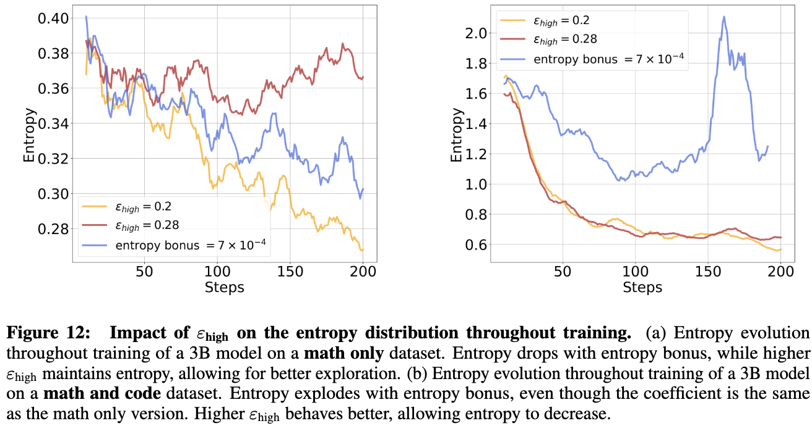

- **KL term / EMA reference**: KL은 학습을 방해, EMA reference도 복잡. → $\varepsilon_{high}$ 수동 조정이 가장 단순·효과적

# 8. RL on OSS reasoning traces
- 별도 실험으로 Mistral Medium 3를 OpenThoughts/OpenR1 등 **오픈소스 reasoning trace(DeepSeek-R1 생성 포함, 1.3M)로 SFT** 후 어려운 subset에 RL

  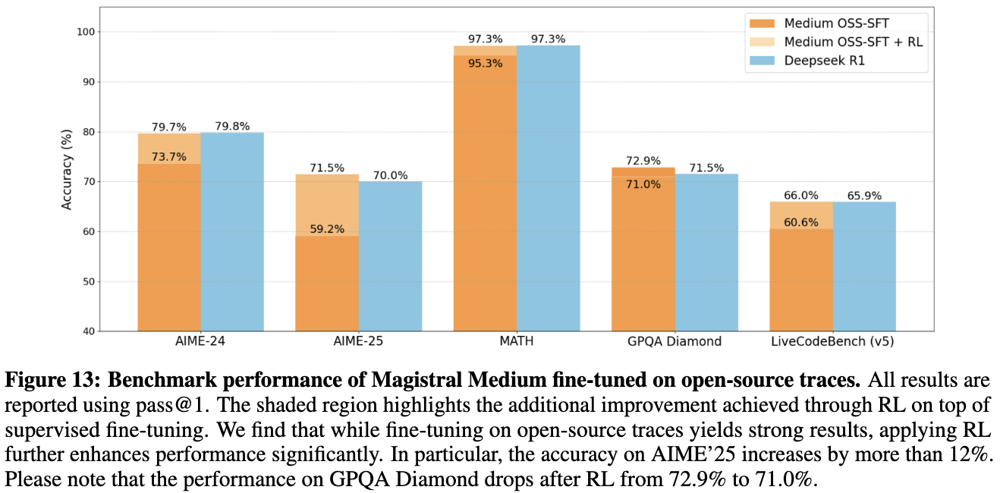

- SFT만으로도 강하지만 RL을 얹으면 AIME'25 +12pp 이상, LiveCodeBench +5pp → **DeepSeek-R1과 대등**. 단 GPQA는 RL 후 72.9 → 71.0으로 소폭 하락
- (Magistral Medium 본체에는 이 증류 경로를 쓰지 않았음 — 어디까지나 비교 실험)

# 9. Conclusion & Limitations

**Conclusion**
- 남의 trace·구현 없이 **자체 스택만으로 순수 RLVR**을 밑바닥부터 돌려도 강력한 reasoning 모델(Magistral Medium/Small)이 나온다
- text-only RL이 multimodal·function calling·instruction following을 **해치지 않고 오히려 개선**하며, 작은 모델도 RL로 증류 baseline을 넘을 수 있다
- Magistral Small(24B)을 Apache 2.0으로 공개

**Limitations / 저자가 밝힌 열린 문제**
- 어떤 loss·optimization이 최적인지, self-generated trace로 얼마나 더 짜낼 수 있는지, 다음 규모의 compute로 어떻게 확장할지는 미해결
- entropy 제어를 $\varepsilon_{high}$ 수동 튜닝에 의존 — 데이터셋 민감성이 남아있음
- length penalty에 닿기 전까지 length 증가가 성능을 견인 → completion length에 대한 자원 의존성

# Takeaways

- **핵심 메시지**: cold-start 증류 없이 순수 RL(RLVR)만으로도 base 모델을 reasoning 모델로 만들 수 있고, 그 향상폭이 AIME-24에서 +50%에 달함
- **GRPO 실전 레시피**: KL 제거 + Clip-Higher($\varepsilon_{high}\approx0.26$~$0.28$) + non-diverse group 제거 + minibatch normalization. entropy bonus보다 $\varepsilon_{high}$ 튜닝이 안정적
- **인프라가 절반**: 비동기 generator + in-flight 가중치 교체 + KV-cache 미갱신으로 on-policy에 가깝게 대규모 RL을 굴린 게 핵심 enabler
- **free lunch 2종**: text-only RL이 (1) multimodal 추론과 (2) cross-domain(math↔code)으로 전이됨 — reasoning 능력의 도메인 일반성을 보여줌
- **투명성**: partial reward·entropy bonus 등 실패한 실험을 명시해 재현·후속 연구에 유용
