# [LLM] On-Policy Self-Distillation for Large Language Models

- paper: https://arxiv.org/pdf/2601.18734
- github: https://github.com/siyan-zhao/OPSD
- arXiv:2601.18734v3 (Preprint, '26-03-20)
- 저자: Siyan Zhao, Zhihui Xie, Mengchen Liu, Jing Huang, Guan Pang, Feiyu Chen, Aditya Grover (UCLA / HKU / Meta Superintelligence Labs)
- downstream task: competition-level 수학 추론 (AIME24/25, HMMT25)
- 주요 용어
  - **OPSD (On-Policy Self-Distillation)**: 하나의 LLM $p_\theta$가 teacher와 student 역할을 동시에 맡는 학습 알고리즘. student는 문제 $x$만 보고 응답을 sampling하고, teacher는 정답 $y^\star$까지 본 채로 그 rollout을 채점해 token-level 감독을 준다
  - **privileged information**: teacher policy만 조건부로 받는 추가 정보. 여기서는 ground-truth 정답/reference reasoning $y^\star$. student는 이걸 못 봄
  - **rationalization**: 정답을 이미 알 때 "왜 그게 정답인지 사후 설명"하는 능력. 저자들은 generation보다 rationalization이 쉽다고 가정하고, teacher가 이 능력으로 student를 가르침
  - **teacher/student policy**: 같은 파라미터 $\theta$를 공유하되 조건부만 다른 두 분포. $p_S(\cdot \mid x)$ vs $p_T(\cdot \mid x, y^\star)$. teacher는 실제로 token을 생성하지 않고 prefill 한 번(forward pass)으로 rationalization만 수행
  - **per-token pointwise KL clipping**: vocab별 divergence 기여도를 $\min(\ell, \tau)$로 잘라 stylistic token이 학습 신호를 지배하는 것을 막는 안정화 기법

# 1. Motivation

- LLM post-training에서 추론 능력을 올리는 세 갈래 접근이 각각 한계를 가짐
  - **RLVR (예: GRPO)**: 검증 가능한 보상으로 학습하지만
    1. 문제당 group으로 여러 응답을 sampling해야 해 계산량이 크고 value 추정 분산이 큼
    2. group 내 응답이 전부 맞거나 전부 틀리면 advantage가 0 $\to$ gradient 소멸 (reward diversity collapse)
    3. 보상이 sparse & 시퀀스 전체에 uniform하게 퍼져 token-level 세밀한 피드백이 없음
  - **SFT**: expert trajectory를 모방하지만 exposure bias & generalization 약함
  - **(off-policy) Knowledge Distillation**: teacher의 dense한 token-level 감독은 좋지만 off-policy 데이터라 train/inference 분포 불일치
- **On-policy distillation**은 student 자기 rollout 위에서 teacher가 dense 감독을 줘 위 문제를 완화하지만 — **별도의(대개 더 큰) teacher 모델이 필요**하고, 추론 데이터셋의 ground-truth 정답을 명시적으로 활용하지 못함

  $\to$ (Research Question) 현대 LLM이 이미 강한 추론 능력을 갖췄다면, **모델이 self-distillation을 통해 스스로의 teacher가 될 수 있을까?**

- 직관: 사람이 학습할 때 무작정 시행착오하기보다 정답 풀이를 보고 "왜 이게 되는지" 이해하고 내재화한다. <u>*모델도 정답 $y^\star$에 접근할 수 있고 충분히 유능*</u>하면 추론 과정을 rationalize 해 스스로의 약한 버전을 가르칠 수 있다

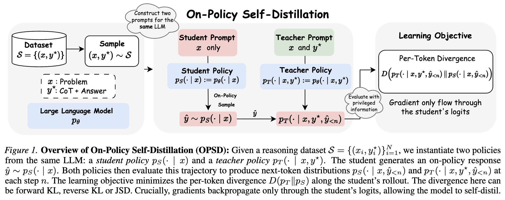

# 2. Contribution

- **OPSD** 제안: 단일 모델이 teacher이자 student로 동작해, ground-truth 정답을 활용해 student rollout에 dense token-level 감독을 주는 프레임워크. 별도 teacher/reward model 불필요
- **per-token pointwise KL clipping** 도입: stylistic token이 학습 신호를 지배하는 문제를 막아 학습을 안정화하고 성능을 개선 (수학 token 대비 style token의 divergence가 훨씬 큼)
- 3개 competition-level *<u>수학 추론 벤치마크</u>*에서 OPSD가 **GRPO와 대등하거나 능가하면서 token efficiency는 크게 개선**, SFT는 상회
- divergence objective(forward/reverse KL, JSD), student generation length, student/teacher generation style의 영향을 분석

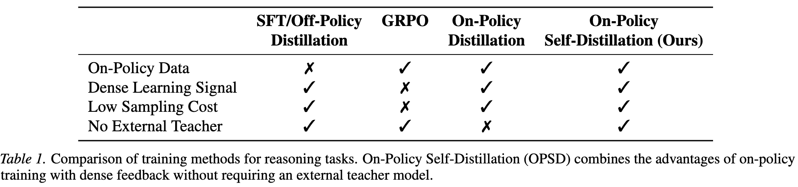

# 3. Background

## 3.1 Knowledge Distillation & On-Policy Distillation

- 전통 supervised distillation: 고정 데이터셋 위에서 teacher-student divergence 최소화
  $$\mathcal{L}_{\text{Supervised Distillation}}(\theta) = \mathbb{E}_{(x,y)\sim\mathcal{S}}[D(p_T \| p_S)(y|x)]$$
  - 문제: student가 inference 때 마주치는 partial sequence가 학습 때(fixed dataset)와 달라 compounding error 발생 (distribution mismatch)
- On-policy distillation: student 자기 생성 시퀀스 $\hat y \sim p_S(\cdot|x)$ 위에서 teacher가 dense 피드백
  $$\mathcal{L}_{\text{On-Policy Distillation}}(\theta) = \mathbb{E}_{x\sim\mathcal{S}}[\mathbb{E}_{\hat y \sim p_S(\cdot|x)}[D(p_T \| p_S)(\hat y|x)]]$$
  - imitation learning(DAgger)과 연결됨. exposure bias 완화 + dense signal, 그러나 여전히 external teacher 필요

## 3.2 RLVR / GRPO

- GRPO: 문제당 $G$개 응답을 sampling, binary reward $r_i \in \{0,1\}$로 group-normalized advantage 계산
  $$A_i = \frac{r_i - \text{mean}(\{r_j\})}{\text{std}(\{r_j\})}$$
- value function 관점에서 $\text{mean}(\{r_j\})$은 $V(x)$의 $G$-sample Monte Carlo 추정, $r_i$는 state-action value $Q(x,o_i)$. **한 응답 내 모든 token이 같은 advantage 공유** $\to$ 어디서 틀렸는지 token-level guidance 없음
- 두 한계: (1) 보상 신호가 sparse & 위치 무관, (2) group 내 응답이 전부 같은 보상이면 advantage 소멸 $\to$ sampling 비용만 쓰고 업데이트 없음

# 4. Method: On-Policy Self-Distillation

## 4.1 Teacher/Student policy

- 같은 파라미터 $\theta$, 조건부만 다름
  - teacher: $p_T(\cdot \mid x, y^\star) \triangleq p_\theta(\cdot \mid x, y^\star)$ — 문제 + 정답 풀이 봄
  - student: $p_S(\cdot \mid x) \triangleq p_\theta(\cdot \mid x)$ — 문제만 봄 (inference 조건과 일치)
- teacher prompt에는 "reference 풀이를 이해한 뒤 네 방식으로 풀어봐"라는 지시를 붙여 student rollout을 자연스럽게 평가하도록 유도. **단 teacher는 실제로 token을 생성하지 않고, prefill(한 번의 forward pass)로 rationalization만 함**
  - student rollout 전체의 각 위치에 대해 teacher logits를 계산한다 뜻

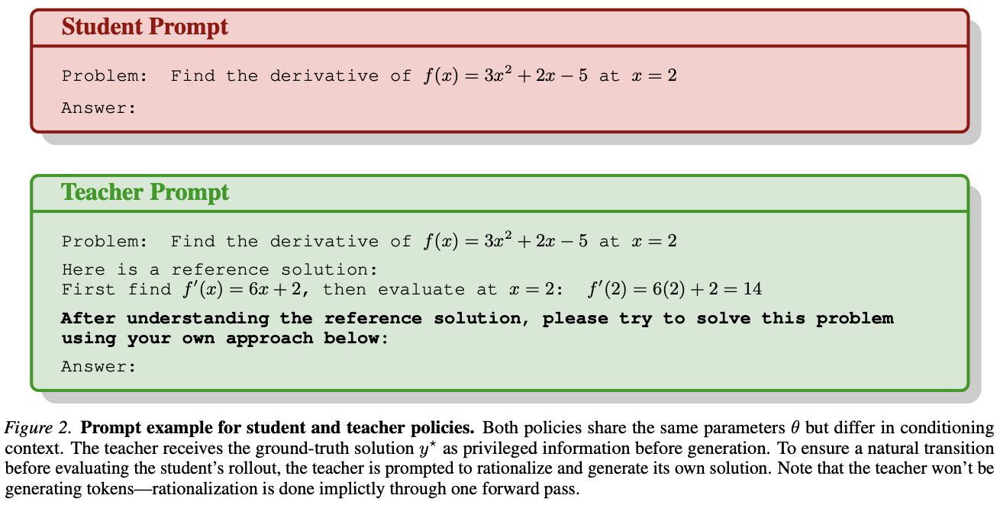

## 4.2 학습 목표: Full-vocabulary logit distillation

- student가 on-policy 응답 $\hat y = (\hat y_1, ..., \hat y_{|\hat y|}) \sim p_S(\cdot|x)$ 생성 후, 각 위치 $n$에서 **같은 student prefix** 위에 두 분포를 유도해 divergence 최소화
  $$\mathcal{L}_{\text{OPSD}}(\theta) = \mathbb{E}_{(x,y^\star)\sim\mathcal{S}} \mathbb{E}_{\hat y \sim p_S(\cdot|x)} \sum_{n=1}^{|\hat y|} D\big(p_T(\cdot \mid x, y^\star, \hat y_{<n}) \,\|\, p_S(\cdot \mid x, \hat y_{<n})\big)$$
- gradient는 **student policy $p_S$로만 backprop**, teacher $p_T$는 $(x,y^\star)$에 조건부인 고정 target 역할
- $D$는 forward KL / reverse KL / generalized JSD$_\beta$ 등 선택 가능
  $$\text{JSD}_\beta(p_T\|p_S) = \beta D_{KL}(p_T\|m) + (1-\beta)D_{KL}(p_S\|m), \quad m = \beta p_T + (1-\beta)p_S$$

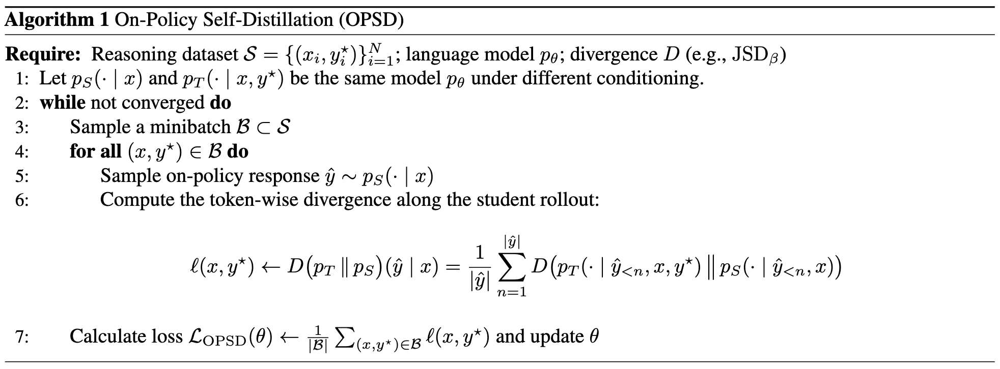

## 4.3 Per-token pointwise KL clipping

- token-level divergence가 vocab 항목마다 매우 편향됨 (소수 stylistic token이 수학 token보다 훨씬 큰 divergence) $\to$ 학습 신호를 stylistic pattern이 지배
- vocab 항목 $v$, 위치 $n$에서 $f$-divergence 기여도 $\ell_{n,v}^{(f)} = p_T(v|\cdot) f\!\left(\frac{p_S(v|\cdot)}{p_T(v|\cdot)}\right)$를 정의하고 clip:
  $$D_{\text{clip}}^{(f)}(p_T\|p_S) = \frac{1}{|\hat y|}\sum_{n}\sum_{v} \min(\ell_{n,v}^{(f)}, \tau)$$

## 4.4 대안 목표: Sampled-token distillation (policy gradient)

- full-vocab 대신 student가 실제로 뽑은 token $\hat y_n$에서만 log-prob를 비교해 reverse-KL을 scalar advantage로 쓰는 policy-gradient 변형
  $$A_n(x,\hat y) = \log p_T(\hat y_n \mid x, y^\star, \hat y_{<n}) - \log p_S(\hat y_n \mid x, \hat y_{<n})$$
  $$\mathcal{L}(\theta) = -\mathbb{E}\left[\frac{1}{|\hat y|}\sum_n A_n(x,\hat y)\, \log p_S(\hat y_n \mid x, \hat y_{<n})\right]$$
  - $A_n$은 상수 취급(gradient는 $A_n \nabla_\theta \log p_S$ 형태). full-distribution matching 없이 sampled token만 shaping
- **STaR와의 비교**: STaR는 같은 모델로 trace 생성 → 정답 trace만 rejection sampling 후 SFT. 이는 sequence-level binary reward라 틀린 응답에선 신호 소멸. OPSD는 정답 여부와 무관하게 모든 token 위치에서 피드백 제공

# 5. Experiments

## 5.1 설정

- 모델: Qwen3-1.7B / 4B / 8B (instruct)
- 학습 데이터: OpenThoughts 수학 subset에서 최대 30K problem-solution
- 평가: AIME24, AIME25, HMMT25 (Avg@12, temperature 1.0, max gen 38k)
- baseline: SFT(off-policy distillation), GRPO(binary outcome reward, max gen 16k). 모두 A100/H100 + LoRA
- teacher policy는 학습 중인 policy가 아니라 **초기 모델로 고정** (regularization 효과, 초기 policy에서 과도한 이탈 방지)

## 5.2 Main Results

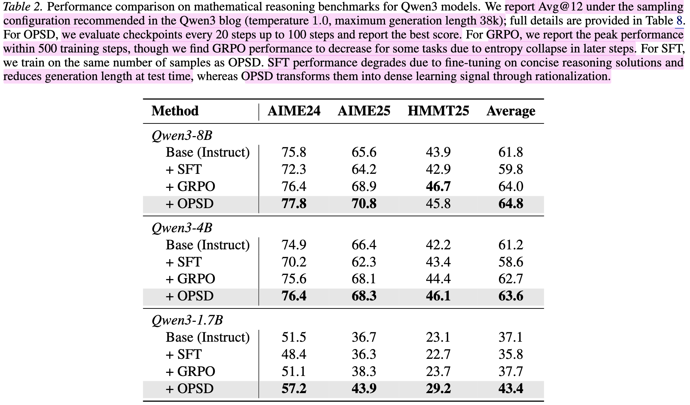

- OPSD가 모든 scale에서 SFT를 일관되게 상회, GRPO와 대등하거나 능가. 특히 **작은 모델(1.7B)에서 격차가 큼** (Average 37.7 $\to$ 43.4, +5.7pp)
- **SFT는 base보다 오히려 하락**: concise한 ground-truth 풀이에 fine-tune돼 test-time reasoning length가 줄어듦. OPSD는 같은 풀이를 rationalization을 통해 dense 학습 신호로 변환

## 5.3 Token Efficiency

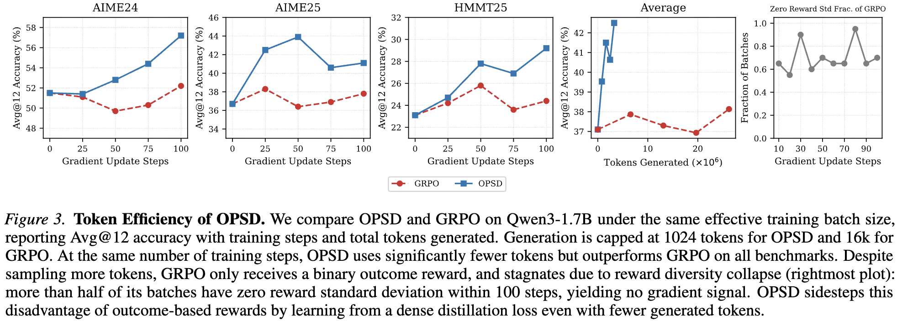

- OPSD는 문제당 **단일 rollout(1024 token cap)**, 100 step 내 수렴. GRPO는 문제당 **8 rollout × 16k token**이 필요
- GRPO는 100 step 내에 정체 — group 내 reward std가 0인 batch가 절반 이상이라 gradient 신호가 소멸(reward diversity collapse). OPSD는 dense distillation 신호라 이 문제를 우회

## 5.4 Ablations

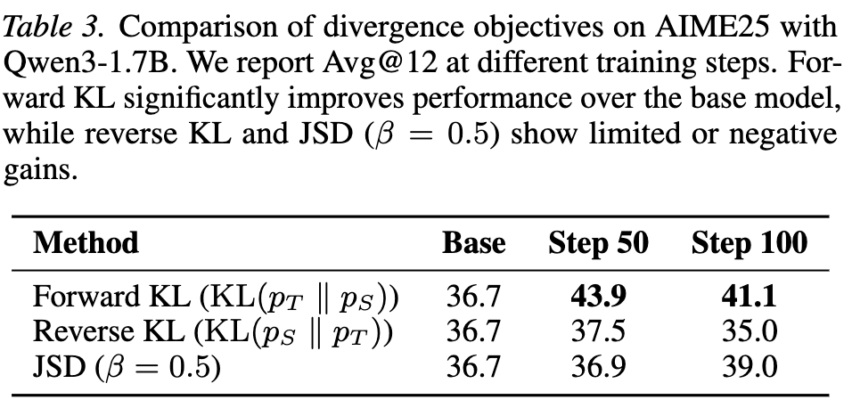

- **Forward KL이 가장 강함** (36.7 $\to$ 43.9). reverse KL/JSD는 제한적이거나 음(-)의 효과 $\to$ 이후 실험 전부 forward KL 채택

### Per-token KL clipping

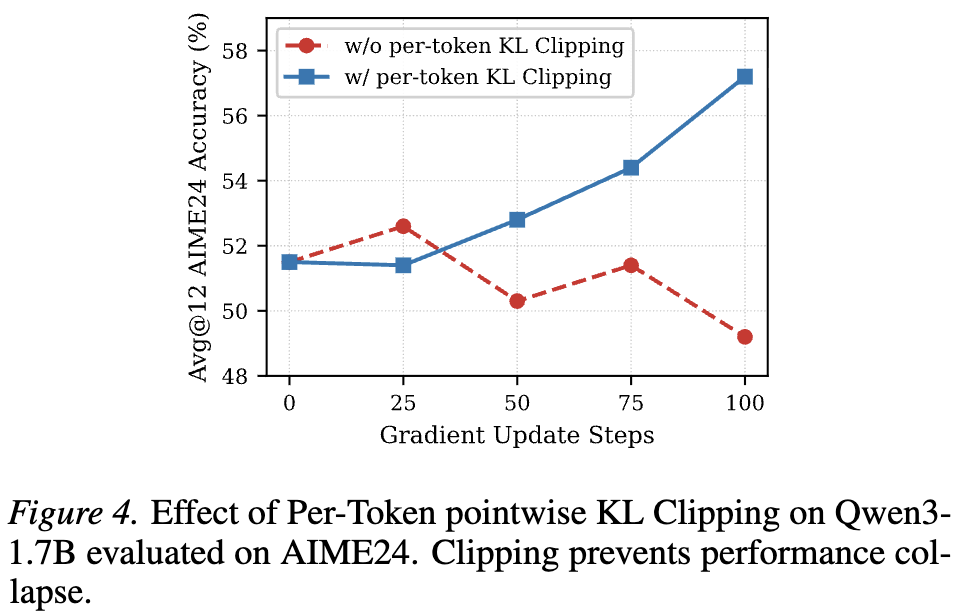

- clipping 없으면 학습이 붕괴, 있으면 안정적으로 상승. OPSD가 100 step 내 빠르게 수렴하므로 특히 중요

### Generation style

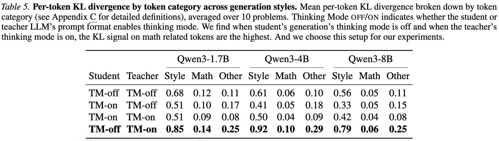

- token을 math / style / other로 분류해 forward KL 분석. **TM-off student + TM-on teacher** 조합이 math token에 가장 큰 KL(=강한 감독) $\to$ 이 조합 채택
- 기대 divergence는 stylistic token에 심하게 치우쳐 있어 pointwise clipping이 필요함을 재확인

### Generation length

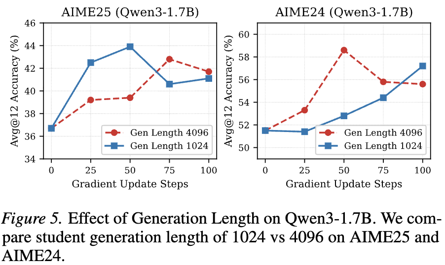

- generation length를 1024 $\to$ 4096으로 늘려도 일관된 개선 없음. **초기 token이 학습에 더 중요**(critical branching point)하고, 긴 prefix 뒤 후반 token은 teacher에게 예측 가능해져 penalty가 작아짐

### Full-vocab vs Sampled-token

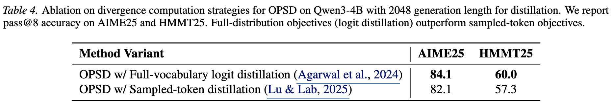

- **full-vocab logit distillation이 sampled-token보다 일관되게 우위** — teacher 전체 분포에 노출되는 편이 더 풍부한 감독. 단 vocab-size logit 저장으로 peak memory가 커지는 trade-off 존재

# 6. Conclusion & Limitations

- 충분히 유능한 추론 LLM은 정답에 접근할 수 있을 때 자기 rationalization 능력으로 스스로의 약한 버전을 external teacher/reward model 없이 가르칠 수 있음
- OPSD는 off-policy distillation/SFT보다 낫고 GRPO와 대등하거나 우수하면서 sample efficiency가 훨씬 좋음
- 저자들이 밝힌 제약/관찰
  - full-vocab distillation은 성능은 좋지만 peak memory 비용이 큼 (성능 vs 효율 trade-off)
  - "충분히 유능한 모델"과 "generation보다 rationalization이 쉽다"는 가정에 의존 — 매우 약한 모델이나 rationalization조차 어려운 태스크에서는 불확실
  - 평가가 수학 추론(AIME/HMMT) 중심. **코딩 등 타 도메인 일반화는 미검증**
  - **generation length를 늘려도 이득이 없다는 결과는 후반 token 감독이 약하다는 뜻**이기도 함

# Takeaways

- **핵심 아이디어**: teacher와 student가 같은 모델. 차이는 오직 "teacher는 정답 $y^\star$를 조건부로 본다"는 것. 정답을 privileged info로 주고 rationalization으로 dense token-level 감독을 만든다
- GRPO의 고질병(sampling 비용 8×, reward diversity collapse로 인한 gradient 소멸)을 dense distillation 신호로 우회 — 특히 작은 모델에서 효과가 크다
- 디테일이 성패를 가름: **forward KL + per-token pointwise clipping + TM-off student/TM-on teacher + full-vocab distillation**이 최적 조합. clipping 없으면 학습 붕괴
- SFT가 base를 깎아먹는(concise 풀이로 reasoning length 축소) 상황에서, 같은 데이터를 rationalization으로 재활용해 오히려 올린다는 점이 실용적 시사점
