# [VLM] CommerceVibe: Learning to Design E-Commerce Creatives as Executable Visual Code via Dual-Feedback Reinforcement Learning

- paper: https://arxiv.org/pdf/2608.27893
- arXiv:2608.27893v1 [cs.CV], '26-08-28 (인용수: 0회, '26-09-15 기준)
- 저자: Yajiao Xu (Tongji University / Alibaba Group), Jin Zhang, Jiangbo Ai, Tao Jiang, Mo Xu, Lina Huang, Chengfu Huo (Alibaba Group)
- downstream task: E-Commerce Creative Generation (상품 이미지 + 디자인 요구사항 $\to$ 렌더링 가능한 광고 소재)
  - diffusion으로 raster 이미지를 뽑는 대신, **한 번의 decoding으로 완전한 HTML/CSS 문서**를 생성함
- 주요 용어
  - **Executable visual code**: 크리에이티브를 픽셀이 아니라 HTML/CSS 문서로 표현. 상품 이미지는 ``로 **참조**(재생성 X), 카피는 native HTML text로 렌더 $\to$ 상품 외형 보존 + 글자 깨짐 원천 차단 + element 단위 편집/재사용 가능
  - **Dual-feedback RL**: rule-based feedback($R_{rule}$, 구조적 오류)과 VLM preference feedback($R_{pref}$, 지각/상업적 품질)을 동등 가중으로 합쳐 GRPO에 쓰는 방식. $R_{comb} = \frac{1}{2}R_{rule} + \frac{1}{2}R_{pref}$
  - **Profile routing**: 입력 상품 이미지 개수 $|I|$ 만으로 rule 프로파일을 선택. $p = \rho(|I|)$, $|I|=1$이면 Single, $|I| \ge 2$이면 Multi. 프로파일이 적용 dimension·가중치·폰트 임계값·critical 항목을 전부 결정함
  - **Check applicability (부분 조건부 verifier)**: 렌더링 결과에 증거가 있는 detector만 집계에 포함. ex. image occlusion은 렌더된 이미지가 2개 이상일 때만 적용, 미적용 항목의 가중치는 남은 항목에 재정규화
  - **Safeguards / hard gates**: 연속 점수 집계 **이전/이후**에 걸리는 고정 음수 보상. malformed HTML, empty body, 상품 URL 누락, sparse text 등을 걸러 reward hacking 방지

# 1. Motivation

- 이커머스 크리에이티브는 상품 이미지 + 마케팅 카피 + 그래픽 요소를 제한된 캔버스에 조합해야 함
  - production-ready가 되려면 (1) 상품 외형 보존 (2) 요구 정보의 정확한 표기 (3) 명확한 정보 구조 세 가지를 동시에 만족해야 함
  - 수작업은 대규모 카탈로그 / 잦은 캠페인 / 다중 출력 포맷을 감당 못 하고, 템플릿 기반은 디자인 다양성이 막힘

- **Diffusion 기반 생성의 한계**를 두 축으로 지적함
  1. **품질 결함**: 글자 왜곡, 상품 특징 변형, 없는 셀링포인트 날조 $\to$ 단순한 시각적 결함이 아니라 **상품을 오표기해 소비자를 오도**하므로 그대로 배포 불가
  2. **구조 부재**: flattened raster라 상품/텍스트/배경이 분리되지 않음 $\to$ 카피 수정, 상품 교체, 레이아웃 조정에 전체 재생성이 필요함

- 반대로 **구조화된 표현**(HTML/CSS)은 element 단위 편집이 되고, 렌더 후 visible content / image 참조 / element box / 경계를 **자동 검사**할 수 있음
  - text overflow, element occlusion, out-of-bounds 같은 오류를 rule-based check로 측정하고 severity를 매길 수 있음

- 그런데 이 측정값을 학습 신호로 바꾸는 데 두 가지 난점이 있음
  1. **check와 가중치가 입력 상품 이미지 수에 따라 달라져야 함**
     - 이미지 1장이면 그 상품이 시각적으로 두드러져야 하고, 여러 장이면 **전부 등장**해야 하며 상품 간 occlusion을 검출해야 함
  2. **rule만으로는 시각 품질을 판정 못 함**
     - 반대로 learned preference evaluator는 크리에이티브 **전체**를 평가하므로 element 단위 오류(상품 누락, 요소 겹침)에는 둔감함

  $\to$ (Research Question) 크리에이티브를 실행 가능한 HTML/CSS로 생성하고, **국소적 제약은 rule로 / 전체적 품질은 VLM Judge로** 역할을 나눠 RL 신호를 만들자

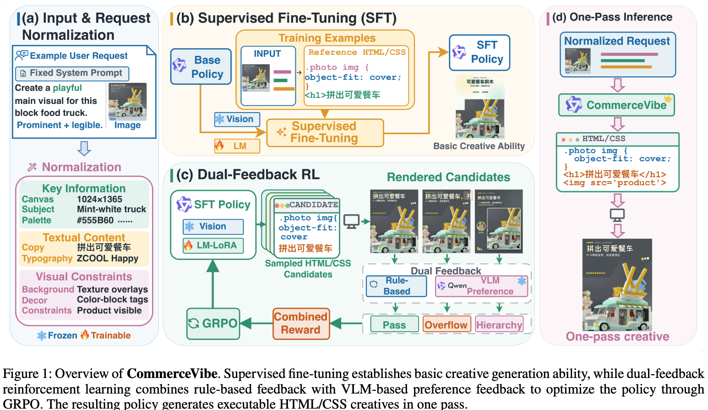 

CommerceVibe 전체 파이프라인: SFT로 기본 생성 능력 확보 $\to$ rule + VLM preference dual-feedback으로 GRPO 최적화 $\to$ one-pass HTML/CSS 생성

# 2. Contribution

- **CommerceVibe 제안**: 이커머스 크리에이티브 생성을 conditional HTML/CSS program synthesis로 정식화
  - 공급된 상품 이미지를 그대로 참조하고, 텍스트를 native HTML element로 렌더하며, RL 최적화를 위한 **검증 가능한 구조**를 제공함
- **Dual-feedback reinforcement learning 제안**: Text / Product / Layout의 rule-based check와 VLM 기반 preference feedback(6개 차원)을 결합
- **1,300-case 벤치마크 구축** 및 외부 모델 대비 우위 입증
  - 자동 평가 $S_{overall}$: base 70.1 $\to$ SFT 87.3 $\to$ **Rule+Preference RL 94.0**
  - 5인 이커머스 디자인 전문가 blind 평가 $S_{expert}$: **90.0** (GPT-5.5 78.9, Claude Opus 4.8 78.4, Gemini 3.5 Flash 75.9)

# 3. Related Works

## 3.1 E-Commerce Creative Generation
- 템플릿 기반 배치 $\to$ product staging / poster generation / 상품-배경 합성으로 발전, 최근에는 layout과 생성 배경을 joint control하는 시스템까지 나옴
- feedback·behavior 기반 방법(human annotation, CTR objective, personalization)이 신뢰성·상업적 효과를 개선
- **한계**: 평가 체계가 최종 이미지를 **전체로만** 보므로, 왜곡된 글자나 잘못된 상품 특징을 특정 요구사항까지 역추적할 수 없음

## 3.2 Structured and Executable Visual Code
- HTML layout, JSON design spec, Figma/SVG component, HTML poster 등으로 편집 가능한 표현을 만드는 흐름
  - **PosterVerse**: MLLM 기반 HTML 엔진으로 상업용 포스터 타이포그래피
  - **DesignAsCode**: 그래픽 디자인을 HTML/CSS synthesis로 정식화, render-and-reflect 반복으로 결함 수정
- HTML/CSS는 편집 가능한 source와 렌더 결과를 잇는 다리 역할
- **한계**: 문서가 문법적으로 잘 렌더되면서도 **잘못된 상품 이미지를 쓰거나, 필수 텍스트를 잘라먹거나, 이미지를 부적절하게 배치**할 수 있음 $\to$ 렌더 결과와 공급 asset을 대조하는 verification이 필요함

## 3.3 Verifiable Rule-Based and Preference Feedback
- rendering-aware RL: validity / fidelity / semantic / geometric 신호로 structured graphics 최적화 (ex. **AeSlides**는 슬라이드 레이아웃 위반을 verifiable reward로 변환)
- learned evaluator: rendered equivalence, 타이포그래피, 심미성처럼 rule로 못 담는 품질에 supervision 제공
- 두 신호는 **상보적이지만 각각 불완전**함 — CommerceVibe는 rule에 국소 제약, 고정 VLM Judge에 전체 품질이라는 서로 다른 역할을 명시적으로 할당함

# 4. Method: HTML/CSS Creative Generation

## 4.1 Formulation

- 입력 $r = (I, u, m)$: 상품 이미지 / free-form 사용자 요청 / (선택) 상품 정보
- 생성 전 **고정 전처리**로 요청을 구조화: $\tilde{u} = \text{Normalize}(I, u, m)$
  - normalization은 SFT·RL·평가 전 구간에서 **고정**이며 모든 variant가 공유함. **새로운 상품 사실을 추가하지 않음**
  - 추출 필드: `PRIMARY_IDEA`, `SOURCE_ANCHORS`, `CORE_PROOF`, `COMPOSITION_AND_TITLE`, `DESIGN_PAYOFF`, `TYPOGRAPHY`, `RISK_CONSTRAINTS`, `PROTECTED_RELATIONS` / `SUCCESS_CONDITION` / `PRIMARY_RELATION`, `FALLBACK_LAYOUT`
- 정책 컨텍스트 $x = (s, I, \tilde{u}, m)$ ($s$는 고정 system instruction). 정책은 완전한 HTML/CSS 문서 1개를 single decoding pass로 생성

$$\pi_\theta(c \mid x) = \prod_{t=1}^{T} \pi_\theta(y_t \mid x, y_{<t})$$

- **SFT**: 참조 문서 $c^*$의 negative log-likelihood 최소화. 참조 HTML/CSS 토큰과 end-of-turn 토큰만 supervise
  $\to$ 참조 문서를 모방할 뿐 **렌더된 결과의 속성을 직접 최적화하지는 못함** (RL의 동기)

- **RL**: 후보 $K$개 샘플링 $\to$ 각 후보를 브라우저로 1회 렌더 $z_k = \text{Render}(c_k)$
  - 렌더 산출물: DOM, element box, visible text, visible image 참조, 최종 스크린샷
  - 렌더 결과는 **보상 계산에만** 쓰이고 policy로 되돌려지지 않음 (반복 수정 루프 없음)

## 4.2 Rule-Based Checks (3 families)

렌더된 문서에서 측정하며, 이커머스에서 허용 불가한 오류 유형 3가지로 나눔.

| Family | Dimensions | 조건부 동작 |
|---|---|---|
| **Text Readability** | text overflow, text overlap, text on product, minimum font size, contrast | 가중치·폰트 임계값이 Single/Multi에서 다름. text-on-product는 visible ``가 있을 때만 평가 |
| **Product Visibility** | subject prominence, image crop, image occlusion | prominence는 Single=최대 매칭 이미지 / Multi=매칭 이미지 면적 합. occlusion은 렌더된 이미지가 2개 이상일 때만 적용 |
| **Layout Validity** | element bounds, visual balance, bottom blank | Multi는 ink-level text mass와 더 타이트한 balance 임계값, Single은 text box 기반 + 장식용 backing panel 제외 |

- visible `` 참조는 공급된 상품 URL과 **매칭**해서 올바른 상품을 썼는지 확인함

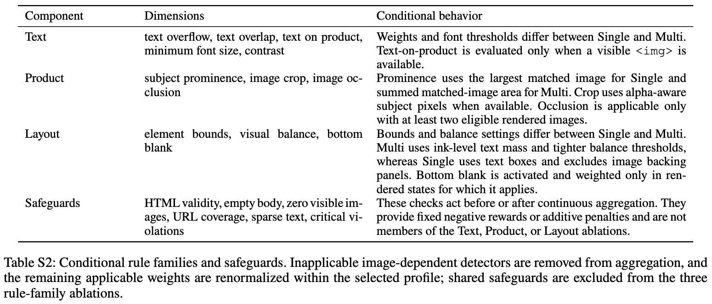 

조건부 rule family와 safeguards 정의

**프로파일별 가중치** (각 행 nominal 합계 50, critical = Ov/Ol/Bd/Io)

| Profile | Ov | Ol | Tp | Bd | Pr | Cr | Fs | Ct | Io | Ba |
|---|---|---|---|---|---|---|---|---|---|---|
| Single | 9 | 9 | 6 | 9 | 9 | 2 | 2 | 2 | – | 2 |
| Multi | 10 | 10 | 7 | 9 | 2 | 3 | 2 | 1 | 4 | 2 |

- Single은 상품이 1개이므로 **prominence 가중치가 9로 큼**, Multi는 prominence를 2로 낮추고 **occlusion(4)** 과 overflow/overlap(10/10)을 키움 — 여러 상품을 전부 겹치지 않게 담는 게 핵심 제약이 되기 때문
- Single에서도 occlusion detector가 적용 가능해지면 weight 3을 받되, prominence에서 최대 2점, contrast/font size/text-on-product에서 1점을 이관해 **프로파일 총합을 보존**함

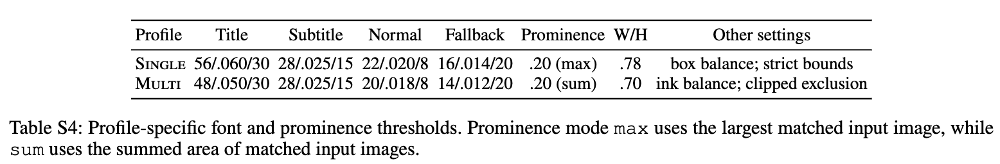 

프로파일별 폰트/prominence 임계값: Single 56/.060/30 등 title·subtitle·normal·fallback 3요소 표기

## 4.3 Rule Reward와 Safeguards

- **렌더 전 고정 보상**: HTML 50자 미만 $-1.0$, non-HTML 텍스트 $-0.8$, body/html 닫는 태그 없음 $-0.5$
- **렌더 후 hard gate**: empty body 또는 visible `` 없음 $-1.0$. 상품 커버리지 gate는 입력 cardinality에 의존 — Single은 유일 URL 누락 시 $-1.0$, Multi는 서로 다른 URL이 2개 이상 누락 시 $-1.0$
- **sparse-text penalty**: visible body text가 10자 미만이면 $P_{sparse}=25$
  $\to$ 필수 정보를 **빼버려서 Text check를 우회하는 꼼수**를 막는 장치
- **critical-violation penalty**: critical dimension은 두 번 페널티 — 점수 $q_d$를 0으로 만들고, 위반 수 $c_d$에 따라 추가 감점 $P_d = b_d + e_d(c_d - 1)$
  - 대부분 $(b_d, e_d) = (3,3)$ $\to$ 위반 1/2/3회에 3/6/9점. subject prominence만 $(3,0)$으로 고정 3점
  - image occlusion은 별도 비선형: overlap ratio $r$에 대해 $v = \text{clip}\left(\frac{r-0.02}{0.18-0.02}, 0, 1\right)$, 위반 쌍 $h$개일 때 $P_{occlusion} = 6 + 20v + 4\max(0, h-1)$

$$\tilde{S}_{rule} = B_{rule} - P_{critical} - P_{sparse}, \qquad R_{rule} = \text{clip}\left(\frac{\tilde{S}_{rule} - 40}{10}, -1, 1\right)$$

- $\tilde{S}_{rule}$ 자체는 clip하지 않아 음수가 될 수 있고, 최종 매핑만 clip함 ($\tilde{S}_{rule} \le 30$이면 $-1$)
- **safeguard와 penalty는 RL에서만 적용**하고, 자동 평가(리포트되는 $S_{rule}$)에서는 동일 dimension과 가중 집계만 쓰고 페널티는 빼서 순수 가중 뷰로 봄

## 4.4 VLM Preference Feedback

- 고정된 **Qwen3-VL-Plus** Judge (temperature 0, SFT/RL 동안 업데이트 없음)
- 입력: 렌더 스크린샷 + 공급 상품 이미지 + normalized request + 상품 정보 + 채점 프롬프트
  - **rule 점수나 rule issue는 Judge에게 주지 않음** (summary-free protocol) $\to$ 두 신호의 독립성 확보
- 6개 차원 각각 정수 1~5점: `visual_appeal`, `product_presentation`, `perceptual_readability`, `marketing_relevance`, `commercial_usability`, `copy_faithfulness`
  - 앞 5개는 weight 8, **copy faithfulness만 weight 10** (상품 정보 정확성이 이커머스에서 가장 critical하다는 판단)

$$V = \sum_j \frac{w_j \, n(s_j)}{100} - \sum_{j: s_j \le 2} \lambda_j (5 - s_j), \quad n(s) = 25(s-1)$$

- 저점(1~2점)에 추가 페널티 $\lambda_j$: copy faithfulness는 12, 나머지는 8 $\to$ **한 차원만 크게 망가져도 평균에 묻히지 않게** 함
- $R_{pref} = \text{clip}\left(\frac{V-25}{12.5}, -1, 1\right)$

## 4.5 GRPO Update

- 공통 validity/content gate 통과 후, 세 variant가 서로 **feedback만 다르게** 학습됨
  - Rule-RLVR: $R_{rule}$ / Preference-RL: $R_{pref}$ / **Rule+Preference RL: $R_{comb} = \frac{1}{2}R_{rule} + \frac{1}{2}R_{pref}$**
- 그룹 내 상대 advantage로 표준화 후 clipped GRPO + reference-policy KL 정규화

$$\hat{A}_k = \frac{R_k - \text{mean}(R_{1:K})}{\text{std}(R_{1:K}) + \epsilon}$$

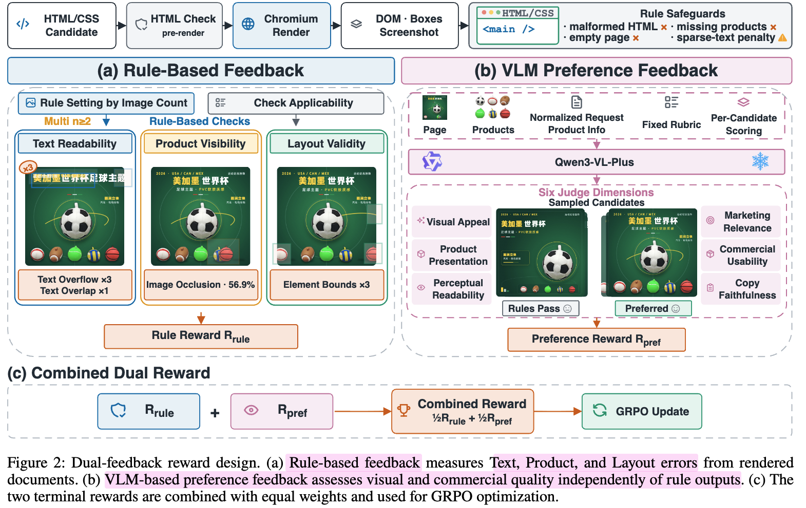

dual-feedback reward 설계: (a) rule-based feedback, (b) VLM preference feedback, (c) 동등 가중 결합 후 GRPO

# 5. Experimental Setup

## 5.1 Data & Benchmark

- **SFT corpus**: 실제 이커머스 디자인 시나리오에서 수집, 품질 필터링 후 **28,568 train / 3,174 validation** (약 9:1)
  - train 구성: Single-image 23,726 / Multi-image 4,842
  - 품질 관리: base64 embed 거부, 짧은 single-image wrapper 제거, 예제 내 중복 이미지 URL 제거
  - SFT 중 구조화된 상품 정보를 **확률 0.3으로 drop** $\to$ 상품 정보를 안 주는 사용자 요청을 모델링
- **Benchmark**: 1,300 케이스 (Single 1,140 = 87.69%, Multi 160 = 12.31%), 34개 이커머스 카테고리 (홈, 뷰티, 전자, 식음료, 의류, 반려동물 등)
  - **상품 단위로 학습 데이터와 완전 분리**, 케이스 간 상품 중복 없음
  - Multi 내 이미지 수 분포: 2장 48 / 3장 46 / 4장 31 / 5장 16 / 6장 8 / 7장 6 / 8장 5 케이스

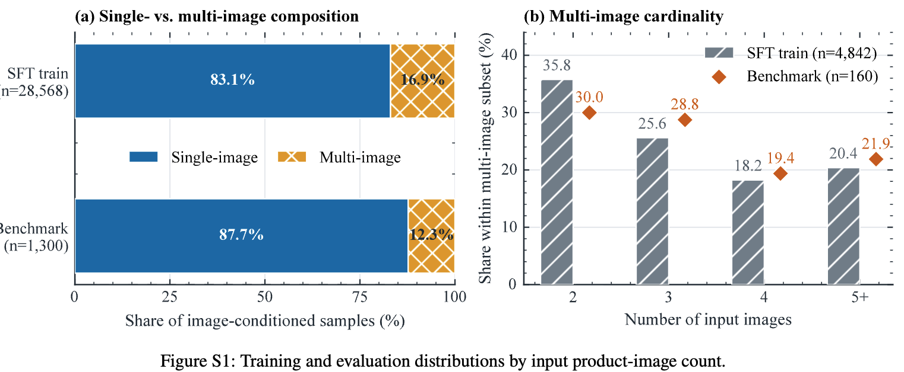

입력 상품 이미지 수별 학습·평가 분포

## 5.2 Metrics

- $S_{rule} \in [0,50]$ (활성 rule dimension 가중 집계) + $S_{pref} \in [0,50]$ (Judge 6차원 rescale) $=S_{overall} \in [0,100]$
- 자동 평가는 RL과 같은 check를 쓰되 **safeguard/penalty는 미적용**
- 평균 처리: 외부 모델은 API 3회 호출, Qwen3.5-9B는 3회 추론, 각 RL variant는 **seed 3개(42/25/999)의 step-900 체크포인트** 평균. SFT는 1회
- **Blind expert 평가**: 실무 1~5년차 이커머스 디자이너 5명. 8개 방법의 출력을 익명화·무작위 순서로 제시하고 자동 점수는 숨김 $\to$ $S_{expert} \in [0,100]$

## 5.3 Implementation

| 항목 | 설정 |
|---|---|
| Backbone | Qwen3.5-9B (multimodal) |
| SFT | 3 epoch, effective batch 32, LR $1\times10^{-5}$, max length 16,384, full LM update |
| GRPO | LoRA rank 8 (vision encoder frozen), $K=8$, LR $5\times10^{-5}$, temperature 0.7, completion batch 64, max completion 3,584 / total 20,480, KL coef 0.001 |
| Renderer | Playwright 기반 headless Chromium |
| Judge | 고정 Qwen3-VL-Plus, temperature 0 |
| Hardware | NVIDIA H20 96GB $\times$ 8 |
| Framework | MS-SWIFT 4.3.0 (`swift rlhf`, `rlhf_type=grpo`), rollout은 vLLM 0.17.1 colocated |

- 벤치마크 추론은 temperature/top-p 없이 greedy, 최대 8,192 토큰, thinking 비활성
- 외부 모델(GPT-5.5 / Claude Opus 4.8 / Gemini 3.5 Flash)도 **동일한 generator system instruction**과 동일 입력을 받고, iterative correction이나 candidate reranking 없이 **1-pass** 생성
  - 무효 응답 시 최대 2회 재시도(총 3회), 이전 응답/에러를 모델에 주지 않음

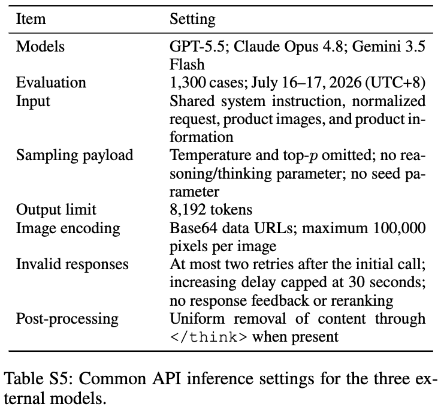

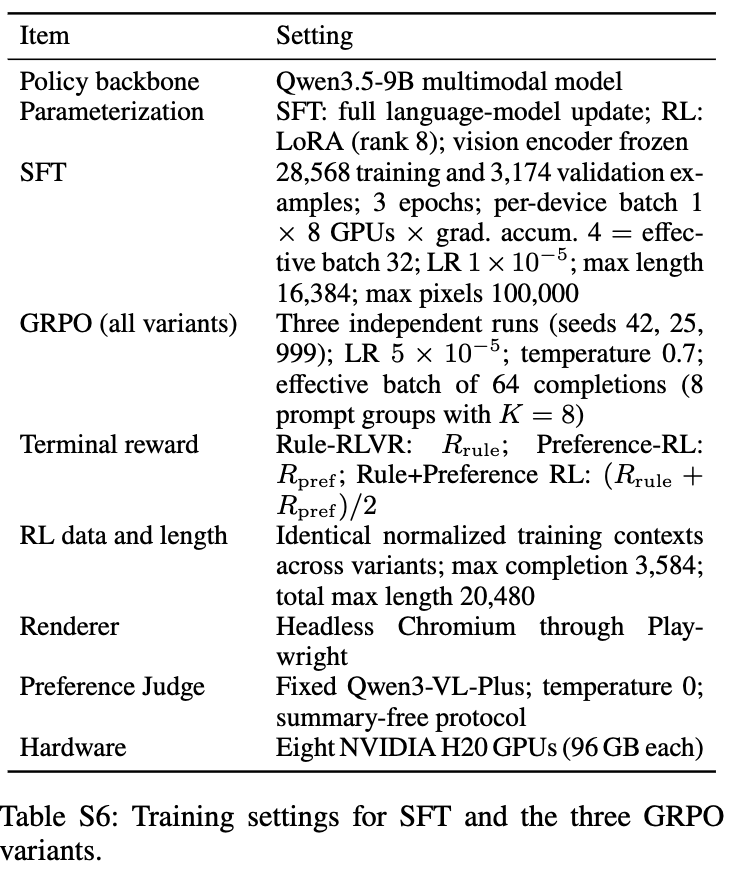

# 6. Experiments

## 6.1 Main Results

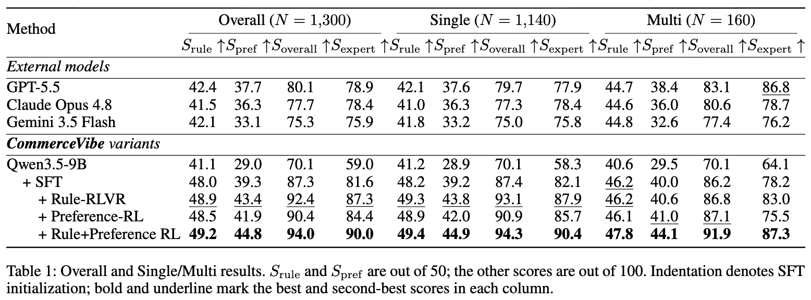

Overall / Single / Multi 결과 — $S_{rule}$, $S_{pref}$는 50점 만점, 나머지는 100점 만점

- base 70.1 $\to$ SFT 87.3 (**+17.2pp**) $\to$ Rule+Preference RL 94.0 (**+6.7pp**). 최고 외부 모델 GPT-5.5 대비 **+13.9pp**
- 흥미로운 점: **base 정책의 $S_{rule}$이 41.1로 외부 모델(41.5~42.4)과 비슷함**
  - base는 공급 이미지와 기본 텍스트만 쓰는 단순 출력이라 rule은 잘 지키지만 $S_{pref}$가 29.0으로 바닥
  - 반대로 외부 모델과 CommerceVibe는 복잡한 시각 요소를 만들어 공간 구성·경계 제어 부담이 커짐
  $\to$ rule 점수만으로는 품질을 못 읽는다는 걸 base 정책이 직접 보여줌 (expert 점수는 59.0으로 압도적 최하위)

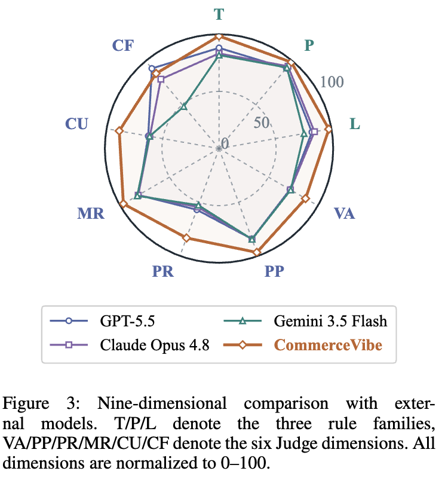

9차원 비교 레이더: rule 3종 T/P/L + Judge 6종 VA/PP/PR/MR/CU/CF, 전부 0–100 정규화

- CommerceVibe가 **rule 3개 family 전부 + Judge 6개 중 5개**에서 최고. **copy faithfulness만 GPT-5.5가 우위**
- Claude Opus 4.8은 Product/Layout에서 상대적으로 강하고, Gemini 3.5 Flash는 rule 준수는 비슷하나 preference 품질이 낮음

## 6.2 두 feedback의 상보성 (입력 복잡도별)

- 세 RL variant 모두 공통 SFT 정책을 개선하지만 Rule+Preference RL이 rule/preference/overall 전부 최고
- 각 설정에서 **더 강한 single-feedback variant 대비**:
  - **Multi-image 케이스 +4.8점** / Single-image 케이스 +1.2점
  $\to$ 상품이 여러 개일수록(상품 커버리지·occlusion·조합 배치가 동시에 걸릴수록) 두 신호의 상보성이 커짐

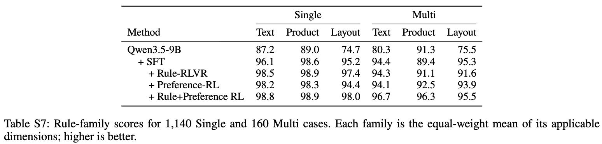

- Multi에서 격차가 특히 큼: SFT의 Multi Product 89.4 $\to$ Rule+Preference RL **96.3**, Multi Layout 95.3 $\to$ **95.5**, Multi Text 94.4 $\to$ **96.7**
- 주목할 부분은 **Rule-RLVR 단독은 Multi Layout이 91.6으로 SFT(95.3)보다 오히려 퇴보**한다는 점. preference 신호가 붙어야 95.5로 회복됨

## 6.3 Expert & Qualitative Validation

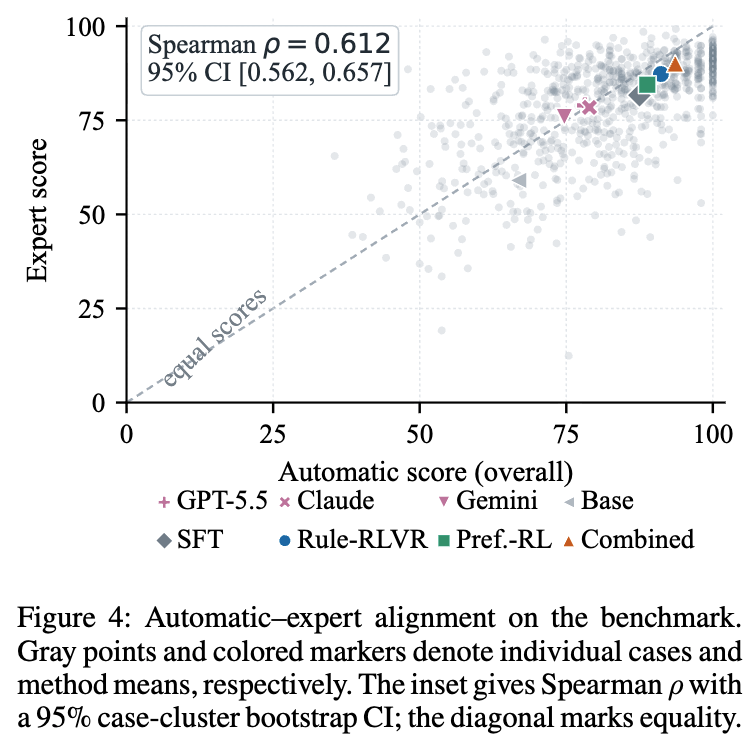

자동 점수 – 전문가 점수 정렬도 산점도, Spearman $\rho$와 95% CI inset

- 전문가 blind 평가에서 CommerceVibe가 **90.0으로 1위**, Single/Multi 서브셋 모두 1위
- 평가자 간 일치도 **ICC(A,5) = 0.811** (높음)
- 자동–전문가 케이스 수준 상관 **Spearman $\rho$ = 0.612, 95% CI [0.562, 0.657]** (10,000회 case-cluster bootstrap)
- 전문가 점수가 방법 간 분리를 더 선명하게 함 — 특히 base 정책은 rule check를 많이 통과하고도 전문가 점수 59.0으로 급락
- Rule-RLVR(87.3) $\to$ Rule+Preference RL(90.0)의 개선이 **VLM preference feedback이 rule을 보완한다**는 직접 증거

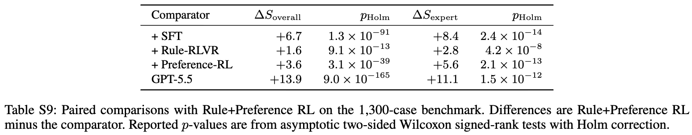

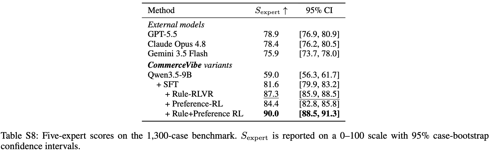

5인 전문가 점수와 95% case-bootstrap CI — Rule+Preference RL 90.0 [88.5, 91.3]로 Rule-RLVR 87.3 [85.9, 88.5]와 CI 비중첩

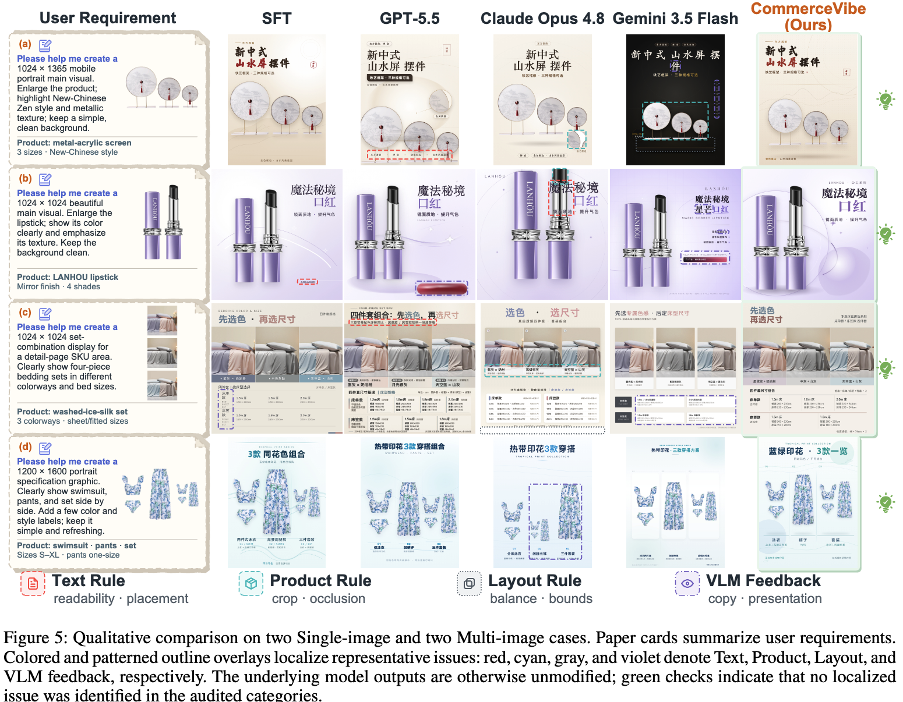

Single 2건 / Multi 2건 정성 비교. red/cyan/gray/violet 오버레이가 각각 Text·Product·Layout·VLM feedback 이슈를 국소화

## 6.4 Rule-Family Ablation

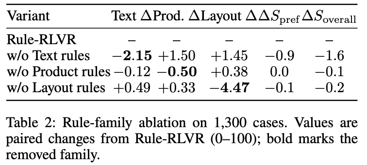

- 세 family 모두 **자기 목표 dimension에서 가장 크게 하락**함 (대각 성분이 음수) $\to$ 신호가 의도대로 분리되어 작동
- **Layout rule 제거 시 −4.47로 family 내 최대 퇴화** $\to$ 명시적 기하 제약(경계·균형)이 가장 대체 불가능함
- **Product rule 제거는 −0.50으로 영향이 작음** $\to$ SFT가 이미 상품 표현 능력을 충분히 학습해 뒀고, rule은 미세 조정 역할만 함
  - Product rule 제거가 Text 점수(−0.12)도 살짝 낮추는데, 저자들은 상품의 prominence·배치가 카피가 쓸 공간에 영향을 주기 때문으로 추정함
- 비대각 성분이 양수인 건 **공동 최적화되는 dimension 간 가중치 재분배** 때문 (한 family가 빠지면 나머지에 예산이 몰림)

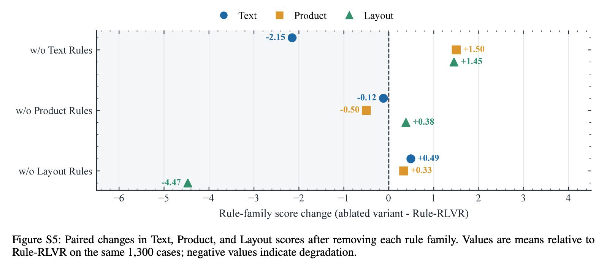

## 6.5 RL Training Dynamics

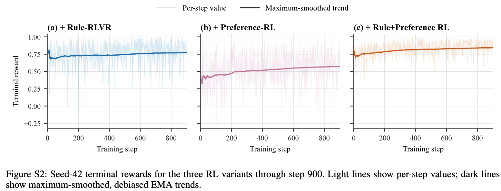

seed-42 세 RL variant의 step 900까지 terminal reward 궤적

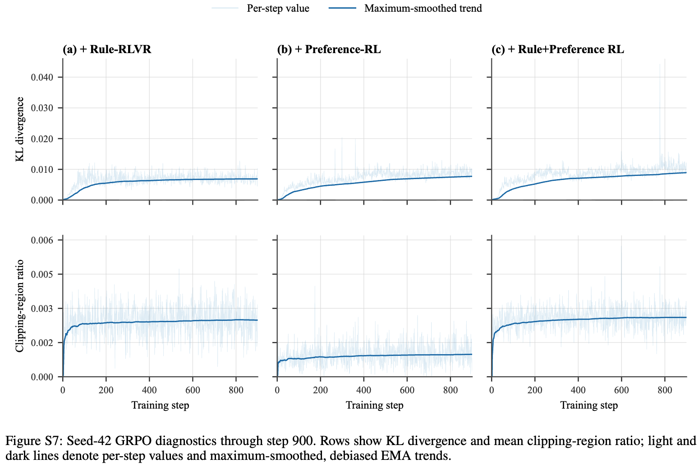

- KL/clipping 모두 작게 유지됨 $\to$ 강한 SFT 초기화와 일관
- **저자들이 명시한 실패 경험**: 더 큰 learning rate나 더 강한 KL 설정으로 초기 튜닝했을 때 **reward hacking이 더 심해지고 instruction following이 퇴화**함 (partial forgetting 시사)
- Preference-RL의 clipping ratio가 가장 낮고, Rule+Preference RL의 KL 추세가 가장 크지만 여전히 작음

# 7. Conclusion & Limitations

## 7.1 Conclusion
- 이커머스 크리에이티브를 **실행 가능한 HTML/CSS**로 생성하면 확장 가능한 양산 + 직접 편집 + 구조적 검증이 동시에 가능해짐
- **rule(국소 구조 제약) + VLM preference(전체 지각·상업 품질)** 의 역할 분리가 핵심이며, 두 신호를 동등 가중으로 합친 GRPO가 각 신호 단독보다 자동/전문가 평가 모두에서 우수함
- 특히 상품 이미지가 여러 장인 어려운 설정에서 상보성 이득이 커짐 (+4.8 vs +1.2)

## 7.2 Limitations (저자 언급 + 리뷰어 관점)

- **rule 라우팅이 task-specific 설계**임을 저자가 직접 인정: 프로파일 선택을 입력 이미지 수로만 하고, **대안적 가중치 체계는 비교하지 않았음** (Table S3의 가중치들이 어떻게 정해졌는지에 대한 sensitivity 분석 없음)
- **Judge와 평가 지표가 같은 축을 공유함**: $S_{pref}$를 학습 보상으로 쓰면서 자동 평가에도 동일한 Qwen3-VL-Plus Judge를 씀 $\to$ 자기 보상 최적화 편향 위험. 저자도 future work로 **independent VLM Judge**를 언급함
  - blind expert 평가가 이를 부분적으로 방어하지만, 전문가 composite 역시 rule-aligned + preference 차원을 그대로 쓰는 구조라 완전히 독립적이진 않음
- **자동–전문가 상관이 중간 수준**: 전체 $\rho = 0.612$지만 **method별 상관 중앙값은 0.385 (범위 0.075–0.492)** $\to$ 같은 방법 내 케이스 순위를 자동 점수가 잘 못 맞춤. 방법 간 비교에는 쓸 만해도 케이스 단위 품질 게이팅으로는 약함
- **Multi 표본이 적음**: 벤치마크 1,300건 중 Multi는 160건(12.31%)뿐이고, 6~8장 케이스는 각 8/6/5건에 불과함. 핵심 주장인 "Multi에서 상보성이 크다"의 통계적 뒷받침이 얇음
- **단일 backbone / 단일 시드 집합**: Qwen3.5-9B 하나만 검증. 저자도 future work로 추가 policy backbone을 언급
- **1-pass 생성만 평가**: 외부 모델도 동일 조건이라 공정하지만, DesignAsCode류의 render-and-reflect 반복 보정과는 직접 비교되지 않음. 저자의 future work가 closed-loop self-improvement인 이유

# Takeaways

- **"픽셀 대신 코드를 생성한다"** 가 이 논문의 진짜 레버리지임. HTML/CSS로 내보내는 순간 (1) 상품 이미지를 재생성 안 해서 외형이 보존되고 (2) 텍스트가 native element라 글자 깨짐이 구조적으로 불가능하며 (3) **렌더 후 DOM/box를 읽어 verifiable reward를 만들 수 있음** — 세 이점이 한 표현 변경에서 동시에 나옴
- rule-based reward를 설계할 때 **입력 조건에 따라 가중치 프로파일을 바꾸는 것**(Single vs Multi)과 **증거가 없는 detector는 집계에서 빼고 재정규화하는 것**이 실무적으로 중요한 디테일임. 고정 rule 벡터를 모든 샘플에 적용하면 Multi 케이스의 occlusion 같은 신호가 희석됨
  - ex. **Group type** container 면 gap score / alignment score는 **제외**
- **reward hacking 방어가 보상 설계의 절반**임. sparse-text penalty(카피를 빼서 Text check 우회), hard gate(상품 URL 누락), critical dimension 이중 페널티가 전부 "점수를 얻는 쉬운 길"을 막는 장치임
  - ex. **Group type**만 남발하지 않도록 (reward hacking) 방어용 **SafeGuard**를 반드시 마련해야함
- rule 단독은 "규칙은 지켰지만 못생긴" 출력을 만들고(base 정책: $S_{rule}$ 41.1인데 $S_{expert}$ 59.0), preference 단독은 국소 오류를 놓침. **두 신호를 0.5/0.5로 합치는 가장 단순한 결합**이 각 단독보다 일관되게 나음
- 다만 Judge가 학습 신호이자 평가 지표라는 구조적 순환과, 자동–전문가 상관이 method 내부에서는 0.385 수준이라는 점은 이 류의 "VLM-as-judge reward" 논문을 읽을 때 항상 확인해야 할 지점
