title: "[Agent] Agent Distillation: CoT가 아니라 '행동'을 증류해서 0.5B 모델을 도구 쓰는 에이전트로 만들기"

# [Agent] Agent Distillation: CoT가 아니라 '행동'을 증류해서 0.5B 모델을 도구 쓰는 에이전트로 만들기

- paper: https://arxiv.org/pdf/2505.17612 (Distilling LLM Agent into Small Models with Retrieval and Code Tools)
- github: https://github.com/Nardien/agent-distillation
- NeurIPS 2025 accepted (인용수: 43회, '26-09-17 기준, Oral)
- 저자: KAIST / University of Wisconsin-Madison / KRAFTON / DeepAuto.ai (Minki Kang, Jongwon Jeong, Seanie Lee, Jaewoong Cho, Sung Ju Hwang)
- downstream task: tool-using small agent (retrieval + code interpreter)
  - factual reasoning 4종 (HotpotQA, Bamboogle, MuSiQue, 2WikiMultiHopQA) + math reasoning 4종 (MATH500, GSM-Hard, AIME, OlymMATH)
- 주요 용어
  - **agent trajectory**: thought $\to$ action $\to$ observation 이 반복되는 상호작용 시퀀스. $\tau = ((r_1, a_1, o_1), \dots, (r_{L_\tau}, a_{L_\tau}, o_{L_\tau}))$. observation $o$ 는 모델이 생성하는 게 아니라 **환경이 돌려주는 값**이라 loss에서 제외
  - **agent distillation**: teacher LLM agent가 만든 trajectory로 student sLM을 SFT. CoT distillation이 정적인 rationale을 베끼게 한다면, 이쪽은 *어떻게 행동할지*를 베끼게 함
  - **first-thought prefix (FTP)**: teacher에게 먼저 CoT 프롬프트로 첫 추론 스텝 $y_1$ 을 뽑고, 그걸 agent의 첫 thought 접두사로 강제 주입해서 trajectory를 생성하는 기법. **teacher trajectory 생성에만 쓰이고 student inference에는 불필요**
  - **self-consistent action generation (SAG)**: greedy decoding 대신 $N$개의 thought-action을 고온 샘플링 $\to$ 코드 인터프리터로 parsing/execution 에러 나는 것 필터링 $\to$ 남은 것 중 **observation이 가장 일치하는(majority) action**을 선택하는 test-time 기법
  - **CodeAct**: action을 Python 코드로 표현하는 에이전트 포맷. 본 논문의 student agent가 따르는 형식

# 1. Motivation

- sLM은 싸지만 복잡한 문제를 못 풂 $\to$ 지금까지의 표준 해법은 **reasoning(CoT) distillation**, 즉 teacher LLM의 CoT를 next-token prediction으로 베끼게 하는 것

- 그런데 CoT distillation된 작은 모델은 두 곳에서 무너짐

  1. **rare factual knowledge** — 모르는 사실은 그냥 hallucinate 함
  2. **precise computation** — 자릿수 많은 산술에서 계산을 틀림

- 논문의 running example: *"2010년에 Apple 주식에 \$100을 넣었으면 2020년에 얼마인가?"*

  - 주가 히스토리(사실) + split 반영 산술(계산)이 둘 다 필요함
  - LLM은 암기된 지식 + 수치 능력으로 CoT만으로 풀 수 있지만, 이 trace를 sLM에 그대로 증류해도 **학습 때 못 본 새 종목/새 수치에는 일반화되지 않음**

  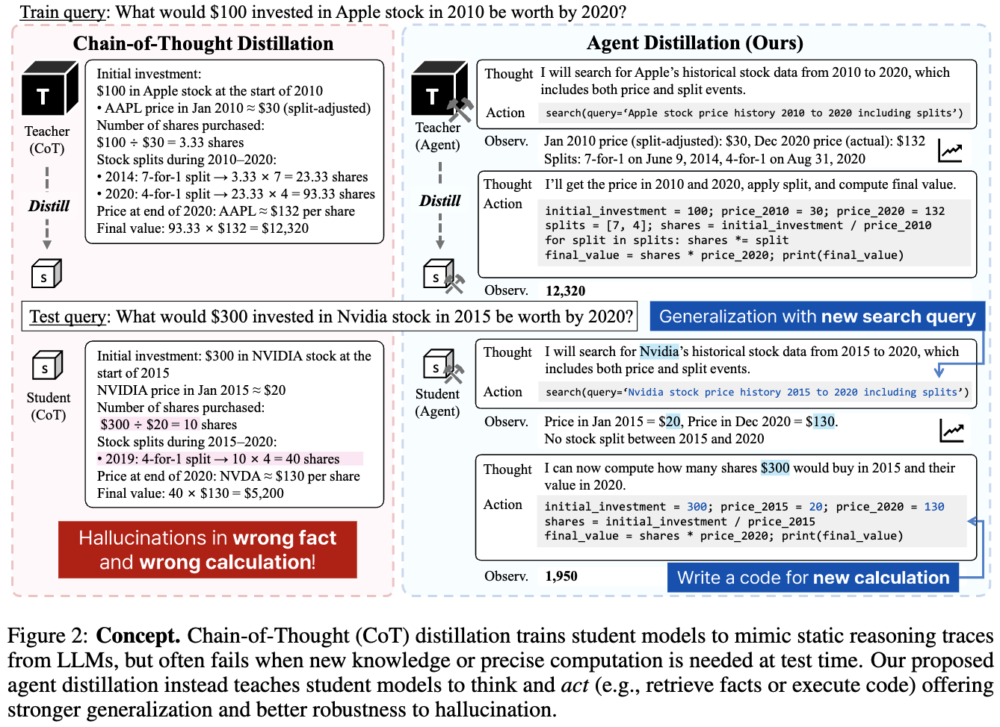

  CoT distillation vs agent distillation 개념 비교 — CoT 학생은 Nvidia 질문에서 사실·계산을 동시에 틀리고, agent 학생은 **검색 쿼리**를 새로 만들고 **코드**로 계산

- $\to$ (Research Question) 지식·계산을 **암기**시키는 대신, retrieval과 code tool을 쓰는 **행동 자체**를 30B급 teacher agent에서 0.5~3B student로 증류할 수 있는가?

# 2. Contribution

- **Agent Distillation** 제안: teacher LLM agent의 **reason-act-observe trajectory**로 sLM을 fine-tuning 하는 프레임워크
  
  - 학생은 사실/계산을 외우는 게 아니라 **도구로 푸는 법**을 배움 $\to$ 못 본 쿼리·계산에 일반화됨
- naive distillation의 두 한계를 겨냥한 보조 기법 2개
  - **first-thought prefix (FTP)**: teacher trajectory 품질 개선 (teacher 추가 학습 없이 프롬프트만으로)
  - **self-consistent action generation (SAG)**: student의 test-time robustness 개선 (invalid code action 감소)
- 8개 벤치마크(factual 4 + math 4), student 0.5B~7B 전 스케일에서 CoT distillation 대비 일관된 향상
- 핵심 주장: **agent distillation된 모델이 2~4배 큰 CoT distillation 모델과 맞먹음**

  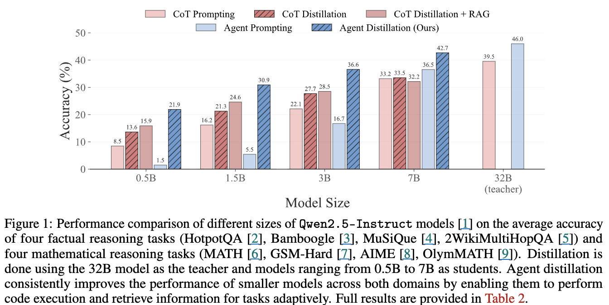
  
  모델 크기별 5개 세팅 평균 정확도 — 0.5B/1.5B/3B/7B/32B teacher

# 3. Related Works

## 3.1 Reasoning distillation

- 기존 CoT distillation은 teacher의 step-by-step rationale을 재현시키는 방식이고, 이미 post-training 파이프라인의 표준 구성요소임
- 일반화를 위해 retrieval이나 code execution을 끼워 넣는 시도도 있었지만, **정적인 demonstration에 의존하고 환경과의 상호작용이 없음**

## 3.2 Language agents

- ReAct가 *observe $\to$ think in natural language $\to$ act* 하는 language agent 개념을 세웠고, 이후 약한 LLM을 강한 LLM의 trajectory로 fine-tuning 하는 연구들이 이어짐 (FireAct 등)
- **차이점**: 선행 연구는 대부분 $\geq$ 7B 모델을 GPT-4 같은 closed-source trajectory로 튜닝함. 본 논문은 **$\leq$ 3B 급까지 내려가는 setting**을 다루고, teacher trajectory 품질과 student test-time 동작을 함께 건드림

# 4. Preliminary

- **Knowledge distillation**: teacher $p_T$ 와 student $p_S$ 의 토큰 분포 차이를 최소화

  $$\min_\theta \mathbb{E}_{(x,y)\sim \mathcal{D}_{train}} \frac{1}{L_y}\sum_{n=1}^{L_y} D\big(p_T(\cdot \mid y_{<n}, x) \,\|\, p_S(\cdot \mid y_{<n}, x; \theta)\big)$$

- **Reasoning distillation**: 사람이 rationale을 다는 건 비싸니, teacher에게 CoT 프롬프트 $I_{CoT}$ 를 줘서 rationale을 생성시키고 그걸 그대로 흉내내게 함

  $$\min_\theta -\mathbb{E}_{x \sim \mathcal{D}_{train},\, y \sim p_T(\cdot \mid x, I_{CoT})} \sum_{n=1}^{L_y} \log p_S(y_n \mid x, y_{<n}; \theta)$$

# 5. Agent Distillation

## 5.1 기본 형태

- teacher에게 agent instruction $I_{agent}$ 를 주고 trajectory를 뽑음

  $$\tau = ((r_1, a_1, o_1), \dots, (r_{L_\tau}, a_{L_\tau}, o_{L_\tau})) \sim p_T(\cdot \mid x, I_{agent})$$

- student는 **observation을 제외하고** thought/action만 학습

  $$\min_\theta -\mathbb{E}_{x,\, \tau \sim \pi_T(\cdot\mid x, I_{agent})} \sum_{t=1}^{L_\tau} \log p_S(r_t, a_t \mid x, \tau_{<t}; \theta)$$

  - observation은 환경이 주는 값이라 모델이 생성할 대상이 아님

- 이렇게 하면 student는 CodeAct 스타일로 코드를 짜고, 인터프리터 에러가 나면 코드를 고치고, 검색 결과가 부실하면 쿼리를 바꿔가며 진행할 수 있음

## 5.2 두 가지 병목

1. **agentic behavior가 OOD임** — teacher/student 모두 CoT 스타일로 instruction-tuning 되어 있어서, agent 포맷을 강요하면 원래 잘하던 도메인의 성능이 오히려 떨어짐
2. **sLM은 정상 동작하는 코드를 잘 못 뽑음** — 포맷 깨진 코드, 라이브러리 오용 등이 상호작용 자체를 막음

## 5.3 First-thought prefix (FTP)

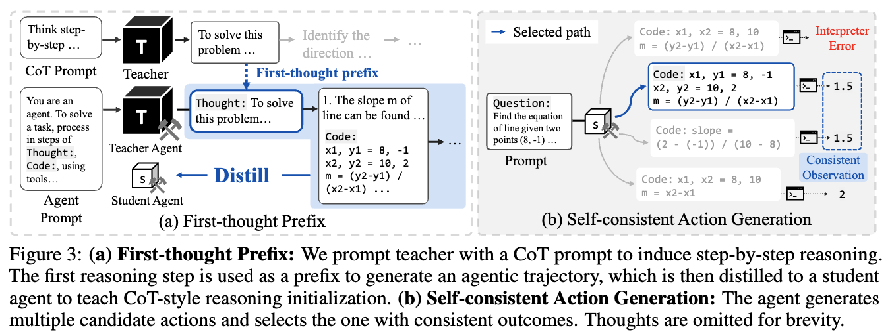 ((a) First-thought Prefix, (b) Self-consistent Action Generation 도식)

- 관찰: Qwen2.5-32B-Instruct 조차 **agent로 쓰면 MATH500 어려운 문제에서 CoT 프롬프트보다 성능이 떨어짐** (Section D.1)
  - 가설: instruction-tuned 모델은 이미 CoT로 푸는 데 최적화돼 있는데, agent instruction이 그 추론 패턴과 충돌해 **distributional drift**를 일으킴
  - 첫 추론 스텝이 최종 결론을 크게 좌우한다는 선행 연구에 기대어, **첫 thought만 제대로 잡아주면 된다**고 봄
- 방법: LLM jailbreaking의 prefix-attack에서 착안. CoT 프롬프트로 뽑은 첫 스텝 $y_1$ 을 agent trajectory의 첫 thought 접두사로 박아넣음

  $$y_1 \sim p_T(\cdot \mid x, I_{CoT}), \quad \tau = \{(r_1', a_1, o_1), \dots\} \sim p_T(\cdot \mid x, y_1, I_{agent})$$

- **teacher trajectory 생성 시에만 사용**. student는 inference 때 prefix가 필요 없음

## 5.4 Self-consistent action generation (SAG)

- 관찰: 작게 증류된 agent는 실행 실패하거나 에러를 뱉는 **invalid action**을 자주 냄
- 방법 (greedy decoding 대체)
  1. 높은 temperature로 nucleus sampling, thought-action 후보 $N$개 생성
  2. 가벼운 코드 인터프리터로 parsing/execution error 나는 후보 제거
  3. 전부 실패하면 실패한 것 중 하나를 랜덤 선택해 **에러 메시지를 observation으로 되먹여** 다음 스텝에서 self-correct
  4. 살아남은 후보의 **observation에 대해 majority voting** $\to$ 가장 일치하는 action 채택
- figure 3(b) 예시: 후보 4개 중 1개는 인터프리터 에러로 탈락, 나머지 3개 중 2개가 같은 출력 $\to$ 그 2개 중 하나를 최종 action으로

# 6. Experiments

## 6.1 Setup

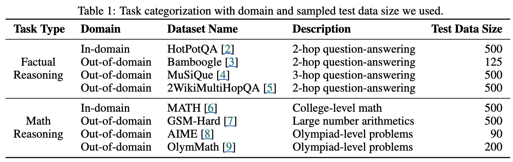 

태스크 분류 — in-domain / out-of-domain, 데이터셋별 test size

- **Tasks**: factual은 HotpotQA(in-domain, 500) / Bamboogle(125) / MuSiQue(500) / 2WikiMultiHopQA(500), math는 MATH500(in-domain) / GSM-Hard(500) / AIME(90) / OlymMATH(200)
  - 학습은 HotpotQA 1,000개 + MATH 2,000개만 사용
- **Models**: teacher = `Qwen2.5-32B-Instruct`, student = `Qwen2.5-Instruct` 0.5B / 1.5B / 3B / 7B (모두 instruction-tuned 상태)
- **Baselines**: CoT distillation (+RAG를 붙인 변형 포함) vs agent distillation (+FTP, +SAG)
- **Training**: 질문당 trajectory 1개 샘플링 후 **오답 trajectory는 버림** $\to$ 약 2,000개로 학습. LoRA(rank 64, 전 linear layer), 2 epochs, batch 8, lr $2\cdot 10^{-4}$, A100 80GB $\times$ 4
- **Inference**: greedy decoding, max 5 steps. SAG는 $N=8$, temperature 0.4
- **Tools/Metric**: 검색엔진 대신 Wikipedia 2018 + `e5-base-v2` 임베딩. math는 exact match, factual은 `gpt-4o-mini` LLM-as-a-judge

## 6.2 Main results

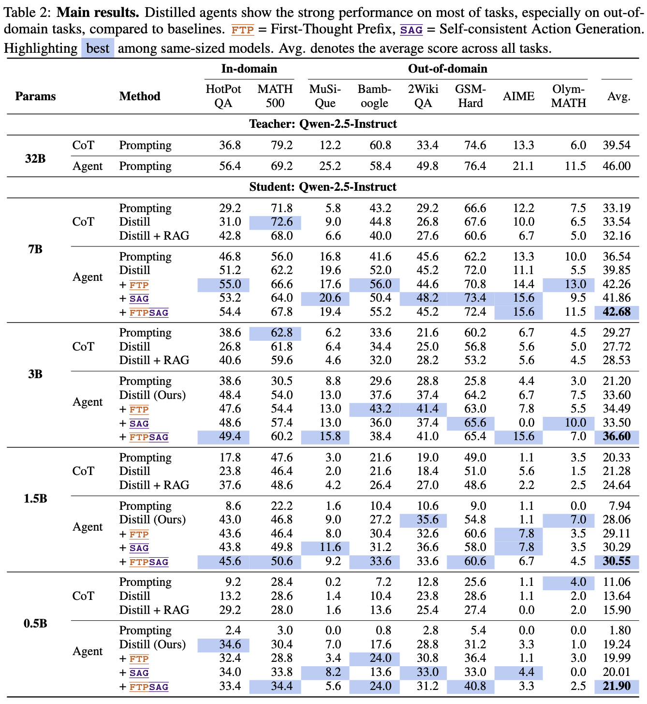 (8개 벤치마크 × 5개 모델 크기 메인 결과)

- 평균 점수 요약 (Avg. 컬럼)

| Params | CoT Prompting | CoT Distill | CoT Distill+RAG | Agent Prompting | Agent Distill | + FTP | + SAG | + FTP&SAG |
| --- | --- | --- | --- | --- | --- | --- | --- | --- |
| 32B (teacher) | 39.54 | - | - | 46.00 | - | - | - | - |
| 7B | 33.19 | 33.54 | 32.16 | 36.54 | 39.85 | 42.26 | 41.86 | **42.68** |
| 3B | 29.27 | 27.72 | 28.53 | 21.20 | 33.60 | 34.49 | 33.50 | **36.60** |
| 1.5B | 20.33 | 21.28 | 24.64 | 7.94 | 28.06 | 29.11 | 30.29 | **30.55** |
| 0.5B | 11.06 | 13.64 | 15.90 | 1.80 | 19.24 | 19.99 | 20.01 | **21.90** |

- **증류 전에는 agent 프롬프팅이 오히려 재앙** — 3B에서 21.20, 1.5B 7.94, 0.5B 1.80. 작은 모델은 프롬프트만으로는 유효한 코드 action을 못 만듦
  - 반대로 증류 후에는 전 스케일에서 CoT distillation을 앞지름. 특히 **out-of-domain에서 격차가 큼**
- **2~4배 큰 모델과 맞먹음**
  - 0.5B agent (21.90) $\approx$ 1.5B CoT distill (21.28)
  - 1.5B agent (30.55) $\approx$ 3B CoT (29.27)
  - 3B agent (36.60) > 7B CoT distill (33.54)
  - 7B agent (42.68) > **32B teacher의 CoT prompting (39.54)**
- **Factual**: RAG를 붙이면 CoT distill이 좋아지지만 정적 검색이라 math에선 오히려 해가 됨. agent distill은 RAG-augmented CoT까지 앞섬 — 추론 중에 **능동적으로 검색을 걸기** 때문
- **Math**: GSM-Hard(6자리 산술 같은 rare number combination)와 AIME/OlymMATH에서 강함
  - 단, **MATH500은 3B·7B에서 CoT distill이 더 나음** (3B: CoT prompting 62.8 vs agent 60.2). 저자 해석 — Qwen2.5가 대학 수준 수학에 이미 instruction-tuning 되어 CoT와 궁합이 좋고, 큰 모델일수록 내부 계산 능력이 충분해 도구 이득이 줄어듦

## 6.3 Analysis

**(1) Code-specific 모델은 teacher 쪽에서만 약간 이득**

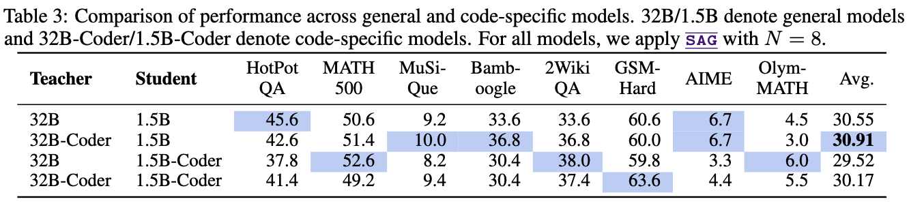 (general vs code-specific teacher/student 조합 비교)

| Teacher | Student | Avg. |
| --- | --- | --- |
| 32B | 1.5B | 30.55 |
| 32B-Coder | 1.5B | **30.91** |
| 32B | 1.5B-Coder | 29.52 |
| 32B-Coder | 1.5B-Coder | 30.17 |

- **student를 code 모델로 바꾸는 건 효과 없음**, teacher를 code 모델로 쓰는 쪽이 (아주 근소하게) 나음
- 전반적으로 차이가 미미 $\to$ **code 지식이 student의 핵심 병목은 아님**

**(2) 다른 모델 패밀리에도 적용됨**

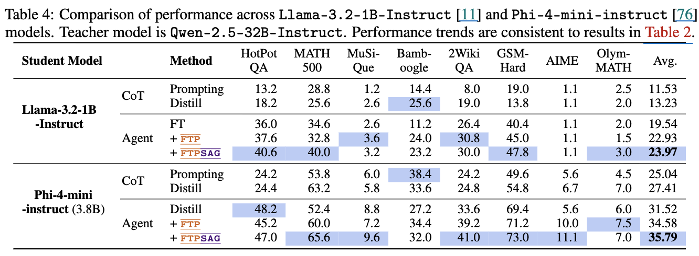 (Llama-3.2-1B-Instruct, Phi-4-mini-instruct 결과)

| Student | CoT Prompting | CoT Distill | Agent (FT) | + FTP | + FTP&SAG |
| --- | --- | --- | --- | --- | --- |
| Llama-3.2-1B-Instruct | 11.53 | 13.23 | 19.54 | 22.93 | **23.97** |
| Phi-4-mini-instruct (3.8B) | 25.04 | 27.41 | 31.52 | 34.58 | **35.79** |

- Qwen 계열 밖에서도 FTP·SAG가 일관되게 더해짐

**(3) FTP는 어려운 문제에서 효과**

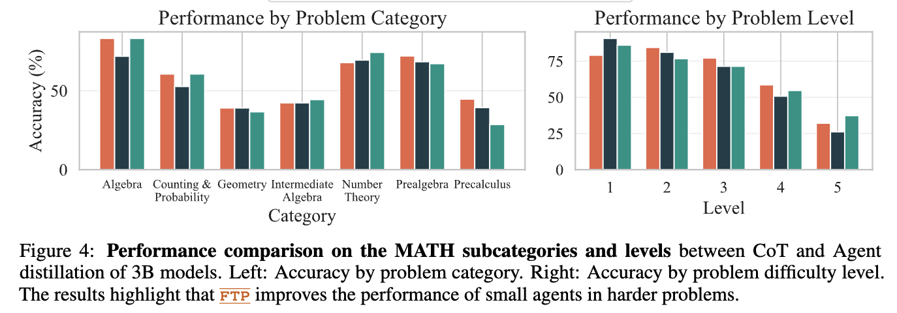 (3B 모델의 MATH subcategory별 / 난이도 level별 정확도 — CoT vs Agent vs Agent+FTP)

- naive agent distillation은 3B의 MATH500 성능을 대부분의 level에서 떨어뜨림
- FTP를 쓴 teacher trajectory로 학습하면 **level 4, 5에서 특히 크게 개선** $\to$ AIME에서의 향상과 같은 경향
- 다만 **precalculus 같은 일부 카테고리는 하락**. 삼각함수 성질 적용처럼 분석적 접근이 필요한 문제는 코드로 풀기 어려움

**(4) SAG vs CoT self-consistency**

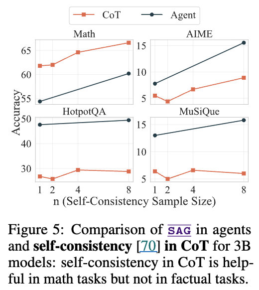 

(샘플 수 $n$ 에 따른 agent+SAG vs CoT+self-consistency, 3B 모델)

- 같은 연산 예산에서 CoT에 self-consistency를 붙이면 MATH에서는 CoT가 앞섬
- 그러나 **더 어려운 AIME에서는 agent+SAG가 여전히 우위**, HotpotQA·MuSiQue 같은 factual 태스크에서는 self-consistency 이득이 미미함

**(5) SAG는 invalid code action을 실제로 줄임**

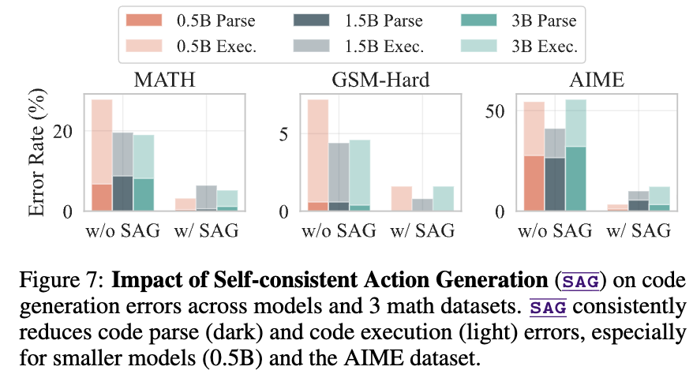

(MATH / GSM-Hard / AIME에서 SAG 유무에 따른 code parse·execution error rate)

- 모델이 작을수록(0.5B) 유효한 코드를 만들 확률이 떨어지는데, SAG가 이를 뚜렷이 완화함. AIME에서 효과가 가장 큼
- 단 execution error가 0이 되진 않고, 남은 건 에러 메시지를 observation으로 받아 다음 턴에서 수정

**(6) 토큰 비용은 크게 늘지 않음**

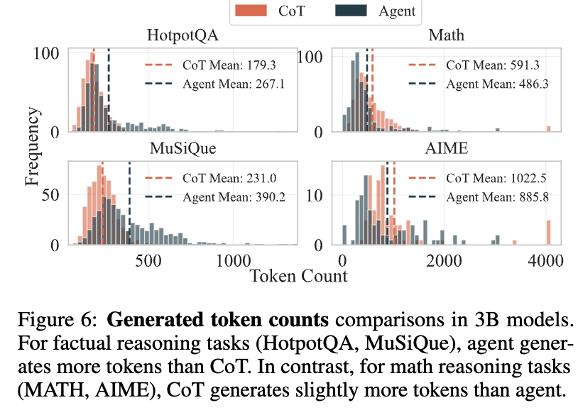

 (3B 모델의 CoT vs Agent 생성 토큰 수 분포)

- factual: agent가 더 씀 (HotpotQA 179.3 $\to$ 267.1, MuSiQue 231.0 $\to$ 390.2) — 여러 번 검색하느라
- math: **agent가 더 적게 씀** (MATH 591.3 $\to$ 486.3, AIME 1022.5 $\to$ 885.8) — 반복 계산을 for-loop 같은 코드에 위임

**(7) FTP는 검색 호출을 줄인다 (양날의 검)**

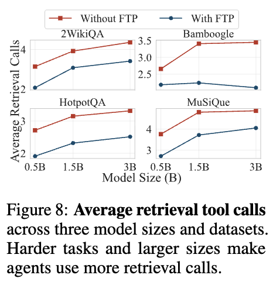

 (모델 크기·데이터셋별 평균 retrieval tool 호출 횟수, FTP 유무)

- 큰 모델일수록 검색을 더 많이 부름. 작은 모델은 처음 가져온 문서에 과의존해 재검색을 안 함
- FTP를 쓰면 검색 호출이 **줄어듦** $\to$ Bamboogle은 개선되지만 HotpotQA·MuSiQue는 엇갈림
  - 해석: FTP가 thought 안에서 사실을 직접 서술하게 유도해서, 도구 대신 **내부 지식에 기대다 hallucination 위험이 커짐**

# 7. Conclusion & Limitations

**Conclusion**

- CoT가 아니라 **tool-using 행동 전체**를 증류하는 Agent Distillation을 제안. teacher 쪽은 FTP로 trajectory 품질을, student 쪽은 SAG로 test-time robustness를 끌어올림
- 0.5B~7B student가 2~4배 큰 CoT distilled 모델과 대등하거나 그 이상, 특히 **out-of-domain**에서 강함

**Limitations (저자 명시)**

- **FTP가 평균적으로는 도움되지만 만능이 아님** — 도구 대신 내부 지식으로 사실을 지어내게 만들어 성능을 떨어뜨리는 경우가 있음 (figure 8). teacher trajectory 생성 전략 자체를 student의 한계에 맞춰 설계할 필요
- **SAG는 test-time compute를 더 씀** ($N=8$ 샘플링). process-level reward model 결합이 후속 방향
- **agent distillation이 코어 추론 능력 자체를 올려주진 않음** — 도구 사용 행동만 이식됨. tool-augmented 환경에서의 RL이 후속 단계로 필요
- 그 외 본문에서 드러나는 제약: teacher trajectory를 질문당 1개만 뽑고 오답을 버려 학습 데이터가 약 2k로 작음, max 5 steps 제한, 검색엔진 대신 Wikipedia 2018 고정 corpus

# Takeaways

- **"무엇을 아는가"를 증류하지 말고 "어떻게 알아내는가"를 증류하라** — 작은 모델일수록 암기보다 도구 사용이 남는 장사. OOD 격차가 이를 보여줌
- 작은 모델에게 agent 포맷은 프롬프트만으로는 절대 안 됨 (0.5B agent prompting 1.80점). **증류가 있어야 비로소 켜짐**
- teacher가 instruction-tuned 상태에서 agent 역할을 하면 성능이 깎인다는 관찰이 흥미로움. FTP는 **첫 thought 하나만 CoT로 고정**하는 저렴한 처방
- SAG는 "샘플링해서 실행 안 되는 건 버리고, 결과가 일치하는 걸 고른다"는 단순한 아이디어인데 sLM agent의 최대 실패 모드(invalid code)를 직격함
- 도구가 항상 이기는 건 아님 — MATH500처럼 모델이 이미 강한 in-domain 태스크에서는 CoT가 여전히 우위. **도구는 rare knowledge / heavy computation에서 값을 함**
